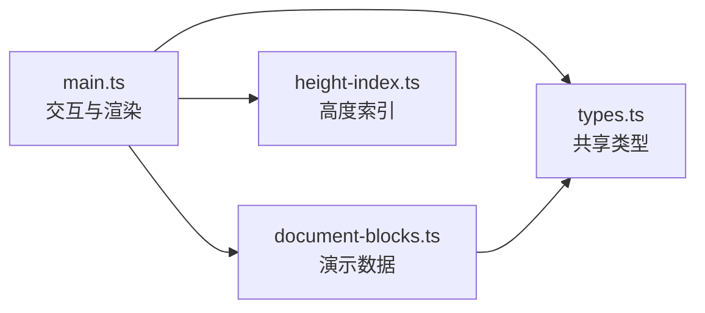
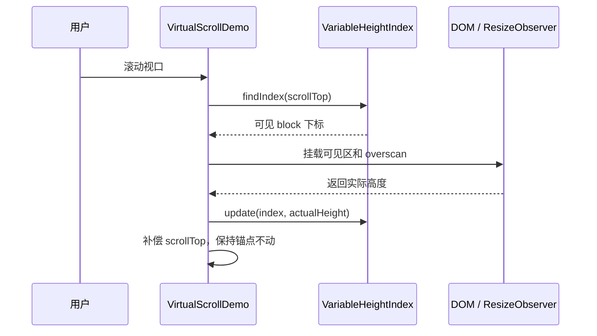

# 不定高度虚拟滚动 Demo

这份 Demo 用 Fenwick Tree 管理 1,000 个 block 的动态高度，学习重点是“估算高度 -> 挂载测量 -> 校正偏移 -> 稳定视口”这条链路。

## 运行

```bash
pnpm install --registry=https://registry.npmmirror.com
pnpm dev
```

## 先操作一遍

1. 点击“跳转”到 block 500，观察页面只挂载了十几个 block。
2. 点击“改变视口上方高度”，观察当前阅读内容没有跳动。
3. 查看右侧日志：先出现实测高度差，再出现 `scrollTop` 锚点补偿。
4. 调整 Overscan，对比挂载 DOM 数量的变化。

## 代码地图



| 阅读顺序 | 文件 | 先关注什么 |
| --- | --- | --- |
| 1 | [`types.ts`](./src/types.ts) | block 和可见范围包含哪些数据 |
| 2 | [`document-blocks.ts`](./src/document-blocks.ts) | 为什么每个 block 高度不同 |
| 3 | [`main.ts`](./src/main.ts) | `getRange` -> `render` -> `handleMeasurements` |
| 4 | [`height-index.ts`](./src/height-index.ts) | 如何快速从像素偏移反查 block |

## 一次滚动发生了什么



`render` 不会生成 1,000 个 DOM 节点。它只渲染当前范围，并用顶部、底部 spacer 补齐其余高度：

```text
[顶部 spacer][少量真实 block][底部 spacer]
      未挂载             未挂载
```

## 分四步学习

### 1. 先理解可见范围

在 [`main.ts`](./src/main.ts) 的 `getRange` 打断点，观察：

```ts
visibleStart // 视口顶部所在的 block
visibleEnd   // 视口底部所在的 block
renderStart  // 加上方 overscan 后的起点
renderEnd    // 加下方 overscan 后的终点，不包含该下标
```

改变 Overscan 后再观察这四个值。此时暂时不需要研究 Fenwick Tree。

### 2. 理解 spacer

在 `render` 打断点，对照 Elements 面板查看 `.spacer-top` 和 `.spacer-bottom`。

```ts
topHeight = heightIndex.offsetOf(renderStart);
bottomHeight = totalHeight - heightIndex.offsetOf(renderEnd);
```

两个 spacer 与已挂载 block 的高度之和，就是当前估算的整份文档高度。

### 3. 理解实测与锚点补偿

在 `handleMeasurements` 打断点，点击“改变视口上方高度”，重点观察：

```ts
anchorDistance = scrollTop - offsetOf(anchorIndex);
compensatedScrollTop = offsetOf(anchorIndex) + anchorDistance;
```

block 高度改变后，`offsetOf(anchorIndex)` 会变，但 `anchorDistance` 保持不变。因此重算 `scrollTop` 后，用户眼前的内容仍在原位置。

### 4. 最后学 Fenwick Tree

打开 [`height-index.ts`](./src/height-index.ts)，先把 `VariableHeightIndex` 当成黑盒：

```ts
offsetOf(10);       // 前 10 个 block 的总高度
findIndex(1200);    // 1200px 处属于哪个 block
update(5, 128);     // 第 6 个 block 的实测高度是 128px
totalHeight();      // 整份文档的估算总高度
```

再进入 `FenwickTree`，只研究三个操作：`add` 更新单项，`prefix` 求前缀和，`findIndexAtOffset` 用前缀和反查下标。它们都是 `O(log n)`。

## 学完后的练习

1. 把默认估算高度从 `96` 改为 `40`，观察初次跳转后如何逐步校正。
2. 暂时注释锚点补偿的 `scrollTop` 赋值，亲眼观察阅读内容跳动。
3. 在 `VariableHeightIndex` 中记录 `update` 次数，观察同一 block 是否会被重复测量。

## 边界

这是原生 TypeScript 教学 Demo，目的是直接展示 DOM 测量和滚动算法。生产级编辑器还需处理 IME composition、跨 block Selection、辅助功能和更严格的任务调度。
