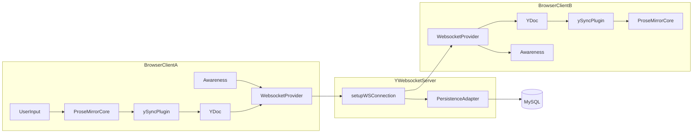
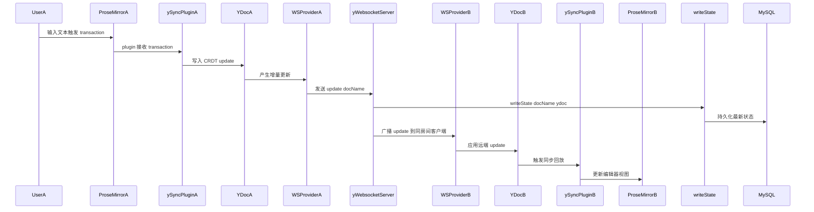
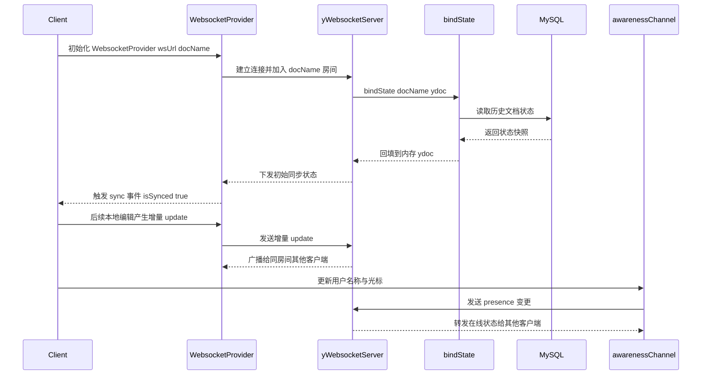
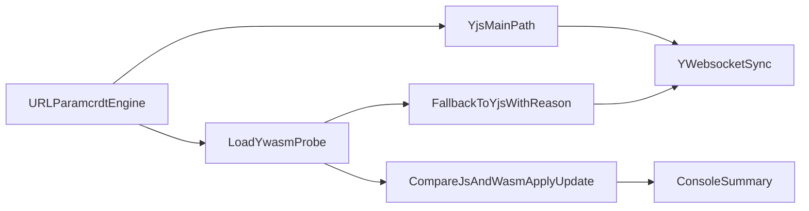

# Yjs 多人协同文档编辑系统

本项目基于 **Yjs**（高性能 CRDT 引擎），实现了适用于团队的实时多人协作文本编辑系统，支持 Node.js 及 Spring Boot 两套后端，便于不同技术栈集成使用。

## 📁 项目结构

```
code/
├── client/                   # 前端（ProseMirror + Yjs）
│   ├── index.html            # 编辑器页面
│   ├── src/main.ts           # ProseMirror + Yjs 协作逻辑
│   └── package.json          # 前端依赖与构建脚本
│
├── server/                   # 服务端代码
│   ├── nodejs/               # Node.js 实现
│   │   ├── server.js         # Express + WebSocket 服务
│   │   ├── mysql-persistence.js # Yjs 状态 MySQL 持久化
│   │   ├── package.json
│   │   └── package-lock.json
│
├── init-db.sql               # 初始化 MySQL 表结构脚本
├── MYSQL_SETUP.md            # MySQL 配置/使用说明文档
└── README.md                 # 项目说明（本文件）
```

## 🎯 主要特性

-   ✅ **实时协同**：多用户同步编辑，毫秒级响应
-   ✅ **自动冲突解决**：基于 CRDT，无需手动合并
-   ✅ **断线重连与离线编辑**：离线可编辑，恢复后自动与他人同步
-   ✅ **高效持久化**：文档状态存储于 MySQL，安全可靠
-   ✅ **双服务端实现**：便于前/后端人员选型和扩展

## 🚀 快速上手指南

### 方案一：Node.js 服务端

#### 1. 安装依赖

```bash
cd server/nodejs
pnpm install
```

#### 2. 初始化数据库

```bash
# 登录 MySQL，执行表结构脚本
mysql -u root -p < ../../init-db.sql
```

#### 3. 启动服务

```bash
cd server/nodejs
pnpm start
```

服务默认启动于 [http://localhost:3000](http://localhost:3000)

### 方案二：任意兼容 y-websocket 协议的服务端（如 Spring Boot）

#### 1. 环境要求

-   JDK 1.8+
-   Maven 3.6+
-   MySQL 5.7+
-   Node.js（用于启动 client）

#### 2. 数据库准备

```bash
mysql -u root -p < init-db.sql
```

#### 3. 数据库配置

编辑 `server/spring-boot/src/main/resources/application.yml`：

```yaml
spring:
    datasource:
        url: jdbc:mysql://localhost:3306/yjs_db
        username: root
        password: your_password
```

#### 4. 启动服务

分别启动：

-   WebSocket 服务（3000 端口默认）

```bash
cd server/spring-boot
mvn spring-boot:run
```

-   Client 前端开发服务（Vite，默认 5173 端口）

```bash
cd client
pnpm install
pnpm dev
```

### 访问应用

浏览器访问 [http://localhost:5173](http://localhost:5173)

1. 打开多个标签页/浏览器测试多端实时编辑
2. 内容输入任意变动将自动同步到所有已打开标签页

## 📖 技术原理简述

一句话结论：本项目的实时协同由 `ProseMirror` 负责编辑体验、`Yjs` 负责 CRDT 收敛、`y-websocket server` 负责跨端转发与状态装载、`MySQL` 负责持久化。

### 协作流程图（深入版）

#### 图 1：ProseMirror + Yjs + Server + MySQL 架构关系



#### 图 2：一次编辑从本地事务到远端回放



#### 图 3：首次连接与后续增量同步



#### 重点解读

-   `ProseMirror` 不直接处理多端冲突，它通过 `ySyncPlugin` 把编辑事务映射到 `Y.Doc`，冲突收敛由 Yjs 的 CRDT 负责。
-   `Y.Doc` 的 update 具备可交换与幂等特性，即使网络乱序到达，也能收敛到一致状态。
-   `docName` 是协作房间路由键，只有同 `docName` 的连接才会互相广播文档更新。
-   文档内容同步与在线状态同步是两条链路：内容走 `Y.Doc update`，在线状态走 `awareness`，二者相互独立。
-   首次连接强调 `bindState`：先把历史状态装载进服务端文档，再进行客户端初始同步。
-   后续编辑通常是增量 update，同步成本更低；服务端通过 `writeState` 持续落库保障恢复能力。

### Yjs 协同机制

-   **全局唯一标识**：每个字符变更带唯一 ID（客户端 ID+时间+位置）
-   **幂等与可交换性**：操作顺序不同，结果仍能收敛一致
-   **只传变化**：同步过程仅发送变更数据，降低带宽和延迟

### CRDT 冲突解决举例

同时插入内容的合并无需服务器转换逻辑，按 ID 排序即可自然收敛——无需 OT 传统算法的复杂修改偏移调整。

## 🔧 配置说明

### MySQL 连接（Node.js）

可通过环境变量覆盖默认参数：

```bash
export MYSQL_HOST=localhost
export MYSQL_PORT=3306
export MYSQL_USER=root
export MYSQL_PASSWORD=your_password
export MYSQL_DATABASE=yjs_db
export MYSQL_TABLE_NAME=yjs_documents
```

### WebSocket 连接及文档路由

-   WebSocket 默认端口：3000
-   路径格式：`ws://localhost:3000/{docName}`，如 `/demo`、`/文档1` 等

## Yjs WASM 协同优化（实验模式）

一句话结论：该示例新增 `crdtEngine=wasm` 实验开关，用于在不影响主协同链路的情况下观测 WASM 版 CRDT 计算性能，加载失败自动回退到 `yjs`。



### 开关参数

-   默认：`http://localhost:5173?doc=demo`
-   WASM：`http://localhost:5173?doc=demo&crdtEngine=wasm`
-   WASM + 强制性能日志：`http://localhost:5173?doc=demo&crdtEngine=wasm&perf=1`

### 压测建议（10+ 协同用户）

1. 同一 `doc` 打开 10-20 个标签页，持续输入和删除，观察同步是否稳定。
2. 在 `crdtEngine=js` 与 `crdtEngine=wasm` 两组场景下分别采集控制台 `transaction.dispatchMs` 摘要。
3. 在 `crdtEngine=wasm` 下对比 `applyUpdate.jsProbeMs` 与 `applyUpdate.wasmProbeMs` 的 `avg/p95`，评估收益。
4. 人为制造弱网和重连，确认失败或抖动时自动回退后仍可持续协同。

### 兼容边界

-   主同步链路仍基于 `yjs + y-prosemirror + y-websocket`，优先保障业务稳定。
-   `ywasm` 当前作为 CRDT 计算实验引擎接入，用于对比评估，不直接替换生产链路。
-   若 WASM 运行环境受限，会自动回退并输出原因，不影响协同功能。

## 📚 目录与组件补充说明

-   **client/** 前端编辑器页面及 ProseMirror + Yjs 适配代码
    -   `index.html`：基础页面
    -   `src/main.ts`：连接服务器，实现实时同步
-   **server/nodejs/** Node.js 服务端
    -   `server.js`：Express + ws 搭建实时通道
    -   `mysql-persistence.js`：MySQL 文档持久化实现
-   **server/spring-boot/** Spring Boot 服务端
    -   WebSocket+MySQL 全栈后端，详情见专用 README

## 🐞 常见问题解答

-   **为何需要 WebSocket？**
    WebSocket 用于在多客户端之间转发消息和同步文档状态。

-   **文档数据存储位置？**
    所有协同编辑内容最终持久化于 MySQL（默认表名 `yjs_documents`）。

-   **并发编辑规模如何？**
    Yjs 支持大规模并发同步，但受服务器和带宽影响，建议负载测试评估。

-   **是否支持访问权限控制？**
    可在服务端自定义认证和文档访问鉴权逻辑，具体见服务端实现。

-   **Node.js/Spring Boot 两方案主要差异？**
    Node.js 采取现成 [y-websocket](https://github.com/yjs/y-websocket) 实现，配置简单、自带持久化接口；Spring Boot 适合 Java 生态，但 WebSocket/CRDT 需自行集成。

## 参考资料

-   [Yjs - 官方文档](https://docs.yjs.dev/)
-   [Yjs 项目地址](https://github.com/yjs/yjs)
-   [CRDT 理论与实践](https://crdt.tech/)
-   [y-websocket 协议](https://github.com/yjs/y-websocket)

## 许可证

MIT License

---

**Happy Sync & Collaboration！🎉**
