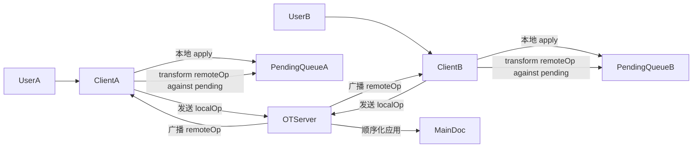
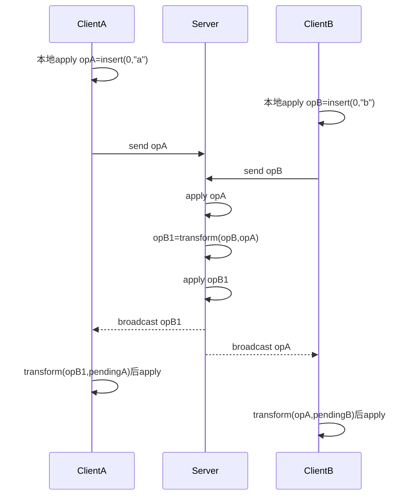
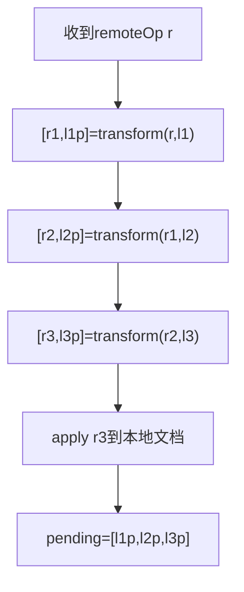
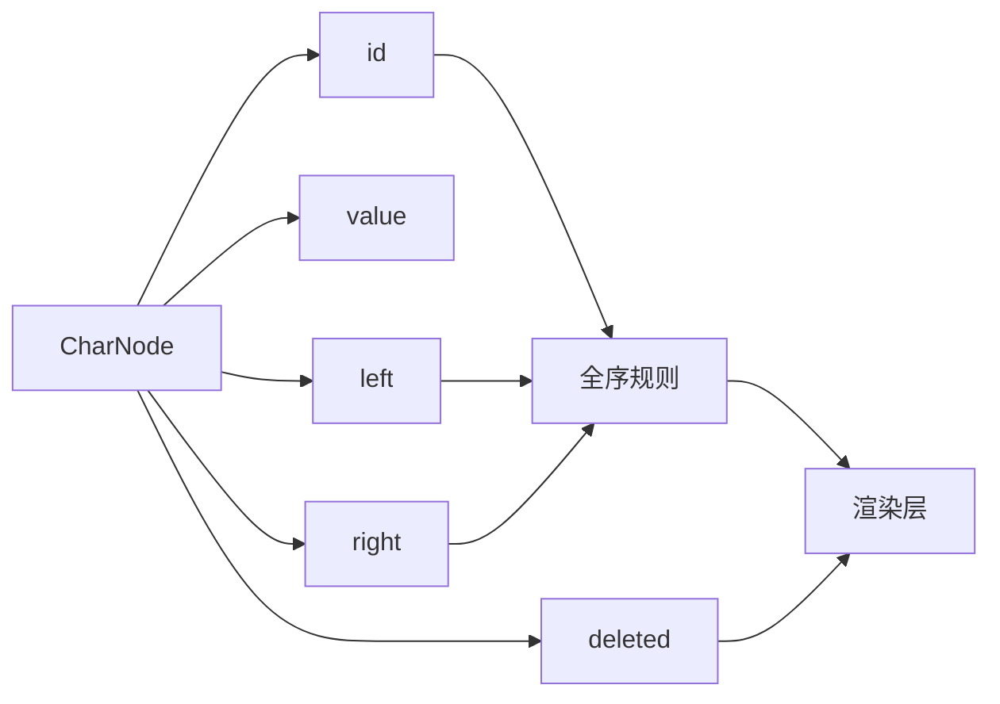
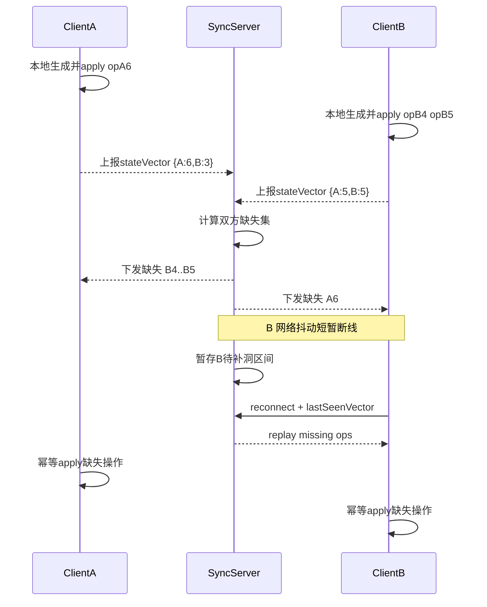
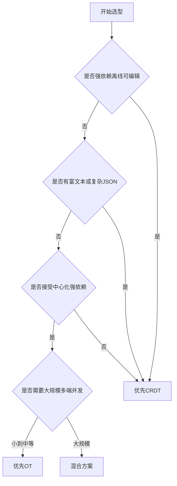
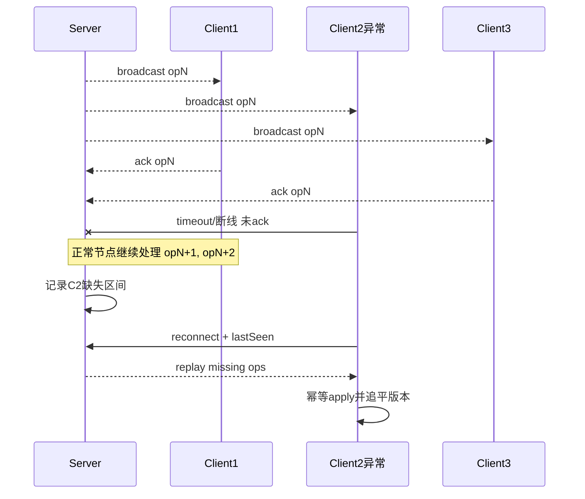

## 编辑器多人协作冲突的核心解决方案（图解版）

> 一句话先记住：OT 是“改操作”，CRDT 是“改数据结构”。

---

### OT（Operational Transformation）

#### 结论

OT 适合中心化实时协作场景：客户端本地先执行提升手感，服务端负责顺序化，客户端对远程操作做 transform 保证最终一致。

#### 1) OT 总体架构图



关键点：

-   本地先 `apply`，用户输入无明显延迟。
-   服务端串行化操作，减少“全网乱序”复杂度。
-   客户端维护 `pending`（已本地应用、未确认的本地操作）。
-   接收远程操作后先 transform，再 apply。

#### 2) OT 并发冲突时序图（A/B 同时在 0 插入）



一致性目标：

```text
apply(apply(S,opA), transform(opB,opA))
=
apply(apply(S,opB), transform(opA,opB))
= S_final
```

#### 真实数据变化：A 插入、B 删除

初始文档是 `ABC`，字符之间的位置是 `0 A 1 B 2 C 3`。A、B 都基于版本 `v0` 编辑：

```text
A: insert(1, "X")，本地结果 AXBC
B: delete(1, 1)，本地结果 AC
```

假设服务端先处理 A：

| 步骤 | 服务端操作 | 文档 |
| --- | --- | --- |
| 1 | 应用 `insert(1, "X")` | `AXBC` |
| 2 | 将 B 的 `delete(1, 1)` 转换为 `delete(2, 1)` | `AXBC` |
| 3 | 删除位置 2 的原始 B | `AXC` |

删除位置从 1 变成 2，是因为前面插入了 X，但 B 的意图仍是删除原来的 B。A 收到 `delete(2)` 后从 `AXBC` 变成 `AXC`；B 收到经 pending 操作转换后的插入，也从 `AC` 变成 `AXC`。

```text
Server = AXC
Client A = AXC
Client B = AXC
```

这就是 OT 的“改操作”：根据并发变化修改位置参数，而不是按收到顺序执行原始位置。

#### 3) OT 远程操作处理流水图



速记：

-   远程操作 `r` 需要依次穿过本地 `pending` 队列。
-   transform 是“双向更新”：远程位移 + 本地队列重写。
-   处理完再应用远程，并更新本地待确认队列。

---

### CRDT（Conflict-free Replicated Data Type）

#### 结论

CRDT 的核心是让并发操作天然可合并：不依赖中心化 transform，下发顺序不同也能收敛。

#### 1) CRDT 文本数据模型图



关键点：

-   位置由 `left/right + id` 表达，不是数组下标。
-   并发插入冲突通过全序规则（如 `id` 字典序）裁决。
-   删除通常是 tombstone（`deleted=true`），避免按下标误删。

#### 2) CRDT 增量同步时序图（生产版：经 Server 交换）



速记：

-   生产中通常是 `Client <-> SyncServer` 交换，客户端不一定互联直连。
-   版本向量负责“去重 + 补洞”，不是冲突裁决器。
-   冲突裁决由 CRDT 数据结构内建规则处理。
-   重连后按缺失集回放，重复投递也安全（幂等）。

#### 3) 真实数据变化：同一位置并发插入

初始文本是 `AC`。CRDT 内部不只存字符，还存稳定 ID 和相邻关系：

```text
A(base:1) -> C(base:2)
```

A、B 离线时都在 A 后插入：

```json
{ "id": "A:7", "value": "X", "left": "base:1" }
{ "id": "B:4", "value": "Y", "left": "base:1" }
```

同步前 A 显示 `AXC`，B 显示 `AYC`。假设并发兄弟按 ID 排序且 `A:7 < B:4`，两条 update 无论谁先到达，都会排成：

```text
A(base:1) -> X(A:7) -> Y(B:4) -> C(base:2)
Client A = AXYC
Client B = AXYC
```

真实 Yjs 的内部结构和排序规则更复杂，但核心相同：相同 update 集合必然得到相同结果。删除也不是“删位置 1”，而是 `{ "type": "delete", "targetId": "base:2" }`；即使位置被并发插入改变，也不会删错元素。

---

### OT vs CRDT 选型决策图



---

### 对照表（保留决策信息）

| 维度     | OT                    | CRDT                        |
| -------- | --------------------- | --------------------------- |
| 冲突处理 | 运行时 transform 操作 | 数据结构天然可合并          |
| 架构依赖 | 常见为中心化服务端    | 去中心化或中心化都可        |
| 离线能力 | 可做但工程复杂        | 原生友好                    |
| 数据类型 | 纯文本最常见          | 文本/富文本/JSON/集合       |
| 成本特征 | transform 规则复杂    | 元数据与 tombstone 管理复杂 |

---

### 实践建议（前端）

1. 纯文本 + 中心化在线编辑器：优先 OT。
2. 离线优先 + 多端同步 + 复杂结构：优先 CRDT（如 Yjs / Automerge）。
3. 追求稳定性时，先做“最小协作闭环”：本地 apply、远程同步、重连补洞、幂等处理，再扩展高级能力（撤销栈、权限、富文本语义）。

---

### 异常场景补充：全播时某个节点网络异常

#### 场景结论

服务端全播时，单个节点网络异常不会破坏全局收敛；关键在于“正常节点继续前进，异常节点重连后补齐缺失操作”。

#### 全播异常时序图（单节点超时）



#### OT 下怎么处理

-   服务端可按连接维护每个客户端的确认进度（如最后确认的序号）。
-   对异常节点采用“重连后补发缺失操作”，客户端收到后仍按 `transform(remote,pending)` 处理。
-   正常在线节点不回滚、不等待异常节点，避免整体阻塞。
-   若补发失败，可退化为“快照 + 增量”恢复。

#### CRDT 下怎么处理

-   异常节点重连后先交换 `state vector/version vector`。
-   双方计算缺失集后补洞，缺失操作可乱序到达，依赖幂等和可交换性收敛。
-   即使重复投递也安全（去重 + 幂等 apply）。
-   若本地积压过大，同样可用“快照 + 缺失增量”加速追平。
