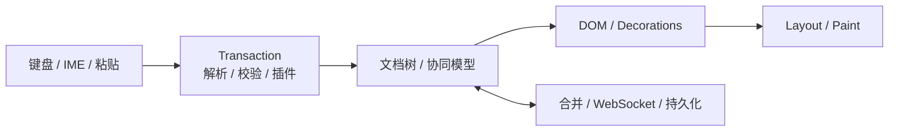
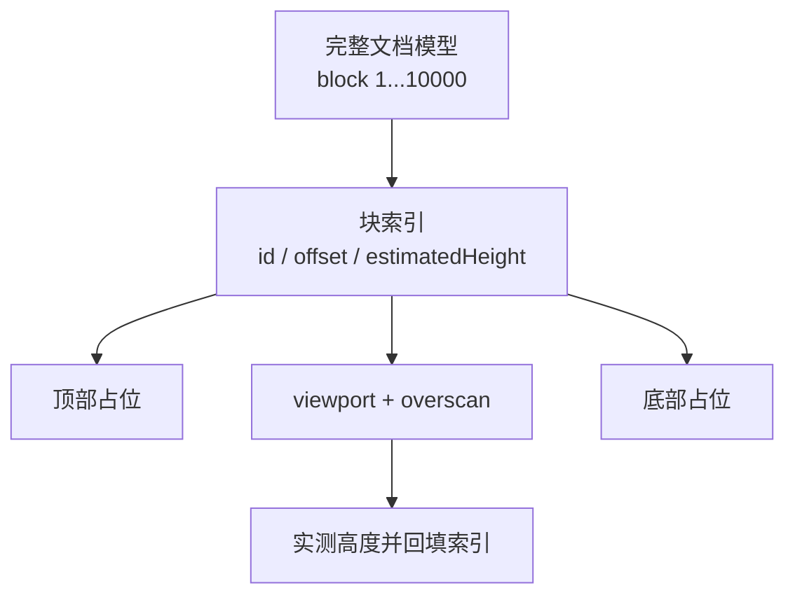
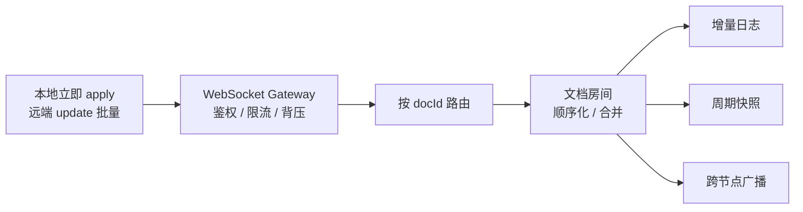

# 大型富文本性能与稳定性

## 1. 大型富文本应用的常见瓶颈

**一句话：瓶颈不只是框架重渲染，而是贯穿输入、文档模型、DOM、浏览器渲染、插件、协同网络和内存。**



| 维度 | 典型瓶颈 | 观测指标 | 优化方向 |
| --- | --- | --- | --- |
| 输入 | 每次按键触发全量校验、插件和保存 | INP、输入链路 p95 | 本地先应用、合并事务、非关键任务延后 |
| 模型 | 全树 diff/normalize/schema 校验 | transaction p95、Long Task | 局部更新、结构共享、增量索引 |
| DOM | 十万字全量挂载，批注和光标全量刷新 | DOM 节点数、commit 耗时 | block 分片、虚拟化、只更新命中节点 |
| 渲染 | 强制同步布局、复杂绘制 | FPS、Layout/Paint 耗时 | 读写分离、rAF、CSS containment |
| 插件 | 高亮、拼写、搜索、评论全量重算 | 各插件耗时 | 按 changed ranges 增量计算 |
| 协同 | 高频小包、远端 update 风暴、重连补洞 | update/s、队列深度、同步延迟 | 批量、压缩、背压、快照 + 增量 |
| 内存 | 多份快照、无限撤销、CRDT 元数据、Blob | heap、DOM nodes、峰值内存 | 有界历史、结构共享、释放资源 |

优化顺序是先建立小/中/超大文档与单人/多人基线，用 Performance、Memory 和业务 trace 找最慢阶段；先缩小计算复杂度和更新范围，再考虑 Worker/Wasm。验收看 INP、transaction p95、滚动帧时间、内存和错误率。

## 2. 十万字文档怎么优化？

**一句话：模型层保留完整文档，视图层按 block 分片，只挂载视口附近 DOM；变更、索引、装饰和协同更新全部尽量增量化。**



### 不定高度 block 的虚拟滚动原理

**关键不是提前知道真实高度，而是允许高度从“预估值”逐步变成“实测值”。**系统为每个 block 保存高度缓存，并通过前缀和计算它在整篇文档中的纵向位置。

假设有 5 个 block，尚未渲染过的 block 先按类型预估高度：

| block | 当前高度 | 起始 offset |
| --- | ---: | ---: |
| A 段落 | 80 | 0 |
| B 图片 | 80（预估） | 80 |
| C 段落 | 80 | 160 |
| D 表格 | 120（预估） | 240 |
| E 段落 | 80 | 360 |

当 `scrollTop = 170`、视口高度为 `120` 时，通过前缀和查找：

```text
视口范围：[170, 290]
第一个相交 block：C，其范围是 [160, 240]
最后一个相交 block：D，其范围是 [240, 360]

top spacer    = 160px
真正挂载 DOM  = C、D，再加前后 overscan
bottom spacer = 总高度 440 - D 的结束位置 360 = 80px
```

顶部和底部 spacer 只负责撑出正确的滚动条高度，中间才是真实 DOM。查找起始 block 不能每次从头累加；生产实现通常用“前缀和数组 + 二分”，高度频繁变化时用 Fenwick Tree/Segment Tree，使查询和单点更新接近 `O(log n)`。

### 实测高度变化后为什么不会跳？

block 挂载后用 `ResizeObserver` 测量真实高度。假设 B 图片加载后从预估 `80px` 变成真实 `140px`，增量是 `+60px`：

```text
修正前：C.offset = 160，scrollTop = 170
        C 顶部位于视口上方 10px

修正后：C.offset = 220
若 scrollTop 不变，C 会在屏幕中向下跳 60px

锚点补偿：scrollTop += 60
最终：C.offset = 220，scrollTop = 230
      C 顶部仍位于视口上方 10px
```

这个过程叫 scroll anchoring。更新高度前记录“首个可见 block ID + 它相对视口的像素偏移”，批量更新高度索引后，再计算该 block 的新 offset 并补偿 `scrollTop`。


概念接口可以这样理解，具体索引内部应使用前缀和树，而不是每次遍历全部 block：

```ts
interface VisibleRange {
  start: number;
  end: number;
  topSpacer: number;
  bottomSpacer: number;
}

interface VariableHeightIndex {
  findRange(scrollTop: number, viewportHeight: number, overscan: number): VisibleRange;
  updateHeight(blockIndex: number, actualHeight: number): number; // 返回高度差 delta
  offsetOf(blockIndex: number): number;
  totalHeight(): number;
}
```

可运行实现见：[不定高度虚拟滚动 Demo](./demo/variable-height-virtual-scroll/README.md)。Demo 会实时显示可见范围、DOM 数、spacer 高度、实测数量和锚点补偿日志。

测量结果应在一帧内批量写回，避免每个 `ResizeObserver` 回调都立即触发重渲染。图片和嵌入节点最好预先保存宽高比，让初始预估更接近真实值，减少补偿次数。

### `contenteditable` 还要额外处理什么？

- 正在 IME composition 的 block 必须 pin，组合输入结束前不能卸载或替换 DOM。
- Selection 两端涉及的 block 即使超出普通 overscan，也要暂时保持挂载；跨很远的选区可以使用模型选区并按需分段挂载。
- 跳转到未挂载位置时，先通过高度索引设置预估 `scrollTop`，挂载并实测目标 block 后再做一次锚点修正。
- block 高度缓存以稳定 ID 为键；插入、删除或移动 block 时同步更新索引，不能用易变化的数组下标长期缓存。

### 渲染和滚动

- 以段落、标题、表格等 block 为渲染单元，使用稳定 ID；不要按字符拆 DOM。
- transaction 携带 changed ranges，只更新受影响节点；搜索、高亮、拼写和索引放入 Worker。
- scroll 回调只记录位置，每帧在 `requestAnimationFrame` 中最多更新一次；DOM 测量和写入分批进行。
- 图片、附件按可视区加载并用稳定尺寸占位；远端光标只渲染可见用户并限频。

### 内存

| 来源 | 处理方式 |
| --- | --- |
| 撤销栈 | 限制条数和字节数，合并连续输入，超限转快照 |
| 文档副本 | 使用 persistent data structure/结构共享，不做全量 deep clone |
| CRDT update/tombstone | 合并 update、周期快照；确认所有副本不再依赖后再压缩 |
| 图片与附件 | 只保存 URL/元数据，可视区加载，及时 `URL.revokeObjectURL` |
| 缓存与监听器 | 设置 LRU 上限，卸载时释放 observer、subscription 和 timer |

验收覆盖连续输入、快速滚动、大粘贴、全文搜索和长时间编辑，检查 p95 帧耗时、Long Task、IME/选区正确性以及 GC 后 heap 是否回落。

## 3. 多人同时编辑时的前后端稳定性

**一句话：前端优先保证本地输入，对远端更新做批量和背压；服务端按文档分片顺序处理，用幂等日志、快照和限流防止热点文档拖垮集群。**



### 前端

- 本地操作立即 apply、异步发送；一帧内到达的远端 update 合并后再派发。
- 本地输入、选区和 IME 优先级高于远端光标；awareness 数据限频、可丢弃、不持久化。
- 队列过长时降级远端光标和非核心插件；积压过大则请求快照追平，不无限回放小 update。
- Worker 处理编解码、压缩和索引；只有 profiling 证明内核过慢时才引入 Wasm。

### 服务端

| 问题 | 方案 |
| --- | --- |
| 海量连接 | 无状态 Gateway、心跳超时、连接配额，缓慢消费者降级或断开 |
| 文档内顺序 | 同一 `docId` 路由到同一分片/房间，文档内顺序处理、文档间并行 |
| 热点文档 | 单独限流、合并 update、分层广播，不占满全局队列 |
| 重试乱序 | `clientId + seq/updateId` 去重，ACK 进度或 state vector 补洞 |
| 持久化 | append-only log 异步合并，快照 + 增量恢复，不每次写全文 |
| 安全 | 每次写入校验权限，限制 update 频率、大小和解压后大小 |

必须监控客户端 transaction p95、待发/待应用队列、INP 和内存，以及服务端连接数、单文档 update/s、广播 p99、队列深度、快照大小和补洞流量。

## 关联阅读

- [编辑器多人协作冲突原理](./在线文档协同/编辑器多人协作冲突原理.md)
- [ProseMirror 常见问题](./proseMirror常见问题.md)
- [AssemblyScript 与 Wasm 性能优化](../性能与浏览器/WebAssembly/03_AssemblyScript面试题.md)
