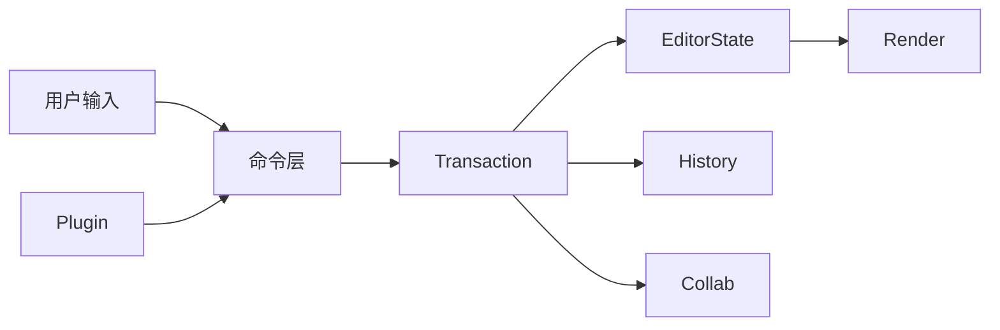
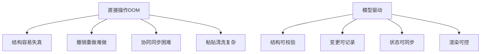
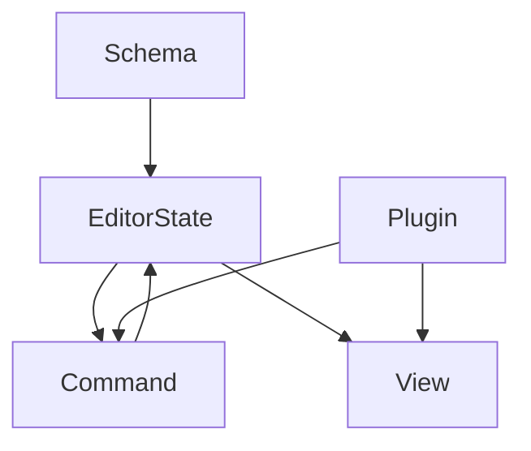
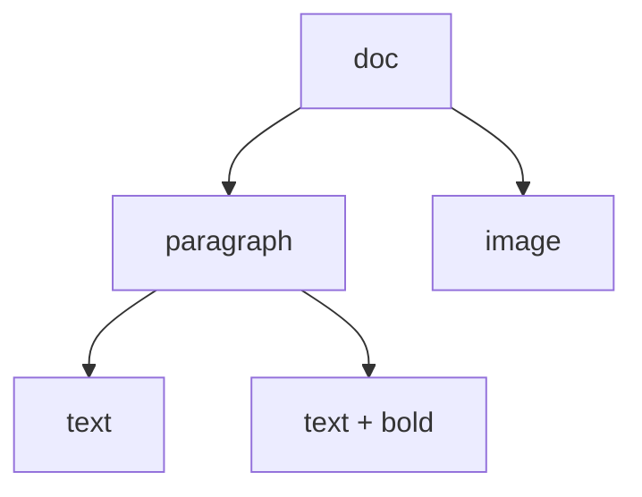
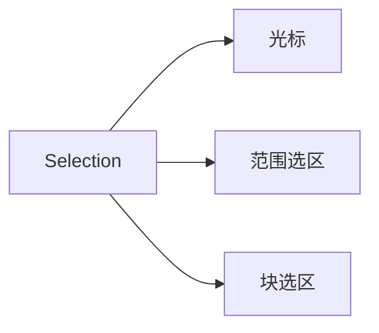
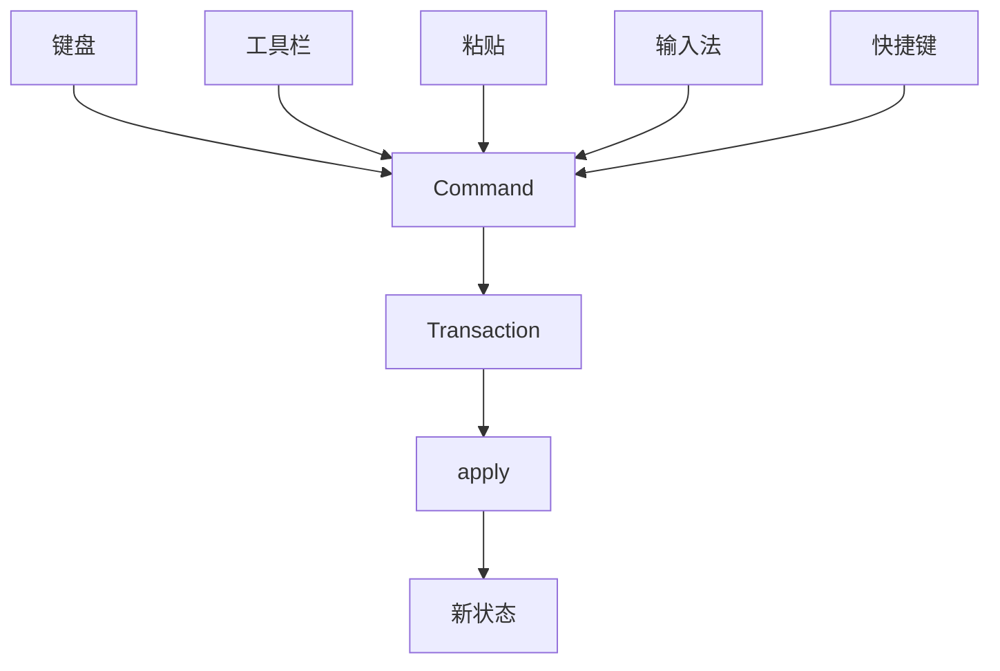
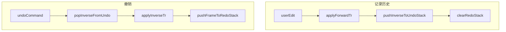
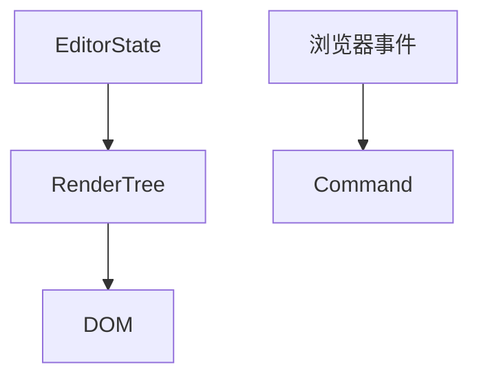
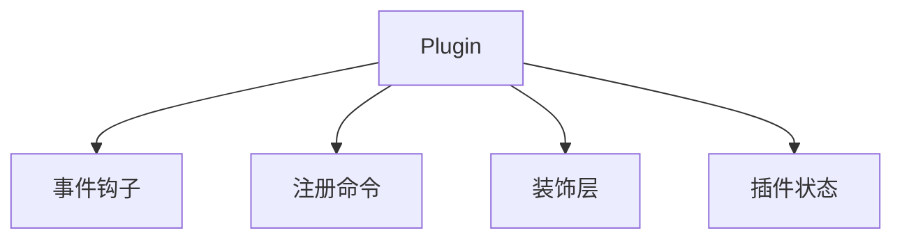
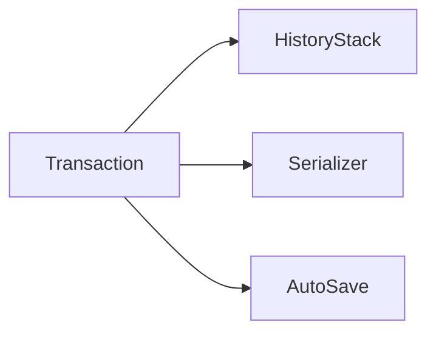

# 如何自己设计一个富文本编辑器

## 先看结论

-   富文本编辑器不是“直接改 DOM”，而是“先改文档模型，再把模型映射到 DOM”。
-   真正的内核是 `Schema + Doc + Selection + Command/Transaction + Render + Plugin`。
-   工程上不要一开始就做协同，先做“单机编辑闭环”，再逐步加历史记录、粘贴、协同和性能优化。



## 为什么不能直接操作 DOM

一句话：DOM 适合展示，不适合作为编辑器的唯一数据源。



最小例子：

```ts
type TextNode = { text: string; bold?: boolean };
type ParagraphNode = { type: 'paragraph'; children: TextNode[] };
type EditorDoc = ParagraphNode[];

const doc: EditorDoc = [
    {
        type: 'paragraph',
        children: [{ text: 'hello' }, { text: ' world', bold: true }],
    },
];
```

有了这棵文档树，编辑器处理的是 `doc`，不是浏览器里的零散 DOM 节点。

## 先拆出 5 层

一句话：自己设计编辑器时，先把“数据、操作、渲染、扩展、周边能力”拆开。

| 层级       | 负责什么                     | 典型对象                |
| ---------- | ---------------------------- | ----------------------- |
| 文档模型层 | 定义合法结构                 | `Schema` `Node` `Mark`  |
| 状态层     | 保存当前文档和选区           | `EditorState`           |
| 命令事务层 | 把输入转成变更               | `Command` `Transaction` |
| 渲染层     | 把状态映射到界面             | `Renderer` `View`       |
| 扩展层     | 接入快捷键、粘贴、历史、协同 | `Plugin`                |



## 文档模型怎么设计

一句话：富文本编辑器的核心不是字符串，而是“带语义的节点树”。

先记住 3 个词：

-   `Schema`：定义允许出现哪些节点、节点能包含什么。
-   `Node`：结构节点，比如段落、标题、列表、图片。
-   `Mark`：文本样式，比如加粗、斜体、链接。



最小例子：

```ts
type Mark = 'bold' | 'italic' | 'link';

interface TextNode {
    type: 'text';
    text: string;
    marks?: Mark[];
}

interface ParagraphNode {
    type: 'paragraph';
    children: Array<TextNode>;
}

interface ImageNode {
    type: 'image';
    src: string;
    alt?: string;
}

type BlockNode = ParagraphNode | ImageNode;
type DocNode = { type: 'doc'; children: BlockNode[] };
```

为什么要先做 Schema：

-   没有 Schema，任意节点都能互相嵌套，后面渲染、复制粘贴、导出都会越来越乱。
-   有了 Schema，标题里能不能放图片、列表里能不能放表格，都能在模型层先约束住。

## 选区模型不能省

一句话：编辑器不是只保存“内容”，还要保存“光标在哪里、选中了什么”。



最小例子：

```ts
interface Point {
    path: number[];
    offset: number;
}

interface Selection {
    anchor: Point;
    focus: Point;
}
```

为什么单独建模：

-   加粗命令要知道当前选中了哪段文本。
-   Backspace、Enter、Tab 的行为都依赖选区。
-   协同时，远程变更还要顺带修正本地选区位置。

## 输入为什么要统一走命令和事务

一句话：键盘输入、工具栏点击、粘贴、快捷键，本质上都应该落成同一种“变更描述”。



最小工作流：

```ts
interface EditorState {
    doc: DocNode;
    selection: Selection;
}

interface Transaction {
    type: 'insertText' | 'toggleBold' | 'insertImage';
    payload: Record<string, unknown>;
}

function applyTransaction(state: EditorState, tr: Transaction): EditorState {
    switch (tr.type) {
        case 'insertText':
            return state;
        case 'toggleBold':
            return state;
        case 'insertImage':
            return state;
        default:
            return state;
    }
}
```

核心价值：

-   所有变更都能进撤销栈。
-   所有变更都能做日志和调试。
-   所有变更都能同步给协同层。

## 命令系统怎么设计

一句话：`Command` 是“我想做什么”，`Transaction` 是“我具体改了什么”。

更直白一点：

-   `Command` 面向用户意图，比如“加粗”“插入图片”“回车换行”。
-   `Transaction` 面向状态变更，比如“给 10-20 这段文本加上 bold mark”“在第 3 个 block 后插入一个 image 节点”。
-   `Command` 通常先做校验，再决定要不要生成 `Transaction`。
-   一个 `Command` 可能不产生任何 `Transaction`，也可能产生一个或多个 `Transaction`。
-   `Transaction` 不一定只能由 `Command` 产生，撤销重做、协同同步、自动修正插件也可能直接生成 `Transaction`。

可以把它理解成：

| 概念          | 更像什么                | 关注点                   |
| ------------- | ----------------------- | ------------------------ |
| `Command`     | 业务动作 / 用户意图     | 能不能执行、要执行什么   |
| `Transaction` | 数据补丁 / 状态变更记录 | 改了哪些节点、选区怎么变 |

一个最短心智模型：

-   用户点了“加粗”按钮，这是 `Command`。
-   编辑器发现当前没有选中文本，那么 `Command` 直接返回 `false`，不会产生 `Transaction`。
-   如果当前选中了文本，`Command` 才会生成一个 `toggleBold` 的 `Transaction`。
-   `applyTransaction` 消费这个 `Transaction`，真正把文档状态改掉。


最小例子：加粗命令

```ts
interface CommandContext {
    state: EditorState;
    dispatch: (tr: Transaction) => void;
}

class ToggleBoldCommand {
    execute(ctx: CommandContext) {
        const hasSelection =
            JSON.stringify(ctx.state.selection.anchor) !==
            JSON.stringify(ctx.state.selection.focus);

        if (!hasSelection) return false;

        ctx.dispatch({
            type: 'toggleBold',
            payload: {},
        });

        return true;
    }
}
```

同一个场景拆开看：

```ts
// 1. Command：表达意图，决定要不要发起变更
const command = new ToggleBoldCommand();
const executed = command.execute(ctx);

// 2. Transaction：真正记录这次变更
const tr: Transaction = {
    type: 'toggleBold',
    payload: {},
};

// 3. apply：把变更应用到 state
const nextState = applyTransaction(ctx.state, tr);
```

这里最容易混淆的点是：

-   “加粗”这个动作本身是 `Command`。
-   “给选区里的文本补上 bold 标记”这个数据变化才是 `Transaction`。

建议：

-   `Command` 只关心“能不能做”和“发什么事务”。
-   `Transaction` 只关心“这次状态到底怎么改”。
-   真正改文档的逻辑统一收口到 `applyTransaction`。

### 撤销与重做怎么做

一句话：撤销 = 应用逆变更，重做 = 再应用正向变更。

按三步记就够了：

1. 用户编辑后，`apply(forwardTr)` 成功，再把对应的 `inverseTr` 记入 `undoStack`。
2. 执行撤销时，从 `undoStack` 弹出并 `apply(inverseTr)`，同时把这帧放入 `redoStack`。
3. 执行重做时，从 `redoStack` 弹出并 `apply(forwardTr)`；一旦出现新编辑，清空 `redoStack`。

和 `Transaction` 的关系：

-   `UndoCommand` / `RedoCommand` 仍是 `Command`，但落地依然是 `dispatch -> apply(Transaction)`。
-   撤销/重做通常带 `meta.addToHistory: false`，避免自己再次入历史。
-   小文档可用 state 快照入栈；生产更常用可逆 step（如 ProseMirror 的 invert + mapping）。



真实数据结构（推荐最小形态）：

```ts
type TextOp =
    | { kind: 'insertText'; at: number; text: string }
    | { kind: 'deleteText'; from: number; to: number; deletedText: string };

interface Transaction {
    id: string;
    ops: TextOp[];
    selectionBefore: Selection;
    selectionAfter: Selection;
    meta?: {
        addToHistory?: boolean;
        source?: 'user' | 'undo' | 'redo' | 'remote' | 'system';
    };
}

type UndoFrame = {
    /** 这次用户编辑真正做了什么 */
    forward: Transaction;
    /** 如何把这次编辑回滚 */
    inverse: Transaction;
};
```

一个真实例子（在位置 5 插入 "A"）：

```ts
const forwardTr: Transaction = {
    id: 'tr_101',
    ops: [{ kind: 'insertText', at: 5, text: 'A' }],
    selectionBefore: {
        anchor: { path: [0], offset: 5 },
        focus: { path: [0], offset: 5 },
    },
    selectionAfter: {
        anchor: { path: [0], offset: 6 },
        focus: { path: [0], offset: 6 },
    },
    meta: { addToHistory: true, source: 'user' },
};

const inverseTr: Transaction = {
    id: 'tr_101_inv',
    ops: [{ kind: 'deleteText', from: 5, to: 6, deletedText: 'A' }],
    selectionBefore: forwardTr.selectionAfter,
    selectionAfter: forwardTr.selectionBefore,
    meta: { addToHistory: false, source: 'undo' },
};
```

最小历史管理示例：

```ts
type UndoFrame = {
    forward: Transaction;
    inverse: Transaction;
};

class HistoryManager {
    private undoStack: UndoFrame[] = [];
    private redoStack: UndoFrame[] = [];

    /** 用户编辑 apply 成功后调用：inverse 能把 state 变回 apply 前 */
    recordUserChange(frame: UndoFrame) {
        this.undoStack.push(frame);
        this.redoStack = [];
    }

    undo(
        state: EditorState,
        apply: (s: EditorState, tr: Transaction) => EditorState
    ): EditorState | null {
        const frame = this.undoStack.pop();
        if (!frame) return null;
        const next = apply(state, frame.inverse);
        this.redoStack.push(frame);
        return next;
    }

    redo(
        state: EditorState,
        apply: (s: EditorState, tr: Transaction) => EditorState
    ): EditorState | null {
        const frame = this.redoStack.pop();
        if (!frame) return null;
        const next = apply(state, frame.forward);
        this.undoStack.push(frame);
        return next;
    }
}
```

为什么「新编辑要清空 `redoStack`」：

-   `redoStack` 记录的是“基于**当前历史分支**可以重放的未来操作”。
-   你一旦产生新编辑，就进入了新分支；旧 `redoStack` 属于旧分支。
-   如果不清空，重做旧分支操作会把文档套到不匹配的上下文，轻则光标错位，重则内容错乱。

可以把它看成 Git：

-   撤销后相当于 `HEAD` 回退；
-   此时 redo 像“还能前进到原来的提交”；
-   但你在回退点新提交一次，就分叉了，原来的“前进路径”自然失效，所以必须清空 redo。

工程注意：

-   连续输入要合并成一个撤销单元（如同一输入窗口内合并，或 debounce 入栈）。
-   自动保存回写、协同远端变更、程序化修正要单独标记是否入栈，避免撤销误伤后台变更。

## 渲染层怎么设计

一句话：渲染层负责把状态映射为 DOM，但不要让 DOM 反过来成为唯一事实来源。



实现上常见两条路：

-   React/Virtual DOM 路线：开发体验好，但需要处理 selection 与受控更新问题。
-   原生 DOM + 增量更新路线：性能更稳，但工程复杂度更高。

渲染层至少要处理 3 件事：

-   根据节点类型渲染对应 DOM。
-   尽量做局部更新，不要整棵树重绘。
-   更新后把模型里的 selection 映射回真实光标。

## 插件系统决定扩展性上限

一句话：插件系统越清晰，后面接工具栏、快捷键、粘贴规则、评论、历史记录就越容易。



最小例子：插件接口

```ts
interface EditorPlugin {
    name: string;
    onKeyDown?: (event: KeyboardEvent, state: EditorState) => boolean;
    onPaste?: (text: string, state: EditorState) => Transaction | null;
    extendCommands?: () => Record<string, (...args: unknown[]) => boolean>;
}

class MaxLengthPlugin implements EditorPlugin {
    name = 'maxLength';

    onPaste(text: string) {
        if (text.length > 1000) {
            return null;
        }

        return {
            type: 'insertText',
            payload: { text },
        };
    }
}
```

你后面要加的很多能力，本质都是插件：

-   快捷键
-   自动补全
-   Markdown 输入规则
-   评论批注
-   协同光标

## 基础能力怎么补齐

一句话：单机可用的编辑器，至少要把历史记录、粘贴、序列化、自动保存补齐。

| 能力     | 最小做法                     | 为什么重要         |
| -------- | ---------------------------- | ------------------ |
| 撤销重做 | 基于 transaction 入栈        | 所有编辑器都必备   |
| 复制粘贴 | 粘贴前清洗 HTML              | 避免脏结构进入文档 |
| 序列化   | `doc <-> JSON/HTML/Markdown` | 方便存储与导出     |
| 自动保存 | 节流后保存 JSON              | 减少丢稿风险       |
| 只读态   | 禁止命令下发                 | 权限控制基础       |



## 进阶能力怎么演进

一句话：复杂能力不要同时开工，建议按“协同、评论、性能、权限”分阶段推进。

### 1. 协同编辑

核心心智：

-   单机编辑器先输出稳定的 transaction 或 operation。
-   协同层只负责同步和冲突处理，不直接碰 DOM。
-   富文本场景里，模型越稳定，协同越容易落地。


### 2. 评论批注

评论通常不是改正文档节点，而是“挂在选区范围上的附属数据”。

```ts
interface Comment {
    id: string;
    range: Selection;
    content: string;
}
```

### 3. 大文档性能

先记住 4 个优化点：

-   只更新受影响节点。
-   Decorations 不要全量重算。
-   大块内容做分片或虚拟滚动。
-   输入合并成批量 transaction，减少重渲染。

### 4. 权限与只读态

权限不要只做在按钮层，要落到命令层：

-   没权限时，命令直接返回 `false`。
-   只读态下，允许选中、复制、评论，不允许改文档。

## 从 0 到 1 的实现顺序

一句话：先做最小闭环，再做体验，再做复杂能力。

1. 定义 `Schema / Node / Mark / Selection`。
2. 做最小命令系统：输入文本、删除、回车、加粗。
3. 做 `transaction -> apply -> render` 闭环。
4. 做工具栏、快捷键、粘贴规则。
5. 做撤销重做、自动保存、序列化。
6. 做图片、表格、评论等复杂节点。
7. 最后再做协同、离线、性能优化。

## 面试回答模板

一句话版：

> 我会先把富文本编辑器拆成文档模型、选区模型、命令事务层、渲染层和插件层。编辑行为不直接改 DOM，而是统一转成 transaction 去更新 state，再把 state 渲染到 DOM。这样后面接撤销重做、粘贴清洗、协同编辑和性能优化都会更顺。

面试展开顺序：

1. 先讲为什么不能直接操作 DOM，因为 DOM 不适合作为唯一数据源。
2. 再讲文档模型，强调 `Schema + Node + Mark`。
3. 再讲选区和命令，把所有输入统一收敛到 transaction。
4. 再讲渲染层和插件层，说明可扩展性来自插件机制。
5. 最后补撤销重做、协同编辑、大文档性能，体现工程完整度。

如果面试官继续追问，你可以按这几个方向展开：

-   追问数据结构：讲节点树、mark、selection path。
-   追问工程实现：讲 command、transaction、plugin。
-   追问协同：讲 operation、OT/CRDT、远程选区同步。
-   追问性能：讲局部更新、虚拟滚动、装饰层优化。

## 最后记忆

-   编辑器最难的不是工具栏，而是“状态建模”。
-   能把所有输入收口成 transaction，编辑器架构就稳了一半。
-   能把插件边界设计清楚，后面扩展复杂能力才不会推倒重来。

### 延伸阅读

-   ProseMirror 侧：`history` 插件与逆操作细节见 [proseMirror 常见问题](./proseMirror常见问题.md) 第 9 题「如何实现撤销/重做？ProseMirror 内部如何管理历史记录？」。
