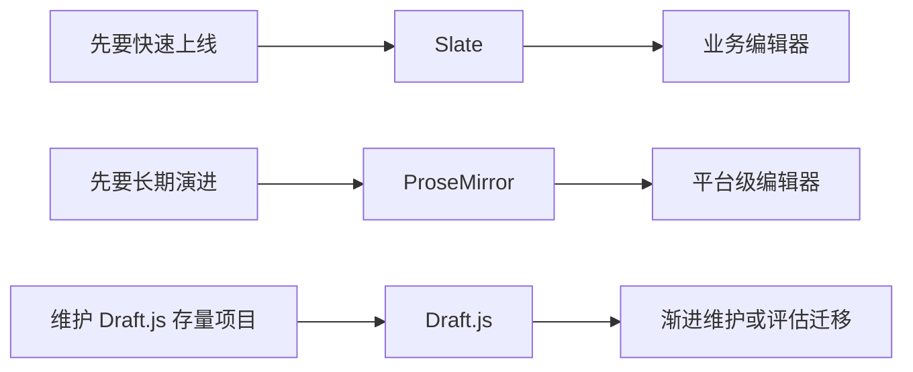
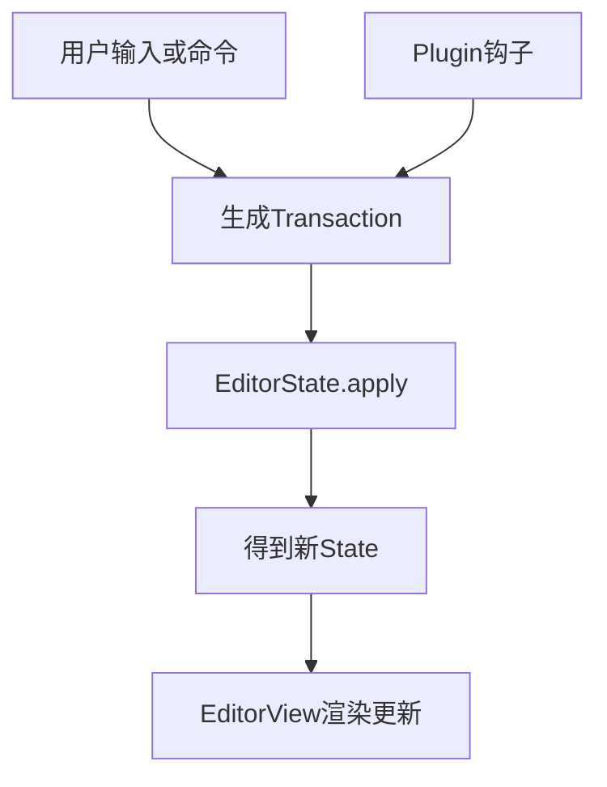
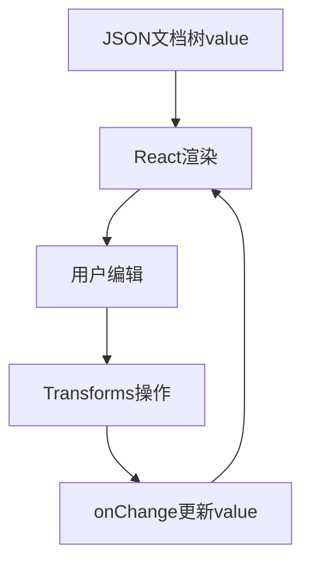
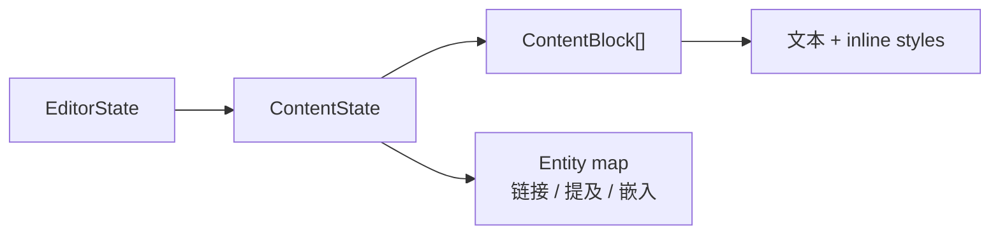

# 编辑器框架：ProseMirror / Slate / Draft.js

## 先看结论

-   ProseMirror：更像“编辑器内核”，强约束、强扩展，适合长期平台化。
-   Slate：更像“React 友好的编辑器状态层”，上手快，适合业务快速交付。
-   Draft.js：基于 block + entity 的 React 编辑器框架，适合维护存量项目；复杂文档扩展和生态活跃度较弱。
-   不想从底层搭起：优先考虑基于 ProseMirror 的 `Tiptap`。



## ProseMirror 是什么

一句话：**基于 Schema 的文档编辑引擎**，核心是“状态不可变 + 事务驱动 + 插件扩展”。

### 你要记住的 4 个词

-   `Schema`：定义文档合法结构（有哪些节点、节点可包含什么）。
-   `EditorState`：当前文档和选区等状态快照。
-   `Transaction`：一次编辑变更（插入文本、设置 mark、替换节点）。
-   `Plugin`：把键盘、输入规则、粘贴、历史记录等能力挂进去。

### 最小心智模型



### 最小示例（概念级）

```ts
import { EditorState } from 'prosemirror-state';
import { EditorView } from 'prosemirror-view';
import { schema } from 'prosemirror-schema-basic';

const state = EditorState.create({ schema });
const view = new EditorView(document.querySelector('#editor'), { state });

// 任何编辑行为，最终都是 transaction -> apply -> 新 state
const tr = view.state.tr.insertText('Hello ProseMirror');
view.dispatch(tr);
```

## Slate 是什么

一句话：**用 JSON 节点树描述富文本，并通过 React 渲染与操作**。

### 你要记住的 4 个词

-   `Editor`：编辑器实例，承载操作能力。
-   `Node`：文档树节点（段落、文本、列表等）。
-   `Transforms`：对节点树做变换（插入、删除、包裹、拆分）。
-   `renderElement/renderLeaf`：把结构和样式渲染成 React UI。

### 最小心智模型



### 最小示例（概念级）

```tsx
import { createEditor } from 'slate';
import { Slate, Editable, withReact } from 'slate-react';
import { useMemo, useState } from 'react';

const initialValue = [
    { type: 'paragraph', children: [{ text: 'Hello Slate' }] },
];

export default function Demo() {
    const editor = useMemo(() => withReact(createEditor()), []);
    const [value, setValue] = useState(initialValue);

    return (
        <Slate editor={editor} initialValue={value} onChange={setValue}>
            <Editable placeholder="Type here..." />
        </Slate>
    );
}
```

## Draft.js 是什么

一句话：**Draft.js 用 `EditorState` 管理内容、选区和撤销，文档由 block、inline style 和 entity 组成。**



它与 React 集成直接，适合已有系统和结构较简单的编辑器。面对嵌套表格、复杂 schema、大文档、协同和长期插件平台时定制成本较高，新大型项目通常先评估 ProseMirror/Tiptap 或 Slate。

## 核心对比（面试/选型高频）

| 维度 | ProseMirror | Slate | Draft.js |
| --- | --- | --- | --- |
| 核心模型 | Schema + State + Transaction + Plugin | JSON 节点树 + Operations/Transforms | EditorState + block + entity |
| 学习曲线 | 偏陡，内核概念多 | React 团队较容易上手 | 基础使用简单 |
| 文档约束 | 强 schema，结构一致性高 | 灵活，约束依赖 normalize 和工程规范 | block 直观，复杂嵌套较弱 |
| 扩展方式 | 插件成熟，可控但复杂 | 灵活，复杂能力需团队沉淀 | decorator/renderer/entity，深度扩展成本高 |
| 协同编辑 | 社区方案和实践较成熟 | 可做，需处理更多边界 | 非核心优势，定制成本高 |
| 适用场景 | 长期平台化、复杂文档 | React 业务快速迭代 | 维护存量、简单编辑器 |

## 怎么选（直接决策）

-   你要做“长期可演进”的编辑器平台：选 ProseMirror（或 Tiptap）。
-   你要在 React 项目里快速做出可用富文本：优先 Slate。
-   已有 Draft.js 系统：可继续维护；新增复杂 schema 或协同时先评估迁移成本。
-   团队编辑器经验偏少，又想稳妥落地：先 Tiptap，再按需求下探 ProseMirror。
