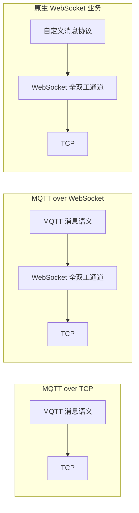
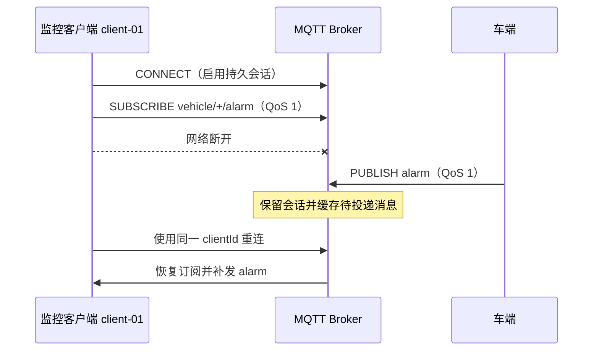
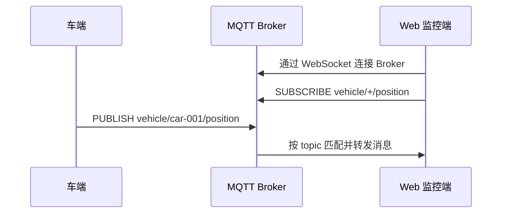
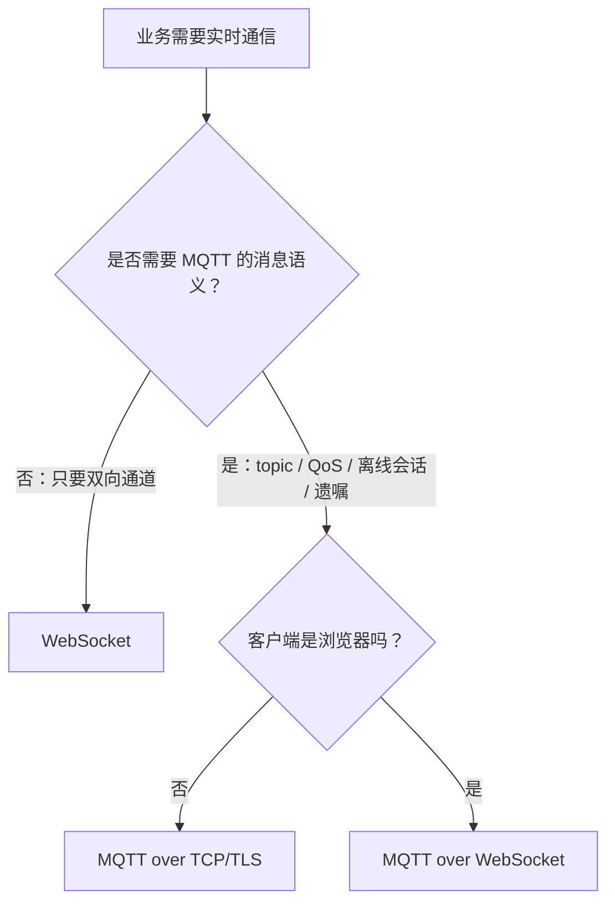

# MQTT 和 WebSocket 的区别

> **一句话结论：** WebSocket 是通用的全双工通信协议，只负责建立一条可双向收发数据的连接；MQTT 是面向物联网的发布/订阅消息协议，额外定义了 topic、QoS、保留消息、遗嘱消息和会话等语义。二者不是互斥关系，MQTT 既可以直接跑在 TCP 上，也可以跑在 WebSocket 上。

## 一、二者不在同一个抽象层



- **WebSocket** 解决浏览器和服务端如何保持一条全双工长连接。
- **MQTT** 解决消息发到哪个 topic、由谁订阅、如何确认重传、断线后是否恢复会话等问题。
- 浏览器不能直接建立任意 TCP 连接，因此浏览器接 MQTT Broker 时通常使用 **MQTT over WebSocket**。

## 二、核心区别

| 对比项 | WebSocket | MQTT |
| --- | --- | --- |
| 定位 | 通用双向通信协议 | 轻量级发布/订阅消息协议 |
| 通信模型 | 客户端与服务端点对点连接 | 发布者 -> Broker -> 订阅者，多对多解耦 |
| 消息路由 | 没有内置路由，业务层自己定义事件名和转发规则 | 原生支持 topic、`+`/`#` 通配符订阅 |
| 可靠性 | 只依赖 TCP 有序可靠传输；应用层确认、重试和幂等要自己实现 | 提供 QoS 0/1/2、离线消息和持久会话等机制 |
| 状态能力 | 没有内置保留消息、遗嘱消息 | 原生支持 retained message 和 LWT |
| 心跳 | 协议有 Ping/Pong，但浏览器 JS 不能直接发送控制帧，常自定义应用层心跳 | CONNECT 中声明 Keep Alive，Broker 可据此判断客户端失联并触发遗嘱 |
| 服务端角色 | 普通 WebSocket Server | MQTT Broker，负责路由、会话和投递 |
| 典型场景 | 聊天、协同编辑、游戏、进度推送等自定义实时业务 | 车联网、物联网设备、遥测、状态同步、告警与指令下发 |

> TCP 的可靠传输只保证当前连接内的字节有序到达。连接中断时，尚未完成的业务消息是否重发、消费是否重复，WebSocket 本身并不处理；MQTT 则提供了协议级投递机制，但业务副作用仍需幂等。

## 三、遗嘱、保留消息和持久会话

> **一句话区分：** 遗嘱消息管“客户端异常掉线后通知别人”，保留消息管“新订阅者立即得到某个 topic 的最新值”，持久会话管“同一客户端断线重连后继续原来的会话”。

| 能力 | Broker 保存什么 | 触发时机 | 典型用途 |
| --- | --- | --- | --- |
| 遗嘱消息 LWT | 客户端在 `CONNECT` 时预登记的消息 | Broker 判定客户端异常断开时代为发布 | 设备离线通知、异常告警 |
| 保留消息 Retained Message | 每个 topic 最新的一条保留消息 | 新订阅者订阅匹配 topic 时立即下发 | 最新在线状态、开关状态、配置快照 |
| 持久会话 Persistent Session | 按 `clientId` 保存订阅关系、未完成的 QoS 流程和符合条件的离线消息 | 同一 `clientId` 在会话过期前重连时恢复 | 断线后无需重新订阅，并补收离线期间的重要消息 |

### 1. 遗嘱消息（LWT）

客户端连接时先告诉 Broker：“如果我不是正常退出，请帮我发这条消息”。进程崩溃、网络中断或心跳超时时，Broker 会代为发布；客户端发送 `DISCONNECT` 正常离线时不会发布。

```text
CONNECT willTopic=vehicle/car-001/status, willPayload=offline
# 车端突然断网
Broker PUBLISH vehicle/car-001/status -> offline
```

### 2. 保留消息（Retained Message）

发布者将 `retain` 设为 `true` 后，Broker 保存该 topic 的最新一条消息。后来的订阅者一订阅就能收到当前值，不必等发布者再发一次。

```text
PUBLISH vehicle/car-001/status -> online  (retain=true)
# 监控端之后才上线
SUBSCRIBE vehicle/car-001/status
Broker -> online                            # 立即补发保留值
```

保留消息和遗嘱常配合使用：车端正常上线后发布 `online + retain`，同时预设 `offline + retain` 遗嘱。这样即使监控端之后才上线，也能立即看到车辆当前状态。

### 3. 持久会话（Persistent Session）

持久会话让 Broker 在网络连接断开后仍保留客户端的会话状态。客户端使用同一个 `clientId` 重连后，可恢复订阅，并接收离线期间 Broker 为它排队的消息。



- MQTT 3.1.1 使用 `cleanSession=false` 开启持久会话。
- MQTT 5 使用 `cleanStart=false` 并设置大于 `0` 的 Session Expiry Interval。
- 离线消息不是无限保存；受 QoS、会话过期时间和 Broker 的队列限制影响。持久会话也不等于业务数据永久存储。

> 最容易混淆的点：**保留消息是按 topic 保存“最新值”，持久会话是按 clientId 保存“某个客户端的会话”**。

更完整的 QoS 和订阅生命周期见 [MQTT 的 QoS、遗嘱消息、保留消息与订阅生命周期](./MQTT的QoS遗嘱保留消息与订阅生命周期.md)。

## 四、同一个需求分别怎么做

以订阅车辆位置为例，原生 WebSocket 需要双方约定消息结构和订阅逻辑：

```json
{
  "type": "subscribe",
  "channel": "vehicle/car-001/position"
}
```

服务端收到后，要自行维护“连接 -> channel”的订阅表，并实现鉴权、广播、重连恢复和消息确认。

MQTT 已经把这些概念标准化：

```text
SUBSCRIBE vehicle/car-001/position   # 订阅位置
PUBLISH   vehicle/car-001/position   # 发布位置
SUBSCRIBE vehicle/+/alarm            # 订阅所有车辆告警
```



这里浏览器和 Broker 之间的底层通道是 WebSocket，上层消息协议仍然是 MQTT。

## 五、怎么选

> **先不要问“是不是实时”，而要问“我需要一条通道，还是一套消息系统”。** 只需要双向通道选 WebSocket；需要发布/订阅、消息投递和离线状态管理选 MQTT。

### 只问两个问题



#### 问题 1：需要“通道”还是“消息系统”？

**选 WebSocket**，当服务端明确知道消息要发给哪个用户或连接，业务只需要一条可自定义的双向通道。

```text
客服发消息 -> 聊天服务 -> 指定用户的 WebSocket 连接
```

**选 MQTT**，当发布者不应关心谁在消费，只需将消息发到 topic；或者需要 QoS、保留消息、遗嘱、持久会话中的任意一项。

```text
车端 -> PUBLISH vehicle/001/alarm
                 Broker
                   |-> 监控大屏
                   |-> 告警服务
                   |-> 数据存储服务
```

如果用 WebSocket 实现后一种需求，就要自己开发 topic 匹配、订阅表、确认重试、离线队列和会话恢复，本质上是在造一个简化的 MQTT Broker。

#### 问题 2：如果选了 MQTT，客户端能否直连 TCP？

- 车端、IoT 设备、后端服务能直连 TCP：用 **MQTT over TCP/TLS**。
- 浏览器 JS 不能建立任意 TCP 连接：用 **MQTT over WebSocket**。

这一步只是在选 MQTT 的传输方式，不是再在 MQTT 和 WebSocket 之间二选一。

### 用四个场景验证

| 场景 | 怎么推导 | 结果 |
| --- | --- | --- |
| 聊天、协同编辑 | 主要是用户与业务服务端交互，消息和状态机高度定制 | WebSocket |
| 一辆车的位置要同时给大屏、调度和存储服务 | 发布者不应感知多个消费者，适合 topic 订阅 | MQTT |
| 车辆掉线后要自动告警，重连后要恢复订阅 | 需要遗嘱和持久会话 | MQTT |
| Web 大屏要直接订阅上述车辆 topic | 业务需要 MQTT，但运行环境是浏览器 | MQTT over WebSocket |

### 不要用这些方式判断

- **“是实时业务，所以用 WebSocket”**：两者都能实时通信，这不是区分点。
- **“是设备数据，所以用 MQTT”**：设备和服务端若只需要定制点对点通道，WebSocket 也可以。
- **“MQTT 和 WebSocket 必须二选一”**：MQTT over WebSocket 中，MQTT 提供消息语义，WebSocket 提供浏览器可用的传输通道。

## 六、面试回答

> WebSocket 和 MQTT 不是同一层的替代品。WebSocket 提供客户端和服务端之间的全双工长连接，但 topic 路由、确认重试、离线会话等都要业务自己设计；MQTT 是基于发布/订阅模型的消息协议，通过 Broker 提供 topic、QoS、保留消息和遗嘱消息等能力。MQTT 可以直接跑在 TCP 上，也可以跑在 WebSocket 上，浏览器接入 MQTT 时通常就是后者。选型上，自定义强、点对点的实时业务可以用 WebSocket；设备多、订阅关系复杂、需要投递和会话能力时更适合 MQTT。
