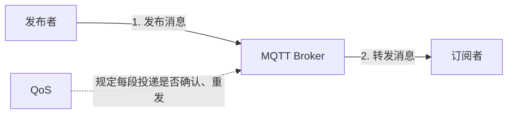
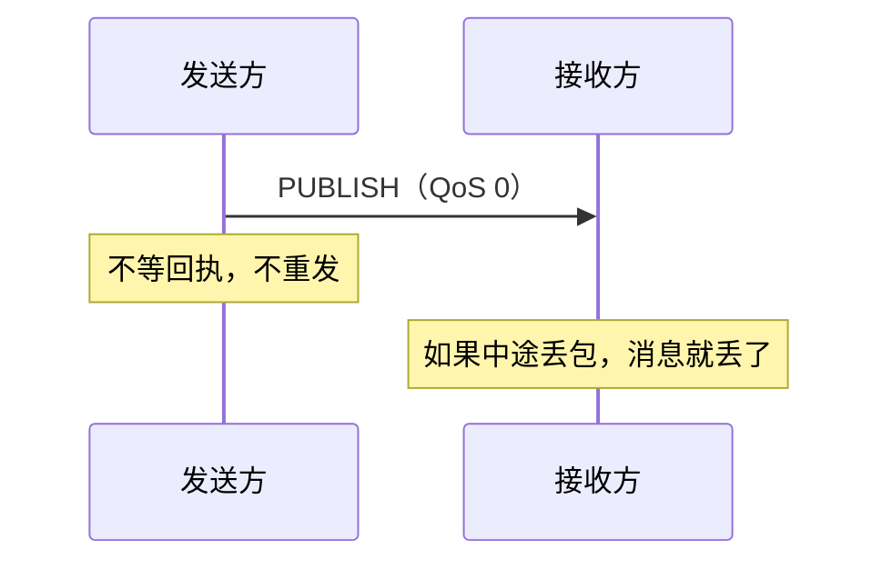
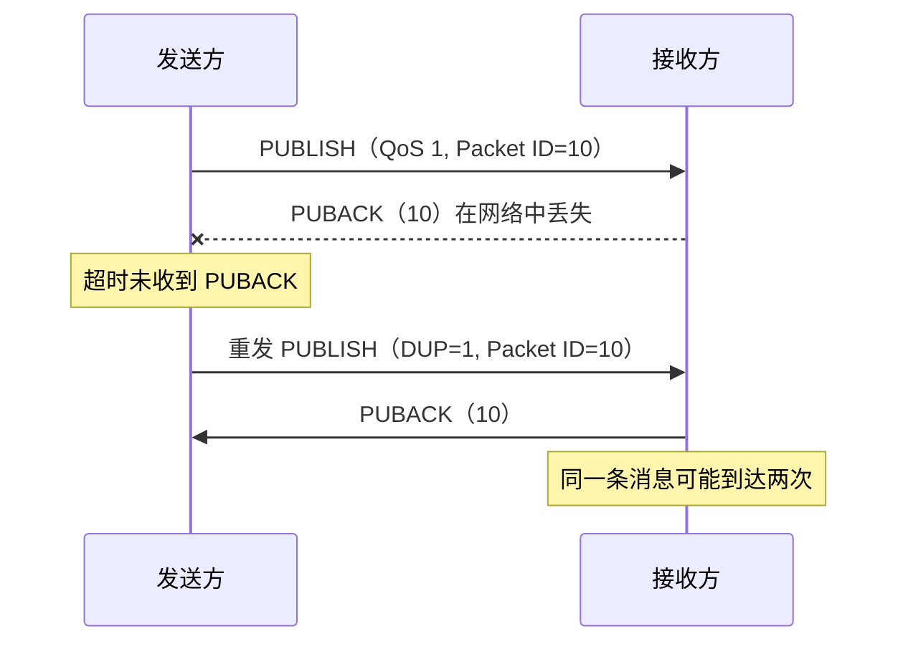
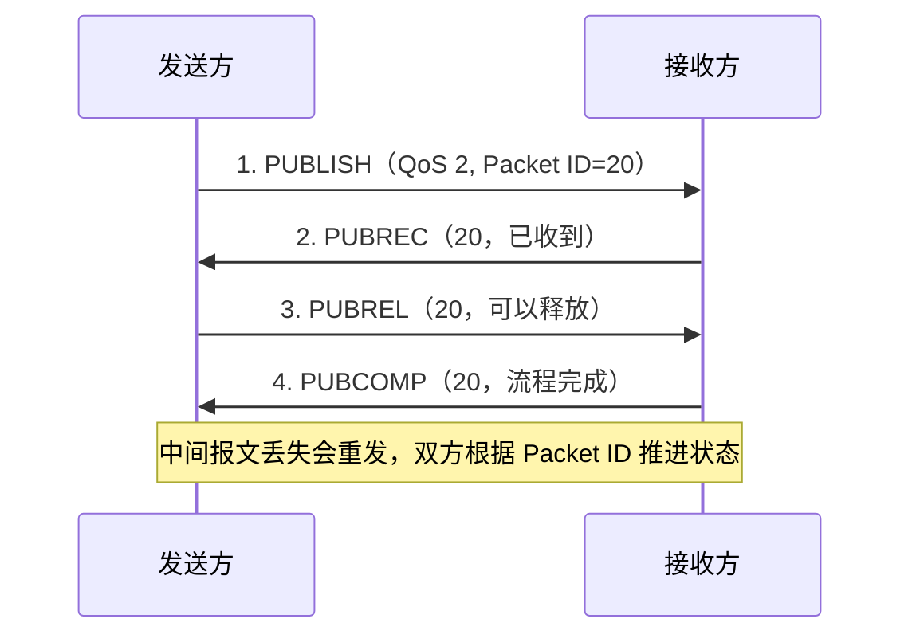
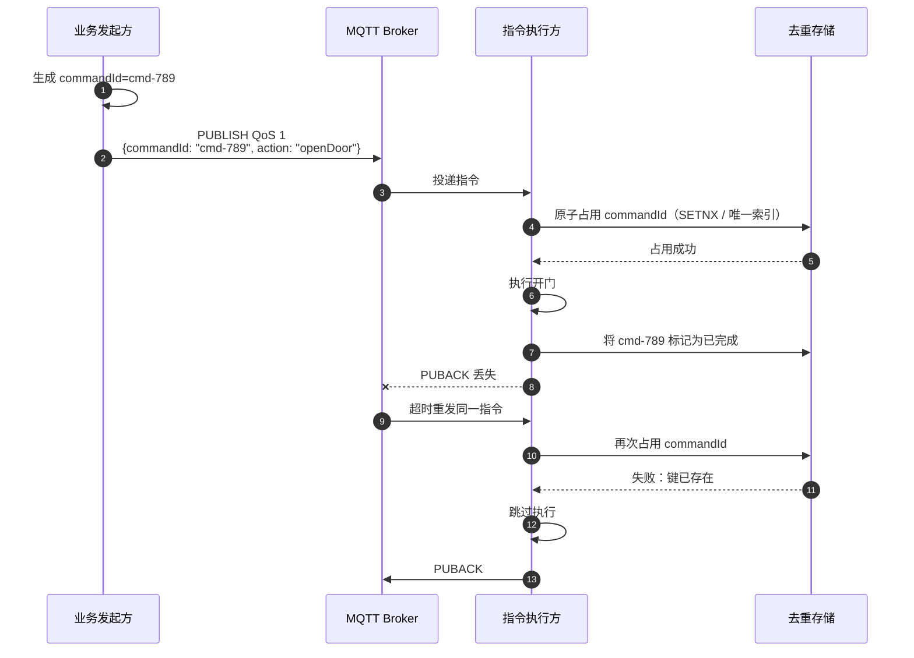

# MQTT 的 QoS、遗嘱消息、保留消息与订阅生命周期

> **一句话结论：** 四个概念各有分工——**QoS** 管「这条消息到底能不能到」；**遗嘱消息**管「客户端异常挂了，别人要知道」；**保留消息**管「新订阅者一上线，立刻拿到最新状态」；**订阅生命周期**管「连接断了、组件卸了，订阅关系怎么和 broker 对齐」。

---

## 一、先搞懂 QoS 是什么

**QoS（Quality of Service，服务质量）是 MQTT 对「一条消息要多努力地送到」的投递级别。**

想象你在寄件：

- **QoS 0** 像寄平信：发出去就算完成，不要回执；
- **QoS 1** 像寄需签收的快递：没收到回执就重发，所以对方可能收到两份；
- **QoS 2** 像双方多次核对交接：尽量确保只交付一次，但流程最重。



例如车辆每秒上报一次位置。某一条丢了，下一秒还会有新位置，用 QoS 0 就够了；而「立即停车」指令不能轻易丢，通常用 QoS 1，并用指令 ID 防止重复执行。

### QoS 0/1/2 分别用在哪里

QoS **越高投递保证越强，但确认报文、延迟和资源开销也越大**：

| QoS | 发送方怎么做 | 结果 | 适用场景 |
| --- | --- | --- | --- |
| **0** | 只发一次，不等确认 | **可能丢失** | 位置、温度、实时状态等高频快照；新值很快会覆盖旧值 |
| **1** | 等待 `PUBACK`，超时就重发 | **至少到一次，可能重复** | 告警、订单状态、下行指令；不能轻易丢，业务层要幂等去重 |
| **2** | 用 `PUBLISH → PUBREC → PUBREL → PUBCOMP` 四步交互 | **协议层恰好交付一次** | 确实不允许重复交付、且能接受额外开销的少数场景 |

### QoS 0/1/2 的投递流程

#### QoS 0：发完就结束



#### QoS 1：没收到回执就重发



#### QoS 2：四步握手完成一次交付



> 上图的「发送方 → 接收方」表示一段 MQTT 连接。「发布者 → Broker」和「Broker → 订阅者」会分别执行自己的 QoS 流程；Broker 转发时的最终 QoS 不会高于发布 QoS 和订阅时声明的最大 QoS。

> 注意：QoS 保证的是 **MQTT 协议层的消息投递**，不保证订阅者的业务代码一定执行成功。例如「扣款只扣一次」仍需要业务层的幂等设计。

> 面试金句：**QoS 不是越高越好**——位置这类高频快照用 QoS 0（旧消息没价值），告警/指令才用 QoS 1。业务上「恰好一次」通常不是靠 QoS 2，而是「QoS 1 + 应用层幂等」。

典型 topic 设计（QoS 跟着业务走）：

```text
vehicle/{vehicleId}/position   # 位置上报（高频，QoS 0：丢一条无所谓）
vehicle/{vehicleId}/alarm      # 告警（QoS 1 + 幂等去重）
fleet/{fleetId}/command        # 下行指令（QoS 1 + 幂等键）
```

### QoS 1 怎么配合幂等键和去重

**QoS 1 负责「尽量不丢」，业务幂等负责「重复到达也只执行一次」。**



消息中的业务标识必须由发起方生成，并在同一业务意图的所有重试中保持不变：

```json
{
  "commandId": "cmd-789",
  "action": "openDoor",
  "vehicleId": "car-001"
}
```

| 标识 | 作用范围 | 用途 |
| --- | --- | --- |
| MQTT `Packet Identifier` | 当前 MQTT 连接上的一次协议交互 | 让 MQTT 完成 QoS 1/2 确认和重发；不能当业务幂等键 |
| `eventId` / `messageId` | 一个业务事件 | 让消费方过滤 QoS 1 重复投递，例如同一告警只弹一次 |
| `commandId` / `idempotencyKey` | 一次业务意图 | 让执行方阻止双击、超时重试等导致的重复执行 |

> 幂等键的「判重 + 占用」必须是原子操作，可以用 Redis `SETNX` 或数据库唯一索引。如果业务变更也在同一数据库中，应将占键与业务变更放进同一事务；如果是开门这类外部设备动作，还需要「处理中 / 已完成 / 失败」状态和超时对账机制。完整实现见 [怎么保证消息不丢、不重复（幂等）](./消息不丢不重复幂等.md)。

---

## 二、遗嘱消息（LWT）有什么用

遗嘱消息（Last Will and Testament）解决「**客户端异常掉线，别人怎么知道**」：

- 客户端在 CONNECT 时预先登记一条遗嘱消息（如 `<vehicleId>/offline`）；
- 客户端正常断开（发 DISCONNECT）时，遗嘱**不生效**；
- 客户端**异常掉线**（网络断了、进程崩了）时，broker 检测到心跳超时，**自动替它发布**这条遗嘱，通知所有订阅者「这车离线了」。

> 价值：车端在荒郊野岭断电/断网，你不可能指望它自己说「我下线了」——broker 代为广播离线状态，大屏才能把车标灰、触发告警。

---

## 三、保留消息（Retained Message）有什么用

保留消息解决「**新订阅者一上线，怎么立刻拿到最新状态**」：

- 发布时带 `retain: true`，broker 会**存下这条消息**（每个 topic 只存最新一条）；
- 之后**任何新订阅者**订阅该 topic 时，broker **立即补发**这条保留消息，不用等下一次上报；
- 发一条 `retain: true` 的空消息可以清除保留。

| | 遗嘱消息 | 保留消息 |
| --- | --- | --- |
| 触发时机 | 发布者**异常掉线**时 | 新订阅者**订阅**时 |
| 解决 | 别人要知道「它挂了」 | 新人要知道「它现在的状态」 |
| 常见用法 | `offline` 告警 | 车辆当前状态/固件版本/告警开关 |

> 两者常配合：遗嘱消息也带 `retain`，这样**新上线的大屏**订阅 `<vehicleId>/offline` 时，能立刻知道「这车当前是不是已经离线」，而不是等到下一次状态更新。

---

## 四、订阅端怎么管理生命周期

订阅登记在 **broker 那边**（不是本地代码），而「连接会断线重连、组件会挂载卸载」——订阅生命周期就是让这张登记表跟两边对齐：

| 错位 | 事故现场 | 对策 |
| --- | --- | --- |
| **连接**断线重连（`clean=true` 时重连 = 全新会话，broker 烧掉旧登记表） | 本地代码一切正常，却**一条消息都收不到** | 重连后照账**重放**订阅 |
| **组件**挂载卸载（一条连接被多个组件共用，谁先卸谁退订） | 车辆列表先卸载，**地图组件跟着断流** | 引用计数，**归零才退订** |

```typescript
import type { IPublishPacket, MqttClient } from 'mqtt';

type MessageHandler = (payload: Buffer, packet: IPublishPacket) => void;
type Subscription = { handler: MessageHandler };
type Unsubscribe = () => Promise<void>;

class SubscriptionManager {
  // 示例按精确 topic 分发；如需 +/# 通配符，需增加 topic 匹配器。
  private readonly subscriptions = new Map<string, Set<Subscription>>();

  constructor(private readonly client: MqttClient) {
    // MQTT.js 只有一个全局 message 事件，再由管理器分发。
    this.client.on('message', this.handleMessage);
  }

  async subscribe(topic: string, handler: MessageHandler): Promise<Unsubscribe> {
    const current = this.subscriptions.get(topic);
    const subscription = { handler };

    if (current) {
      current.add(subscription);
    } else {
      this.subscriptions.set(topic, new Set([subscription]));
      try {
        await this.client.subscribeAsync(topic, { qos: 1 });
      } catch (error) {
        this.subscriptions.delete(topic);
        throw error;
      }
    }

    let active = true;
    return async () => {
      if (!active) return;
      active = false;
      try {
        await this.unsubscribe(topic, subscription);
      } catch (error) {
        active = true; // 退订失败，允许组件稍后再次清理。
        throw error;
      }
    };
  }

  async replayAll(): Promise<void> {
    // clean=true 且客户端未自动重订阅时，在 reconnect/connect 后调用。
    await Promise.all(
      [...this.subscriptions.keys()].map((topic) =>
        this.client.subscribeAsync(topic, { qos: 1 }),
      ),
    );
  }

  destroy(): void {
    this.client.off('message', this.handleMessage);
  }

  private readonly handleMessage = (
    topic: string,
    payload: Buffer,
    packet: IPublishPacket,
  ): void => {
    for (const { handler } of this.subscriptions.get(topic) ?? []) {
      try {
        handler(payload, packet);
      } catch (error) {
        console.error(`MQTT handler failed: ${topic}`, error);
      }
    }
  };

  private async unsubscribe(
    topic: string,
    subscription: Subscription,
  ): Promise<void> {
    const current = this.subscriptions.get(topic);
    if (!current) return;

    current.delete(subscription);
    if (current.size > 0) return;

    this.subscriptions.delete(topic);
    try {
      await this.client.unsubscribeAsync(topic);
    } catch (error) {
      // 远端退订失败时恢复本地记录，便于稍后重试。
      this.subscriptions.set(topic, current);
      current.add(subscription);
      throw error;
    }
  }
}
```

组件使用时传入回调，并在卸载时调用返回的清理函数：

```typescript
const stop = await manager.subscribe('vehicle/car-001/alarm', (payload) => {
  const alarm = JSON.parse(payload.toString()) as VehicleAlarm;
  showAlarm(alarm);
});

await stop(); // 组件卸载；同 topic 还有其他回调时不会向 Broker 退订
```

- **回调分发**：`client.on('message')` 统一接收 MQTT 消息，再按 topic 调用所有 handler；
- **照账重放**：重连成功后遍历本地订阅表重新 SUBSCRIBE。MQTT.js 默认可能自动重订阅，实际项目只保留一种重订阅机制；
- **最后一个回调移除才退订**：避免组件 A 卸载时把组件 B 还在看的消息掐断。

---

## 面试回答

> 四个概念各管一件事。QoS 是投递保证：0 至多一次适合位置这种高频快照、丢一条无所谓，1 至少一次适合告警指令、配合幂等去重，2 恰好一次但四步握手太重、一般用 QoS1 + 幂等替代。遗嘱消息是客户端 CONNECT 时预登记的，异常掉线时 broker 自动代发 offline，让大屏知道车挂了。保留消息是发布时带 retain，broker 存最新一条，新订阅者一订阅就立刻收到当前状态，常和遗嘱配合让新上线的大屏立刻知道谁在线谁离线。订阅生命周期管的是 broker 那边登记表跟本地对齐：重连后 clean=true 会清空登记表，要照本地账重放订阅；多组件共用一条连接要引用计数，归零才退订。

## 相关资料

- [心跳机制介绍](./心跳机制.md)
- [怎么保证消息不丢、不重复（幂等）](./消息不丢不重复幂等.md)
