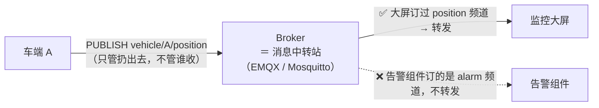
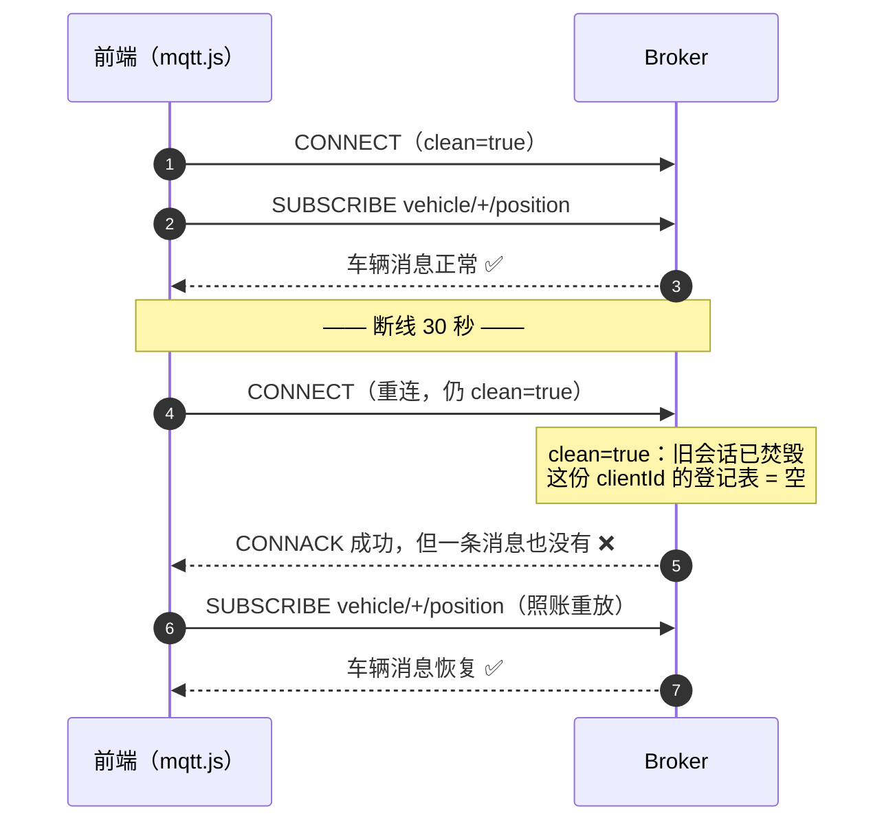
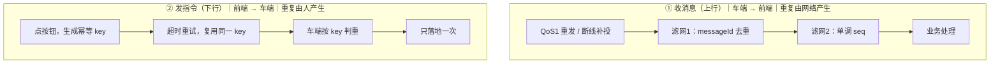
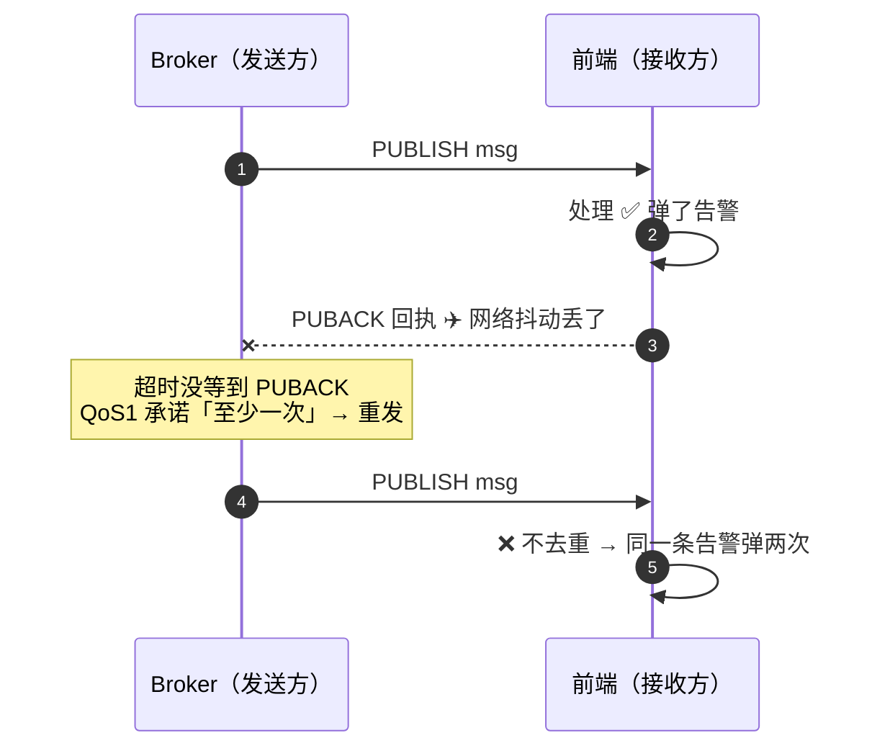
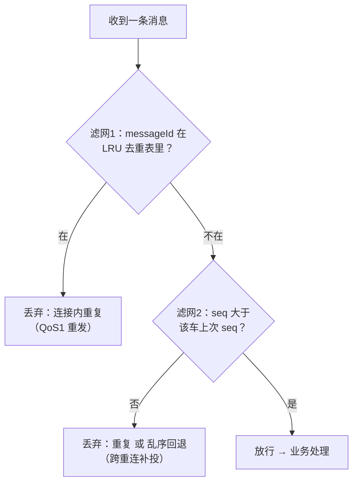
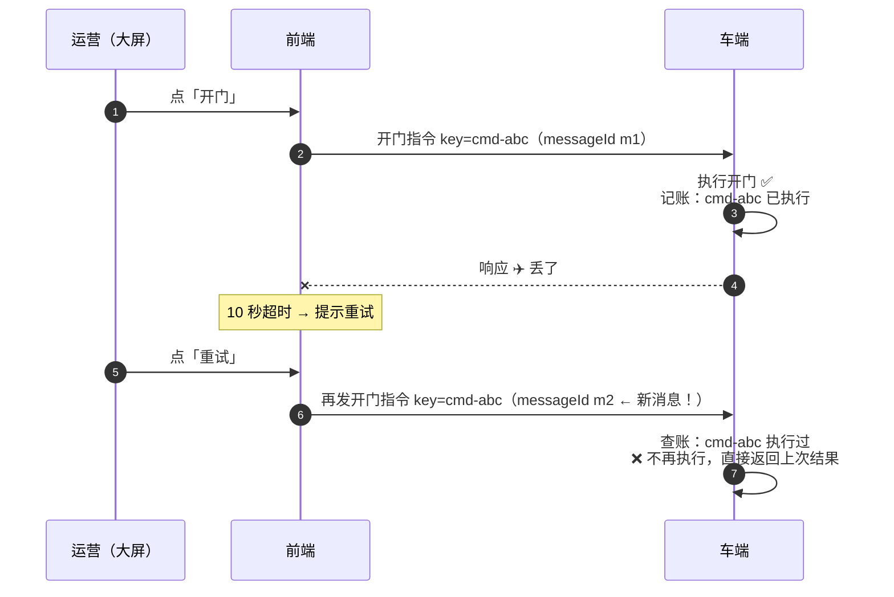

# WebSocket / MQTT 长连接治理

> **一句话结论：** 长连接治理四件套——**心跳保活、指数退避重连、订阅生命周期、消息幂等**；无人车/车联网场景优先选 MQTT（over WebSocket），因为它的 QoS、遗嘱消息、通配符订阅天然匹配「海量车辆状态上报」。

---

## 一、为什么无人车场景选 MQTT 而不是裸 WebSocket（必问）

### 背景：MQTT 的发布/订阅模型（broker 是什么）

WebSocket 只是一条「管道」，管道上传什么、怎么路由全要自己造；MQTT 是跑在管道上的**发布/订阅**协议，三个角色：



- **PUBLISH**：车端把消息扔给 broker，带一个频道名（**topic**），不关心谁收；
- **Broker**：服务端跑的消息中转站（如 EMQX）。自己不产消息，只按登记表「谁订过什么频道」转发；
- **SUBSCRIBE**：前端（用 mqtt.js 库走 WebSocket 连上来）在 broker 登记表上记一笔「这个频道的消息发我一份」。

> **订阅登记在 broker，不在你本地代码里**——这是第四节「订阅生命周期」一切问题的根源。

有了这个模型，再看两条路子的差距：

| 维度 | 裸 WebSocket | MQTT（over WSS） |
| --- | --- | --- |
| 定位 | 传输通道，协议语义全要自己造 | 发布/订阅消息协议，语义开箱即用 |
| 订阅模型 | 自建（谁要什么消息自己路由） | **Topic 通配符**：`vehicle/+/position` 一次订阅所有车 |
| 消息质量 | 只有「收到/没收到」 | **QoS 0/1/2**：至多一次 / 至少一次 / 恰好一次 |
| 掉线感知 | 自己写心跳协议 | **遗嘱消息（LWT）**：客户端异常掉线，broker 自动向他人广播 `<vehicleId>/offline` |
| 会话保持 | 断线即丢 | `clean=false` 时 broker 保留会话与离线消息（QoS1/2），重连后补投 |
| 报文开销 | 帧头 2~14 字节 | 最小报头 **2 字节**，车端弱网/流量友好 |
| 浏览器支持 | 原生 | mqtt.js 跑在 WebSocket 之上（`wss://broker/mqtt`） |

**典型 topic 设计（面试可画）**：

```text
vehicle/{vehicleId}/position     # 位置上报（高频，QoS 0：丢一条无所谓）
vehicle/{vehicleId}/status       # 车辆状态（QoS 1：必须到，可重复）
vehicle/{vehicleId}/alarm        # 告警（QoS 1 + 幂等去重）
fleet/{fleetId}/command          # 下行指令（QoS 1 + 幂等键）
vehicle/{vehicleId}/offline      # 遗嘱：broker 自动发布
```

> QoS 不是越高越好：位置这类高频快照消息用 QoS 0（旧消息没价值），指令/告警才用 QoS 1。

---

## 二、心跳保活

**为什么要心跳：**

1. 中间的 NAT 网关 / LB（如 Nginx `proxy_read_timeout` 默认 60s）会静默掐掉「长时间无数据」的连接——TCP 半打开：客户端以为连着，实际早已死掉；
2. 尽快发现对端崩溃（不发数据检测不出来）；
3. TCP 自带 keepalive 默认 2 小时且不可精细控制，不能依赖。

> **WebSocket 协议层有 ping/pong 帧，但浏览器 JS 无法发送**，所以浏览器端一律走**应用层心跳**；mqtt.js 的 `keepalive` 参数由库代发协议层心跳，语义等价。

```typescript
class Heartbeat {
  private timer = 0;
  private missed = 0;

  constructor(
    private send: () => void,          // 发 {"type":"ping"}
    private onDead: () => void,        // 判死 → 主动 close → 触发重连
    private readonly interval = 15000, // 心跳周期
    private readonly maxMissed = 3,    // 连续 3 次无 pong 判死
  ) {}

  start() {
    this.timer = window.setInterval(() => {
      if (++this.missed > this.maxMissed) { this.stop(); this.onDead(); return; }
      this.send();
    }, this.interval);
  }

  feedPong() { this.missed = 0; } // 收到任意消息也算活着：pong 或业务消息都 reset

  stop() { clearInterval(this.timer); }
}
```

**面试细节**：判死不要等 `onclose`——半打开连接永远不会触发 `onclose`，必须靠「N 个周期无任何入站消息」主动判死并 `close()`。

---

## 三、指数退避重连（Reconnect with Backoff + Jitter）

**为什么指数 + 抖动**：服务端重启/抖动时，万级客户端若用固定间隔重连会**同步洪峰**（惊群）。指数退避拉大间隔止损，**抖动（jitter）打散重连时刻**。

```typescript
function backoff(attempt: number, base = 1000, max = 30000) {
  const exp = Math.min(base * 2 ** attempt, max);   // 1s,2s,4s,8s...封顶30s
  return exp * (0.5 + Math.random() * 0.5);          // 全抖动：取 [50%,100%) 随机
}
```

### 生产级重连管理器（真实代码）

```typescript
class ReconnectableSocket {
  private ws: WebSocket | null = null;
  private attempt = 0;
  private retryTimer = 0;
  private heartbeat: Heartbeat | null = null;

  constructor(private url: string, private onMessage: (ev: MessageEvent) => void) {
    // ① 网络恢复事件：立刻重试，不等退避计时器
    window.addEventListener('online', () => this.schedule(0));
    // ② 页面隐藏时降频/暂停（挂机大屏切后台不再白耗连接）
    document.addEventListener('visibilitychange', () => {
      if (document.hidden) this.ws?.close();
      else this.schedule(0);
    });
  }

  connect() {
    this.ws = new WebSocket(this.url);

    this.ws.onopen = () => {
      this.attempt = 0; // 成功即清零，下次断线从头退避
      this.heartbeat = new Heartbeat(
        () => this.send({ type: 'ping' }),
        () => this.ws?.close(), // 判死 → close 触发 onclose 统一走重连
      );
      this.heartbeat.start();
      this.onOpen?.();
    };

    this.ws.onmessage = (ev) => {
      this.heartbeat?.feedPong();
      const msg = JSON.parse(ev.data);
      if (msg.type === 'pong') return;
      this.onMessage(msg);
    };

    this.ws.onclose = () => {
      this.heartbeat?.stop();
      this.heartbeat = null;
      this.schedule(this.attempt + 1);
    };
    // onerror 不单独处理：error 后必触发 close，统一从 close 走重连，避免双路径
  }

  private schedule(attempt: number) {
    clearTimeout(this.retryTimer);
    this.attempt = attempt;
    this.retryTimer = window.setTimeout(() => this.connect(), backoff(attempt));
  }

  send(data: unknown) { this.ws?.send(JSON.stringify(data)); }
  onOpen?: () => void; // 重连成功后由订阅管理器重放订阅（见下节）

  destroy() {
    clearTimeout(this.retryTimer);
    this.heartbeat?.stop();
    this.ws?.close();
    this.ws = null;
  }
}
```

**三个加分细节**：

1. `onerror` 不单独写重连逻辑——error 之后必触发 `close`，单一入口防重复重连；
2. 监听 `window online` 事件，网络恢复瞬间立即重试（用户感知最快）；
3. 成功后 `attempt = 0`，保证每次新故障都从 1s 起步。

---

## 四、订阅生命周期（Subscribe Lifecycle）

> **一句话结论：** 订阅登记在 broker 那边（见第一节背景），而**连接会断线重连、组件会挂载卸载**——订阅生命周期就是让这张登记表跟两边对齐：重连后照账**重放**（问题 1），组件卸载**计数归零才退订**（问题 2）。

`subscribe()` 不是本地生效的一行代码，而是 broker 登记表上多出的一条记录。这张表要跟着两样**会变的东西**活，对不上就有事故：

| # | 错位 | 事故现场 | 对策 |
| --- | --- | --- | --- |
| 问题 1 | **连接**断线重连：`clean=true` 时重连＝全新会话，broker 把旧登记表烧了 | 本地代码一切正常，却**一条消息都收不到** | 重连后照账**重放**（图例 1） |
| 问题 2 | **组件**挂载卸载：一条连接被多个组件共用，谁先卸载谁退订 | 车辆列表先卸载，**地图组件跟着断流** | 引用计数，**归零才退订**（图例 2） |

### 图例 1 · 问题 1：重连后照账重放

**「照账重放」拆开念：**

- **账** ＝ 前端自己内存里记的订阅表（`Map<topic, 计数>`）：每次 `subscribe` 记一笔、`unsubscribe` 销一笔；
- **重放** ＝ 重连成功后遍历这张账，**每个 topic 重新发一次 SUBSCRIBE**——broker 那边的登记表已被 `clean=true` 清空，要重新填回来。

本质是**两张表的同步问题**：broker 的登记表会被清空，前端的账不会——所以拿前端的账重建 broker 的表：

| 时刻 | 前端的账（内存 Map） | broker 的登记表 | 收得到消息吗 |
| --- | --- | --- | --- |
| 断线前 | `position ✓` `alarm ✓` | `position ✓` `alarm ✓` | ✅ 两边一致 |
| 刚重连成功 | `position ✓` `alarm ✓`（账还在） | **空**（被 clean=true 清掉） | ❌ 连着却是聋的 |
| 照账重放后 | `position ✓` `alarm ✓` | `position ✓` `alarm ✓`（照账重新登记） | ✅ 恢复一致 |

上面三个时刻，在协议报文层面长这样：



| 图例编号 | 时刻 | 关键点（不这么做会怎样） |
| --- | --- | --- |
| ② | 首次订阅 | 同步记进**前端自己的订阅表**，不散落在组件回调里 |
| ④→⑤ | 重连成功 | broker 端订阅表是空的——「**连着却是聋的**」，最典型的线上事故 |
| ⑥ | 照账重放 | 在重连管理器的 `onOpen` 钩子里调 `replayAll()`，一条不能少 |

### 图例 2 · 问题 2：引用计数，归零才退订

地图组件和车辆列表组件都要看**同一个**频道 X＝`vehicle/+/position`，但共用一条连接——所以订阅表给每个 topic 记「还有几个人在看」：

| 事件 | 订阅表变化 | 对 broker |
| --- | --- | --- |
| 地图组件 `subscribe(X)` | `X: 0 → 1` | 发 SUBSCRIBE |
| 列表组件 `subscribe(X)` | `X: 1 → 2` | 不发报文（已订过） |
| 地图组件卸载 | `X: 2 → 1` | **不退订**（列表还在看） |
| 列表组件卸载 | `X: 1 → 0` | 发 UNSUBSCRIBE |

> 计数**归零才退订**：避免组件 A 卸载时把组件 B 还在看的消息掐断。

### 最小实现

```typescript
class SubscriptionManager {
  private counts = new Map<string, number>(); // 「账」本体：topic → 订阅者数（计数见问题 2）

  constructor(private client: mqtt.MqttClient) {}

  subscribe(topic: string) {
    const n = (this.counts.get(topic) ?? 0) + 1;
    this.counts.set(topic, n);
    if (n === 1) this.client.subscribeAsync(topic); // 首个订阅者才发报文
  }

  unsubscribe(topic: string) {
    const n = (this.counts.get(topic) ?? 0) - 1;
    if (n <= 0) { this.counts.delete(topic); this.client.unsubscribeAsync(topic); }
    else this.counts.set(topic, n); // 还有订阅者，不退订
  }

  replayAll() { // 重连成功后调用（图例 1 的第 ⑥ 步）
    for (const t of this.counts.keys()) this.client.subscribeAsync(t);
  }
}

// 与第三节重连管理器接线：重连成功 → 照账重放
reconnectable.onOpen = () => subs.replayAll();
```

**收尾两条**：车辆列表变化时 diff 增量订阅/退订，不整体重订；页面卸载时全部 unsubscribe + `destroy()`——没有订阅者的连接不该挂着。

---

## 五、消息幂等与去重

> **一句话结论：** QoS 1 是 at-least-once，**重复是常态不是异常**；处理分两个方向——**收消息（上行）过两道滤网**（messageId 去重 + 单调 seq），**发指令（下行）带一把幂等键**（执行方按 key 只落地一次）。

### 全景：收与发，两套处理

**重复的来源不同，武器就不同**：收消息的重复是**网络**产生的；发指令的重复是**人**产生的（双击、超时点重试）。



### 收消息（上行）怎么处理：两道滤网

#### 图例 1 · 重复怎么来的：回执丢了必重发



> 「消息到了、回执没到」只要发生一次，重发就必然发生——网络抖动、断线重连后的补投都是触发源。

#### 图例 2 · 每条消息过两道滤网



#### 图例 3 · 第 2 道滤网：单调 seq（输入 → 输出对照）

```text
收到 #5：seq 5 > last 4 → 放行，last=5
收到 #6：seq 6 > last 5 → 放行，last=6
收到 #6：seq 6 ≤ last 6 → 重复，丢
收到 #8：seq 8 > last 6 → 放行，last=8
收到 #7：seq 7 ≤ last 8 → 乱序回退，丢（旧快照没价值）
收到 #9：seq 9 > last 8 → 放行，last=9
```

#### 落地代码：两道滤网（图例 2 管线的落地）

```typescript
// 滤网1：messageId → LRU 短窗口去重
const seen = new Map<string, true>();
function isDup(id: string) {
  if (seen.has(id)) return true;
  seen.set(id, true);
  if (seen.size > 5000) seen.delete(seen.keys().next().value!); // 淘汰最老
  return false;
}

// 滤网2：按车单调 seq（重复 + 乱序一起解决）
const lastSeq = new Map<string, number>();
function isStale(vehicleId: string, seq: number) {
  if (seq <= (lastSeq.get(vehicleId) ?? 0)) return true;
  lastSeq.set(vehicleId, seq);
  return false;
}

client.on('message', (_topic, payload) => {
  const msg = JSON.parse(payload.toString());
  if (isDup(msg.messageId) || isStale(msg.vehicleId, msg.seq)) return; // 两道滤网
  render(msg);
});
```

### 发指令（下行）怎么处理：一把幂等键

#### 图例 4 · messageId 为什么抓不住重试



> **重试是一次新的发送**：messageId 是新的，滤网1 的去重完全抓不住；但业务意图没变——幂等键在「点按钮那一刻」生成，重试时**复用同一个 key**，执行方按 key 拦截。

| | messageId（滤网1 去重） | idempotencyKey（幂等键） |
| --- | --- | --- |
| 防的事故 | **同一条消息**被投递两次（QoS1 网络重发） | **两条不同消息**表达同一个意图（双击、超时重试） |
| 谁生成 | 发送方随消息附带 | 业务发起方在「点按钮那一刻」生成 |
| 谁判重 | 接收方（前端消费时丢弃） | **执行方**（车端/服务端动作落地前拦截） |
| 记多久 | 短窗口 LRU，过期就忘 | 持久到该意图不可能再被重试为止 |
| 没防住的后果 | 告警弹两次（骚扰） | 门开两次、车启动两次（危险） |

#### 落地代码：发起方复用 key，执行方判重

```typescript
// 发起方（前端）：key 在点按钮那一刻生成，重试时复用
let pendingKey: string | null = null;
async function openDoor(vehicleId: string) {
  pendingKey ??= crypto.randomUUID();   // 超时重试时 ??= 不换 key——同一意图
  try {
    await send(vehicleId, { action: 'open', idempotencyKey: pendingKey });
    pendingKey = null;                  // 成功才清：下次点击是新意图、新 key
  } catch { /* 超时：留着 key，等用户点重试 */ }
}

// 执行方（车端）：动作落地前按 key 判重
function onCommand(cmd: Command) {
  if (done.has(cmd.idempotencyKey)) return;  // 同一意图执行过 → 跳过
  done.add(cmd.idempotencyKey);
  door.open();
}
```

### 收尾：按消息类型选武器

| 消息类型 | 方向 | 天然幂等？ | 武器 |
| --- | --- | --- | --- |
| 位置/状态快照 | 上行 · 收 | ✅ 新值覆盖旧值 | 滤网2（单调 seq）就够 |
| 告警 | 上行 · 收 | ❌ 重复弹窗骚扰 | 滤网1（messageId 去重） |
| 下行指令（开关门/启停） | 下行 · 发 | ❌ 且危险 | **幂等键 idempotencyKey**（≠ messageId，见图例 4） |

**面试一句话**：收消息方向——快照靠「新覆盖旧」+ seq 单调丢回退、告警靠 messageId 去重；发指令方向——幂等键保证只落地一次。

---

## 六、MQTT 浏览器接入最小示例

```typescript
import mqtt from 'mqtt';

const client = mqtt.connectAsync('wss://iot.example.com/mqtt', {
  clientId: `web-${crypto.randomUUID()}`, // 每次刷新唯一，避免顶掉旧会话
  keepalive: 30,          // 协议层心跳（库代发 PINGREQ）
  clean: true,            // 不保留会话 → 重连后必须重放订阅
  connectTimeout: 4000,
  reconnectPeriod: 0,     // 关掉内置重连，交给自己的治理层（统一退避/重放/可见性）
});

await client.subscribeAsync(['vehicle/+/position', 'fleet/+/#'], { qos: 1 });
client.on('message', (topic, payload) => {
  const [, vehicleId] = topic.split('/');
  handlePosition(vehicleId, JSON.parse(payload.toString()));
});
```

**相关阅读**：

- [SSE 与 WebSocket 对比（协议层）](../../../AI/面试题/sse/sse%20vs%20websocket.md)
- [TCP 与 UDP 区别（理解 RTP/QUIC 底层）](../面试题/TCP与UDP区别.md)
- [地图侧的高频消费端优化](../../../跨端与多媒体/地图/高德地图与高频轨迹渲染.md)
