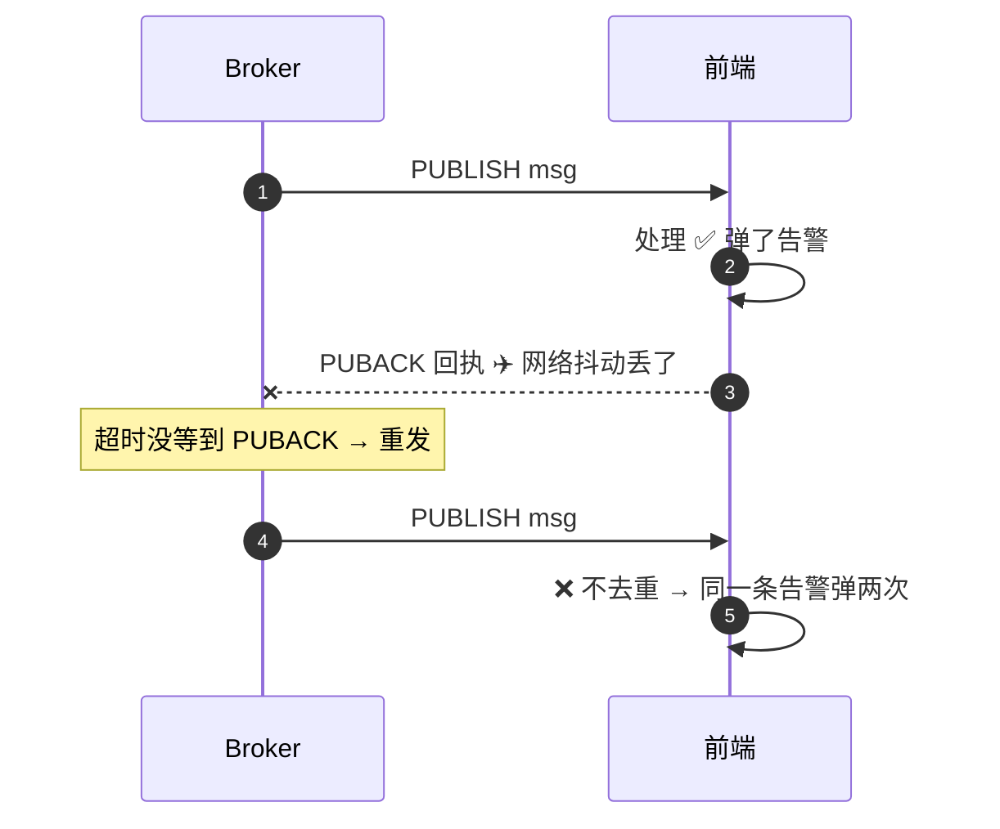

# 怎么保证消息不丢、不重复（幂等）

> **一句话结论：** 「不丢」和「不重复」是一对矛盾——要保证不丢（至少一次）就必然引入重复；所以正确做法是**传输层保不丢，应用层做幂等消重复**，合起来得到「恰好一次」的业务语义。收方向用 messageId 去重挡网络重发，发方向用幂等键挡双击/超时重试，两者不是一回事。

---

## 一、先拆成两件事：不丢 vs 不重复

| 目标 | 手段 | 谁负责 |
| --- | --- | --- |
| **不丢** | QoS 1（发送方等 PUBACK，超时重发）+ 会话保持（`clean=false`，断线期间 broker 保留消息，重连补投） | 协议 / 传输层 |
| **不重复** | 收方向 messageId 去重、发方向幂等键 | 应用层 |

> QoS 0（至多一次）会丢、QoS 2（恰好一次）握手太重——车联网折中用 QoS 1：位置这类快照丢一条无所谓，告警/指令用 QoS 1 + 幂等。

---

## 二、不重复（收方向）：messageId 去重

**重复从哪来**：QoS 1 下「消息到了、PUBACK 回执丢了」就会重发，断线重连后的补投也会触发——所以收方向必须去重。



```typescript
// 收方向滤网：messageId → LRU 短窗口去重
const seen = new Map<string, true>();
function isDup(id: string) {
  if (seen.has(id)) return true;
  seen.set(id, true);
  if (seen.size > 5000) seen.delete(seen.keys().next().value!); // 淘汰最老
  return false;
}
```

---

## 三、不重复（发方向）：幂等键

**messageId 为什么抓不住重试**：重试是一次**新的发送**（messageId 是新的），但业务意图没变——「点开门」点了两次，车端执行两次就危险了。所以要在「点按钮那一刻」生成幂等键，重试复用，执行方按 key 拦截。

```typescript
// 发起方：key 在点按钮那一刻生成，重试时复用
let pendingKey: string | null = null;
async function openDoor(vehicleId: string) {
  pendingKey ??= crypto.randomUUID();   // 超时重试时 ??= 不换 key——同一意图
  try {
    await send(vehicleId, { action: 'open', idempotencyKey: pendingKey });
    pendingKey = null;                  // 成功才清：下次点击是新意图、新 key
  } catch { /* 超时：留着 key，等用户点重试 */ }
}

// 执行方：动作落地前按 key 判重
function onCommand(cmd: Command) {
  if (done.has(cmd.idempotencyKey)) return;  // 同一意图执行过 → 跳过
  done.add(cmd.idempotencyKey);
  door.open();
}
```

| | messageId（收方向去重） | idempotencyKey（发方向幂等） |
| --- | --- | --- |
| 防的事故 | **同一条消息**被投递两次（QoS1 网络重发） | **两条不同消息**表达同一意图（双击、超时重试） |
| 谁生成 | 发送方随消息附带 | 业务发起方在「点按钮那一刻」生成 |
| 谁判重 | 接收方消费时丢弃 | **执行方**落地前拦截 |
| 没防住的后果 | 告警弹两次（骚扰） | 门开两次、车启动两次（危险） |

---

## 四、补充：单调 seq 处理「乱序 + 快照回退」

对**快照类**消息（位置/状态），新值天然覆盖旧值，用「单调 seq」一条就够——seq 不增长就丢（重复或乱序回退），旧快照没价值：

```typescript
const lastSeq = new Map<string, number>();
function isStale(vehicleId: string, seq: number) {
  if (seq <= (lastSeq.get(vehicleId) ?? 0)) return true;
  lastSeq.set(vehicleId, seq);
  return false;
}
```

**按消息类型选武器**：

| 消息类型 | 方向 | 武器 |
| --- | --- | --- |
| 位置/状态快照 | 收 | 单调 seq（新覆盖旧，丢回退） |
| 告警 | 收 | messageId 去重 |
| 下行指令（开关门/启停） | 发 | 幂等键 idempotencyKey |

---

## 面试回答

> 消息可靠性分两件事：不丢靠 QoS 1「至少一次」和会话保持补投；不重复靠应用层幂等——收方向用 messageId 去重挡网络重发，发方向用幂等键挡双击/超时重试。两者不是一回事：messageId 防的是「同一条消息投两次」，幂等键防的是「两条不同消息表达同一个意图」，后者必须在点按钮那一刻生成、重试复用、执行方按 key 拦截。快照类消息还可以用单调 seq 一条搞定重复和乱序回退。

## 相关资料

- [MQTT 的 QoS / 遗嘱 / 保留 / 订阅生命周期](./MQTT的QoS遗嘱保留消息与订阅生命周期.md)
- [重连退避算法是怎么设计的](./重连退避算法.md)
