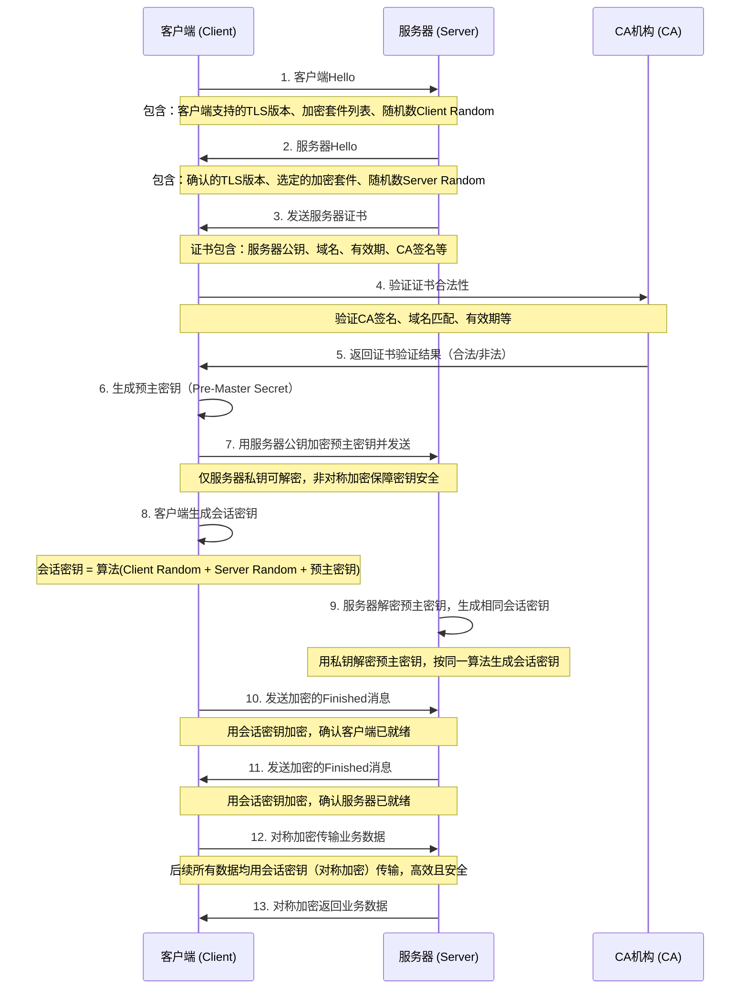
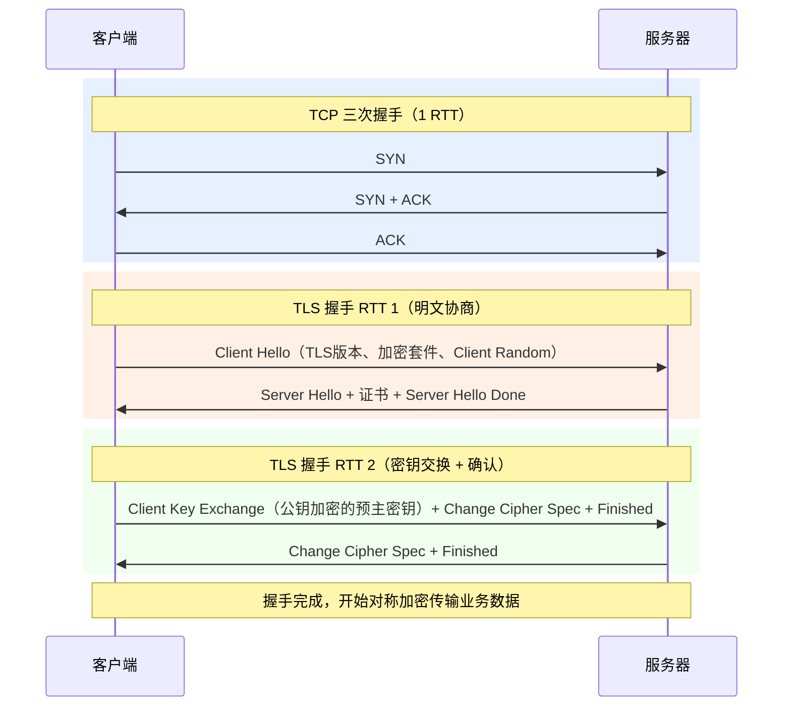
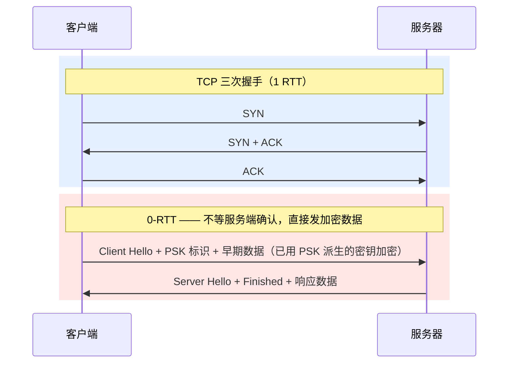
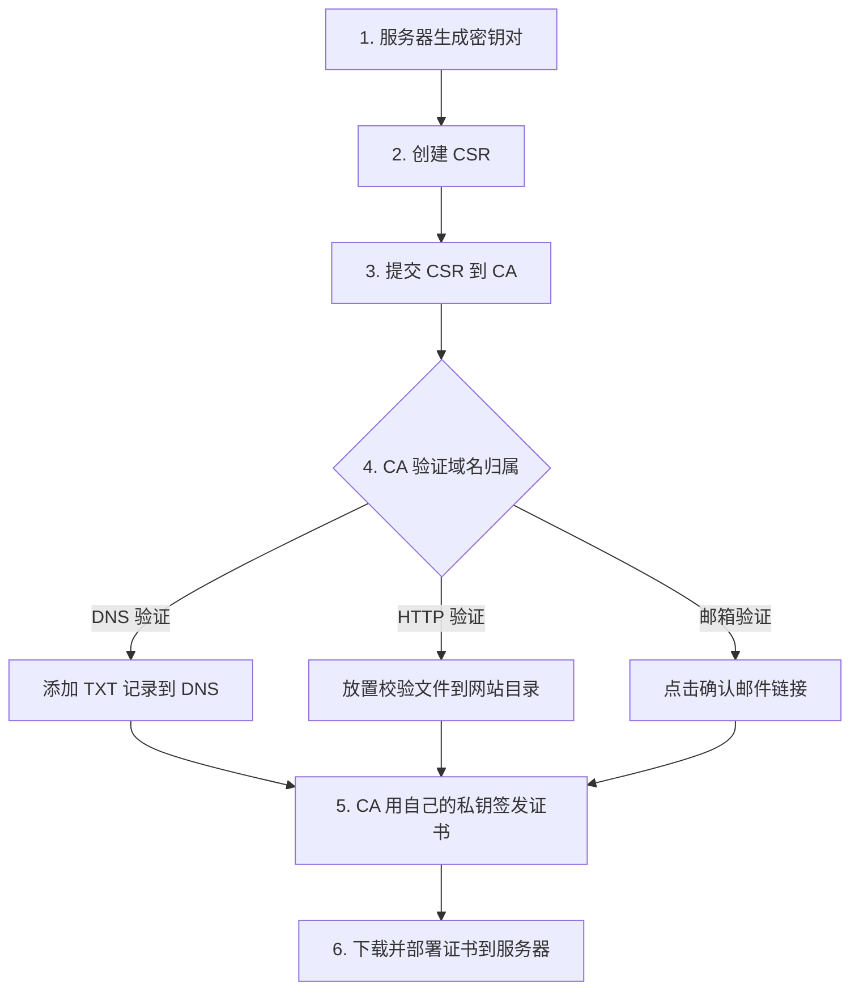
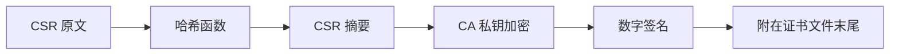

## HTTPS

其实 HTTPS 就是披着 SSL 外壳的 HTTP，在采用了 SSL 后，HTTP 就拥有了加密、证书和完整性保护这些功能。

**怎么加密？**

使用对称和非对称加密结合的方式。为什么？

-   对称密钥密码算法处理迅速，但是需要共享密钥，这往往需要耗费巨大的代价
-   公开密钥无需共享密钥，但是算法处理速度慢

所以就采用非对称加密去共享密钥，后续就采用对称加密的方式。

**完整保护**

在现代密码学中有一个叫散列函数的，也就是哈希函数，它可以将内容转换成一系列的 hash，如果内容发生了变化它的 hash 也会变，利用它我们就可以完成完整性保护。

**CA 证书有什么用？**

它主要是为了确保服务器公钥的合法性，因为公钥很有可能通过第三方伪造。CA 机构会用自己的私钥在证书上完成数字签名，用户通过它的公钥能成功解密就说明这个证书是它所颁发的，因为私钥是它独有的。

### https 加密过程



**流程关键步骤解释**

1. 客户端 / 服务器 Hello：双方先交换基础信息（支持的加密规则、随机数），为后续协商做准备，这一步是明文传输，无安全风险。
2. 证书验证：核心是客户端确认服务器身份，避免 “中间人攻击”——CA 是可信第三方，只有它签名的证书才被认可，确保客户端连接的是真实服务器。
3. 预主密钥协商：客户端生成的预主密钥用服务器公钥加密后发送，只有服务器能用私钥解密，这一步用非对称加密保障密钥本身的安全。
4. 会话密钥生成：客户端和服务器基于 Client Random、Server Random、预主密钥，用同一算法生成完全相同的对称加密会话密钥（非对称加密效率低，仅用于协商密钥）。
5. 对称加密传输：握手完成后，所有业务数据都用会话密钥做对称加密，兼顾安全性和传输效率。

**总结**

1. HTTPS 加密分两大阶段：先用非对称加密完成身份验证和密钥协商，再用对称加密传输实际数据。
2. 证书是防中间人攻击的核心，CA 签名确保服务器身份真实，预主密钥的非对称加密确保密钥不泄露。
3. 会话密钥是双方共享的对称密钥，既保证加密强度，又解决了非对称加密效率低的问题，是 HTTPS 高效安全的关键

### RTT 分析

以图中 TLS 1.2 完整握手流程为例，一次全新的 HTTPS 连接需要 **3 个 RTT** 才能开始传输业务数据：

```text
1 条 HTTPS over TCP 连接（TLS 1.2 首次连接）
├─ TCP 握手：3 个典型报文，消耗 1 RTT
├─ TLS 握手：约 4 个握手消息组，消耗 2 RTT
└─ HTTP 请求与响应：N 个业务报文，至少消耗 1 RTT 才收到响应首字节

从建连开始到收到 HTTP 响应首字节：约 1 + 2 + 1 = 4 RTT
```

> 这里的“4 个 TLS 握手消息组”是面试中的简化说法，不等于物理上固定只发 4 个 TCP 包。TLS 消息可能被合并或因证书链、MTU 而拆分；响应体较大时，完整下载还要受带宽、拥塞窗口和丢包重传影响。



**各 TLS 版本 RTT 对比**

| 场景 | TLS 1.2 | TLS 1.3 |
|---|---|---|
| 首次连接（含 TCP） | 3 RTT（TCP 1 + TLS 2） | 2 RTT（TCP 1 + TLS 1） |
| 会话复用（Session ID/Ticket） | 2 RTT（TCP 1 + TLS 1） | 2 RTT（TCP 1 + TLS 1） |
| 0-RTT 早期数据（PSK） | 不支持 | 1 RTT（TCP 1，TLS 加密数据可附在首个包发送） |

**为什么会话复用还要 2 RTT？**

拆开来看：

- **TCP 1 RTT 省不掉**：TLS 会话可以复用，但 TCP 连接是新的（前一次连接的 TCP 已关闭），三次握手必须重来。
- **TLS 1 RTT 省不掉**：客户端必须等服务端回一句"这个会话我还认"，才能派生本次连接的会话密钥开始传数据。不是怕会话密钥本身出错——两边用 PSK 算出来的密钥确实一样——而是服务端**可能已销毁该会话**（重启、到期、主动清除），如果客户端不等确认直接发加密数据，这些包会被服务端丢掉，白白浪费带宽。

**0-RTT 怎么省掉 TLS 这一步？**它允许客户端**不等确认**，在 Client Hello 之后直接捎带加密数据：



**代价是重放攻击**：攻击者截获 0-RTT 包原样重放，服务端会重复执行请求。因此 0-RTT 只适合 **GET 类幂等请求**，POST 支付等有副作用的操作绝不能走 0-RTT。

**关键优化点（TLS 1.3 vs 1.2）**

- 省掉一整轮 RTT：TLS 1.2 下服务端收到 Client Hello 后还不能算密钥，必须等客户端在下一轮发来 DH 参数 / 预主密钥（Client Key Exchange），因此多 1 RTT。TLS 1.3 客户端在 Client Hello 中直接附带 `key_share`（DH 公钥），服务端收到后当场就能算出会话密钥，第一次响应直接带 Finished，无需额外往返。
- 0-RTT 适用场景：曾经连接过的客户端可用 PSK（Pre-Shared Key）在首个包就携带加密数据，适合重复访问场景，但存在重放攻击风险，不适合非幂等请求（如 POST 支付）。

### 部署

将服务请求从 HTTP 转变为 HTTPS 是一个重要的安全措施，可以确保数据在传输过程中被加密，防止被窃听和篡改。以下是将服务请求转变为 HTTPS 的步骤和示例代码：

#### 步骤

1. **获取 SSL/TLS 证书**：

    - 你需要从受信任的证书颁发机构（CA）获取一个 SSL/TLS 证书。常见的 CA 包括 Let's Encrypt、DigiCert、GlobalSign 等。
    - 你也可以使用自签名证书进行测试，但自签名证书不会被浏览器信任。

##### 证书申请完整流程

证书申请的底层原理就是一句话：**服务器生成密钥对 → 把公钥和域名信息打包成 CSR 发给 CA → CA 验证域名归属后用自己的私钥签名 → 返回证书**。浏览器之所以信任这个证书，是因为 CA 的根证书已经预置在操作系统/浏览器里。



**Step 1：生成私钥**

```bash
# 生成 2048 位 RSA 私钥（2048 以上才安全）
openssl genrsa -out private.key 2048

# 或使用 ECC（更短密钥，同等安全性，性能更优）
openssl ecparam -genkey -name prime256v1 -out private.key
```

**Step 2：创建 CSR（Certificate Signing Request）**

CSR 包含你的公钥和域名、组织信息。CA 将根据 CSR 签发证书。

```bash
openssl req -new -key private.key -out request.csr
```

交互式填写信息：

```
Country Name (2 letter code)        CN              # 国家代码
State or Province Name              Beijing         # 省份
Locality Name                       Beijing         # 城市
Organization Name                   My Company      # 公司名称
Common Name                         yourdomain.com  # ★ 最重要的字段：你的域名
```

Common Name 在单域名证书中必须是你的域名，在多域名 / 通配符证书中，CA 还会检查 SAN（Subject Alternative Name）列表。你填写的每一个域名，CA 后续都要验证你是否真的拥有它。

> **自签名测试**：跳过 CA 一步生成自签名证书：
> ```bash
> openssl req -newkey rsa:2048 -nodes -keyout key.pem -x509 -days 365 -out cert.pem
> ```
> 浏览器不信任自签名证书，仅用于本地开发。

**Step 3：提交 CSR 到 CA 并完成域名验证**

CA 收到 CSR 后，必须验证你确实拥有申请中列出的域名。主流验证方式有三种：

| 验证方式 | 操作 | 适用场景 |
|---|---|---|
| **DNS 验证** | CA 给你一段随机值，你添加一条 `_acme-challenge` 的 TXT 记录到 DNS | 最常用，支持通配符证书，适合自动化（Let's Encrypt 默认方式） |
| **HTTP 验证** | CA 给你一个文件，你把它放到网站 `/.well-known/acme-challenge/` 目录下 | 无需操作 DNS，适合已有 Web 服务的场景 |
| **邮箱验证** | CA 向 `admin@yourdomain.com` 等预设邮箱发确认链接 | 传统商业 CA 常用，如 DigiCert、GlobalSign |

**Step 4：CA 签发证书**

验证通过后，CA 用**自己的私钥**对你的 CSR 做数字签名，生成证书文件。签名过程：



浏览器验证证书时用 CA 的**公钥**解密签名，得到的摘要和浏览器自己对证书重新计算的摘要比对——一致则签名有效，证书未被篡改。这也是为什么 CA 的根证书必须预置在操作系统中：它是整个信任链的锚点。

**Step 5：下载并部署证书**

CA 返回的文件通常包括：
- `certificate.crt`（或 `fullchain.pem`）—— 服务器证书 + 中间 CA 证书链
- 私钥`private.key` 必须由你自己保管，CA 不会知道你的私钥

> **中间证书（Intermediate CA）的作用**：CA 不会直接在根证书上签发服务器证书（根证书离线保管，泄露后果不可控），而是通过中间 CA 代理签发。所以部署时必须提供**完整的证书链**（服务器证书 + 中间 CA 证书），否则部分客户端会因无法构建到根证书的信任链而报错。

2. **配置服务器**：

    - 将获取到的证书和私钥配置到你的服务器上。不同的服务器有不同的配置方法，以下是一些常见服务器的配置示例。

3. **重定向 HTTP 到 HTTPS**：
    - 配置服务器将所有的 HTTP 请求重定向到 HTTPS，以确保所有流量都通过安全的 HTTPS 传输。

#### 示例代码

以下是一些常见服务器的 HTTPS 配置示例：

##### Node.js (使用 Express)

如果你使用 Node.js 和 Express 框架，可以按照以下步骤配置 HTTPS：

1. **安装 `https` 模块**：

    - `https` 模块是 Node.js 内置模块，无需额外安装。

2. **创建 HTTPS 服务器**：

```javascript
const fs = require('fs');
const https = require('https');
const express = require('express');

const app = express();

// 读取 SSL/TLS 证书和私钥
const options = {
    key: fs.readFileSync('path/to/your/private.key'),
    cert: fs.readFileSync('path/to/your/certificate.crt'),
};

// 配置中间件和路由
app.get('/', (req, res) => {
    res.send('Hello, HTTPS!');
});

// 创建 HTTPS 服务器
https.createServer(options, app).listen(443, () => {
    console.log('HTTPS server is running on port 443');
});

// 可选：重定向 HTTP 到 HTTPS
const http = require('http');
http.createServer((req, res) => {
    res.writeHead(301, { Location: 'https://' + req.headers['host'] + req.url });
    res.end();
}).listen(80);
```

##### Nginx

如果你使用 Nginx 作为反向代理服务器，可以按照以下步骤配置 HTTPS：

1. **安装 Nginx**：

    - 在大多数 Linux 发行版上，可以使用包管理器安装 Nginx，例如 `apt-get` 或 `yum`。

2. **获取证书**（以 Let's Encrypt / Certbot 为例）：

```bash
# 安装 certbot
sudo apt-get install certbot python3-certbot-nginx

# 获取证书并自动配置 nginx
sudo certbot --nginx -d yourdomain.com -d www.yourdomain.com

# 设置自动续期（证书有效期 90 天）
sudo certbot renew --dry-run  # 测试续期
# certbot 会自动添加 systemd timer / cron，无需手动干预
```

3. **完整 Nginx HTTPS 配置**：

```nginx
# ==========================================
# 1. HTTP → HTTPS 重定向
# ==========================================
server {
    listen 80;
    server_name yourdomain.com www.yourdomain.com;
    return 301 https://$host$request_uri;
}

# ==========================================
# 2. HTTPS 主配置
# ==========================================
server {
    listen 443 ssl http2;  # 启用 HTTP/2
    server_name yourdomain.com www.yourdomain.com;

    # ---------- 证书配置 ----------
    ssl_certificate     /etc/letsencrypt/live/yourdomain.com/fullchain.pem;
    ssl_certificate_key /etc/letsencrypt/live/yourdomain.com/privkey.pem;

    # ---------- SSL 协议与加密套件 ----------
    ssl_protocols TLSv1.2 TLSv1.3;  # 禁用不安全的 TLSv1.0 / TLSv1.1
    ssl_ciphers ECDHE-ECDSA-AES128-GCM-SHA256:ECDHE-RSA-AES128-GCM-SHA256:ECDHE-ECDSA-AES256-GCM-SHA384:ECDHE-RSA-AES256-GCM-SHA384:ECDHE-ECDSA-CHACHA20-POLY1305:ECDHE-RSA-CHACHA20-POLY1305;
    ssl_prefer_server_ciphers off;   # TLSv1.3 下由客户端选择，性能更优

    # ---------- DH 参数（提升密钥交换安全性） ----------
    # 生成命令：openssl dhparam -out /etc/nginx/dhparam.pem 2048
    ssl_dhparam /etc/nginx/dhparam.pem;

    # ---------- 会话缓存（减少 TLS 握手开销） ----------
    ssl_session_cache   shared:SSL:10m;  # 10MB 可缓存约 4000 个 session
    ssl_session_timeout 1d;
    ssl_session_tickets off;  # 关闭 session ticket 避免 PFS 降级

    # ---------- OCSP Stapling（减少客户端证书验证延迟） ----------
    ssl_stapling on;
    ssl_stapling_verify on;
    resolver 8.8.8.8 8.8.4.4 valid=300s;
    resolver_timeout 5s;

    # ---------- HSTS（强制浏览器走 HTTPS，防 SSL 剥离攻击） ----------
    add_header Strict-Transport-Security "max-age=63072000; includeSubDomains; preload" always;

    # ---------- 安全 Headers ----------
    add_header X-Content-Type-Options nosniff always;
    add_header X-Frame-Options DENY always;
    add_header X-XSS-Protection "1; mode=block" always;
    add_header Referrer-Policy "strict-origin-when-cross-origin" always;

    # ---------- 代理到后端应用 ----------
    location / {
        proxy_pass http://localhost:3000;
        proxy_set_header Host $host;
        proxy_set_header X-Real-IP $remote_addr;
        proxy_set_header X-Forwarded-For $proxy_add_x_forwarded_for;
        proxy_set_header X-Forwarded-Proto $scheme;

        # WebSocket 支持（可选）
        proxy_set_header Upgrade $http_upgrade;
        proxy_set_header Connection "upgrade";
    }

    # ---------- 静态资源（可选：直接由 Nginx 处理） ----------
    location /static/ {
        root /var/www/yourdomain;
        expires 30d;
        add_header Cache-Control "public, immutable";
    }
}
```

4. **验证配置**：

```bash
# 检查语法
nginx -t

# 重载配置（不停机）
nginx -s reload

# 在线评估 SSL 安全等级
# 访问 https://www.ssllabs.com/ssltest/ 输入你的域名
```

**配置要点说明**

| 配置项 | 作用 |
|---|---|
| `ssl_protocols TLSv1.2 TLSv1.3` | 仅启用安全协议版本 |
| `ssl_ciphers` | 指定强加密套件，优先 GCM/CHACHA20 |
| `ssl_dhparam` | DH 密钥交换参数，增强前向安全性 |
| `ssl_session_cache` | 缓存 TLS 会话，减少重复握手开销 |
| `ssl_stapling` | OCSP 装订，由服务器附带证书状态，客户端无需实时查询 CA |
| `HSTS` 头 | 告知浏览器在未来长时间内只走 HTTPS |
| `fullchain.pem` | Let's Encrypt 证书链文件，包含服务器证书 + 中间 CA 证书 |

**为什么用 `fullchain.pem` 而不是单独的 `.crt`？**
大多数 CA 颁发的证书是链式结构：服务器证书 → 中间 CA → 根 CA。如果只配服务器证书，某些客户端（尤其是移动端）可能因缺少中间证书而无法完成证书链校验，导致 HTTPS 连接失败。`fullchain.pem` 将服务器证书和中间证书拼接成一个文件，确保全部客户端都能验证通过。

#### 总结

将服务请求从 HTTP 转变为 HTTPS 需要获取 SSL/TLS 证书，并将其配置到你的服务器上。不同的服务器有不同的配置方法，但基本步骤都是相似的：获取证书、配置服务器、重定向 HTTP 到 HTTPS。

通过上述步骤，你可以确保你的服务请求通过 HTTPS 进行安全传输。如果你有任何进一步的问题或需要更多示例，欢迎随时提问！😊
