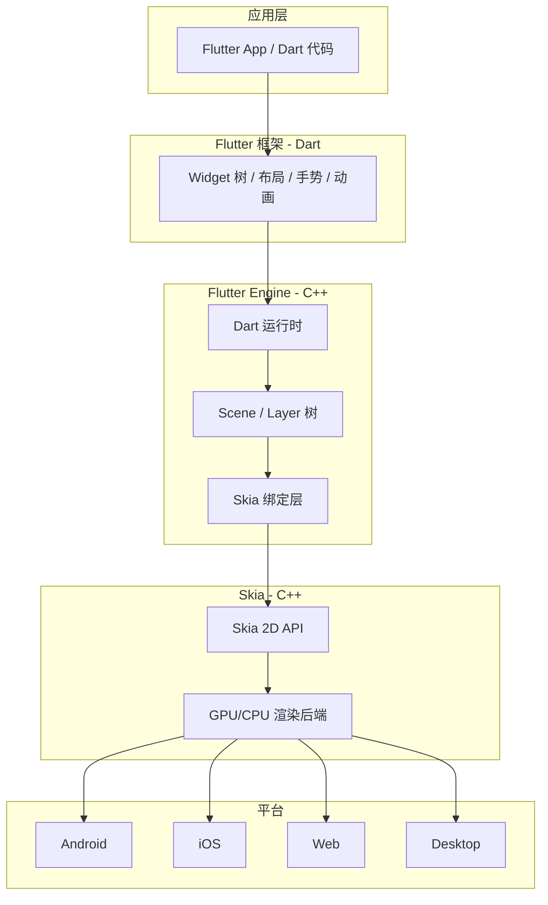
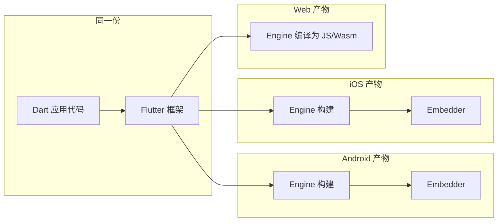

# Flutter 与 Skia

## 一句话结论

-   **Skia**：跨平台的 **2D 图形库**（C++），负责「把绘制命令变成像素」；不关心业务 UI，只做底层绘图。
-   **Flutter**：用 **Dart** 写的 UI 框架，负责组件、布局、手势、动画；**渲染**交给 Flutter Engine，Engine 再调用 **Skia** 在各平台绘制。
-   关系：**Flutter（框架）→ Flutter Engine（引擎）→ Skia（渲染实现）→ 各平台 GPU/Canvas**。  
    「Flutter/Skia」= Flutter 用 Skia 做**跨端统一自绘**。

---

## 结构关系（谁调谁）

---

## Skia 是什么

| 维度         | 说明                                                                                                               |
| ------------ | ------------------------------------------------------------------------------------------------------------------ |
| 是什么       | 开源 2D 图形库，Google 维护，C++。Chrome、Android、Flutter 等在用。                                                |
| 做什么       | 接收「画矩形、路径、文字、图像」等绘制命令，做光栅化，输出像素到屏幕或离屏缓冲。                                   |
| 与平台       | 同一套 Skia API，在 Android 用 OpenGL/Vulkan，iOS 用 Metal，Web 用 Canvas/WebGL 等，由 Skia 内部**渲染后端**适配。 |
| 「后端」含义 | 此处指**渲染后端**（谁真正画图），不是前后端分离里的服务器端。                                                     |

---

## Flutter 是什么

| 维度         | 说明                                                                                               |
| ------------ | -------------------------------------------------------------------------------------------------- |
| 是什么       | Dart 写的 UI 框架，一套代码跑 iOS、Android、Web、桌面等。                                          |
| 渲染方式     | **自绘**：不依赖各平台原生控件（不像 RN 用 UIView/View），用 **Skia** 自己把 UI 画出来，各端一致。 |
| 与 Skia 分工 | Flutter 负责「要画什么」（Widget → RenderObject → Layer/Scene）；Skia 负责「怎么画到像素」。       |

---

## 一套代码如何跑多端

**结论**：你写的 **Dart + Flutter 业务代码只有一份**；每个平台有各自的 **Flutter Engine 构建 + 平台嵌入层**，负责把同一份 Dart 代码接到该平台的窗口、输入、GPU 上。

| 层级                   | 是否「一套」               | 说明                                                              |
| ---------------------- | -------------------------- | ----------------------------------------------------------------- |
| 应用 + 框架（Dart）    | 是                         | 同一份源码，不区分平台。                                          |
| Engine + Skia（C++）   | 源码同一套，**按平台编译** | 同一份 C++ 代码，编译出 Android/iOS/Web 等不同二进制或 Wasm。     |
| 平台嵌入层（Embedder） | 各端各自实现               | 各平台用原生 API 创建窗口、接收输入、把 Engine 画出的帧贴到屏幕。 |

因此「一套代码跑多端」= **业务与框架层一份代码** + **Engine 按目标平台编译一次** + **各平台提供自己的嵌入层**；你只维护 Dart 那部分，多端由 Flutter 工具链与各端 Engine 构建完成。

---

## 与 mini-render-engine 的对应

本仓库的 [mini-render-engine](./mini-render-engine/) 只做「抽象绘制 API + 渲染后端」这一小段，用于理解原理：

-   **抽象绘制 API**（如 `drawRect`、`drawText`）≈ Flutter Engine 暴露的绘图接口，对应 Skia 能做的事。
-   **Canvas 2D 后端** ≈ 在 Web 上用浏览器 Canvas 作为「一个渲染后端」，概念等价于 Skia 在某一平台上的后端实现。
