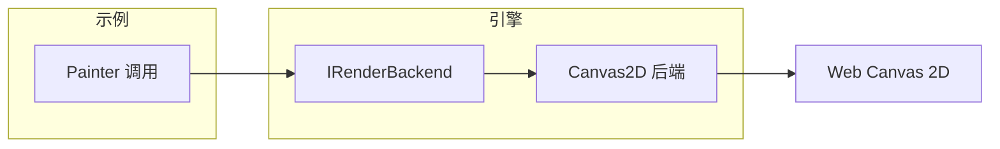

# Mini 跨端渲染引擎

教学用的小型跨端渲染引擎：**抽象绘制 API + 渲染后端**，用于理解 Flutter/Skia 类引擎的原理。

## 一句话结论

同一套绘制指令（画矩形、文字等），通过**抽象接口**交给不同的**渲染后端**执行；换后端即换输出（如 Web Canvas、Skia、Mock），业务代码不变。

## 架构



- **IRenderBackend**：抽象绘制 API（clear、fillRect、fillText 等）。
- **Canvas2DBackend**：用浏览器 `CanvasRenderingContext2D` 实现该接口。
- **Painter**：门面，持有一个 backend，业务只依赖 Painter 或 IRenderBackend。

## 与 Flutter/Skia 的对应

概念说明见 [../Flutter与Skia.md](../Flutter与Skia.md)。

| 本 mini 引擎 | Flutter/Skia |
|-------------|--------------|
| IRenderBackend | Skia 暴露的 2D 绘图 API / Engine 绑定层 |
| Canvas2DBackend | Skia 在 Web 平台的后端实现 |
| Painter 调用 | Framework 通过 Canvas 发出的绘制命令 |

## 如何运行

```bash
pnpm install
pnpm dev
```

浏览器会打开 `examples/browser.html`，画布上由引擎绘制矩形与文字。

## 目录

- `src/backend.ts`：抽象接口 `IRenderBackend`
- `src/backends/canvas2d.ts`：Canvas 2D 渲染后端
- `src/painter.ts`：门面
- `examples/main.ts` + `examples/browser.html`：浏览器示例
