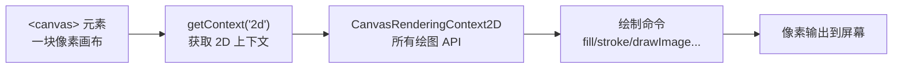

# Canvas 完整指南与面试题

> **一句话总结：** Canvas 是 HTML5 提供的「**位图（栅格）**」绘图 API，通过 JavaScript 在 `<canvas>` 上**即时绘制**像素，适合像素级操作、图像处理、复杂动画和游戏；它和 SVG（矢量图）是前端正经图形渲染的两大基石。

---

## 一、核心概念

### 1.1 Canvas 是什么

```html
<!-- canvas 本身只是一块"画布"，真正画画的是上下文 Context -->
<canvas id="cv" width="800" height="600"></canvas>
```

```typescript
const canvas = document.getElementById('cv')!;
// 2D 绘图上下文（最常用）
const ctx = canvas.getContext('2d');

ctx.fillStyle = '#f40';
ctx.fillRect(10, 10, 100, 100);   // 画一个红方块
```



**关键认知：**
- Canvas 是**位图**——画上去的就是像素，放大失真；不像 SVG 那样有 DOM 节点
- Canvas **没有内置的事件系统**——画出来的图形不是 DOM 元素，无法直接 `addEventListener`
- 画完即"定稿"，要修改只能清空重画

### 1.2 Canvas vs SVG（超高频面试题）

| 维度 | Canvas（位图） | SVG（矢量图） |
|------|---------------|---------------|
| **本质** | 像素位图，JS 即时绘制 | XML 描述的矢量图，DOM 节点 |
| **缩放** | 放大失真（锯齿） | 无损缩放 |
| **DOM** | 无节点，画完即定型 | 每个图形都是 DOM 元素 |
| **事件** | 需手动做点击检测 | 原生支持 `click` 等事件 |
| **性能（元素多）** | 元素数量不影响性能（重绘开销固定） | DOM 节点上千后卡顿 |
| **性能（重绘频率）** | 高频重绘友好 | 高频重绘昂贵 |
| **可访问性/SEO** | 差（只有一张图） | 好（可被检索） |
| **导出** | `toDataURL` 导出 PNG/JPG | 可导出 `.svg` 文件 |
| **适用场景** | 游戏、图像处理、复杂动画、热力图 | 图标、图表、地图、可交互插画 |

**选型口诀：**
```
要交互/可缩放/元素少  → SVG（如图标、图表）
要高频动画/像素操作/元素海量 → Canvas（如游戏、粒子）
要 3D → WebGL（canvas.getContext('webgl')）
```

### 1.3 Canvas 2D vs WebGL

```typescript
canvas.getContext('2d');        // 2D 位图绘图，CPU 驱动
canvas.getContext('webgl');     // OpenGL ES 子集，GPU 加速，用于 3D
canvas.getContext('webgl2');    // WebGL 2.0，更多特性
```

> WebGL 是另一套体系（着色器、缓冲区）。日常说的「Canvas」默认指 2D Context，本文聚焦于此，WebGL 详见 [[webgl]] 目录。

---

## 二、基础 API 速览

### 2.1 绘制基本图形

```typescript
const ctx = canvas.getContext('2d')!;

// —— 矩形 ——
ctx.fillRect(x, y, w, h);            // 填充矩形
ctx.strokeRect(x, y, w, h);          // 描边矩形
ctx.clearRect(x, y, w, h);           // 清空区域（变透明）

// —— 路径（Path）——  所有复杂图形靠路径拼
ctx.beginPath();                     // 开始一条新路径
ctx.moveTo(50, 50);                  // 移动画笔
ctx.lineTo(200, 50);                 // 画直线
ctx.lineTo(125, 200);
ctx.closePath();                     // 闭合路径
ctx.fill();                          // 填充
ctx.stroke();                        // 描边

// —— 圆弧 ——
ctx.arc(x, y, radius, startAngle, endAngle, anticlockwise);
// 角度为弧度：0 = 3点钟方向，Math.PI/2 = 6点钟方向
ctx.beginPath();
ctx.arc(150, 150, 50, 0, Math.PI * 2);   // 完整圆
ctx.fill();

// —— 贝塞尔曲线 ——
ctx.quadraticCurveTo(cpx, cpy, x, y);              // 二次贝塞尔（1 控制点）
ctx.bezierCurveTo(cp1x, cp1y, cp2x, cp2y, x, y);   // 三次贝塞尔（2 控制点）
```

### 2.2 样式与文本

```typescript
// 颜色
ctx.fillStyle = '#ff6600';           // 支持 #rgb / rgb() / rgba() / hsl() / gradient
ctx.strokeStyle = 'rgba(0,0,0,0.5)';
ctx.lineWidth = 2;

// 线条样式
ctx.lineCap = 'round';               // butt | round | square（端点）
ctx.lineJoin = 'miter';              // miter | round | bevel（拐角）
ctx.setLineDash([10, 5]);            // 虚线：实线10 间隔5

// 文本
ctx.font = 'bold 20px "PingFang SC", sans-serif';
ctx.textAlign = 'center';            // start|end|left|right|center
ctx.textBaseline = 'middle';         // top|hanging|middle|alphabetic|bottom
ctx.fillText('你好', 100, 100);      // 填充文字
ctx.strokeText('你好', 100, 100);    // 描边文字
```

### 2.3 渐变与阴影

```typescript
// 线性渐变
const lg = ctx.createLinearGradient(0, 0, 200, 0);
lg.addColorStop(0, '#fff');
lg.addColorStop(1, '#000');
ctx.fillStyle = lg;

// 径向渐变
const rg = ctx.createRadialGradient(100, 100, 10, 100, 100, 100);
rg.addColorStop(0, 'rgba(255,0,0,1)');
rg.addColorStop(1, 'rgba(255,0,0,0)');
ctx.fillStyle = rg;

// 阴影
ctx.shadowColor = 'rgba(0,0,0,0.5)';
ctx.shadowBlur = 10;
ctx.shadowOffsetX = 4;
ctx.shadowOffsetY = 4;
```

### 2.4 变换矩阵（重要！）

```typescript
ctx.save();                          // 保存当前状态（样式 + 变换）

ctx.translate(100, 100);             // 平移坐标系原点
ctx.rotate(Math.PI / 4);             // 旋转（弧度）
ctx.scale(2, 2);                     // 缩放

// 画一个绕自身中心旋转的方块
ctx.fillRect(-25, -25, 50, 50);

ctx.restore();                       // 恢复到 save 时的状态
```

> **save/restore 是栈结构**：`save()` 压栈，`restore()` 出栈。变换、样式、裁剪都会被保存。这是绘制复杂图形时避免状态污染的关键。

---

## 三、进阶能力

### 3.1 绘制与处理图像

```typescript
const img = new Image();
img.crossOrigin = 'anonymous';       // 跨域时必须，否则 toDataURL 会污染报错
img.src = 'https://example.com/a.png';
img.onload = () => {
  ctx.drawImage(img, 0, 0);                              // 原尺寸
  ctx.drawImage(img, 0, 0, 100, 100);                    // 缩放
  ctx.drawImage(img, 20, 20, 50, 50, 0, 0, 100, 100);    // 切片再缩放（精灵图）
};
```

### 3.2 像素级操作（图像处理核心）

```typescript
// 读取像素
const imageData = ctx.getImageData(0, 0, w, h);
const data = imageData.data;         // Uint8ClampedArray，每 4 位代表 RGBA
// [r,g,b,a, r,g,b,a, ...]  范围 0~255

// 灰度滤镜示例
for (let i = 0; i < data.length; i += 4) {
  const gray = data[i] * 0.299 + data[i+1] * 0.587 + data[i+2] * 0.114;
  data[i] = data[i+1] = data[i+2] = gray;
}

// 写回画布
ctx.putImageData(imageData, 0, 0);
```

> ⚠️ **跨域安全（Tainted Canvas）**：若 canvas 绘制了**跨域且未设置 `crossOrigin`** 的图片，该 canvas 会被「污染」，此时调用 `getImageData()` / `toDataURL()` 会抛 `SecurityError`。解法是图片服务器配置 CORS + 客户端 `img.crossOrigin = 'anonymous'`。

### 3.3 合成模式 globalCompositeOperation

```typescript
ctx.globalCompositeOperation = 'destination-out';   // 用新图形"挖空"已有内容（橡皮擦）
```

常用模式：

| 模式 | 效果 |
|------|------|
| `source-over` | 默认，新图形盖在旧图形上 |
| `destination-out` | **橡皮擦**：新图形区域变透明（实现擦除/抠图） |
| `lighter` | 颜色相加（粒子发光叠加效果） |
| `multiply` / `screen` / `overlay` | PS 混合模式 |
| `xor` | 重叠区域变透明 |
| `source-in` | 只保留新旧重叠部分（遮罩/裁剪常用） |

### 3.4 裁剪 clip

```typescript
ctx.beginPath();
ctx.arc(100, 100, 50, 0, Math.PI * 2);
ctx.clip();                          // 之后的绘制只在这个圆内可见（蒙版效果）
ctx.drawImage(img, 0, 0);
```

---

## 四、动画与事件

### 4.1 动画循环（标准范式）

```typescript
function draw() {
  ctx.clearRect(0, 0, canvas.width, canvas.height);   // 1. 清屏
  // 2. 更新状态 & 绘制
  ball.x += ball.vx;
  ball.y += ball.vy;
  ctx.beginPath();
  ctx.arc(ball.x, ball.y, 10, 0, Math.PI * 2);
  ctx.fill();
  // 3. 递归下一帧
  requestAnimationFrame(draw);
}
requestAnimationFrame(draw);
```

> **为什么用 `requestAnimationFrame` 而不是 `setInterval`？**
> ① 跟随屏幕刷新率（通常 60fps，高刷屏 120/144fps）；② 页面切到后台自动暂停，省电；③ 浏览器可合并优化，避免丢帧。

### 4.2 事件处理（命中检测）

Canvas 图形不是 DOM，无法直接绑定 click。两种方案：

```typescript
// 方案 1：几何计算（适合规则图形）
canvas.addEventListener('click', (e) => {
  const rect = canvas.getBoundingClientRect();
  const x = e.clientX - rect.left;     // 注意 CSS 缩放和 canvas 实际尺寸
  const y = e.clientY - rect.top;
  // 判断点是否在圆内
  const dist = Math.hypot(x - ball.x, y - ball.y);
  if (dist < ball.radius) {
    console.log('点中了小球');
  }
});

// 方案 2：isPointInPath（适合复杂路径）
ctx.beginPath();
ctx.moveTo(...);
ctx.lineTo(...);
ctx.isPointInPath(x, y);   // true 表示点在当前路径内
```

> **坐标陷阱**：`clientX/Y` 是浏览器视口坐标，要减去 `getBoundingClientRect()` 的偏移；若 canvas 用 CSS 缩放过，还需乘以 `canvas.width / rect.width` 才是画布坐标。

---

## 五、性能优化（面试重点）

### 5.1 优化手段清单

| 手段 | 说明 | 收益 |
|------|------|------|
| **分层渲染** | 静态背景、动态前景用多个 canvas 叠加，静态层只画一次 | 减少重绘面积 |
| **离屏 Canvas 缓存** | 把不变的内容预渲染到 `OffscreenCanvas`，每帧 `drawImage` 贴回 | 避免重复计算 |
| **按需重绘（脏矩形）** | 只清空/重绘变化区域，而非整张画布 | 大幅降低每帧像素操作量 |
| **减少状态切换** | 相同 `fillStyle` 的图形批量画，避免反复 set | 状态切换有开销 |
| **整数坐标** | 坐标取整，避免亚像素抗锯齿计算 | 渲染更快更清晰 |
| **避免浮点 lineWidth** | 用整数线宽 | 减少抗锯齿 |
| **禁用透明度叠加** | 不需要透明就别用 rgba | 减少混合计算 |
| **降低分辨率** | 大屏可用 `devicePixelRatio` 适度降采样 | 像素量是性能的平方级 |
| **Web Worker + OffscreenCanvas** | 把渲染移出主线程 | 主线程不卡 |
| **复杂场景上 WebGL** | 上万图元时 2D Canvas 跟不上 | GPU 并行 |

### 5.2 离屏 Canvas 示例

```typescript
// 把复杂背景预渲染一次，之后每帧只是"贴图"
const off = document.createElement('canvas');
off.width = canvas.width;
off.height = canvas.height;
const offCtx = off.getContext('2d')!;
drawComplexBackground(offCtx);        // 只画一次

function frame() {
  ctx.clearRect(0, 0, canvas.width, canvas.height);
  ctx.drawImage(off, 0, 0);           // 贴图：极快
  drawDynamicStuff(ctx);              // 只画动态部分
  requestAnimationFrame(frame);
}
```

### 5.3 分层示例

```html
<!-- 三层叠加，绝对定位重合 -->
<canvas id="bg"     style="position:absolute"></canvas>   <!-- 背景：只画一次 -->
<canvas id="game"   style="position:absolute"></canvas>   <!-- 游戏对象：每帧重绘 -->
<canvas id="effect" style="position:absolute"></canvas>   <!-- 特效：高频重绘 -->
```

---

## 六、常见应用场景

| 场景 | 核心技术 |
|------|---------|
| **签名板 / 画笔** | `mousemove` + `lineTo` + `lineCap:round` |
| **图片压缩 / 加水印** | `drawImage` 缩放 + `fillText` + `toBlob` |
| **头像裁剪** | `clip` 圆形裁剪 |
| **前端截图** | 把 DOM 转 canvas（`html2canvas`） |
| **验证码** | 随机文字 + 干扰线 + 扭曲 |
| **数据可视化** | 图表（ECharts 底层可用 canvas） |
| **小游戏** | `requestAnimationFrame` 游戏循环 |
| **滤镜处理** | `getImageData` + 像素运算 |
| **粒子/烟花特效** | 大量粒子 + `globalCompositeOperation:'lighter'` |

### 实战：图片压缩工具

```typescript
async function compressImage(
  file: File,
  maxWidth = 1280,
  quality = 0.8,
): Promise<Blob> {
  const img = await loadImage(file);
  const scale = Math.min(1, maxWidth / img.width);
  const w = Math.round(img.width * scale);
  const h = Math.round(img.height * scale);

  const canvas = document.createElement('canvas');
  canvas.width = w;
  canvas.height = h;
  const ctx = canvas.getContext('2d')!;
  ctx.drawImage(img, 0, 0, w, h);

  return new Promise((resolve) =>
    canvas.toBlob((blob) => resolve(blob!), 'image/jpeg', quality)!,
  );
}
```

---

## 七、面试常考问题

### Q1：Canvas 和 SVG 的区别？怎么选型？

> 这是最高频的 Canvas 面试题，详见 **1.2 节对比表**。

**一句话回答：** Canvas 是位图、绘制后无 DOM、元素多不卡但无内置事件，适合游戏/图像处理/高频动画；SVG 是矢量图、每个图形是 DOM 节点、可缩放可交互但元素多了会卡，适合图标/图表/地图。**要交互和可缩放选 SVG，要高频重绘和像素操作选 Canvas。**

---

### Q2：Canvas 为什么没有事件？怎么实现点击某个图形？

**核心：** Canvas 画出来的是像素，不是 DOM 节点，浏览器无法知道「这个像素属于哪个图形」。

**两种解法：**
1. **几何命中检测**：维护图形的数据结构（位置、大小），点击时遍历计算点是否在图形内（圆用距离、矩形用范围、多边形用射线法）。
2. **`isPointInPath(x, y)`**：重建路径后让 Canvas 帮你判断点是否在路径内，适合不规则形状。

注意点击坐标要做 `getBoundingClientRect()` 偏移修正和 DPR 缩放修正。

---

### Q3：为什么动画要用 `requestAnimationFrame` 而不是 `setInterval`？

| 维度 | `setInterval` | `requestAnimationFrame` |
|------|---------------|------------------------|
| 帧率 | 固定间隔，与屏幕刷新率脱节 | 自动匹配屏幕刷新率（60/120/144Hz） |
| 后台 | 仍然执行，浪费性能 | 标签页隐藏时自动暂停 |
| 丢帧 | 不可预测，可能堆积 | 浏览器统一调度，跟随 vsync |
| 节能 | ❌ | ✅ |

**结论：** 所有视觉动画都应该用 `requestAnimationFrame`，`setInterval` 只适合与渲染无关的定时任务。

---

### Q4：Canvas 性能优化有哪些手段？

> 详见 **第五章**。回答时按层次组织：

1. **减少绘制量**：分层渲染、脏矩形（只重绘变化区域）、按需重绘
2. **减少计算量**：离屏 Canvas 缓存、整数坐标、批量同状态绘制
3. **降负**：适度降低 DPR、禁用不必要的透明混合
4. **卸载主线程**：`OffscreenCanvas` + Web Worker
5. **换引擎**：元素海量时上 WebGL（GPU 并行）

---

### Q5：`save()` 和 `restore()` 的作用？什么原理？

它们保存/恢复的是**绘图状态栈**，包含：变换矩阵、裁剪区域、所有样式（fillStyle/strokeStyle/lineWidth/font/shadow/globalCompositeOperation 等）。

```typescript
ctx.save();          // 压栈：保存当前所有状态
ctx.translate(100,100);
ctx.rotate(0.5);
ctx.fillStyle = 'red';
ctx.fillRect(...);
ctx.restore();       // 出栈：恢复到 save 前的状态（位置、颜色都还原）
```

**用途：** 绘制嵌套/层级图形时避免变换和样式相互污染，比如画一个太阳系（行星绕太阳，卫星绕行星），靠 save/restore 隔离每层坐标系。

---

### Q6：如何实现一个签名板/画笔？

**要点：**
1. `mousedown` 开始记录路径，`mousemove` 用 `lineTo` 连线，`mouseup` 结束
2. `lineCap='round'` + `lineJoin='round'` 让线条圆滑
3. 触屏用 `touchstart/move/end`，或统一用 Pointer Events
4. 平滑曲线：用 `quadraticCurveTo` 连接中点（避免折线感）
5. 导出：`canvas.toDataURL('image/png')`
6. 橡皮擦：`globalCompositeOperation = 'destination-out'`

```typescript
let drawing = false;
canvas.addEventListener('pointerdown', (e) => {
  drawing = true;
  ctx.beginPath();
  ctx.moveTo(...toCanvasCoord(e));
});
canvas.addEventListener('pointermove', (e) => {
  if (!drawing) return;
  ctx.lineTo(...toCanvasCoord(e));
  ctx.stroke();
});
canvas.addEventListener('pointerup', () => (drawing = false));
```

---

### Q7：`getImageData` / `toDataURL` 报 SecurityError 是为什么？

**Canvas 污染（Tainted Canvas）机制：** 当 canvas 绘制了**跨域**的图片/视频且该资源**未开启 CORS**，canvas 会被标记为「污染」，之后任何读取像素（`getImageData`）或导出（`toDataURL`/`toBlob`）的操作都会抛 `SecurityError`。

**这是浏览器的安全策略**，防止脚本读取跨域图片的像素数据（比如读取别人的隐私图）。

**解法：**
1. 图片服务器配置 `Access-Control-Allow-Origin`
2. 客户端 `img.crossOrigin = 'anonymous'`（必须在设 `src` 之前）
3. 同源部署或用 Base64 内联

---

### Q8：`globalCompositeOperation` 有哪些常用模式？应用场景？

| 模式 | 场景 |
|------|------|
| `source-over`（默认） | 正常叠加 |
| `destination-out` | **橡皮擦**、镂空效果 |
| `source-in` | 遮罩裁剪（只留交集） |
| `lighter` | 粒子发光、火焰叠加（颜色相加变亮） |
| `multiply` / `screen` | PS 风格混合 |

**经典追问：** 怎么实现橡皮擦？答：把笔刷颜色设为任意，`globalCompositeOperation='destination-out'`，画到哪哪就变透明。

---

### Q9：如何处理高 DPI 屏幕（Retina）下的模糊问题？

**问题：** canvas 默认按 CSS 像素绘制，在 2x/3x 屏上会被拉伸放大导致模糊。

**解法：** 物理像素 = CSS 像素 × DPR，把 canvas 实际尺寸放大 DPR 倍，再用 `scale` 缩放回上下文。

```typescript
const dpr = window.devicePixelRatio || 1;
const rect = canvas.getBoundingClientRect();
canvas.width = rect.width * dpr;        // 物理像素
canvas.height = rect.height * dpr;
ctx.scale(dpr, dpr);                    // 之后按 CSS 像素坐标画即可
// CSS 控制显示尺寸
// canvas { width: rect.width; height: rect.height; }
```

---

### Q10：`toDataURL` 和 `toBlob` 的区别？

| 维度 | `toDataURL(type, quality)` | `toBlob(callback, type, quality)` |
|------|----------------------------|-----------------------------------|
| 返回 | Base64 字符串（同步） | `Blob` 对象（异步回调） |
| 内存 | Base64 比原数据大约 33%，且全程在内存 | Blob 更省内存 |
| 适用 | 小图、`` 直接用、预览 | 大图、上传（`FormData`）、`download` |

**结论：** 导出后要上传或下载大图用 `toBlob`，只是预览小图可用 `toDataURL`。

---

### Q11：什么是 OffscreenCanvas？解决什么问题？

`OffscreenCanvas` 是可以**脱离 DOM** 在 **Web Worker** 中渲染的 canvas。

**解决的问题：** 把耗时的渲染计算从主线程移到 Worker，主线程保持流畅（不卡 UI）。比如大数据量的图表渲染、复杂图像滤镜处理。

```typescript
// 主线程
const offscreen = canvas.transferControlToOffscreen();
worker.postMessage({ canvas: offscreen }, [offscreen]);

// Worker 中
self.onmessage = ({ data }) => {
  const ctx = data.canvas.getContext('2d');
  // 在 Worker 里做所有绘制
};
```

**兼容性注意：** Safari 较晚才支持，需做特性检测降级。

---

### Q12：Canvas 的坐标变换矩阵 `transform` / `setTransform` 怎么用？

```typescript
// transform(a, b, c, d, e, f) 对应矩阵：
// | a c e |
// | b d f |
// | 0 0 1 |
// a=水平缩放, d=垂直缩放, e=水平平移, f=垂直平移, b/c=倾斜(切变)

ctx.transform(1, 0, 0, 1, 100, 100);   // 等价于 translate(100,100)
ctx.setTransform(1, 0, 0, 1, 0, 0);    // 重置为单位矩阵（绝对值，不受 save 影响）
```

`setTransform` 常用来**重置**变换状态，避免多次 translate/rotate 累积漂移。

---

## 八、总结

> **Canvas 的面试考查路径：** 概念（位图 vs 矢量、Canvas vs SVG）→ 基础 API（绘图/路径/变换/save-restore）→ 动画（requestAnimationFrame）→ 事件（命中检测）→ 进阶（像素操作/合成模式/裁剪）→ 性能优化（分层/离屏/脏矩形）→ 实战（签名板/压缩/水印/滤镜）→ 工程化（DPR 适配/跨域安全/OffscreenCanvas）。
>
> 能讲清楚「为什么 Canvas 没有事件」「跨域为什么报错」「怎么优化高频动画」这三点，基本就过了 Canvas 这关。

---

> 本文档为个人学习笔记。WebGL 内容见 [[webgl]] 目录，图表库见 [[echarts]] 目录。
