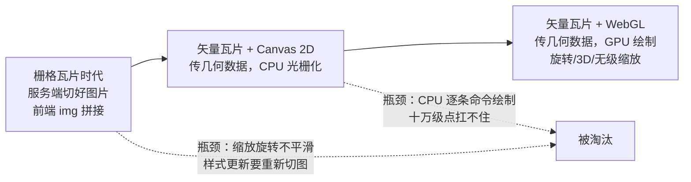
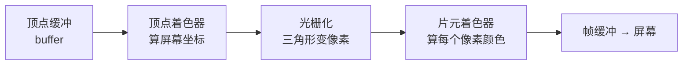
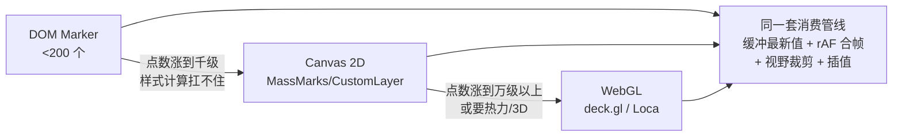

# 地图 SDK 选型与 WebGL 可视化

> **一句话结论：** 国内业务选商业 SDK（高德/百度，数据全、坐标系即开即用），海外或深度定制选开源栈（MapLibre GL + deck.gl）；所有现代地图引擎底层都是 **WebGL 矢量瓦片渲染**，「DOM → Canvas 2D → WebGL」三级渲染演进 + 各级的高频更新手段，就是 JD 里「Canvas/WebGL 可视化 + 高频数据更新」这条线的完整答案。

---

## 一、选型对比表（面试直接背）

| SDK | 渲染底层 | 海量点方案 | 国内数据 | 许可 | 适用场景 |
| --- | --- | --- | --- | --- | --- |
| 高德 JSAPI 2.0 | WebGL | `MassMarks` / `CustomLayer` | ✅ 最全 | 商业免费（配额） | 国内 C 端/B 端首选 |
| 百度 BMapGL | WebGL | `PointCollection` | ✅ 全 | 商业免费（配额） | 国内，百度系生态 |
| 腾讯位置服务 | WebGL | 海量点图层 | ✅ 全 | 商业免费 | 国内，微信生态 |
| Leaflet | DOM / Canvas 2D | `L.canvas` + circleMarker | 需接瓦片 | BSD 开源 | 轻量嵌入、老项目 |
| MapLibre GL | WebGL | 自绘 source layer | 需接瓦片/数据 | BSD 开源 | 海外、私有化部署、可改源码 |
| Mapbox GL JS | WebGL | circle layer | 需接瓦片 | v2 起闭源收费 | 海外商业项目 |
| deck.gl | WebGL（叠加层） | 几十种 Layer，十万级 | 叠在任意底图 | MIT 开源 | 大数据地理可视化 |
| 高德 Loca 2.0 | WebGL（官方叠加层） | 官方可视化层 | ✅ | 免费 | 高德生态内的大数据可视化 |

**选型口诀：**

```
国内 + 快速上线        → 高德/百度（坐标系、路网、导航现成）
海外 / 私有化 / 定制渲染 → MapLibre GL + deck.gl
点数上万 + 热力/轨迹/六边形聚合 → deck.gl（或高德 Loca）
只是嵌一张简单地图     → Leaflet（~40KB，无 WebGL 依赖）
```

**面试追问「为什么选高德」**：坐标系与路网数据开箱即用、海量点与聚合插件齐全、Loca 官方可视化层兜底、配额对中小项目免费。反过来「百度和高德区别」答三点：坐标系（GCJ-02 vs BD-09）、海量点 API（`MassMarks` vs `PointCollection`）、key/安全校验机制类似（百度 AK + SN 签名）。

---

## 二、坐标系坑（无人车场景真实踩点）

> **问题**：车载 GPS/RTK 设备上报的是 **WGS-84**（地球真实坐标），而国内商业底图做了加密偏移——高德/腾讯用 **GCJ-02**（火星坐标），百度在 GCJ-02 基础上再偏一次成 **BD-09**。原始 GPS 点直接叠加高德底图会**偏移几百米**（非线性偏移，不同位置偏移量不同）。

| 坐标系 | 谁在用 | 叠加到高德底图 |
| --- | --- | --- |
| WGS-84 | GPS 设备、Google Earth（海外）、MapLibre 自建底图 | ❌ 偏移几百米 |
| GCJ-02 | 高德、腾讯、国内路网数据 | ✅ 直接用 |
| BD-09 | 百度 | ❌ 需转换 |

```typescript
// 方案 A：高德官方转换 API（服务端批量转，精度有保障）
AMap.convertFrom(lnglatArray, 'gps', (status, result) => {
  if (status === 'complete') useOnMap(result.locations); // 已转 GCJ-02
});

// 方案 B：自建底图走 WGS-84（MapLibre + 自有瓦片），上报数据零转换
// 代价：路网/POI/导航能力全部自己解决
```

**工程结论**：在接入层（网关或消息消费入口）**统一转一次坐标系**，全链路内部只流通一种坐标系——转换散落在各页面是排查「车显示在河里」这类工单的常见根源。

---

## 三、地图渲染架构演进：为什么全是 WebGL



- **矢量瓦片**：不再传图片，传 **MVT**（Mapbox Vector Tile，protobuf 编码的几何数据）+ 一份样式表，前端拿到数据自己画——这是平滑旋转、3D 楼宇、无级缩放、样式热切换的前提。
- **为什么 GPU**：一个瓦片要三角化成上千个三角形再按样式分层绘制，CPU 串行扛不住；WebGL 把「喂数据」和「绘制」分离，CPU 只提交顶点缓冲，并行计算交给 GPU。
- 高德 JSAPI 2.0、BMapGL、MapLibre 都是这条路线——所以 `CustomLayer` 能直接拿到 **原生 WebGL context**，意味着 three.js / deck.gl 可以无缝叠加。

---

## 四、WebGL 渲染管线（地图视角的最小理解）



```typescript
// 最小可对照示例：画一个三角形的两段着色器（与 Canvas 2D 一行 fillRect 对比）
const vertexShader = `
  attribute vec2 a_pos;      // 顶点坐标（数据在 buffer 里，不在 JS 变量里）
  void main() { gl_Position = vec4(a_pos, 0.0, 1.0); }`;

const fragmentShader = `
  precision mediump float;
  void main() { gl_FragColor = vec4(0.1, 0.45, 0.94, 1.0); }`; // 每个像素并行执行
```

**与 Canvas 2D 的本质区别（高频考点）：**

| 维度 | Canvas 2D | WebGL |
| --- | --- | --- |
| 执行者 | CPU 逐条执行绘制命令 | GPU 并行跑着色器 |
| 数据位置 | JS 对象 → 每帧重新提交 | 顶点缓冲常驻显存，只更新变化部分 |
| 十万点 | 一次循环逐个画，主线程满载 | 一次 draw call，毫秒级 |
| 代价 | API 简单 | 要管理 shader/buffer/矩阵，工程上用库（deck.gl/three.js） |

**高频更新在 WebGL 层的做法**：位置数据放在顶点缓冲里，每帧只对变化的车辆调 `gl.bufferSubData()` **局部更新**对应区段（或用 instance 渲染：一个图元模板 + 每实例一个 attribute），不需要整块重建——这是「十万点 + 每秒更新」能跑起来的底层原因。

---

## 五、deck.gl：数据驱动的 WebGL 可视化

> **问题**：手写 WebGL 管线管理 shader/buffer 成本太高；数据可视化的共性是「给一堆经纬度 + 属性，按规则画出来」，应该只写规则不写管线。deck.gl 把每个可视化场景封装成 **Layer**，数据变更走增量 buffer 更新。

```typescript
import { Deck } from '@deck.gl/core';
import { ScatterplotLayer } from '@deck.gl/layers';

const deck = new Deck({
  canvas: 'deck-canvas',           // 叠在 MapLibre/Mapbox 底图之上
  initialViewState: { longitude: 114.05, latitude: 22.55, zoom: 12 },
  controller: true,
  layers: [
    new ScatterplotLayer({
      id: 'vehicles',
      data: vehicles,               // 数组驱动：换数组 = 自动重建 buffer
      getPosition: (d: Vehicle) => d.lnglat,
      getFillColor: (d: Vehicle) => (d.alarm ? [244, 67, 54] : [26, 115, 232]),
      radiusUnits: 'pixels',
      getRadius: 8,
      updateTriggers: { getFillColor: [alarmVersion] }, // 告警状态变了才重建颜色 buffer
    }),
  ],
});
```

**高频更新的正确姿势**：高频位置更新时**不要每条消息 new 一个数组**触发全量重算——沿用「缓冲 + 每帧一次」的节奏（见[高德地图与高频轨迹渲染 §3](./高德地图与高频轨迹渲染.md)），每帧把最新值写入同一份可变集合再 `setProps`；`updateTriggers` 控制只有真正变化的 accessor 才重建 buffer。

---

## 六、面试串联：三个 JD 关键词连成一条线

> 「地图 SDK → Canvas → WebGL → 高频更新」是一条升级链，每级有明确的天花板信号：



- **高频数据更新优化在各层的形态**：DOM 层是 `setPosition` 批量提交；Canvas 层是每帧全量重绘一次；WebGL 层是 `bufferSubData` 局部更新——**消息消费策略（缓冲/rAF/裁剪/插值）三层通用**，这也是把它单列为 JD 一项的原因。
- 配套可运行对比 → [demo/高频更新渲染对比.html](./demo/高频更新渲染对比.html)（逐条更新 vs rAF 合帧的帧率实测）。

---

## 相关阅读

- [地图与渲染零基础入门（黑话扫盲 + 面试官真实问法，0 经验起点）](./地图与渲染零基础入门.md)
- [高德地图与高频轨迹渲染（SDK 使用层：接入、Marker 选型、rAF 管线、轨迹抽稀）](./高德地图与高频轨迹渲染.md)
- [Canvas 完整指南与面试题（2D 上下文、动画、事件）](../Canvas完整指南与面试题.md)
- [WebGL 与 WebGPU 区别（升级路线）](../webgl/webgl与webgpu区别.md)
- [消息来源侧：MQTT 长连接治理](../../网络与安全/计算机网络/websocket/WebSocket与MQTT长连接治理.md)
