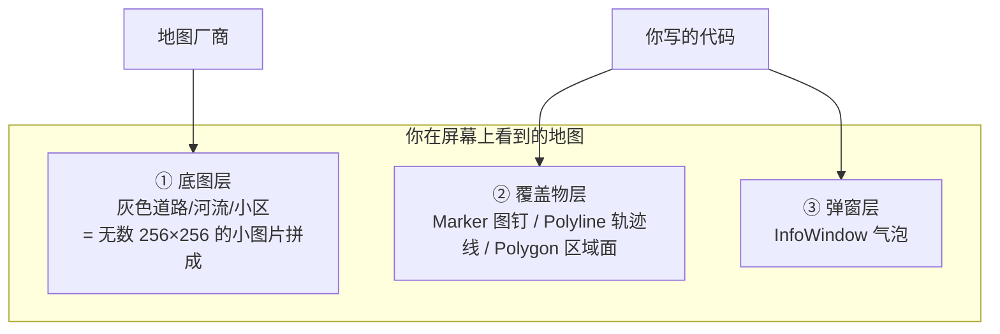
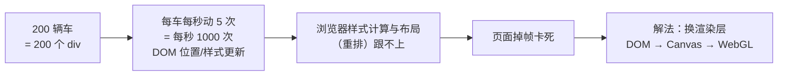

# 地图与渲染零基础入门（含面试官视角）

> **一句话结论：** 地图前端 = 「一张可拖拽缩放的画布（底图）+ 你往上叠的东西（图钉、线、面）」；货拉拉这条 JD 要的**不是背 API**，而是「车多、更新快的时候，你知不知道为什么卡、怎么分层解决」。本文先把 9 个黑话词讲透，再按面试官的真实问法逐层准备答案。

---

## 一、地图是什么：一张分层画布



**心智模型**：底图是厂商画好的「背景画」（你不用管），你的代码只负责往上面叠②③层——这和 PS 的图层一个道理。

### 1.1 九个黑话词（面试默认你懂，逐个定义）

| 术语 | 一句话定义 | 生活类比 |
| --- | --- | --- |
| **经纬度 lng/lat** | 地球上某个点的坐标，`[114.05, 22.55]` = 经度 114.05°、纬度 22.55°（深圳附近） | 平面坐标的 x / y |
| **底图** | 道路、河流、楼栋那层背景画 | 桌布 |
| **瓦片 Tile** | 底图按格子切成的小图（通常 256×256 像素），拖地图时按需加载视野内的几块 | 铺地砖 |
| **zoom 缩放级别** | 放大倍数：3 ≈ 全国，12 ≈ 城市，20 ≈ 单栋楼 | 望远镜倍率 |
| **视野 Bounds** | 当前屏幕显示的那块矩形经纬度范围 | 相机取景框 |
| **Marker 点标记** | 地图上的「图钉」——搜「海底捞」出现的红色大头针 | 图钉 |
| **Polyline 折线** | 把一串点连成的线，画车辆轨迹用 | 路径笔 |
| **InfoWindow 信息窗** | 点图钉弹出的气泡卡片 | 便利贴 |
| **聚合 Cluster** | 点太多时把附近的点合并成一个「999」的圆 | 一串葡萄算一颗 |

### 1.2 高德常用 API 速查（覆盖面试 90% 的使用题）

```typescript
const map = new AMap.Map('container', { center: [114.05, 22.55], zoom: 14 });

// Marker：图钉。position 是经纬度，icon 可以换图片，angle 转车头方向
const marker = new AMap.Marker({ position: [114.05, 22.55], angle: 90 });
map.add(marker);
marker.setPosition([114.06, 22.56]);  // 动了：车更新位置就调它

// Polyline：轨迹线。path 是一串经纬度
const line = new AMap.Polyline({ path: [[114.05, 22.55], [114.06, 22.56]], strokeWeight: 6 });
map.add(line);

// 事件：地图/标记都能监听
map.on('click', (e) => console.log(e.lnglat));
marker.on('click', () => console.log('点了车'));

// 视野操作：把地图自动缩放到正好框住所有内容
map.setFitView([marker, line]);
```

---

## 二、Marker 展开：为什么这东西多了会卡（性能问题的根）

> **Marker 的技术本质**（高德 JSAPI 默认实现）：**一个 DOM 元素**（div + img）。车多会卡的一切根源都在这。



- **Marker 生命周期**：`new Marker()` 创建 → `map.add()` 挂载 → `setPosition/setAngle/setIcon` 更新 → `map.remove()` 销毁。长时间运行时移出视野的车要销毁，否则 DOM 越堆越多（内存泄漏）。
- **为什么换层能救**：Canvas 一张画布上画 1 万个点和画 100 个点成本差不多（重绘开销固定），且没有 DOM 样式计算；WebGL 再把绘制交给 GPU 并行。三层怎么选、什么时候升级 → [地图SDK选型与WebGL可视化 §一、§六](./地图SDK选型与WebGL可视化.md)。

---

## 三、面试官视角：这条 JD 的 6 个真实问法

> 面试官为什么写「优先」：无人车监控大屏有三个硬特点——**车多、位置更新快、人要盯盘**。这三个特点分别对应使用层、性能层、设计层的考察。0 经验不是硬伤，**答不出层次感才是**。

| # | 面试官问法 | 在考什么 | 及格线 | 加分线 |
| --- | --- | --- | --- | --- |
| Q1 | 「地图在前端是怎么显示出来的？」 | 底层认知 | 知道瓦片：底图是切好的小图按视野拼接 | 知道矢量瓦片：现代 SDK 传几何数据、WebGL 绘制，所以能平滑旋转/3D |
| Q2 | 「地图上实时显示 200 辆无人车，怎么做？」 | **核心场景题** | 会用 Marker + 定时 setPosition | 答出「消息缓冲 + rAF 合帧 + 视野裁剪 + 插值」完整管线（见 §3.1 模板） |
| Q3 | 「车每秒上报 5 次，直接更新会怎样？」 | 性能感知 | 知道会卡 | 说清因果链：消息频率 ≠ 渲染频率，每条消息都碰 DOM 就是每秒上千次样式计算 |
| Q4 | 「车到 1 万辆还卡，怎么办？」 | 渲染分层 | 知道换 Canvas | 知道 MassMarks/CustomLayer 的区别、WebGL bufferSubData 局部更新、deck.gl |
| Q5 | 「坐标系了解吗？GPS 数据直接显示为什么会偏？」 | 细节亮点 | 知道有不同坐标系 | WGS-84（GPS 原始）vs GCJ-02（高德）vs BD-09（百度），偏移几百米，接入层统一转换 |
| Q6 | 「设计一个无人车监控大屏」 | 架构设计 | 地图 + 车列表 + 报警三块布局 | 消息层（MQTT）→ 状态层（最新值缓冲）→ 渲染层（地图/图表分别消费）分层，和数据流方向 |

### 3.1 Q2 的完整答题模板（可直接背）

> 分四步说，每步一句话，层层递进：

1. **接入**：「用高德 JSAPI 2.0，`CustomLayer` 或 Marker 层放车辆；key 走网关注入不打进包」；
2. **消息消费**：「MQTT 收到的位置消息不直接操作地图，先写进一个 `Map<车辆id, 最新状态>` 缓冲——同一辆车一帧内到 5 条消息只留最新一条」；
3. **渲染提交**：「`requestAnimationFrame` 每帧统一消费缓冲：视口外的车直接跳过，视口内的 `setPosition` 并做插值平滑——渲染频率 60fps 与上报频率解耦」；
4. **兜底升级**：「车到千级以上 Marker（DOM）扛不住，换 Canvas 自绘（CustomLayer），十万级再上 WebGL（deck.gl/Loca）。」

这套管线的逐行代码 → [高德地图与高频轨迹渲染 §3](./高德地图与高频轨迹渲染.md)；帧率对比实证 → [demo/高频更新渲染对比.html](./demo/高频更新渲染对比.html)。

---

## 四、0 经验的答题策略（诚实 + 迁移）

**不要装做过**。面试官看到简历就知道没地图经验，装只会被追问穿。正确姿势是「诚实承认 + 展示已学的深度 + 迁移相似经验」：

> 「地图 SDK 我没有生产经验，但为这个岗位系统补过：核心问题我理解是海量点渲染和高频更新的矛盾。我做过流式渲染，**打字机效果就是同一套思路**——网络消息先进缓冲，rAF 按帧消费，渲染次数和消息频率解耦；视野裁剪也和长列表**虚拟滚动**是同一个思想，只处理视口内的。」

三条真实可迁移的经验（都来自你的既有项目）：

| 迁移点 | 地图里的对应 | 共同本质 |
| --- | --- | --- |
| 流式渲染打字机（缓冲 + rAF 消费） | 高频位置更新合帧 | 消息频率与渲染频率解耦 |
| 长列表虚拟滚动 | 视野裁剪 Bounds culling | 只处理视口内可见项 |
| 长时运行稳定性排查 | Marker/轨迹数组内存泄漏 | 有上界、可观测、能归零 |

---

## 五、面试前的学习路径（按时间预算）

| 预算 | 做什么 |
| --- | --- |
| **1 小时** | 背 §1.1 九个词 + §3.1 答题模板；打开 [demo/高频更新渲染对比.html](./demo/高频更新渲染对比.html) 拉一次高负载，记住左右两个数字 |
| **半天** | 加上：跑通 [demo/第一个地图与Marker.html](./demo/第一个地图与Marker.html)（真 SDK 体感）→ 读 [高德地图与高频轨迹渲染](./高德地图与高频轨迹渲染.md) 全文 |
| **一天** | 再加：[地图SDK选型与WebGL可视化](./地图SDK选型与WebGL可视化.md) 全文（选型表 + 坐标系 + WebGL 管线），能白板画出「DOM → Canvas → WebGL」升级链 |

**注册 key（5 分钟，跑真实 demo 用）**：[高德开放平台](https://console.amap.com/dev/key/app) → 应用管理 → 创建应用 → 添加 Key（平台选 **Web端(JS API)**）→ 同时记下 Key 和安全密钥 securityJsCode。

---

## 相关阅读

- [高德地图与高频轨迹渲染（SDK 使用层：Marker 选型、rAF 管线、轨迹抽稀）](./高德地图与高频轨迹渲染.md)
- [地图SDK选型与WebGL可视化（选型对比、坐标系坑、WebGL 管线、升级链）](./地图SDK选型与WebGL可视化.md)
- [Canvas 完整指南（Canvas 2D 从零讲起）](../Canvas完整指南与面试题.md)
