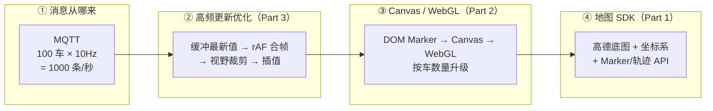
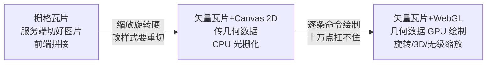
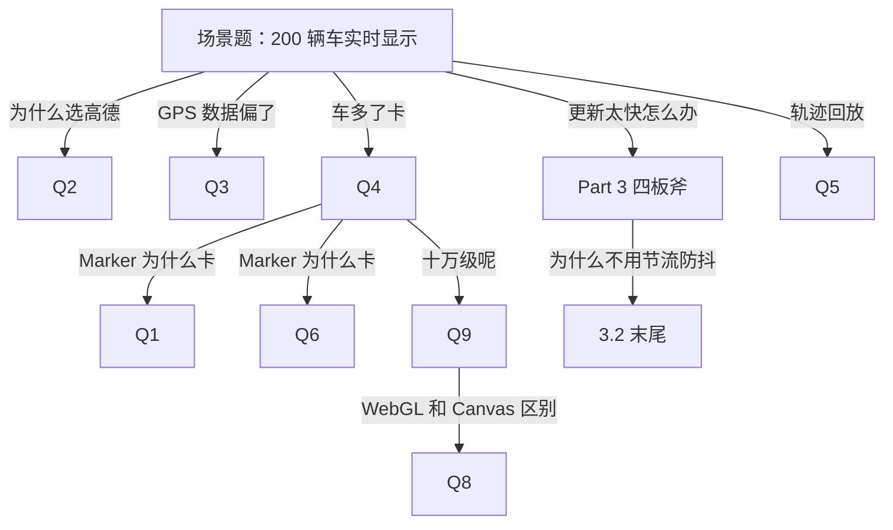

# 地图与渲染面试体系（无人车场景一条线）

> **一句话结论：** 这条 JD 只有一个场景——**地图上实时跑着一群车**。「车怎么显示」（地图 SDK）、「车太多怎么画得动」（Canvas/WebGL）、「车更新太快怎么不卡」（高频更新优化）是**同一个问题的三层**。本文按面试官的追问顺序展开成 12 问，一问咬一问，最后收敛成可背的答题模板。

---

## 〇、全文一张图：一个场景，三层问题



**黑话速查**（详版 → [零基础入门 §1.1](./地图与渲染零基础入门.md)）：Marker = 地图上的图钉（本质 DOM 元素）｜瓦片 = 底图切成 256×256 小图拼接｜zoom = 放大级别（3 全国 / 20 楼栋）｜Bounds = 当前屏幕显示的矩形区域｜GCJ-02 = 高德的加密坐标系。

---

## Part 1 · 地图 SDK 常考（高德/百度）

### Q1「地图在前端是怎么显示出来的？」

- **及格**：底图不是一张整图，是按 `z/x/y` 切成 256×256 的**瓦片**，只加载视野内那几十块，拖动/缩放时换瓦片；
- **加分**：zoom 每加 1 级瓦片数 ×4（视野内瓦片数基本恒定，所以流畅）；现代 SDK 用**矢量瓦片**（传几何数据而非图片），所以能平滑旋转、3D 楼宇、样式热切换。

### Q2「为什么选高德？高德和百度什么区别？」

| 维度 | 高德 JSAPI 2.0 | 百度 BMapGL |
| --- | --- | --- |
| 坐标系 | GCJ-02 | BD-09（在 GCJ-02 上再偏一次） |
| 海量点 API | `MassMarks` | `PointCollection` |
| 鉴权 | Key + securityJsCode | AK + SN 签名 |
| WebGL 可视化 | Loca 2.0（官方） | 生态内自绘为主 |

**答法**：国内业务选商业 SDK（坐标系、路网、导航开箱即用）；海外或要私有化/深度定制 → MapLibre GL + deck.gl（开源）。选高德的具体理由：数据全、海量点与聚合插件齐、Loca 兜底大数据可视化、配额免费。

### Q3「GPS 设备的数据直接显示为什么会偏？」（细节亮点题）

- 车载 GPS/RTK 上报 **WGS-84**（真实坐标）；高德底图是 **GCJ-02**（法规要求的加密偏移）；直接叠加**偏几百米**（非线性偏移，各地不同）。
- **工程解法**：在接入层（网关/消息入口）统一转一次（`AMap.convertFrom` 批量或服务端算法），**全链路只流通一种坐标系**——转换散落各页面是「车显示在河里」工单的常见根源。

### Q4「车太多 Marker 卡怎么办？」（必考）

Marker 本质是 DOM 元素 → 每个「车」= 一个 div → 1000 车 = 1000 个 div 每秒动 10 次 = 每秒上万次样式计算。

| 方案 | 渲染 | 数量级 | 高频更新 |
| --- | --- | --- | --- |
| `AMap.Marker` | DOM | < ~200 | 可行（rAF 批量 setPosition） |
| `MassMarks` | Canvas 一次绘制 | 万~十万 | 弱（setData 全量重设） |
| `CustomLayer` | 自己拿 ctx 画 | 千~万 | **强**（每帧完全可控） |
| `MarkerCluster` | 聚合成一个 | 大范围态势 | 中 |

**选型结论**：百级 + 高频 → DOM Marker + rAF 批量；千级或样式逐帧变（告警闪烁）→ CustomLayer；十万级 → WebGL（见 Q9）。

### Q5「轨迹怎么画？」

- **历史轨迹**：一天几十万个点直接 `Polyline` 会卡 → ① Douglas-Peucker **抽稀**（按 5 米容差去共线冗余点，几十万 → 几千，形状不失真）② `GraspRoad` **纠偏**（GPS 漂移点吸附回路网）；
- **实时轨迹**：数组**必须有上界**——滑窗只留最近 500 点。没有上界 = 内存泄漏 + 绘制复杂度只增不减（无人车大屏要连跑数天，这直接关联[长时稳定性治理](../../性能与浏览器/性能优化/长时运行稳定性治理与排查.md)）。

> 深挖（接入代码、抽稀实现、MoveAnimation）→ [高德地图与高频轨迹渲染](./高德地图与高频轨迹渲染.md)

---

## Part 2 · Canvas / WebGL 常考

### 先导：升级链为什么成立（第一性原理，先懂这个再看表）

> **一句话：DOM 贵在「每个点都有身份」，Canvas 便宜在「点只是像素」，WebGL 便宜在「点只是数据、执行并行」。**

三层各画 2000 个点时，浏览器分别在忙什么：

| | DOM | Canvas 2D | WebGL |
| --- | --- | --- | --- |
| 2000 个点 = | 2000 个 DOM 对象 | 1 个 DOM 对象 + 2000 条哑命令 | 1 个 DOM 对象 + 1 条命令 + 2000 条数据 |
| 点有身份吗 | 有：可点击/有样式/在 DOM 树里 | 没有，只是像素 | 没有，只是显存里的数字 |
| 谁在画 | 渲染管线逐元素（样式→布局→绘制） | CPU **串行**逐条执行 fill | GPU 数千核心**并行**跑同一段着色器 |

- **DOM → Canvas 省的是「身份税」**：每个 div 都是全能员工（样式、事件、命中测试、可查询），福利每个点都要付钱。Canvas 把 2000 个点变成一张位图上的像素，浏览器眼里只有 1 个元素变了。类比：**Word 里放 2000 个可编辑文本框（卡）vs Photoshop 一个图层画 2000 个点（快）**——代价是点失去身份、不能单独点击，所以要自己做点击检测（这就是 Q6 表里「事件要自己做」的原因）。
- **Canvas → WebGL 省的是「串行执行」**：Canvas 再快，2000 次 `fill()` 也是 CPU 一条条执行（API 有状态、顺序敏感，天然串行）。WebGL 把坐标写进一个数组 → 一次放显存 → 发 **1 条** draw call → GPU 数千核心对每个点并行跑同一段着色器。类比：**一个厨师逐道炒 2000 道菜 vs 把菜单交给 2000 个炉子同时开火**——你只花写菜单的时间，所以耗时与 N 几乎无关。
- **和合成层的关系**（连回渲染管线知识）：`<canvas>` 会被**自动提升为独立合成层**（内容本身就是位图纹理，同 `translateZ(0)` 提升的机制）——重画只重新光栅化自己这层，不触发页面级样式计算/布局、不连累其它层。但注意 **合成便宜 ≠ 画便宜**：分层解决「不连累别人」，层内 2000 次 fill 的串行执行仍在（那才是 WebGL 解决的）。反模式：给每个 DOM Marker 加 `will-change` 各自成层 → 2000 块显存纹理，显存爆炸。渲染管线详见 → [浏览器原理与性能优化](../../性能与浏览器/浏览器原理/浏览器相关-原理、性能优化.md)
- **反直觉（防翻车）**：< 200 个点时 DOM 反而最优——性能不是瓶颈时，「原生事件/无障碍/CSS 动画免费」的福利价值最大，没必要上 Canvas。

### Q6「Canvas、SVG、DOM 怎么选？」

| 维度 | DOM/SVG | Canvas |
| --- | --- | --- |
| 本质 | 每个图形一个节点 | 一张位图，画完即定稿 |
| 事件 | 原生支持 | 要自己做点击检测 |
| 元素多 | 上千节点卡 | 数量不影响成本（重绘开销固定） |
| 高频重绘 | 昂贵 | 友好 |

口诀：**要交互/元素少 → SVG；要海量点/高频动画 → Canvas；要 3D 或十万级 → WebGL**。（完整版 → [Canvas 完整指南](../Canvas完整指南与面试题.md)）

### Q7「为什么现代地图引擎全是 WebGL？」



高德 2.0、BMapGL、MapLibre 都是第三阶段。**关键推论**：`CustomLayer` 能拿到**原生 WebGL context** → three.js / deck.gl 可无缝叠加在地图上。

### Q8「Canvas 2D 和 WebGL 的本质区别？」

| 维度 | Canvas 2D | WebGL |
| --- | --- | --- |
| 执行者 | CPU 逐条执行绘制命令 | GPU 并行跑着色器 |
| 数据位置 | JS 对象，每帧重新提交 | 顶点缓冲常驻显存，只更新变化部分 |
| 十万点 | 循环逐个画，主线程满载 | 一次 draw call |
| 代价 | API 简单 | 要管 shader/buffer/矩阵 → 工程上用库 |

### Q9「十万级点还高频更新，WebGL 层怎么做？」

- 位置数据放**顶点缓冲**，每帧只对变化的车 `gl.bufferSubData()` **局部更新**对应区段——不重建整块；
- **instance 渲染**：一个图元模板 + 每实例一个 attribute，专为「十万个同样的图钉」设计；
- **deck.gl**（MIT 开源）：把场景封装成 Layer，数据驱动 + `updateTriggers` 控制只有变化的 accessor 才重建 buffer；高德生态内的等价物是 **Loca 2.0**。

> 深挖（渲染管线、坐标系全表、deck.gl 代码）→ [地图SDK选型与WebGL可视化](./地图SDK选型与WebGL可视化.md)
> 代码级体感：真实高德地图上切换三层渲染 → [demo/真实SDK渲染优化.html](./demo/真实SDK渲染优化.html)（Marker/MassMarks/Loca 三种模式可切换，各自的真实更新姿势与耗时对比；需自填 Key）

---

## Part 3 · 高频数据更新优化（方法论总结，本文核心）

### 3.1 问题本质：两个频率的错配

```
消息速率 = 车数 × 上报频率     = 100 × 10Hz = 1000 条/秒
渲染上限 = 显示器刷新率        = 60 帧/秒
```

每条消息都去碰一次渲染 = **94% 的工作注定被下一帧覆盖**。所有优化都围绕一件事：**让消息频率与渲染频率解耦**。

### 3.2 四板斧（背这四个词）

```typescript
ingest(id, msg) { pending.set(id, msg); }          // ① 缓冲最新值：同车一帧内 5 条只留 1 条

const tick = () => {                               // ② rAF 合帧：一帧消费一批
  const bounds = map.getBounds();                  // ③ 视野裁剪：视口外的车零成本跳过
  for (const [id, s] of pending) {
    const m = markers.get(id);
    if (!bounds.contains(s.lnglat)) continue;
    m.setPosition(lerp(m.getPosition(), s.lnglat, 0.2)); // ④ 插值平滑：上报 1Hz 渲染 60fps
  }
  pending.clear();
  requestAnimationFrame(tick);
};
```

| 板斧 | 解决什么 | 一句话原理 |
| --- | --- | --- |
| ① 缓冲最新值 | 消息过载 | 写内存不碰渲染，同车多条自动合并成最新 |
| ② rAF 合帧 | 更新过频 | 与 vsync 对齐，一帧一批，天然合帧不撕裂 |
| ③ 视野裁剪 | 车多视野小 | `bounds.contains()` 视口外直接跳过 |
| ④ 插值平滑 | 上报低频跳变 | 指数平滑补帧，60fps 下约 300ms 收敛 |

**为什么不用节流/防抖**：节流降到固定频率但与 vsync 不对齐、渲染间隙空转；防抖在高频下**永远不触发**（计时器不断重置）。rAF + 最新值缓冲 = 无损合帧：一条不浪费，又绝不超频。

### 3.3 这套策略与渲染层正交（经验总结的抽象）

| 渲染层 | 一帧内的提交动作 | 适用规模 |
| --- | --- | --- |
| DOM Marker | N 次 `setPosition` | < 200 车 |
| Canvas 自绘 | 整幅重绘一次 | 千~万 |
| WebGL | `bufferSubData` 局部更新 | 十万级 |

**面试金句**：消息消费策略（缓冲/合帧/裁剪/插值）是**渲染层无关**的——从 DOM 换到 Canvas 再换到 WebGL，换的只是「一帧内怎么提交」，消费管线一行不改。这就是 JD 把它单列一项的原因。

### 3.4 实测数字（demo 可复现，面试直接引用）

[demo/高频更新渲染对比.html](./demo/高频更新渲染对比.html)（浏览器直接打开）：

| 场景 | 逐条更新 | rAF 合帧 |
| --- | --- | --- |
| 120 车 × 8Hz（960 条/s） | 重绘 ≈ 960 次/s，耗时上涨 | 60 次/s，同帧合并持续计数 |
| 300 车 × 15Hz（4500 条/s） | 单次重绘耗时 + 页面帧率**双崩** | 仍 60 次/s |
| 车辆 1~2Hz 低频 | 车逐格跳变、消息间隙静止 | 插值平滑持续移动 |

---

## Part 4 · 答题模板（考前背这里）

### 4.1 三十秒完整答案（场景题「200 辆车实时显示」）

> ① 接高德 JSAPI 2.0，key 走网关注入；② MQTT 位置消息不碰地图，先写 `Map<车id, 最新状态>` 缓冲；③ rAF 每帧统一消费：视口外跳过、视口内 setPosition + 指数平滑插值，渲染 60fps 与上报频率解耦；④ 车到千级 Marker 扛不住换 CustomLayer 自绘 Canvas，十万级上 WebGL/deck.gl，消费管线不变。

### 4.2 追问树（每个分支落到上文哪一问）



### 4.3 0 经验兜底（诚实 + 迁移）

> 「地图 SDK 我没有生产经验，但为岗位系统补过：核心是海量点渲染和高频更新的矛盾。我做过**流式渲染打字机**——网络消息进缓冲、rAF 按帧消费，和位置更新合帧**同一套思路**；**长列表虚拟滚动**和视野裁剪也是同一个思想：只处理视口内。」

---

## Part 5 · 深挖与实证（延伸阅读）

| 想深入 | 去哪 |
| --- | --- |
| 黑话扫盲 / 0 经验策略全文 | [地图与渲染零基础入门](./地图与渲染零基础入门.md) |
| 高德接入源码 / VehicleLayer 完整实现 / 轨迹抽稀 | [高德地图与高频轨迹渲染](./高德地图与高频轨迹渲染.md) |
| 选型全表 / 坐标系转换 / WebGL 管线 / deck.gl 代码 | [地图SDK选型与WebGL可视化](./地图SDK选型与WebGL可视化.md) |
| 跑第一个真 Marker（5 分钟注册 key） | [demo/第一个地图与Marker.html](./demo/第一个地图与Marker.html) |
| **真实高德 SDK 里切换三层渲染**（Marker/MassMarks/Loca 各自的真实更新姿势） | [demo/真实SDK渲染优化.html](./demo/真实SDK渲染优化.html)（需自填 Key） |
| 帧率对比实证 | [demo/高频更新渲染对比.html](./demo/高频更新渲染对比.html) |
| 消息来源侧（MQTT 心跳/重连/订阅生命周期） | [WebSocket与MQTT长连接治理](../../网络与安全/计算机网络/websocket/WebSocket与MQTT长连接治理.md) |
