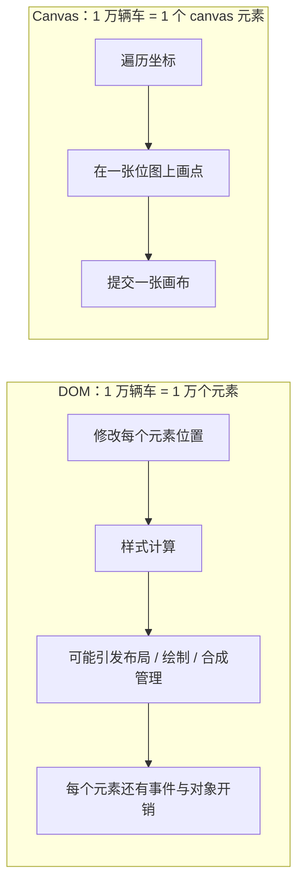
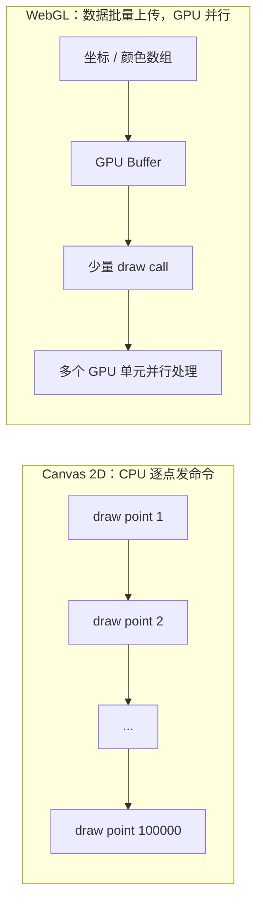

# 海量轨迹点 / 车辆标记点渲染卡顿怎么优化

> **一句话结论：** 卡的根因是 **Marker 本质是 DOM 元素**——每个「车」= 一个 div，1000 车 = 1000 个 div 每秒动 10 次 = 每秒上万次样式计算。解法是按数量级**升级渲染方案**：百级用 DOM Marker + rAF 批量，千级换 CustomLayer 自绘 Canvas，十万级上 WebGL；轨迹则靠**抽稀 + 滑窗截断**让点数有上界。

---

## 一、先定位：Marker 为什么卡

| 方案 | 实现 | 数量级 | 高频更新 |
| --- | --- | --- | --- |
| `AMap.Marker` | 每个点一个 **DOM 元素** | < ~200 | 可行（rAF 批量 setPosition） |
| `AMap.MassMarks` 海量点 | **Canvas** 一次性绘制 | 万~十万 | 弱（`setData` 全量重设） |
| `AMap.CustomLayer` 自定义层 | 自己拿 ctx 画 | 千~万 | **强**（每帧完全可控） |
| `AMap.MarkerCluster` 聚合 | 点多时聚合成一个 | 大范围态势 | 中 |

### 为什么 Canvas 比 DOM 更适合海量点

**DOM 中每辆车都是一个浏览器需要管理的元素；Canvas 中所有车只是同一张位图上的像素。**



以 1 万辆车的位置更新为例：

| 浏览器要做的事 | DOM Marker | Canvas 2D |
| --- | --- | --- |
| 管理对象 | 1 万个 DOM 节点、样式和事件目标 | 1 个 `<canvas>` + 一份车辆数据 |
| 位置更新 | 对 1 万个元素设置 `transform` 或样式 | JS 遍历坐标并调用绘图命令 |
| 渲染管线 | 可能引发样式计算、绘制和大量图层管理 | 不需要为每辆车做 DOM 样式计算 |
| 单点点击 | 浏览器直接分发到该元素 | 需要自己根据坐标做命中检测 |
| 单点样式 / 无障碍 | CSS、DOM API 和无障碍语义开箱即用 | 需要自己管理数据与交互 |

Canvas 并不是「画 100 个点和 1 万个点一样快」。它仍要在 CPU 上逐条执行 `drawImage()` / `fill()`，动画时通常还要清空并重画整张画布；它的优势是省掉了每个点的 DOM 管理成本。

### 为什么 WebGL 又比 Canvas 2D 更适合十万级点

**Canvas 2D 的绘图命令主要由 CPU 一条条提交；WebGL 把坐标和样式整批放入 GPU 缓冲区，让 GPU 并行处理大量点。**



| 维度 | Canvas 2D | WebGL |
| --- | --- | --- |
| 数据表示 | JS 每帧发出多条有状态绘图命令 | 坐标、颜色等是显存中的结构化 buffer |
| 处理方式 | CPU 为主，绘图 API 调用多 | GPU 对顶点和像素大规模并行处理 |
| 提交方式 | 通常每个点至少一条绘图命令 | 批处理 / 实例化后，少量 draw call 可绘制大量点 |
| 高频局部更新 | 常见做法是整帧清空后重画 | `bufferSubData()` 只更新变化的 buffer 区段 |
| 3D / 深度 / 海量粒子 | 需自己模拟，能力有限 | 原生支持着色器、深度测试与矩阵变换 |
| 开发成本 | API 直观，调试简单 | 需管理 shader、buffer、纹理和坐标系，复杂度高 |

WebGL 也不是只要使用就一定更快。如果仍为每辆车单独上传数据、切换状态并调用一次 `drawArrays()`，CPU 和 GPU 之间的通信会抵消优势。它的性能来自**批处理、实例化渲染、减少 draw call 和局部更新 buffer**。

```text
DOM     优先保留每个点的元素能力：好交互，但每点管理成本高
Canvas  放弃每个点的 DOM 身份：只画像素，但 CPU 仍要逐条发绘图命令
WebGL   进一步把点变成 GPU 数据：批量提交并行绘制，但开发成本最高
```

> 更深入的 WebGL 渲染管线、shader 和 `bufferSubData()` 示例见 [地图 SDK 选型与 WebGL 可视化](./地图SDK选型与WebGL可视化.md)。

```typescript
// 万级静态点：MassMarks（Canvas，一次绘制）
const massMarks = new AMap.MassMarks(vehicles, {
  zooms: [3, 20],
  style: { url: '/car.png', anchor: 'center', size: [28, 28] },
});
massMarks.setMap(map);
```

**选型结论（面试直接背）**：

- **百级 + 高频更新**（车辆实时位置）→ DOM Marker + rAF 批量更新，性价比最高；
- **千级 / 样式逐帧变**（告警闪烁）→ 升级 `CustomLayer` 自绘 Canvas；
- **十万级** → WebGL（deck.gl / Loca 2.0），批处理后用少量 draw call 绘制。

---

## 二、轨迹怎么画（历史 + 实时）

### 历史轨迹：抽稀 + 纠偏

一天轨迹几十万个点，`Polyline` 直接画会卡死：

```typescript
// ① Douglas-Peucker 抽稀：按距离容差去掉共线冗余点（几十万 → 几千，形状不失真）
const simplified = douglasPeucker(rawPoints, tolerance = 5); // 5 米

const polyline = new AMap.Polyline({ path: simplified, strokeWeight: 6, showDir: true });
map.add(polyline);

// ② GraspRoad 纠偏：GPS 漂移点吸附回路网（高德官方插件）
AMap.plugin('AMap.GraspRoad', () => {
  const graspRoad = new AMap.GraspRoad();
  graspRoad.driving(points.map((p) => ({ x: p.lng, y: p.lat, sp: p.speed, ag: p.heading, tm: Date.now() })),
    (error, result) => { if (!error) map.add(new AMap.Polyline({ path: result.points.map((p: any) => [p.x, p.y]) })); });
});
```

### 实时轨迹：滑窗截断

```typescript
const MAX_TAIL = 500; // 只保留最近 500 个点，内存与绘制复杂度有上界
class LiveTrack {
  private path: [number, number][] = [];

  push(lnglat: [number, number]) {
    this.path.push(lnglat);
    if (this.path.length > MAX_TAIL) this.path.shift(); // 滑窗截断
    this.polyline.setPath(this.path);
  }
}
```

> 轨迹数组**必须有上界**（滑窗截断），否则既是内存泄漏（大屏连跑数天）又是绘制性能退化（点数只增不减）——关联 [内存泄漏治理](../../性能与浏览器/性能优化/内存泄漏治理.md)。

---

## 面试回答

> 卡的根因是 Marker 本质是 DOM 元素，每个车一个 div，千级车辆每秒上万次样式更新，主线程压力很大。解法按数量级升级：百级加高频就用 DOM Marker 加 rAF 批量更新；千级或样式逐帧变换 CustomLayer 自绘 Canvas；十万级上 WebGL，用 deck.gl 或 Loca 做批处理和少量 draw call。轨迹分两类：历史轨迹用 Douglas-Peucker 抽稀去共线冗余点、GraspRoad 纠偏吸附路网；实时轨迹必须滑窗截断保留最近几百点，让内存和绘制复杂度都有上界。

## 相关资料

- [高频数据更新优化](./高频数据更新优化.md)
- [高频更新渲染对比 demo](./demo/高频更新渲染对比.html)
