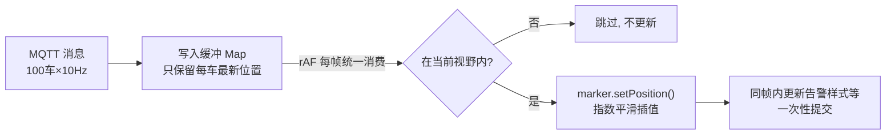

# 高德地图与高频轨迹渲染（无人车监控场景）

> **一句话结论：** 监控大屏地图的两个性能瓶颈是 **Marker 数量**和**位置更新频率**；解法组合拳——海量点用 Canvas 系渲染（MassMarks/CustomLayer）、高频消息只存最新值再 **rAF 每帧批量提交**、视口外裁剪不更新、动画用**插值平滑**而非逐消息跳变。

---

## 一、接入最小示例

```typescript
import AMapLoader from '@amap/amap-jsapi-loader';

// JSAPI 2.0 必须配安全密钥（2021-12 后申请的 key 强制）
window._AMapSecurityConfig = { securityJsCode: '你的安全密钥' };

const AMap = await AMapLoader.load({
  key: '你的Key',
  version: '2.0',
  plugins: ['AMap.MarkerCluster', 'AMap.MoveAnimation'], // 按需插件
});

const map = new AMap.Map('container', {
  center: [114.05, 22.55],
  zoom: 14,
  viewMode: '2D',
});
```

**面试细节**：key + securityJsCode 不要打进主 bundle（安全），生产由网关代理或 Nginx 注入；`plugins` 按需加载减少首屏体积。

---

## 二、点标记选型：什么时候 Marker 扛不住

| 方案 | 实现 | 数量级 | 高频更新 |
| --- | --- | --- | --- |
| `AMap.Marker` | 每个点一个 **DOM 元素** | < ~200 个 | 可行（rAF 批量 setPosition） |
| `AMap.MassMarks` 海量点 | **Canvas** 一次性绘制 | 万~十万 | 弱（`setData` 全量重设） |
| `AMap.CustomLayer` 自定义层 | 自己拿 ctx 画 | 千~万 | 强（每帧完全可控） |
| `AMap.MarkerCluster` 聚合 | 点多时聚合成一个 | 大范围态势 | 中 |

```typescript
// 万级静态点：MassMarks（Canvas，一次绘制）
const massMarks = new AMap.MassMarks(vehicles, {
  zooms: [3, 20],
  style: { url: '/car.png', anchor: 'center', size: [28, 28] },
});
massMarks.setMap(map);
```

**选型结论（面试直接背）**：车辆实时位置这种「百级 + 每秒多次更新」的场景，**DOM Marker + rAF 批量更新**性价比最高；点规模上千或要点样式逐帧变化（告警闪烁），升级 **CustomLayer 自绘 Canvas**。

---

## 三、高频位置更新的渲染管线（核心考点）

**场景**：MQTT 订阅 100 台车，每台 1~10Hz 上报 → 最坏每秒上千条位置消息。

**错误做法**：每条消息直接 `marker.setPosition()` + `setMap` 相关刷新 → 每秒上千次 DOM 样式计算，主线程被地图操作打爆，页面掉帧卡死。



### 3.1 批量更新管理器（真实代码）

```typescript
interface VehicleState { lnglat: [number, number]; heading: number; seq: number }

class VehicleLayer {
  private markers = new Map<string, AMap.Marker>();
  /** 缓冲区：每车只留最新状态，消息到达不直接碰 DOM */
  private pending = new Map<string, VehicleState>();
  private rafId = 0;

  constructor(private map: AMap.Map) {}

  mount() { this.rafId = requestAnimationFrame(this.tick); }

  /** MQTT 消息入口：只写内存，1ms 内被合并到下一帧 */
  ingest(vehicleId: string, state: VehicleState) { this.pending.set(vehicleId, state); }

  private tick = () => {
    const bounds = this.map.getBounds(); // 视野裁剪：一帧取一次
    for (const [id, state] of this.pending) {
      this.pending.delete(id);
      const marker = this.markers.get(id);
      if (!marker) continue;

      if (!bounds.contains(state.lnglat)) continue; // 视口外：零成本跳过

      const current = marker.getPosition();
      // 指数平滑：向目标位置移动 20%/帧，60fps 下约 300ms 收敛
      const next: [number, number] = [
        current.lng() + (state.lnglat[0] - current.lng()) * 0.2,
        current.lat() + (state.lnglat[1] - current.lat()) * 0.2,
      ];
      marker.setPosition(next);
      marker.setAngle(state.heading);
    }
    this.rafId = requestAnimationFrame(this.tick); // 永续帧循环
  };

  destroy() { cancelAnimationFrame(this.rafId); this.markers.clear(); this.pending.clear(); }
}
```

**四个关键点：**

1. **消息到渲染解耦**——消息只写 `pending`（同车多条合并成最新一条），DOM 更新频率与消息频率彻底无关；
2. **rAF 对齐渲染帧**——浏览器按显示频率消费，一帧一批，天然合帧；不用 `setInterval`（不与 vsync 对齐会撕裂）；
3. **视野裁剪**——`getBounds().contains()` 视口外的车直接跳过，缩放/拖动时收益最大；
4. **插值平滑**——上报 1Hz 但渲染 60fps，车不会一格一格跳，用指数平滑（或按时间窗 lerp）补帧。

### 3.2 为什么不用节流/防抖

- 节流：把更新降到固定频率，但仍可能在渲染间隙空转，且丢帧节奏与 vsync 不对齐；
- 防抖：高频消息会**永远不触发**更新（不断重置计时器）；
- rAF + 最新值缓冲 = 「无损合帧」：一条不浪费地更新，又绝不超频。

---

## 四、轨迹渲染

### 4.1 历史轨迹：抽稀 + 纠偏

**问题**：一天轨迹几十万个点，`Polyline` 直接画会卡死。

```typescript
// ① Douglas-Peucker 抽稀：按距离容差去掉共线冗余点（几十万 → 几千，形状不失真）
const simplified = douglasPeucker(rawPoints, tolerance = 5); // 5 米

const polyline = new AMap.Polyline({
  path: simplified,
  strokeWeight: 6,
  showDir: true, // 方向箭头
  strokeColor: '#1a73e8',
});
map.add(polyline);
map.setFitView([polyline]);
```

```typescript
// ② 驾车轨迹纠偏：GPS 漂移点吸附回路网（高德官方插件）
AMap.plugin('AMap.GraspRoad', () => {
  const graspRoad = new AMap.GraspRoad();
  graspRoad.driving(
    points.map((p, i) => ({ x: p.lng, y: p.lat, sp: p.speed, ag: p.heading, tm: 1478031031 + i })),
    (error, result) => {
      if (!error) map.add(new AMap.Polyline({ path: result.points.map((p: any) => [p.x, p.y]) }));
    },
  );
});
```

### 4.2 实时轨迹：尾部截断 + 增量追加

```typescript
const MAX_TAIL = 500; // 只保留最近 500 个点，内存与绘制复杂度有上界
class LiveTrack {
  private path: [number, number][] = [];

  push(lnglat: [number, number]) {
    this.path.push(lnglat);
    if (this.path.length > MAX_TAIL) this.path.shift(); // 滑窗截断
    this.polyline.setPath(this.path); // 与位置更新共用同一个 rAF 帧提交
  }
}
```

**面试点**：轨迹数组**必须有上界**（滑窗截断），否则既是内存泄漏（长时运行数天）又是绘制性能退化（点数只增不减）——这直接关联[长时稳定性治理](../../性能与浏览器/性能优化/内存泄漏治理.md)。

---

## 五、高频重绘的其他手段（提分项）

| 手段 | 场景 | 一句话原理 |
| --- | --- | --- |
| `requestAnimationFrame` 合帧 | 位置/状态高频更新 | 帧级对齐 + 最新值语义 |
| 视野裁剪（bounds culling） | 车辆多、地图缩放 | 视口外零成本 |
| 抽稀（Douglas-Peucker） | 历史轨迹 | 去冗余共线点，形状保真 |
| Canvas 代替 DOM | 点数量大 / 样式逐帧变 | Canvas 命中 O(1) 绘制，DOM 每点一次样式计算 |
| 分层渲染 | 底图静、车辆动 | 车辆层独立重绘，不牵连底图 |
| WebGL（mapbox/deck.gl） | 十万级点/热力 | GPU 并行绘制，CPU 只喂数据 |

**相关阅读**：

- [地图 SDK 选型与 WebGL 可视化（高德/百度/MapLibre/deck.gl 对比、坐标系、WebGL 管线）](./地图SDK选型与WebGL可视化.md)
- [配套 demo：逐条更新 vs rAF 合帧帧率实测](./demo/高频更新渲染对比.html)（浏览器直接打开）
- [Canvas 完整指南（2D 上下文、动画、事件）](../Canvas完整指南与面试题.md)
- [消息来源侧：MQTT 长连接治理](../../网络与安全/计算机网络/websocket/MQTT的QoS遗嘱保留消息与订阅生命周期.md)
- [WebGL 与 WebGPU 区别（升级路线）](../webgl/webgl与webgpu区别.md)
