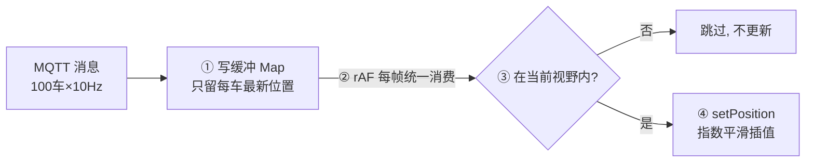
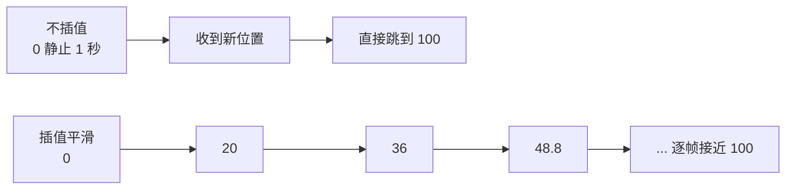

# 高频数据更新优化

> **一句话结论：** 高频更新的本质是**两个频率错配**——消息 1000 条/秒、渲染 60 帧/秒，每条消息都碰一次渲染意味着 94% 的工作被下一帧覆盖。所有优化围绕一件事：**让消息频率与渲染频率解耦**，落成四板斧——缓冲最新值、rAF 合帧、视野裁剪、插值平滑。

---

## 一、问题本质：两个频率的错配

```
消息速率 = 车数 × 上报频率 = 100 × 10Hz = 1000 条/秒
渲染上限 = 显示器刷新率      = 60 帧/秒
```

**错误做法**：每条消息直接 `marker.setPosition()` → 每秒上千次 DOM 样式计算，主线程被打爆。

---

## 二、四板斧（背这四个词）



```typescript
class VehicleLayer {
  private markers = new Map<string, AMap.Marker>();
  private targets = new Map<string, VehicleState>(); // 每车只保留最新目标
  private rafId = 0;

  ingest(vehicleId: string, state: VehicleState) {
    this.targets.set(vehicleId, state); // 新消息直接覆盖旧目标
  }

  private tick = () => {
    const bounds = this.map.getBounds(); // 视野裁剪：一帧取一次
    for (const [id, state] of this.targets) {
      const marker = this.markers.get(id);
      if (!marker || !bounds.contains(state.lnglat)) continue; // 视口外零成本跳过

      const current = marker.getPosition();
      const dx = state.lnglat[0] - current.lng();
      const dy = state.lnglat[1] - current.lat();

      // 向剩余距离的目标方向移动 20%。
      const next = [
        current.lng() + dx * 0.2,
        current.lat() + dy * 0.2,
      ];
      marker.setPosition(next as any);

      // 指数平滑只会无限接近目标，足够近时直接对齐并停止更新。
      if (Math.hypot(dx, dy) < 1e-6) {
        marker.setPosition(state.lnglat as any);
        this.targets.delete(id);
      }
    }
    this.rafId = requestAnimationFrame(this.tick); // 永续帧循环
  };
}
```

| 板斧 | 解决什么 | 一句话原理 |
| --- | --- | --- |
| ① 缓冲最新值 | 消息过载 | 写内存不碰渲染，同车多条自动合并成最新 |
| ② rAF 合帧 | 更新过频 | 与 vsync 对齐，一帧一批，不撕裂 |
| ③ 视野裁剪 | 车多视野小 | `bounds.contains()` 视口外直接跳过 |
| ④ 插值平滑 | 上报低频导致车标跳变 | 前端每帧补一个中间位置；60fps 下约 18 帧（300ms）走完 98.2% |

### ④ 插值平滑到底在做什么

**服务器只负责告诉前端新目标，前端在两次上报之间自己画出中间位置，这就是「补帧」。**

假设车辆每 1 秒上报一次，地图上的旧位置是 `0`，新目标突然变成 `100`：



每帧都走「剩余距离的 20%」：

```text
下一帧位置 = 当前位置 + (目标位置 - 当前位置) × 0.2
```

| 时刻 | 计算 | 显示位置 | 距目标还剩 |
| --- | --- | --- | --- |
| 第 0 帧 | 初始位置 | `0` | 100% |
| 第 1 帧 | `0 + (100 - 0) × 0.2` | `20` | 80% |
| 第 2 帧 | `20 + (100 - 20) × 0.2` | `36` | 64% |
| 第 3 帧 | `36 + (100 - 36) × 0.2` | `48.8` | 51.2% |
| 第 10 帧 | 继续迭代 | `89.3` | 10.7% |
| 第 18 帧 | 继续迭代 | `98.2` | 1.8% |

60fps 时每帧约 `16.7ms`，18 帧约是 `18 × 16.7 ≈ 300ms`。所以「300ms 收敛」不是精确到达 100，而是约走完 98.2%，肉眼看起来已经到了；代码最后用误差阈值对齐目标。

> 插值平滑优化的是视觉连续性，不会提高 GPS 真实精度，而且会带来少量视觉延迟。车辆跨城、信号恢复等大距离跳变应直接吸附到新位置，不要慢慢滑过去。

---

## 三、为什么不用节流/防抖

- **节流**：降到固定频率，但仍可能与渲染间隙空转，且节奏与 vsync 不对齐；
- **防抖**：高频消息下会**永远不触发**（计时器不断被重置）；
- **rAF + 最新值缓冲 = 无损合帧**：一条不浪费地更新，又绝不超频。

---

## 四、这套策略与渲染层正交（经验总结）

| 渲染层 | 一帧内的提交动作 | 适用规模 |
| --- | --- | --- |
| DOM Marker | N 次 `setPosition` | < 200 车 |
| Canvas 自绘 | 整幅重绘一次 | 千~万 |
| WebGL | `bufferSubData` 局部更新 | 十万级 |

**面试金句**：消息消费策略（缓冲/合帧/裁剪/插值）是**渲染层无关**的——从 DOM 换到 Canvas 再换 WebGL，换的只是「一帧内怎么提交」，消费管线一行不改。这就是 JD 把它单列一项的原因。

---

## 面试回答

> 高频更新的本质是两个频率错配：消息每秒上千条、渲染只有 60 帧，每条消息都碰渲染就是 94% 的工作被覆盖。解法是让消息频率和渲染频率解耦，四板斧：一是缓冲最新值，消息只写内存不碰 DOM，同车多条合并成最新；二是 rAF 合帧，每帧统一消费一批，和 vsync 对齐；三是视野裁剪，视口外的车零成本跳过；四是插值平滑，上报 1Hz 但渲染 60fps，用指数平滑补帧。为什么不用节流防抖——节流和 vsync 不对齐、防抖在高频下永远不触发。这套消费策略是渲染层无关的，从 DOM 换 Canvas 换 WebGL 都不改。

## 相关资料

- [海量标记点渲染卡顿优化](./海量标记点渲染卡顿优化.md)
- [高频更新渲染对比 demo](./demo/高频更新渲染对比.html)
