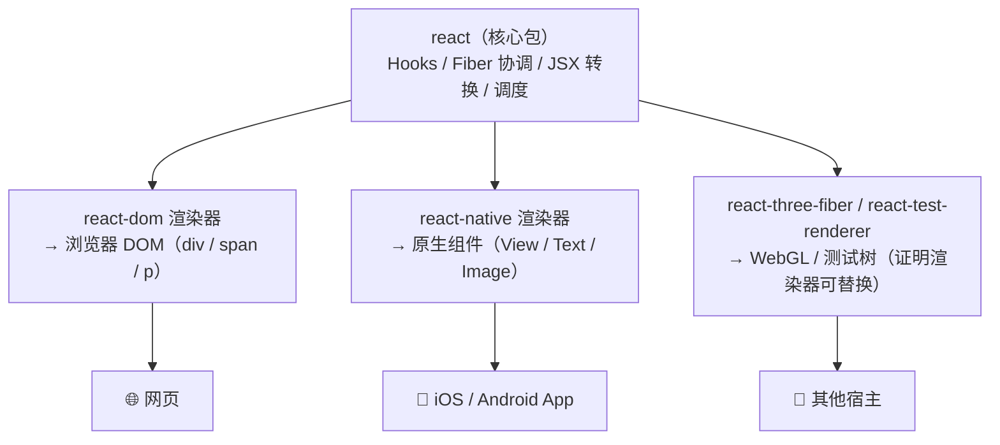
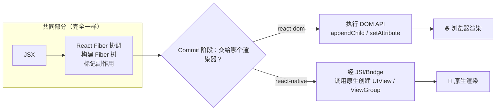

# React Native vs React：主要区别全解

> **一句话结论**：React 不是「一个框架」，而是「**核心 + 可替换渲染器**」的架构。`react` 包提供核心（Hooks / Fiber / 协调 / JSX），`react-dom` 把它接到浏览器，`react-native` 把它接到原生组件。**所以「RN 和 React 的区别」本质是「`react-native` 渲染器 vs `react-dom` 渲染器的区别」**——核心层完全一样。

## 一、先看架构：同一个核心，不同的出口



**为什么这张图是理解一切的钥匙**：

- `import { useState } from 'react'` —— 这行代码在 Web 和 RN 里**一模一样**，因为用的是同一个核心包。
- `import { render } from 'react-dom'` vs `import { AppRegistry } from 'react-native'` —— 只有「**把树渲染到哪**」不同。
- 这也是为什么 `react-three-fiber`（渲染到 WebGL）能存在：**只要换一个渲染器，React 就能渲染到任何地方**。

## 二、全维度对照表（先记这张）

| 维度 | React（Web / DOM） | React Native |
| --- | --- | --- |
| **渲染目标** | 浏览器 DOM 节点 | 原生 UI 组件（UIView / ViewGroup） |
| **基础标签** | `div` `span` `p` `img` `button` | `View` `Text` `Image` `TouchableOpacity` |
| **样式写法** | CSS 文件 / `className` / 内联对象 | `StyleSheet.create` / 内联对象，**无 CSS 文件** |
| **样式单位** | `px` `%` `rem` `vw` 多种 | **只有数字**（逻辑像素 dp），无 `px` |
| **布局默认** | `flexDirection: row`，需手写 `display:flex` | `flexDirection: column`，**默认就是 flex** |
| **事件** | `onClick` `onMouseEnter`（鼠标） | `onPress` `onTouchStart`（触摸，**无 hover**） |
| **文本规则** | 文字可写在任意标签里 | **文字必须包在 `<Text>` 内**，否则报错 |
| **路由** | `react-router`（基于 URL / History） | `react-navigation`（基于**栈**，无 URL） |
| **运行环境** | 浏览器，有 `window` / `document` / `localStorage` | **无 DOM/BOM**，靠原生模块访问系统能力 |
| **本地存储** | `localStorage`（同步） | `AsyncStorage`（**异步**） |
| **JS 引擎** | V8（浏览器） | Hermes / JSC |
| **打包器** | Webpack / Vite | Metro |

## 三、关键差异的最小 Demo（一看就懂）

### 1. 标签 + 文本：最直观的差异

```tsx
// ❗ React DOM：HTML 标签，文字随便写
<div className="card">
  <p>你好</p>               {/* 文字直接放 p 里 */}
  
  <button onClick={fn}>点我</button>
</div>
```

```tsx
// ❗ React Native：原生组件，文字必须包在 <Text> 里
<View style={styles.card}>
  <Text>你好</Text>          {/* ✅ 文字必须放 Text 里 */}
  <Image source={require('./logo.png')} />
  <TouchableOpacity onPress={fn}>   {/* 没有原生 button，用可点击容器 */}
    <Text>点我</Text>
  </TouchableOpacity>
</View>
```

**两个必踩坑**：
1. RN 里 `<View>你好</View>` 会**报错**——裸文字非法，必须 `<Text>你好</Text>`。
2. RN 没有原生 `<button>` 能直接放文字，通常用 `TouchableOpacity` / `Pressable` 包裹。

### 2. 样式：从 CSS 到 StyleSheet

```tsx
// ❗ React DOM：CSS 文件 + 选择器 + 多单位
// styles.css:  .card { padding: 16px; font-size: 14px; color: red; }
<div className="card" style={{ margin: '8px' }}>...</div>
```

```tsx
// ❗ React Native：只有数字单位，用 StyleSheet.create 提升性能
import { StyleSheet } from 'react-native';

const styles = StyleSheet.create({
  card: { padding: 16, fontSize: 14, color: 'red' },  // 数字，无 px
});

<View style={[styles.card, { margin: 8 }]}>...</View>  // 数组可合并样式
```

**关键差异**：
- RN **没有 CSS 文件、没有选择器、没有伪类**（`:hover` 不存在），样式都是 JS 对象。
- 单位只有数字（`padding: 16` 而非 `16px`），百分比仅 `width/height` 等少数属性支持（`'50%'`）。
- `StyleSheet.create` 会把样式转成内部 ID 引用，比每次新建对象**性能更好**。

### 3. 事件：从鼠标到触摸

```tsx
// ❗ React DOM：鼠标事件丰富
<div onClick={fn} onMouseEnter={fn} onMouseLeave={fn}>
```

```tsx
// ❗ React Native：触摸事件为主，没有鼠标悬停
<View onTouchStart={fn} onTouchEnd={fn}>
<TouchableOpacity onPress={fn} onLongPress={fn}>  {/* 移动端交互主力 */}
```

**关键差异**：移动端**没有 hover**，所以 `onMouseEnter/Leave` 在 RN 里不存在；复杂手势用 `PanResponder` 或 `react-native-gesture-handler`。

## 四、底层渲染流程对比（进阶，面试追问用）



| 阶段 | react-dom 做的事 | react-native 做的事 |
| --- | --- | --- |
| JSX → 虚拟节点 | `{type:'div', props}` | `{type:'View', props}`（**结构相同，仅 type 不同**） |
| Fiber 协调 | **完全相同**：可中断遍历、diff、副作用标记 | **完全相同** |
| Commit 提交 | 调 DOM API（`createElement` 等） | 调原生 API，创建/更新原生组件 |
| `stateNode` 指向 | 浏览器 DOM 元素 | 原生组件的**句柄（handle）** |

> 📌 **精髓**：协调逻辑（diff、调度、副作用）是核心层共享的，**只有最后「commit 到哪」不同**。这也是 React 能跨端的理论基础。

## 五、千万别忽略的：哪些是**一样**的

容易答漏——面试官常追问「那 RN 和 React 有什么**相同**」：

| 完全通用 | 说明 |
| --- | --- |
| **Hooks 全家桶** | `useState` `useEffect` `useMemo` `useRef` `useContext` 写法完全一致 |
| **JSX 语法** | 一模一样 |
| **协调机制** | Fiber 树、diff 算法、副作用标记，**同一套代码** |
| **状态管理库** | Redux / Zustand / Jotai 都能直接用 |
| **自定义 Hook** | 业务 Hook 可在 Web 和 RN 间复用 |

```tsx
// 这段代码在 React 和 RN 里行为完全一致（只要不碰 UI 标签）
function useCounter(initial = 0) {
  const [count, setCount] = useState(initial);
  const inc = useCallback(() => setCount(c => c + 1), []);
  useEffect(() => console.log('count:', count), [count]);
  return { count, inc };
}
```

> 这就是「**核心层复用**」的价值：业务逻辑、Hook、状态管理可跨 Web 和 RN 共享，只有**视图层**要分别写。

## 六、一句话速记

> **React 是核心，渲染器是出口**：Web 用 `react-dom` 画 DOM，移动端用 `react-native` 画原生组件。标签、样式、事件、路由、运行环境全不同；但 Hooks、JSX、Fiber 协调、状态库全相同。

---

**相关阅读**：
- RN 底层机制（Bridge / Fabric / Shadow Tree）：[[编译原理]]、[[运行流程]]（`跨端与多媒体/跨端/RN/`）
- RN 面试题与性能优化 demo：[[常见面试题与demo]]（`跨端与多媒体/跨端/RN/常见面试题与demo.md`）
```
