# React Native 常见面试题与 Demo

> 面试向笔记：每题先给**一句话结论**，再给**图例/最小 demo**，最后补**踩坑点**。
> 底层机制（Bridge / Fabric / TurboModules / Shadow Tree）详见同目录 [[编译原理]] 与 [[运行流程]]，本文聚焦「**怎么答 + 怎么写**」。

---

## 目录

| 类别 | 题目 |
| --- | --- |
| [架构原理](#1-架构原理) | RN 为什么能跨平台？Bridge 的本质是什么？新旧架构差在哪？ |
| [性能优化](#2-性能优化) | 列表卡顿怎么排查？动画掉帧怎么办？`useNativeDriver` 是什么？ |
| [JS/原生通信](#3-js原生通信) | 如何调原生模块？JSI 是什么？同步调用怎么实现？ |
| [组件与布局](#4-组件与布局) | Flex 布局方向和 Web 有何不同？`FlatList` vs `ScrollView`？ |
| [工程与生态](#5-工程与生态) | Metro vs Webpack？热更新怎么做？Hermes 比 JSC 强在哪？ |

---

## 0. 前置概念：Shadow Tree 与 Yoga（地基，先看这个）

后面会反复出现这两个词，它们是理解整个渲染管线和 `useNativeDriver` 限制的基石。

### Shadow Tree（影子树）——「没填坐标的建筑图纸」

**本质**：一棵纯 JS 数据对象组成的树，**镜像**你的组件树。每个节点（Shadow Node）装着：类型（View/Text）、props、**样式规则**（flex:1、margin）、子节点——但**没有算好的位置**。

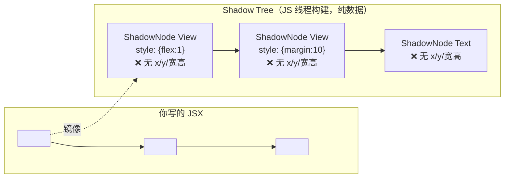

**为什么叫「Shadow（影子）」**：它是真实原生 UI 的「影子」——JS 操纵这棵轻量数据树，**不直接碰真实原生视图**。「有这些房间、用 flex 怎么排」写好了，但每个房间具体在哪还没算。

### Yoga ——「填坐标的测量员」

**本质**：Meta 用 **C++** 写的跨平台 Flexbox 布局引擎。吃进 Shadow Tree（结构 + flexbox 规则），吐出**每个节点的最终 x/y/宽/高**。

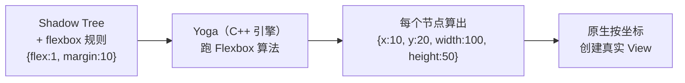

**为什么用 Yoga（关键价值）**：同一套 C++ 算法在 iOS（YogaKit）/Android/Windows 跑完全相同——保证「**同一份样式，三端像素级一致**」。若各端用自己的布局算法，跨平台就会出现「这边正常那边歪」。

### 它俩就是「渲染第①步 Layout」的全部

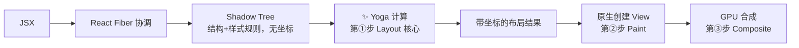

> 📌 **回扣 `useNativeDriver` 限制**：Shadow Tree + Yoga 都归 **JS 线程**。改 `width` 要重跑 Yoga 重排 → 要 JS → ❌；改 `opacity` 跳过第①步只在第③步合成 → 不用 Yoga 不用 JS → ✅。

---

## 1. 架构原理

### Q1.1 RN 为什么能跨平台？一条 React 代码到屏幕像素的路径

**结论**：RN 用「**一套 JS 逻辑 + 平台各自的原生渲染**」换跨平台——JS 只生成**界面描述（Shadow Tree）**，真正画像素的是各平台原生组件，所以既不是 WebView 也不是编译成原生代码。

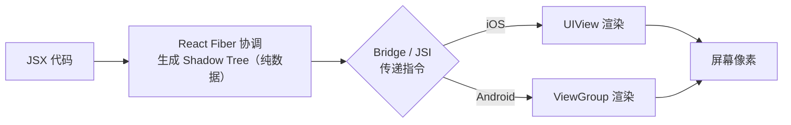

**关键对比**（一句话记忆）：

| 维度 | Cordova/WebView | **RN** | Flutter |
| --- | --- | --- | --- |
| 渲染主体 | WebView 画 HTML | **原生组件**画像素 | Skia 自绘 |
| 产物 | 套壳网页 | **原生 UI** | 自绘 UI |

> 详见 [rn和react对比](../../前端框架/react/React原理/rn和react对比.md)：React DOM 的 `stateNode` 指向 DOM 元素，RN 的 `stateNode` 指向**原生组件句柄**。

---

### Q1.2 Bridge 的本质是什么？为什么说它是性能瓶颈？

**结论**：Bridge 是一条**异步、单线程、JSON 序列化**的消息队列——所有 JS↔原生数据都要「打包成 JSON 字符串 → 排队 → 对端解析」，大数据或高频通信会被它卡住。

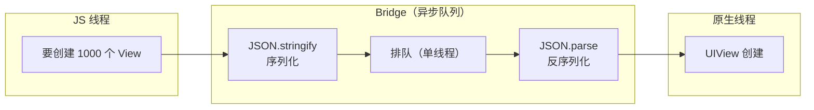

**三个性能痛点**：

1. **异步**：JS 调原生拿不到同步返回值（旧架构），只能用回调/Promise。
2. **序列化开销**：传一张图片要 `JSON.stringify`，大对象慢且占内存。
3. **单队列瓶颈**：所有模块（UI/网络/动画）挤一条队列，一个堵全堵。

**新架构怎么解（面试高频追问）**：

| 旧架构（Bridge） | 新架构 | 解决了什么 |
| --- | --- | --- |
| 异步 + JSON 序列化 | **JSI**（JS 直接持有 C++ 对象指针） | 可同步调用、零序列化 |
| UI 走队列异步渲染 | **Fabric**（新渲染器） | 渲染可同步、可并发 |
| 原生模块全量加载 | **TurboModules** | 按需懒加载 |

> 📌 一句话答面试官：「Bridge 本质是一条异步 JSON 消息队列，是旧架构的性能瓶颈；新架构用 JSI 让 JS 直接调 C++，省掉序列化还能同步，配合 Fabric/TurboModules 重构了渲染和模块加载。」

---

## 2. 性能优化

### Q2.1 列表卡顿怎么排查和优化？（FlatList 高频题）

**结论**：列表卡顿 90% 是「**渲染太多 + 主线程忙**」，核心手段是 `getItemLayout`、`keyExtractor`、`removeClippedSubviews`，以及**避免 `renderItem` 里写内联函数/复杂对象**。

**最小可运行 demo**（性能优化前后对比）：

```tsx
// ❌ 反面：每次 render 都新建函数 + 内联对象，触发额外重渲染
<FlatList
  data={data}
  renderItem={({ item }) => (
    <View style={{ padding: 10, backgroundColor: '#f5f5f5' }}>  {/* 内联对象：每次新建 */}
      <Text onPress={() => handleClick(item.id)}>{item.title}</Text> {/* 内联函数：每次新建 */}
    </View>
  )}
/>
```

```tsx
// ✅ 正面：函数/样式抽出，列表项独立成组件 + memo
import { memo, useCallback } from 'react';
import { FlatList, View, Text, StyleSheet } from 'react-native';

// 1) 列表项独立 + memo：props 不变就不重渲染
const ListItem = memo(function ListItem({
  item,
  onPress,
}: {
  item: { id: string; title: string };
  onPress: (id: string) => void;
}) {
  return (
    <View style={styles.item}>
      <Text onPress={() => onPress(item.id)}>{item.title}</Text>
    </View>
  );
});

// 2) 样式预定义：避免每次 render 新建对象
const styles = StyleSheet.create({
  item: { padding: 10, backgroundColor: '#f5f5f5' },
});

export function OptimalList({ data }: { data: Array<{ id: string; title: string }> }) {
  // 3) 回调稳定化：用 useCallback 避免每次 render 新建函数
  const handlePress = useCallback((id: string) => {
    console.log('click', id);
  }, []);

  return (
    <FlatList
      data={data}
      // 4) 必填且稳定：避免用 index 做 key 导致重排时全量重渲染
      keyExtractor={(item) => item.id}
      renderItem={({ item }) => <ListItem item={item} onPress={handlePress} />}
      // 5) 固定行高时必开：跳过测量，直接滚动到任意位置
      getItemLayout={(_, index) => ({
        length: 44,   // 行高
        offset: 44 * index,
        index,
      })}
      // 6) 长列表建议开启：卸载屏幕外的不可见视图
      removeClippedSubviews
      // 7) 控制每次渲染的批量大小，减少单帧压力
      maxToRenderPerBatch={10}
      windowSize={5}
    />
  );
}
```

**口诀**：`keyExtractor` 必填 → 列表项 `memo` → 函数 `useCallback` → 样式 `StyleSheet.create` → 定高开 `getItemLayout`。

---

### Q2.2 动画掉帧怎么办？`useNativeDriver` 是什么？

**结论**：动画掉帧多半因为「动画计算跑在 **JS 线程**，而 JS 线程被业务逻辑阻塞」。`useNativeDriver: true` 把动画的**数值计算整体交给原生线程**，JS 线程再卡也不影响动画流畅度。

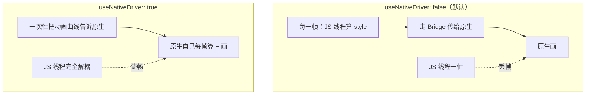

**最小 demo**：

```tsx
import { useRef } from 'react';
import { Animated, View, StyleSheet, Easing } from 'react-native';

export function FadeInBox() {
  // 初始透明度 0
  const opacity = useRef(new Animated.Value(0)).current;

  const start = () => {
    Animated.timing(opacity, {
      toValue: 1,
      duration: 1000,
      easing: Easing.ease,
      useNativeDriver: true, // ✅ 关键：动画跑在原生线程
    }).start();
  };

  return (
    <>
      <Animated.View style={[styles.box, { opacity }]} />
      <View style={styles.btn} onTouchStart={start} />
    </>
  );
}

const styles = StyleSheet.create({
  box: { width: 100, height: 100, backgroundColor: 'tomato' },
  btn: { width: 100, height: 40, backgroundColor: '#eee', marginTop: 10 },
});
```

**限制（必背踩坑）**：`useNativeDriver: true` **只能驱动非布局属性**——`opacity`、`transform`（translate/scale/rotate）可以；`width`、`height`、`backgroundColor`、`flex` **不行**。

#### 先破除一个误解：UI 不都交给原生了吗，关 JS 什么事？

很多人卡在这里：「UI 不都是原生渲染的么？为什么改个 width 还扯到 JS？」

**关键**：「原生渲染」不是一个动作，而是一条**三步管线**，其中**第一步就跟 JS 强绑定**：

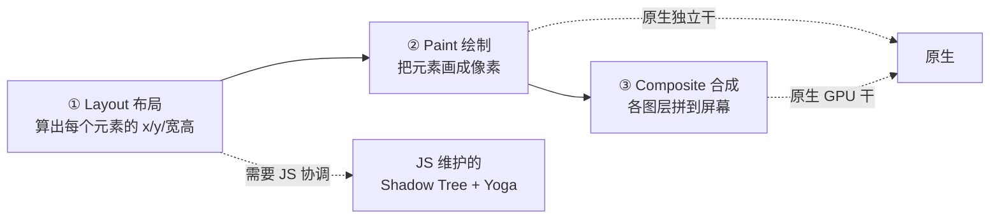

| 步骤 | 干什么 | 谁负责 |
| --- | --- | --- |
| ① **Layout 布局** | 算出「这个 View 应该在 x=10, y=20, 宽=100」 | **需要 JS**（结构归 JS 的 Shadow Tree 管） |
| ② Paint 绘制 | 按算好的位置把元素画出来 | 原生 |
| ③ Composite 合成 | 把各图层叠到屏幕上 | 原生 GPU |

> 所以严格讲，是「**②③由原生干，但①要听 JS 的**」——原生只是执行者，**界面结构（Shadow Tree）是 JS 线程维护的**，原生自己不知道「界面该长什么样」。

**比喻（最好记）**：原生是「**听话但不会自己规划的施工队**」，JS 是「**设计师**」。设计师画图纸（Shadow Tree）+ 算每面墙位置（Yoga），施工队按图施工。只「刷层漆/贴张膜」施工队自己能干（opacity/transform）；要「加高/挪墙」会影响别的墙，必须设计师重画图纸重算位置（width/flex）。

#### 为什么有这个限制？（面试必答的「原因」）

**根本前提**：`useNativeDriver: true` 意味着动画**开始后，每一帧都由原生线程独立计算和渲染，JS 线程完全不参与**。所以一个属性能不能用，取决于一个问题——「**改它，会不会触发第①步 Layout？触发了就需要 JS，原生就干不了。**」

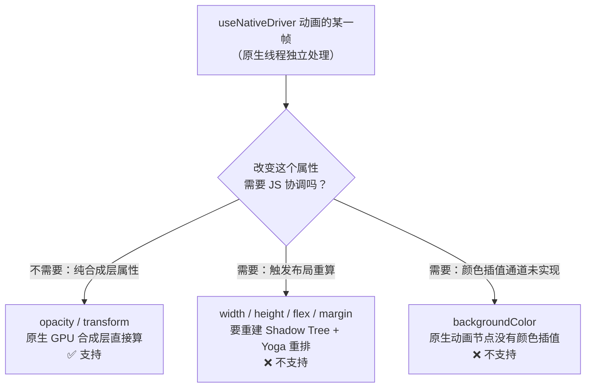

**按属性类型分原因**：

| 属性类型 | 代表 | 原生能独立完成吗 | 根本原因 |
| --- | --- | --- | --- |
| **纯合成/绘制属性** | `opacity`、`transform` | ✅ 能 | 改了**不触发布局**——视图位置、大小、周围节点都不变。原生只需在 **GPU 合成层**做矩阵变换（transform）或 alpha 混合（opacity），属于渲染管线**最后一步**，无需 JS 介入 |
| **布局属性** | `width`、`height`、`flex`、`margin` | ❌ 不能 | 改了会**触发整棵子树重新布局**：自己的尺寸变 → 兄弟节点位移 → 父容器可能变。这需要更新 **Shadow Tree** 并调用 **Yoga** 重新计算，而 Shadow Tree 归属 **JS 线程协调**，原生无法独立决定重排结果 |
| **颜色属性** | `backgroundColor` | ❌ 不能（旧架构） | 本身只**重绘不布局**，但 RN 的原生动画节点系统**没有实现颜色插值通道**——它只能插值数字并绑定到少数合成属性。颜色更新只能走常规 `setProps`（经 Bridge/JSI 回 JS），无法被原生驱动器接管 |

> 📌 **一句话记忆**：`useNativeDriver` 要求「**原生全程自己干、JS 不参与**」。只有**不碰布局、能纯 GPU 合成**的属性（opacity/transform）原生才干得了；凡是改动会牵连布局重排的，都得 JS 介入协调，原生干不了。

> 💡 **追问「那想驱动颜色/尺寸动画怎么办」**：用 `react-native-reanimated` 的 **worklet**——它把动画逻辑当成轻量函数**直接跑在原生 UI 线程**，能驱动几乎所有属性，是 `useNativeDriver` 的进阶替代方案。

---

## 3. JS/原生通信

### Q3.1 RN 怎么调用原生模块/原生 UI 组件？

**结论**：分两类——**原生模块（Native Module）**调能力（如震动、Toast），**原生 UI 组件（Native Component）**嵌视图（如地图）。旧架构都要走 Bridge，新架构（TurboModules）走 JSI 更快。

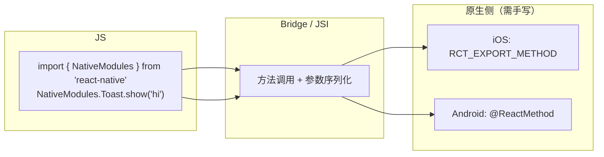

**最小 demo（JS 侧调用）**：

```tsx
import { NativeModules, Platform } from 'react-native';

// 假设原生侧已实现 Toast 模块（iOS 用 RCT_EXPORT_METHOD，Android 用 @ReactMethod）
const { Toast } = NativeModules;

export function showToast(msg: string) {
  if (!Toast) {
    // 兜底：原生模块未注册时不崩溃
    console.warn('Toast module not found');
    return;
  }
  // 平台差异：iOS/Android 可能签名不同，用 Platform 分流
  if (Platform.OS === 'ios') {
    Toast.show(msg, 1.5); // (message, duration)
  } else {
    Toast.show(msg, Toast.SHORT); // Android 常用常量
  }
}
```

> 原生侧实现（iOS Objective-C / Android Kotlin）较冗长，面试重点掌握「**JS 怎么调 + 调用是异步的 + 走 Bridge**」即可；动手实现可查官方 Native Modules 文档。

---

### Q3.2 JSI 是什么？为什么是新架构的核心？

**结论**：JSI（JavaScript Interface）是 **JS 引擎与 C++ 之间的直接绑定层**——让 JS 代码**直接持有 C++ 对象引用并同步调用**，不再经过 Bridge 的 JSON 序列化，是新架构能「同步、高性能」的根本。

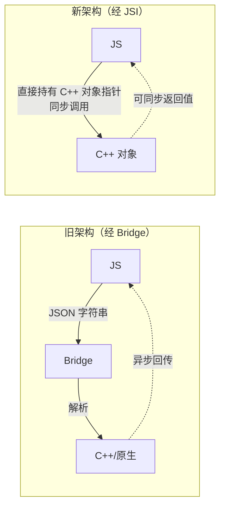

**JSI 的三个意义**（面试记忆点）：

1. **同步调用**：可以像普通 JS 函数一样 `const v = native.getSync()`，立即拿返回值。
2. **零序列化**：直接操作内存对象，传大数据（如图片 Buffer）不再 `JSON.stringify`。
3. **引擎无关**：JSC、Hermes、V8 都能接入（因为 JSI 抽象了引擎层）。

> 📌 追问「JSI 和 Bridge 区别」时答：Bridge 是异步 JSON 消息队列，JSI 是 JS↔C++ 的直接同步绑定，省掉了序列化和异步等待。

---

## 4. 组件与布局

### Q4.1 RN 的 Flex 布局和 Web CSS Flex 有何不同？（高频踩坑）

**结论**：默认值不同——RN 中 `flexDirection` 默认是 **`column`**（Web 是 `row`），且默认 `display: flex`（无需手写），布局引擎统一是 **Yoga**（跨平台 C++ 实现）。

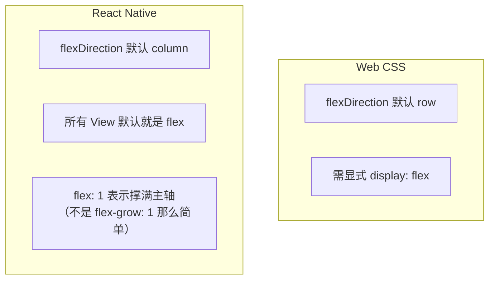

**对照表（必背差异）**：

| 点 | Web CSS | React Native |
| --- | --- | --- |
| `flexDirection` 默认 | `row` | **`column`** |
| `display` | 需写 `flex`/`block` | **默认 flex** |
| `flex: 1` | `flex-grow:1; flex-shrink:1; flex-basis:0` | **撑满主轴剩余空间** |
| 单位 | `px`/`%`/`rem`/`vw` | **只有数字（逻辑像素 dp）** |
| 盒模型 | `content-box`/`border-box` | 默认 `border-box` |

**最小 demo（典型 RN 布局：垂直排列 + 一个撑满）**：

```tsx
import { View, Text, StyleSheet } from 'react-native';

export function LayoutDemo() {
  return (
    <View style={styles.container}>
      <Text style={styles.header}>Header（固定高）</Text>
      {/* flex: 1 → 撑满剩余高度，因为主轴是垂直方向 */}
      <View style={styles.content}>
        <Text>Content（撑满中间）</Text>
      </View>
      <Text style={styles.footer}>Footer（固定高）</Text>
    </View>
  );
}

const styles = StyleSheet.create({
  container: { flex: 1 }, // 根容器撑满整个屏幕
  header: { height: 60, backgroundColor: '#eee', textAlign: 'center' },
  content: { flex: 1, backgroundColor: '#fafafa', justifyContent: 'center', alignItems: 'center' },
  footer: { height: 50, backgroundColor: '#eee', textAlign: 'center' },
});
```

---

### Q4.2 `FlatList` vs `ScrollView` 怎么选？

**结论**：数据少且全展示用 **`ScrollView`**（一次性全渲染）；长列表用 **`FlatList`**（视口内才渲染、滚动复用），错用 `ScrollView` 装大列表 = 卡顿 + OOM。

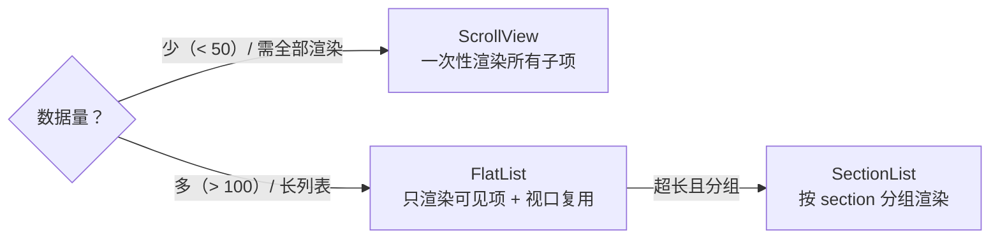

**对照表**：

| 维度 | ScrollView | FlatList |
| --- | --- | --- |
| 渲染策略 | **全量**渲染所有子组件 | **视口内**才渲染（虚拟化） |
| 内存占用 | 随数据线性增长（易 OOM） | 恒定（只持有可见项） |
| 适用场景 | 表单/短列表/轮播 | 长列表/信息流/通讯录 |
| `getItemLayout` | 无 | **有**（性能关键） |

---

## 5. 工程与生态

### Q5.1 Hermes 是什么？为什么 RN 默认用它？

**结论**：Hermes 是 Meta 为 RN 自研的 **JS 引擎**，针对移动端优化——预编译成**字节码**（启动快）、**内存占用低**，现已替代 JSC 成为 Android 默认引擎。

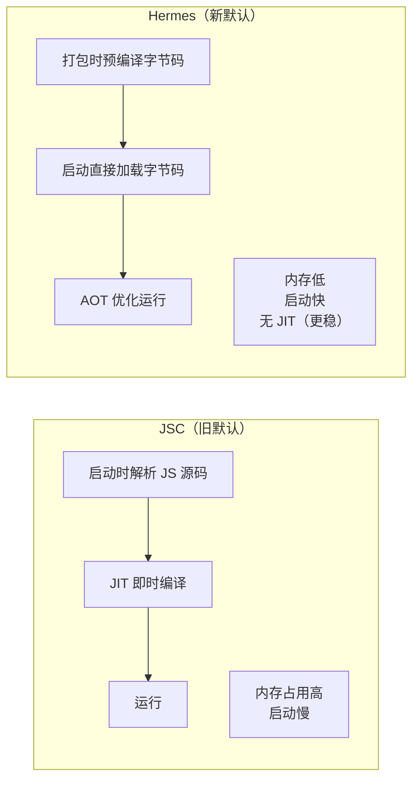

**三个优势**（面试记忆）：

1. **启动快**：JS 提前编译成字节码，跳过运行时解析。
2. **内存低**：针对移动端内存模型重写。
3. **调试友好**：自带 Chrome DevTools 集成 + crash 日志可读。

---

### Q5.2 Metro vs Webpack？RN 为什么不用 Webpack？

**结论**：Metro 是 RN 官方打包器，为**移动端场景定制**——重点是「**快速启动、增量打包、支持热更新 bundle**」，而 Webpack 是为浏览器生态设计，配置灵活但重，不适合 RN 的开发体验。

| 维度 | Metro | Webpack |
| --- | --- | --- |
| 设计目标 | **RN/移动端**开发体验 | 通用 Web 打包 |
| 核心能力 | 快速启动 + 增量打包 + bundle 热更 | 插件生态丰富、配置灵活 |
| 配置复杂度 | 开箱即用 | 高（loader/plugin 链） |
| 是否默认 | **RN 默认** | 非 RN 场景 |

> 追问「热更新」：生产环境 JS 打成 `bundle` 文件随安装包发布；热更新（如 CodePush）的原理就是**替换这个 bundle 文件**，无需应用商店审核。详见 [[运行流程]] 的「热更新/调试的特殊流程」。

---

## 附：高频追问速答表

| 追问 | 一句话答 |
| --- | --- |
| RN 能用浏览器 DOM API 吗？ | 不能，没有 `document`/`window`，只能用 RN 组件（`View`/`Text`）。 |
| RN 的 `style` 和 Web 的有啥不同？ | 用 `StyleSheet.create`（性能更好、可跨平台），样式不全局、无 CSS 选择器。 |
| 为什么 `useState` 更新后 UI 没立刻变？ | 和 React Web 一样是异步批量更新，不是 RN 特有问题。 |
| 怎么做跨平台样式差异？ | `Platform.OS === 'ios'` 分流，或 `Platform.select({ ios, android })`。 |
| 新架构怎么开启？ | 新建项目默认开启；老项目升级需 `rn-new-architecture-enable`。 |

---

## 学习建议

1. **先吃透原理**（[[编译原理]] + [[运行流程]]），面试题只是对原理的「换角度问」。
2. **demo 本地跑**：用 `pnpm dlx react-native@latest init MyApp --template react-native-template-typescript` 建项目，把上面的 demo 贴进去运行验证。
3. **性能优化是面试重区**：Q2.1（FlatList）和 Q2.2（动画）几乎必问，务必能写出带 `memo`/`useCallback`/`useNativeDriver` 的完整代码。
```
