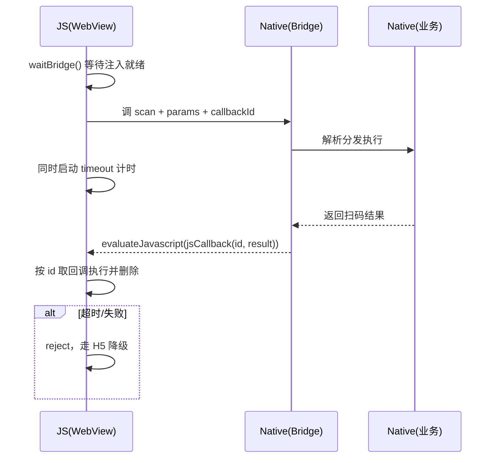

# Hybrid H5 与原生交互常见坑

**一句话总结**：坑集中在三类——**异步回调**（注入时序、回调丢失、无超时）、**参数传递**（类型限制、转义编码、大数据）、**多端兼容**（API 差异、重复注册、无 Bridge 环境降级）。

基础通信机制见 [JSBridge 通信原理](./jsbridge通信原理.md)，本文只讲踩坑点。

## 总览

| 类别 | 典型坑 | 核心解法 |
| --- | --- | --- |
| 异步回调 | 注入时序、回调丢失、无超时 | 就绪等待、事件订阅替代内存 map、timeout 兜底 |
| 参数传递 | 类型限制、转义错误、大数据卡顿 | 统一 JSON 协议、encodeURIComponent、临时文件 |
| 多端兼容 | 双端 API 差异、handler 重复注册、无 Bridge 环境 | 统一 SDK 封装、add/remove 成对、能力检测降级 |

## 一、异步回调

### 坑 1：Bridge 未注入就调用

**现象**：页面 JS 一执行就调 `window.JSBridge.xxx`，报 `undefined`。iOS WKWebView 的脚本注入时机晚于页面 JS 执行，竞态必现。

**解法**：JS 侧等待就绪（轮询或监听事件），Native 侧注入完成后主动通知。

```javascript
// 方式 1：轮询 + 超时
function waitBridge(timeout = 3000) {
    return new Promise((resolve, reject) => {
        const start = Date.now();
        (function check() {
            if (window.JSBridge) return resolve(window.JSBridge);
            if (Date.now() - start > timeout) return reject(new Error('bridge 注入超时'));
            setTimeout(check, 50);
        })();
    });
}

// 方式 2：Native 注入完成后 evaluateJavascript 通知
window.addEventListener('bridgeReady', () => init(), { once: true });
```

方式 2 需要 Native 配合：注入完成后主动执行一段派发事件的 JS。

```java
// Android：在页面加载完成、bridge 注入完成后调用
webView.evaluateJavascript(
    "window.dispatchEvent(new Event('bridgeReady'))",
    null
);
```

```swift
// iOS：WKWebView 注入完成后调用（主线程）
webView.evaluateJavaScript("window.dispatchEvent(new Event('bridgeReady'))")
```

**注意时序**：若 Native 在页面 JS 执行 `addEventListener` **之前**就派发了事件，事件会丢。稳妥做法是两端都做——JS 先挂监听再轮询兜底，Native 在 `onPageFinished` / `didFinish navigation` 之后延迟派发。

### 坑 2：页面刷新后回调丢失

**现象**：`callbackMap` 存在 JS 内存里，页面刷新/跳转后 map 清空；Native 拿着旧 callbackId 回调，无人接收。

**解法**：

- 页面存活期间的一次性调用：正常用 callbackId，用完即删
- 跨页面/持久订阅：回调标识改用**业务事件名**（订阅-发布模式），Native 按事件名派发，不依赖 JS 内存

### 坑 3：无超时导致无限等待

**现象**：Native 处理失败或方法未注册，JS 侧 Promise 永远 pending，Loading 转圈不止。

**解法**：所有 bridge 调用加超时，超时走错误分支。

```javascript
function callNative(method, params, timeout = 5000) {
    return Promise.race([
        bridge.call(method, params),
        new Promise((_, reject) =>
            setTimeout(() => reject(new Error(`${method} 调用超时`)), timeout)
        ),
    ]);
}
```

### 完整时序（以一次扫码调用为例）



## 二、参数传递

### 坑 1：各通道类型限制不同

| 通道 | 限制 |
| --- | --- |
| URL Scheme | 只能传字符串，长度受限，大数据易被截断 |
| Android addJavascriptInterface | 方法参数只能是基本类型，复杂对象需 JSON.stringify |
| iOS postMessage | 参数转 WKScriptMessage.body，`undefined`/函数/Date 会丢失或变形 |

**解法**：约定统一消息协议——一切参数整体 `JSON.stringify` 成字符串传输，双端对称解析。

### 坑 2：转义与编码错误

**现象**：JSON 里的引号、换行直接拼进 URL 或 JS 字符串，Native 解析失败；中文/emoji 未编码出现乱码。

**解法**：

- 拼 URL：`encodeURIComponent(JSON.stringify(params))`
- Native 拼 JS 代码：不要手拼引号，让序列化库生成完整参数

```java
// Android 反例：params 含单引号即语法错误，还有注入风险
String js = "window.onCallback('" + params + "')";

// 正例：整体由 JSON 序列化生成，天然带转义
String js = "window.onCallback(" + gson.toJson(paramsObj) + ")";
webView.evaluateJavascript(js, null);
```

### 坑 3：大数据走 Bridge 卡主线程

**现象**：base64 图片、长列表 JSON 走 bridge 字符串传输，序列化 + 跨端拷贝卡顿，甚至被截断。

**解法**：大数据不走 bridge——Native 写临时文件或共享存储，bridge 只传路径/key；必要时分片传输。

## 三、多端兼容

### 坑 1：双端 API 完全不同

| 能力 | Android | iOS(WKWebView) |
| --- | --- | --- |
| JS → Native | `addJavascriptInterface` 注入对象 | `messageHandlers.xxx.postMessage` |
| Native → JS | `evaluateJavascript` | `evaluateJavaScript` |

**解法**：前端封装统一 SDK，按 UA 分发到不同实现，业务层无感知。

```javascript
const ua = navigator.userAgent;
const isAndroid = /Android/.test(ua);
const isIOS = /iPhone|iPad/.test(ua);

function callNative(method, params, callbackId) {
    if (isAndroid) {
        window.JSBridge.callNative(method, JSON.stringify(params), callbackId);
    } else if (isIOS) {
        window.webkit.messageHandlers.jsBridge.postMessage({ method, params, callbackId });
    } else {
        fallback(method, params); // 纯浏览器环境降级
    }
}
```

### 坑 2：iOS handler 重复注册

**现象**：WKWebView 每次 `add(scriptMessageHandler:)` 都会强持有 handler，页面刷新后重复 add → 内存泄漏甚至崩溃。

**解法**：`add`/`remove` 成对出现；用 weak 代理对象打破对 ViewController 的循环引用。

### 坑 3：无 Bridge 环境未降级

**现象**：H5 被分享到微信/第三方浏览器打开，`window.JSBridge` 不存在，页面白屏或按钮点击无响应。

**解法**：能力检测 + 降级链——原生能力不可用时降级 H5 实现（扫码→上传图片、支付→跳收银台页），再不行引导"在 App 内打开"。

```javascript
function scan() {
    const inApp = window.JSBridge || window.webkit?.messageHandlers?.jsBridge;
    if (inApp) return callNative('scan', {});
    location.href = '/h5/scan-fallback';
}
```

### 坑 4：联调调试困难

双端日志割裂、真机上看不到 H5 报错。

**解法**：H5 内嵌 vConsole/Eruda 收集端上日志；Native 通过 bridge 暴露日志通道，把 `console` 转发到 Native 日志统一排查。

## 总结

> 异步回调坑在**时序与丢失**（等注入、事件订阅、加超时）；参数坑在**序列化与转义**（统一 JSON 协议、编码、大数据走文件）；多端坑在**差异与降级**（统一 SDK 封装、成对注册、能力检测降级）。
