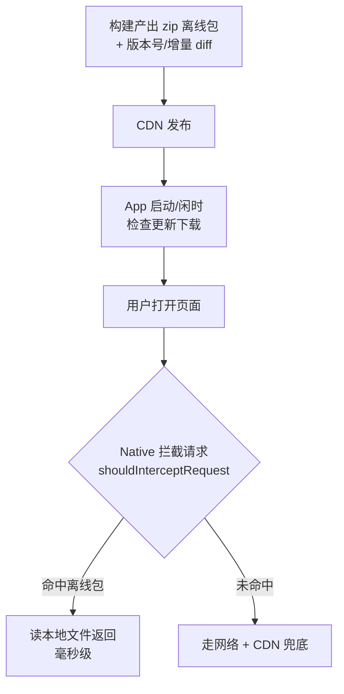

# Hybrid 页面性能优化

**一句话总结**：Hybrid 页面 = **通用 Web 优化全都要做**，再叠加三类端上独有的手段——**容器预建**（WebView 池）、**离线包**（资源本地化）、**端能力替代**（原生渲染/导航/图片库）；核心差异是 Hybrid 有客户端这个"队友"，可以优化浏览器控制不了的部分。

通用 Web 优化（网络链路、资源体积、关键渲染路径）见 [首屏性能优化](../../../性能与浏览器/性能优化/首屏性能优化.md)、[优化资源加载](../../../性能与浏览器/性能优化/优化方法/优化资源加载.md)，本文不重复，聚焦 Hybrid 特有部分。

## 一、Hybrid 页面的耗时模型

先看时间花在哪，才知道 Hybrid 独有优化点在哪：


标黄的两段是 Hybrid 与纯 Web 的分水岭：

- **WebView 创建**：纯 Web 浏览器打开页面时容器已就绪；Hybrid 每次新建 WebView 要初始化内核（首次 300ms+），这是纯 Web 不存在的开销
- **资源加载**：纯 Web 只能靠 CDN + 缓存；Hybrid 可以让客户端**提前把资源放到本地**，直接消灭网络段

## 二、Hybrid 特有优化手段

### 1. 容器层：WebView 预建池

**问题**：WebView 创建 + 内核初始化耗时（首次尤其慢），用户点击后才初始化，白屏时间被拉长。

**方案**：App 启动时预建 N 个 WebView 放入池中，用 `loadUrl("about:blank")` 保持温热；进入页面时取出来直接加载真实 URL，用完归还。

```java
// Android：启动时预热
public class WebViewPool {
    private final Queue<WebView> pool = new LinkedList<>();

    public void preload(Context ctx, int count) {
        for (int i = 0; i < count; i++) {
            WebView wv = new WebView(ctx);
            wv.loadUrl("about:blank"); // 触发内核初始化
            pool.offer(wv);
        }
    }
}
```

**效果**：省掉 200-500ms 的容器初始化；可再配合复用时注入公共 JSBridge，省重复注入。

### 2. 资源层：离线包（Hybrid 最核心的优化）

**问题**：H5 资源走网络，弱网下 HTML→JS→CSS 串行下载，3s+ 才首屏。

**方案**：静态资源（HTML/CSS/JS/图片）打成 zip 包，客户端提前下载到本地；WebView 请求资源时 Native 拦截，命中离线包直接读本地文件返回。



```java
// Android 拦截示例
webView.setWebViewClient(new WebViewClient() {
    @Override
    public WebResourceResponse shouldInterceptRequest(WebView view, WebResourceRequest request) {
        String local = offlinePackage.lookup(request.getUrl());
        if (local != null) {
            return new WebResourceResponse(mime, "utf-8", new FileInputStream(local));
        }
        return super.shouldInterceptRequest(view, request);
    }
});
```

**关键细节**：

- **增量更新**：按文件 hash 做 diff，只下载变更部分，省流量
- **兜底**：离线包校验失败时回源网络，不能白屏
- **WebURL 加载**：iOS 用 `WKURLSchemeHandler` 注册自定义 scheme（如 `applocal://`）拦截，比安卓麻烦

**效果**：资源加载从"网络 1-3s"降到"本地读取 <100ms"，是 Hybrid 首屏的最大杀器。

### 3. 能力层：端能力替代 Web 实现

| 场景 | Web 做法 | Hybrid 优化做法 |
| --- | --- | --- |
| 长列表滚动 | 虚拟列表 | 原生 RecylerView 嵌入 |
| 图片加载 | img + lazyload | 原生图片库（解码/缓存更优）|
| 跳转页 | location.href 整页刷新 | 端上路由打开新 WebView，旧页面缓存复用 |
| 定位/存储 | Web API 受限 | bridge 调原生 |
| 动画 | CSS/JS 动画 | 复杂动效用原生绘制 |

**原则**：Web 擅长动态性和开发效率，原生擅长性能和体验——把性能瓶颈部分下沉，不盲目全原生。

### 4. 通信层：减少 bridge 开销

- **合并调用**：多个 bridge 请求合成一个批量接口，减少序列化/跨端次数
- **高频事件降频**：滚动位置同步等高频 bridge 调用做节流，否则双端序列化把主线程打满
- **大数据走文件不走字符串**（见 [hybrid交互常见坑](./hybrid交互常见坑.md)）

## 三、与纯 Web 优化思路的差异

| 维度 | 纯 Web 页面 | Hybrid 页面 |
| --- | --- | --- |
| 优化边界 | 只能优化页面自身（网络/资源/渲染） | 页面自身 + **客户端协同**（容器、离线包、端能力） |
| 首屏瓶颈 | 网络下载 + JS 执行 | 前移到 **WebView 创建**；资源可被离线包"消灭" |
| 缓存手段 | HTTP 缓存、Service Worker | 离线包（强管控、可灰度、可回滚），SW 在 iOS WKWebView 支持有限 |
| 渲染优化 | 虚拟列表、GPU 加速 | 可直接**换原生组件**，天花板更高 |
| 通信开销 | 无跨端序列化 | bridge 有序列化成本，高频通信本身成为优化对象 |
| 发布更新 | 直接上线，即时生效 | 离线包要走客户端通道，需版本管理/灰度/兜底 |
| 监控 | 前端 SDK + 性能 API | 前端 + **Native 双端日志**，白屏/崩溃由端上兜底监控 |

**本质区别一句话**：

> 纯 Web 优化是"在浏览器规则内把页面做到最快"；Hybrid 优化多了"和客户端协作"这个维度——**把浏览器控制不了的开销（容器初始化、网络、渲染能力）用端能力解决**，代价是引入版本管理和双端协同的复杂度。

## 四、指标与验证

- 通用指标照用：FCP/LCP（`PerformanceObserver` 采上报）
- Hybrid 独有指标：**WebView 创建耗时、离线包命中率、bridge 调用耗时**
- 端上埋点串联：Native 记录容器阶段耗时，与 H5 侧 Performance API 用同一页面 id 关联，拼出全链路耗时分布，定位瓶颈在哪段
