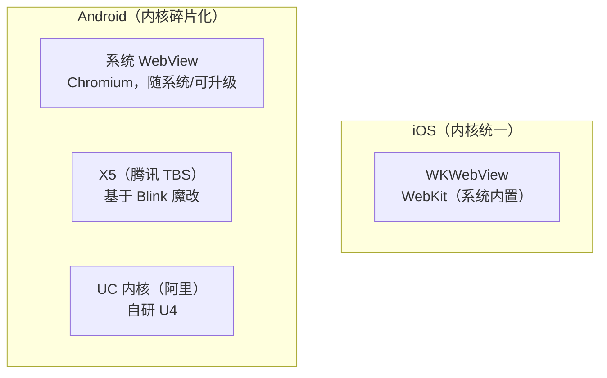
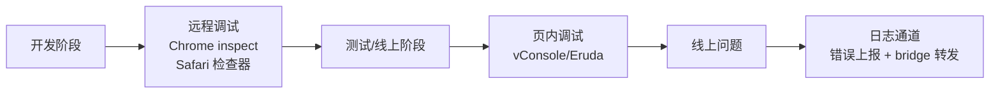

# WebView 容器差异与适配调试

**一句话总结**：差异来自三处——**内核谱系**（iOS 全员 WebKit、安卓碎片化 + 国产浏览器内核魔改）、**JSBridge API**（双端注入方式不同）、**渲染行为**（滚动/手势/键盘细节）；适配靠 UA/特性检测 + 统一 SDK 分发，调试靠 vConsole/远程调试 + 端上日志通道。

JSBridge 双端 API 差异见 [JSBridge 通信原理](./jsbridge通信原理.md)，交互踩坑见 [Hybrid H5 与原生交互常见坑](./hybrid交互常见坑.md)，本文聚焦容器本身的差异。

## 一、内核差异



| 维度 | iOS WKWebView | Android 系统 WebView | 国产魔改内核（X5/UC） |
| --- | --- | --- | --- |
| 内核 | WebKit，苹果独占维护 | Chromium，4.4+ 独立可升级（Google Play） | Blink 魔改，版本不透明 |
| 版本碎片 | 基本无，跟随系统 | 严重：低版本设备停留在老 Chromium | 不确定，需单独探测 |
| 多进程 | 独立 WebContent 进程，页面崩溃不拖垮 App | Android 8+ 支持 | X5 为独立进程 |
| Cookie | `WKHTTPCookieStore`（与 Safari 隔离，曾长期有同步坑） | `CookieManager` 自动同步 | 各自封装 |
| 缓存 | NSURLCache 不生效，需 WKWebsiteDataStore | HTTP 缓存标准 | 部分自带离线包/预加载 |
| 白屏问题 | 内存紧张时 WebContent 进程被杀 → 白屏 | 相对少 | X5 有自己的崩溃恢复 |

**关键认知**：iOS 内核统一所以只需适配系统版本；安卓真正的坑是**低端机停留在老内核**（flex gap、optional chaining 等新特性挂掉）和**厂商 App 内嵌魔改内核**（微信 X5/XWeb、支付宝 UC 内核）行为不可预期。

## 二、API 与行为差异

### JSBridge 通道（最核心差异）

| 能力 | iOS WKWebView | Android 系统 WebView |
| --- | --- | --- |
| JS → Native | `WKScriptMessageHandler` / `postMessage` | `addJavascriptInterface` |
| Native → JS | `evaluateJavaScript`（主线程） | `evaluateJavascript` |
| 注入时机 | 页面 JS 之后注入，需等待就绪 | 基本同 JS 上下文创建，时序坑较少 |
| 重复注册 | handler 强持有 → 泄漏/崩溃 | 无此问题 |

适配做法：封装统一 SDK 按 UA 分发（详见 [hybrid交互常见坑 - 多端兼容](./hybrid交互常见坑.md#三多端兼容)）。

### 典型行为差异速查

| 现象 | iOS | Android |
| --- | --- | --- |
| 滚动弹性 | 默认 bounce 回弹，`overscroll-behavior` 支持有限 | 无 bounce |
| 键盘弹起 | 顶起 visualViewport，fixed 元素错位 | 视口压缩或顶起，厂商行为不一 |
| 日期选择 | `<input type=date>` 样式不可控，出现「今天」清除按钮差异 | 各家实现不同 |
| 输入框首帧 | 聚焦不自动滚动到位，需 `scrollIntoView` | 基本自动处理 |
| 长按选择 | 长按图片出预览/拷贝弹层 | 出现文本选择 |
| 点击态 | 无 :active 高亮（需 FastClick 时代问题） | 有 |
| 1px 边框 | 物理像素渲染细 | 部分机型渲染粗 |

（键盘/滚动等纯 H5 层问题的处理方案见 [交互体验问题](./移动端h5/交互体验问题.md)、[安全区适配方案](./移动端h5/安全区适配方案.md)。）

## 三、适配方案

### 1. 环境识别：UA + 特性检测，不要只信 UA

```javascript
const ua = navigator.userAgent;

// 平台
const isIOS = /iPhone|iPad|iPod/i.test(ua)
    || (navigator.platform === 'MacIntel' && navigator.maxTouchPoints > 1); // iPadOS 桌面 UA
const isAndroid = /Android/i.test(ua);

// 内核（微信等容器可能伪装 UA，用引擎特征兜底）
const isX5 = /MQQBrowser|TBS/i.test(ua);
const isWX = /MicroMessenger/i.test(ua);

// 能力检测：新 CSS/JS 特性用前先探
const supportsFlexGap = CSS.supports('gap', '10px');
```

### 2. 分层适配策略

| 层 | 手段 |
| --- | --- |
| JS 语法 | Babel 按目标浏览器编译 + core-js polyfill；`browserslist` 覆盖低端安卓 |
| CSS | autoprefixer 前缀；新特性（gap、aspect-ratio）提供 fallback 写法 |
| 容器 | 检测微信/X5/UC 各自的 JSBridge（`WeixinJSBridge`、`window.wx`）单独适配 |
| 能力 | 逐特性 `CSS.supports` / `'IntersectionObserver' in window` 检测后降级 |

### 3. 构建目标示例

```json
// package.json
"browserslist": [
    "iOS >= 10",
    "Android >= 5"   // 覆盖低端机老内核
]
```

## 四、调试方案

### 分环境调试手段



**开发阶段——远程调试（可断点、看 DOM）**：

- Android：`chrome://inspect`（系统 WebView 需 App 开启调试：`WebView.setWebContentsDebuggingEnabled(true)`；X5 用 TBS 内核的 inspect 地址 `http://debugxbs.qq.com`）
- iOS：Mac Safari → 开发菜单 → 选中设备上的 WebView（真机需 设置-Safari-高级-Web 检查器）

**测试/线上——页内调试面板（无需连电脑）**：

```javascript
// 按 URL 参数或端上开关动态注入，线上默认关闭
if (new URLSearchParams(location.search).get('vconsole')) {
    const s = document.createElement('script');
    s.src = 'https://unpkg.com/vconsole/dist/vconsole.min.js';
    s.onload = () => new window.VConsole();
    document.head.appendChild(s);
}
```

**线上——日志与错误通道**：

- H5 侧：`window.onerror` / `unhandledrejection` 监听 → 前端监控 SDK 上报（Sentry 等）
- 端上协同：通过 bridge 把 `console.log/error` 转发进 Native 日志，客户端崩溃、白屏（`onRenderProcessGone` / WebContent 进程死亡）由 Native 监控，双端日志用同一 requestId 串联

**常用辅助**：

- `eruda`：比 vConsole 更全（Elements 面板近似 devtools）
- 微信开发者工具 / 企业微信调试：内置 TBS 内核远程调试
-  Charles/Whistle 代理：真机抓包改包，配合 map local 用本地代码调试线上页面

## 总结

> 容器差异三板斧：**内核**（iOS 统一 WebKit，安卓碎片化 + 国产魔改，低端机特性缺失靠 browserslist/polyfill）、**API**（JSBridge 双端通道不同，统一 SDK 按 UA 分发 + 特性检测兜底）、**调试**（开发用 chrome inspect / Safari 检查器，线上用 vConsole + bridge 日志通道 + Native 白屏监控）。
