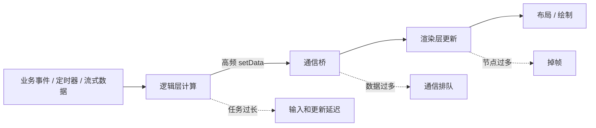

# 小程序动画优化

## 一句话结论

小程序动画优化的核心是让视觉变化尽量由渲染层或平台动画能力连续执行，避免逻辑层以高频 `setData` 驱动每一帧；标准小程序页面也不能默认把浏览器 `requestAnimationFrame` 当作通用 API 使用。

## 卡顿是怎么产生的



双线程不会自动保证流畅：逻辑层可能计算过久，通信桥可能传输过多，渲染层也可能因为节点复杂或更新频繁而掉帧。

```text
错误：每 16ms 修改一次 left，并通过 setData 传给渲染层
结果：每一帧都产生一次跨层通信和视图更新

推荐：修改一次动画状态或 class，让平台连续执行动画
结果：视觉变化不需要每一帧经过逻辑层
```

## 小程序有 `requestAnimationFrame` 吗？

### 标准小程序页面

在标准微信小程序页面逻辑层中，不能默认使用浏览器的 `window.requestAnimationFrame`。小程序页面不是普通浏览器页面，逻辑层通常没有完整的 `window`、`document` 和浏览器动画 API。

```js
// 普通 H5
window.requestAnimationFrame(step);

// 标准小程序逻辑层：不要假设这个 API 一定存在
requestAnimationFrame(step);
```

不同基础库、Canvas 类型和运行环境可能存在差异。小游戏或特定 Canvas 环境可能提供帧循环 API，但不能把小游戏能力直接当成普通小程序页面能力；实际项目应以目标平台文档和真机结果为准。

### `wx.nextTick` 不是 `requestAnimationFrame`

`wx.nextTick` 用于把回调安排到当前同步更新之后执行，适合等待本轮视图更新后再进行后续逻辑；它不保证在下一次屏幕重绘之前执行，也不提供浏览器 `requestAnimationFrame` 的时间戳和帧率语义。

```js
this.setData({ visible: true });

wx.nextTick(() => {
  // 适合：等待本轮视图更新后执行后续逻辑
  // 不等价于：下一帧开始前执行动画回调
});
```

| API | 解决的问题 | 是否等价于 rAF |
| --- | --- | --- |
| `requestAnimationFrame` | 浏览器动画回调与下一次重绘对齐 | 是浏览器帧调度 API |
| `wx.nextTick` | 等待当前小程序视图更新任务之后执行 | 否 |
| `setTimeout` | 延迟执行普通任务 | 否 |
| `wx.createAnimation` / CSS 动画 | 交给平台执行过渡和动画 | 不是 JS 帧循环 |

## 不同场景怎么做

### 普通 UI 动画：优先交给平台

优先使用 CSS 动画、过渡或小程序平台的动画能力，把逐帧变化交给渲染层或原生实现，避免逻辑层每一帧调用 `setData`。

```text
推荐：修改一次 class 或动画配置 -> 平台连续执行视觉动画
不推荐：定时器每 16ms 修改 left、top、opacity -> 反复跨层通信
```

适合使用平台动画的内容包括展开收起、淡入淡出、位移、缩放和 loading 动画。动画过程中的中间值不需要回写业务状态，业务层只维护开始、进行中、完成等少量状态。

### AI 流式输出：批量更新，不要强行使用 rAF

流式输出是文本状态更新，不是严格意义上的视觉帧动画。它更适合使用缓冲区和定时批处理，重点是减少通信次数和数据量。

```js
let pendingText = '';
let flushTimer = null;

function onToken(token) {
  pendingText += token;
  if (!flushTimer) {
    flushTimer = setTimeout(() => {
      flushTimer = null;
      const text = pendingText;
      pendingText = '';
      // 只更新当前消息，不提交完整历史列表
      updateCurrentMessage(text);
    }, 50);
  }
}
```

### Canvas 或小游戏：使用目标环境的帧循环

如果业务确实需要逐帧绘制，应使用目标 Canvas/小游戏环境明确提供的帧循环能力，并将动画状态尽量留在 Canvas 或渲染侧。

```text
逻辑层：更新速度、目标位置等低频状态
帧循环：在 Canvas / 游戏渲染环境中读取最新状态并绘制
```

不要让每一帧都走“逻辑层 -> 通信桥 -> 页面组件”的完整链路，否则帧率越高，通信压力越大。

## 优化检查表

| 问题 | 优先方案 | 验证方式 |
| --- | --- | --- |
| 每帧频繁 `setData` | 改用 CSS/平台动画 | 查看通信次数和帧率 |
| 流式文本更新过密 | 缓冲并按批次刷新 | 对比输入响应和消息延迟 |
| 动画节点太多 | 减少节点、拆分区域 | 真机滚动和动画测试 |
| 逻辑层计算过重 | 拆分任务、延迟非关键计算 | 记录 JS 执行耗时 |
| 前后台切换后动画异常 | 停止并恢复动画状态 | 测试切后台再返回 |
| 高端机正常、低端机卡顿 | 以低端真机为基准 | 记录帧率和内存峰值 |

## 面试回答模板

> 小程序双线程不能完全避免卡顿，因为逻辑层的大计算、逻辑层到渲染层的高频通信，以及渲染层复杂节点都可能造成延迟或掉帧。标准小程序页面不能默认使用浏览器的 `requestAnimationFrame`，`wx.nextTick` 也只是等待当前视图更新任务完成，不等价于下一帧。普通 UI 动画应优先使用 CSS 或平台动画能力；AI 流式输出使用缓冲和批量更新；Canvas 或小游戏再根据目标环境使用帧循环。核心原则是减少逻辑计算、跨层通信和每次渲染的工作量。

