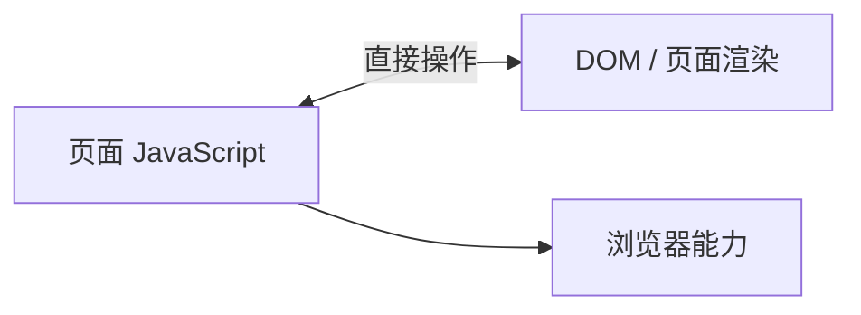
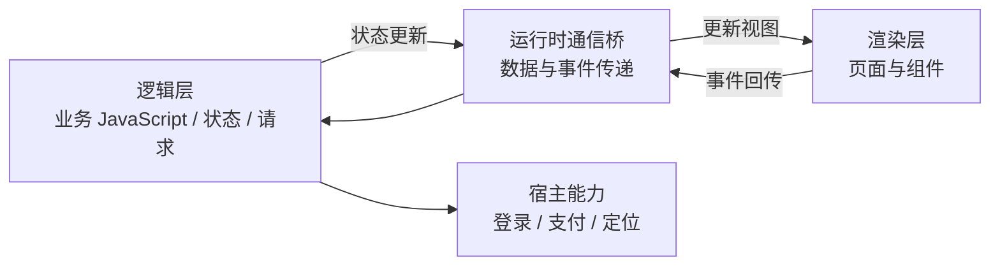
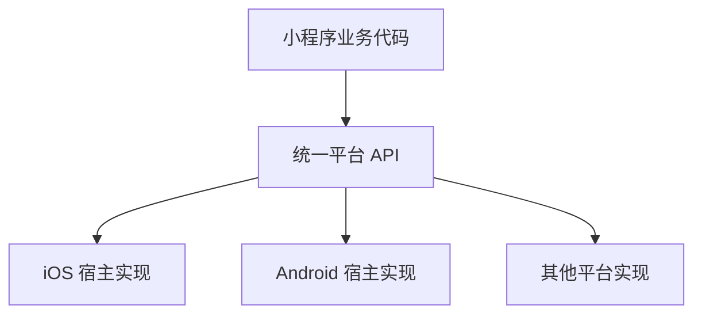
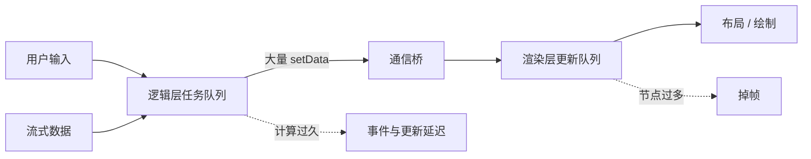
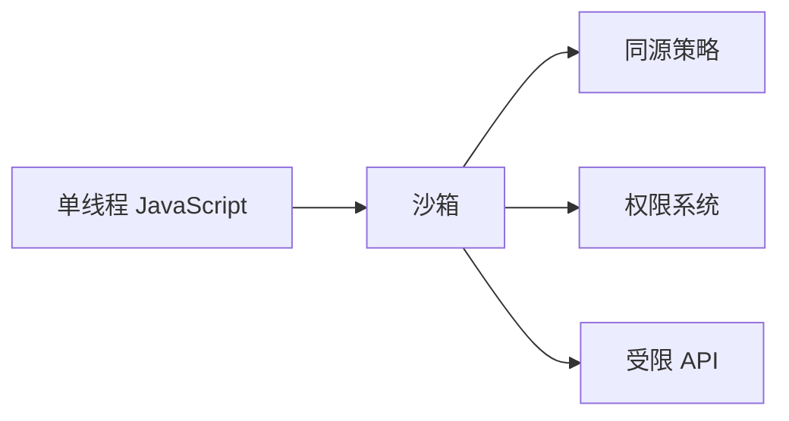
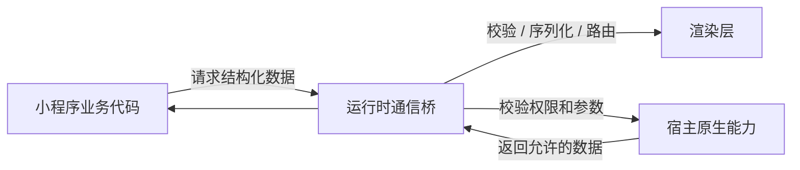
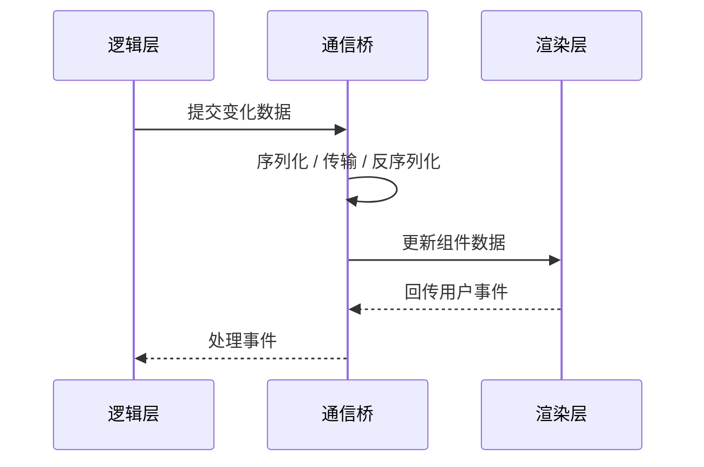

# 小程序双线程模型：为什么要拆分

## 一句话结论

小程序拆分逻辑层和渲染层，核心不是“单线程做不到安全”，而是让业务执行、页面渲染和宿主能力之间形成更清晰的受控边界；代价是两层之间不能直接共享页面上下文，数据更新需要经过通信桥。

## 先理解：如果不拆分会怎样？

把普通 H5 想象成一个房间：JavaScript 可以直接操作 DOM，DOM 变化、事件处理和业务计算都发生在同一个页面运行环境里。



这种模型灵活，但业务代码和页面 DOM 通常处于同一个 WebView JavaScript 上下文。对于运行在微信等宿主 App 中的第三方小程序，平台还需要管理代码权限、页面渲染、登录支付等敏感能力，因此需要额外设计沙箱和 Native Bridge，不能把宿主内部对象直接暴露给业务脚本。

## 拆分后是什么样？



- **逻辑层**：执行 JavaScript，维护业务状态，发起请求，调用平台 API。
- **渲染层**：负责页面和组件的渲染，并将用户操作转成事件。
- **通信桥**：传输允许跨层的数据和事件；逻辑层不能把渲染层当成同一个 DOM 环境直接操作。

这里的“双线程”是面试中的简化说法。不同平台的具体实现可能不同，准确重点是**逻辑执行和视图渲染隔离**，而不是机械地认为它一定是两个普通 Web Worker。

## 为什么要拆分

### 1. 让能力边界更容易统一治理

小程序代码由业务方提供，但运行在宿主 App 里。平台需要限制它直接访问宿主页面、其他页面或敏感数据，并通过白名单、授权流程和平台 API 暴露能力。

```text
业务代码：调用平台提供的“选择图片” API
平台运行时：检查权限、调起系统能力、返回结果
业务代码：拿到允许返回的图片信息
```

如果业务脚本可以直接操作宿主页面 DOM，就可能覆盖宿主 UI、伪造敏感交互或扩大数据访问范围。双层隔离本身不是完整的安全方案，但它让平台可以把页面、宿主能力和业务代码放在不同边界上治理。

### 2. 让宿主统一管理渲染和原生能力

小程序需要同时适配不同系统、机型和宿主版本。渲染层和平台 API 由运行时管理，业务代码只面对统一的组件和接口，平台可以在底层处理兼容性、生命周期和资源回收。



这解释了为什么小程序不能直接依赖完整的 `window`、`document` 或浏览器 DOM：它的页面不是一个完全开放的浏览器页面，而是由宿主控制的页面容器。

### 3. 避免业务脚本直接拖垮视图更新

这里不能简单说“两个线程所以不会卡”。逻辑层如果持续执行大量计算，仍然会阻塞逻辑处理；渲染层如果节点过多或更新过重，也仍然会掉帧。

拆分的价值是把业务状态处理和视图渲染分开管理，平台可以控制视图更新的入口和范围。它改善了隔离和治理能力，但不会自动消除性能问题。

```text
错误理解：双线程 = 业务计算永远不会影响页面
正确理解：双线程 = 业务层与视图层隔离，但两层通信和各自的工作仍然有成本
```

### 为什么逻辑层卡顿仍然会影响体验？

双线程只能把逻辑执行和视图渲染分开，不能让逻辑层的任务凭空消失。逻辑层持续执行大计算时，用户事件、网络回调和下一次视图更新仍然可能排队；渲染层收到大量更新时，也可能来不及布局和绘制。



例如，逻辑层每收到一个 token 就同步完整消息列表：

```text
token 1 -> setData(完整 messages) -> 通信 -> 渲染
token 2 -> setData(完整 messages) -> 通信 -> 渲染
token 3 -> setData(完整 messages) -> 通信 -> 渲染
```

更合理的策略是先在逻辑层合并数据，再按固定频率提交最新状态：

```text
token 1、2、3、4 -> 逻辑层合并
50ms 到期         -> 只提交当前消息 content
```

动画与高频视觉更新的具体方案见：[小程序动画优化](./小程序动画优化.md)。

## WebView 也可以安全

单线程本身不是安全问题。浏览器的 JavaScript 通常也是单线程执行，WebView 也可以通过沙箱、同源策略、权限系统和 Native Bridge 白名单来保护宿主。



例如 WebView 中的 JavaScript 默认不能直接访问系统 API；只有宿主主动注入桥接对象后，页面才拥有对应能力：

```text
WebView JavaScript
  -> window.nativeBridge.openCamera()
  -> 宿主检查 API 白名单和系统权限
  -> 调用相机
  -> 只返回允许的数据
```

真正的问题是：如果单线程模型同时允许业务代码直接访问页面 DOM、宿主对象和原生能力，那么这些权限都混在同一个 JavaScript 上下文里，边界更难统一控制。

```text
单线程 + 直接暴露 document
  -> 可以查找和修改页面节点
  -> 可以绑定任意页面事件
  -> 可能覆盖敏感交互界面
  -> 平台需要在大量 DOM 能力上逐项补权限控制
```

因此准确说法是：**单线程也能安全，WebView 也能通过沙箱和桥接白名单建立安全边界；双线程的优势是从运行模型上减少业务代码直接接触渲染环境的机会，让小程序平台更容易统一划分和治理能力边界。**

## WebView 与小程序的准确对比

| 维度 | WebView | 小程序双线程 |
| --- | --- | --- |
| 页面操作 | 页面脚本通常可直接操作自己的 DOM | 逻辑层通过数据驱动平台组件 |
| 原生能力 | 宿主自行设计并注入 Native Bridge | 平台统一提供受控 API |
| 安全性来源 | 沙箱、同源策略、权限和 Bridge 白名单 | 运行时隔离、组件模型、API 白名单和权限系统 |
| 逻辑与渲染 | 通常共享 WebView 的主要执行环境 | 逻辑执行和视图渲染分开管理 |
| 平台治理 | 依赖每个 App 的实现质量 | 平台可以统一管理版本、生命周期和资源 |

所以不能简单说“WebView 不安全、小程序安全”。更准确的说法是：**两者都可以安全，差别在于安全边界和平台治理是否由统一运行时强制执行。**

## 通信桥具体做了什么



### 数据隔离

逻辑层发送的是可序列化数据，而不是渲染层的内部对象：

```text
允许：{ "title": "订单详情", "loading": false }
不允许：DOM 节点、宿主页面对象、原生 View 实例
```

业务代码拿不到渲染引擎中的任意对象，就不能沿着对象引用继续访问宿主环境。

### API 白名单和授权

小程序调用登录、支付、定位、相册等能力时，不能直接调用系统模块，而是调用平台暴露的 API：

```text
小程序代码
  -> 平台 location API
  -> 运行时检查权限和参数
  -> 调用系统定位能力
  -> 返回允许的数据
```

平台可以检查当前小程序是否有权调用、用户是否授权、参数是否合法，以及最终返回哪些数据。

### 上下文隔离

宿主需要区分宿主 App、小程序 A、小程序 B，以及各自的页面和实例。小程序 A 的逻辑层不能直接拿到小程序 B 的运行时对象，也不能直接读取宿主 App 的内部状态。

### 资源和生命周期治理

平台可以统一管理页面创建销毁、内存、CPU、后台定时器、网络请求和实例回收。进入后台后，平台也可以暂停或回收运行实例，避免单个小程序长期占用宿主资源。

## 代价：为什么会有通信成本

逻辑层不能直接修改渲染层的 DOM，因此状态变化要通过运行时发送给渲染层；用户操作也要从渲染层回传逻辑层。



### 一个直观的数量级例子

```text
错误：每收到 1 个 token，就传输完整的 100 条消息
结果：token 越多、历史消息越长，重复传输越严重

推荐：每 50ms 合并一次 token，只更新当前 assistant 消息
结果：通信次数和每次数据量都更可控
```

所以“隔离换来通信成本”的含义是：**为了不允许逻辑层直接碰渲染环境，平台增加了一道受控的数据通道；这道通道带来了序列化、传输和视图更新开销。**

## 安全边界的局限

双线程不是完整的安全方案，也不能单独防止所有钓鱼和恶意业务。恶意小程序仍然可以在自己的页面里绘制相似界面，因此还需要结合审核、支付确认、授权提示、域名白名单、签名校验和风控。

双线程主要解决的是：**业务代码不能直接越过运行时边界，访问宿主页面、其他小程序上下文或未经授权的原生能力；但 WebView 通过沙箱和安全设计同样可以达到类似目标。**

## 优化方式

| 问题 | 做法 | 示例 |
| --- | --- | --- |
| 更新太频繁 | 节流、批量提交 | 多个 token 合并后更新 |
| 数据太大 | 只传变化字段 | 不重复传完整消息列表 |
| 节点太多 | 分页、增量追加、虚拟化 | 长列表只保留必要节点 |
| 无关更新 | 拆分状态范围 | 输入状态不触发整页更新 |
| 计算太重 | 拆分任务、延迟非关键计算 | 首屏后再处理历史消息 |

## 面试回答模板

> 小程序采用逻辑层和渲染层隔离的模型。逻辑层负责 JavaScript、状态和请求，渲染层负责页面和组件，两者通过运行时通信。这样做主要是为了让宿主能够控制业务代码的权限、统一管理渲染和原生能力，并降低业务代码直接影响宿主环境的风险。代价是逻辑层不能直接操作渲染层 DOM，数据需要经过序列化和通信，所以要减少跨层次数、只传变化数据，并控制长列表和高频更新。单线程并非不能安全，浏览器也能通过沙箱和同源策略保证安全；小程序采用双线程，是为了让隔离边界在架构上更明确、更容易治理。

## 常见追问

### 双线程是不是两个 Web Worker？

不是严格等同。应回答“逻辑执行和视图渲染隔离，由小程序运行时负责桥接通信”，具体线程和进程实现以平台为准。

### 双线程能完全避免页面卡顿吗？

不能。逻辑层的大量计算、通信桥的大量数据传输、渲染层的复杂节点和频繁更新都可能造成卡顿。双线程提供的是隔离和治理边界，性能仍需要通过减少计算、通信和渲染量来优化。

### 为什么不用普通 H5 的 DOM 模型？

普通 H5 更强调开放的浏览器能力，小程序更强调宿主可控、权限受限和跨平台一致性。小程序牺牲部分 DOM 灵活性，换取平台对能力、版本、资源和生命周期的统一管理。
