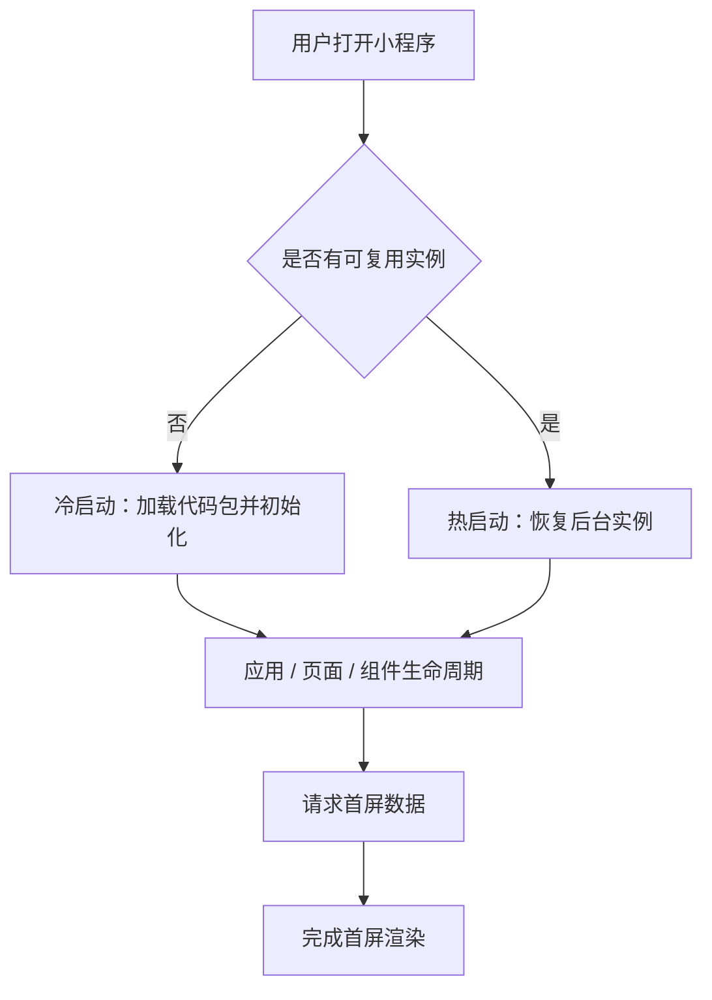
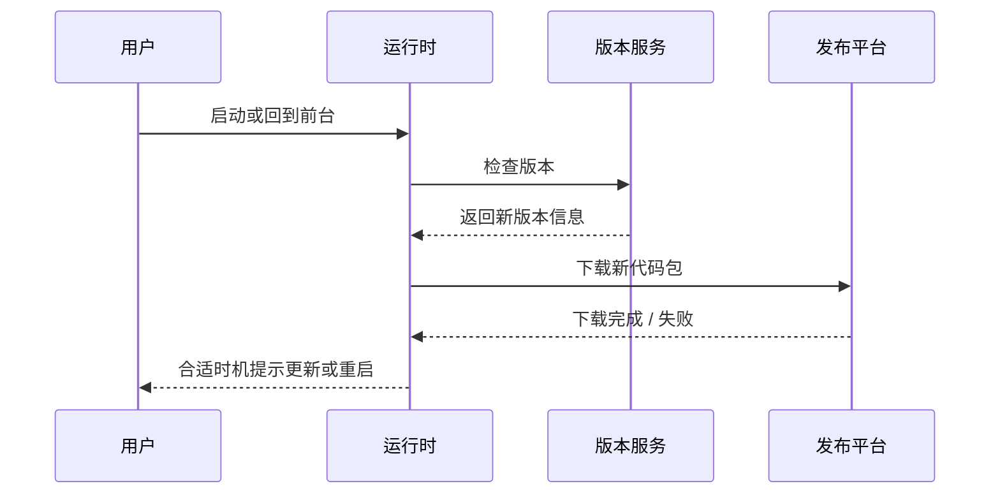

# 小程序启动与更新机制

## 一句话结论

冷启动需要重新创建运行实例，热启动主要复用后台实例；更新不能只看“下载了新包”，还要处理生效时机、接口兼容、用户操作连续性和失败降级。

## 启动流程



- **冷启动**：实例不存在或已被系统回收，需要加载代码包、初始化依赖、创建页面。
- **热启动**：实例仍在后台，用户再次进入时复用运行环境，通常耗时更短。
- **注意**：进入后台后实例仍可能被回收，不能只把关键状态放在内存变量里。

## 最小状态示例

```text
内存状态：当前输入框内容、临时 loading 状态
本地存储：用户偏好、未发送草稿、最近一次页面参数
服务端：订单状态、权限、会话有效性、关键业务数据
```

热启动可以先展示缓存，再按数据时效静默刷新；订单、权限等关键数据必须重新校验，不能完全相信旧页面状态。

## 更新流程



新版本通常不会强行中断正在运行的页面，具体检查、下载和生效行为由平台机制决定。业务侧要关注新旧客户端并存期间的兼容性。

## 版本兼容示例

```ts
interface ChatResponseV1 {
  content: string;
}

interface ChatResponseV2 {
  content: string;
  status?: 'streaming' | 'done';
}

// 新客户端兼容旧字段，新增字段使用可选值，避免灰度期间解析失败。
function readContent(data: ChatResponseV1 | ChatResponseV2) {
  return data.content;
}
```

发布接口变更时，优先新增字段并保留旧字段；确需删除或改变语义时，使用接口版本或服务端兼容层，避免客户端更新不同步导致业务中断。

## 启动和更新优化

| 目标 | 做法 | 验证指标 |
| --- | --- | --- |
| 缩短冷启动 | 减少主包、拆分分包、延迟非首屏依赖 | 首屏时间、包加载耗时 |
| 降低初始化阻塞 | 并行请求、取消无效请求 | JS 执行耗时、接口等待 |
| 保证热启动正确 | 根据前后台停留时间决定刷新 | 数据过期率、恢复耗时 |
| 不打断关键流程 | 普通更新延迟重启，关键版本强提示 | 更新完成率、任务中断率 |
| 便于线上排障 | 记录版本、机型、启动和更新失败 | 失败率、版本分布 |

## 常见追问

### 如何降低冷启动耗时？

从包体、初始化、网络和渲染四方面处理：主包只保留首屏能力，非关键依赖延迟加载，接口并行且可取消，减少首屏节点，最后用真机数据验证。

### 什么时候应该强制更新？

普通功能更新尽量不打断用户当前操作；协议不兼容、安全漏洞或关键数据错误时才强制更新，并提供失败重试和旧版本降级提示。

