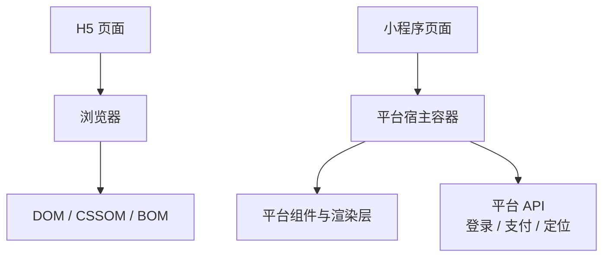
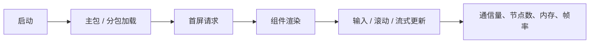

# 小程序运行环境与 H5 区别

## 一句话结论

H5 依赖浏览器的 DOM、BOM 和 Web API，小程序运行在平台宿主容器中，使用受控组件和平台 API；迁移代码时，业务逻辑可复用，视图和平台能力需要适配。

## 核心对照

| 维度 | H5 | 小程序 |
| --- | --- | --- |
| 容器 | 浏览器页面 | 平台提供的宿主容器 |
| 视图 | 可直接操作 DOM | 使用平台组件，数据驱动视图 |
| 能力 | 受浏览器安全策略约束 | 通过平台 API 调用支付、定位等能力 |
| 生命周期 | 页面加载、可见性、卸载 | 应用、页面、组件及前后台生命周期 |
| 发布 | URL + 服务端资源 | 审核版本 + 代码包、分包和平台规则 |
| 网络 | 受同源、CORS 等约束 | 受合法域名、接口协议和平台限制 |

## 运行模型



## 最小适配示例

同一个“获取用户位置”业务，不应直接复用 H5 的实现：

```ts
// 可复用：业务层接口
interface LocationService {
  getCurrentLocation(): Promise<{ latitude: number; longitude: number }>;
}

// H5 与小程序分别实现 LocationService，页面只依赖接口。
```

```text
H5 实现：navigator.geolocation
小程序实现：平台 location API + 用户授权失败处理
页面业务：只调用 locationService.getCurrentLocation()
```

因此，TypeScript 类型、请求封装、数据转换和纯函数通常可以复用；DOM 操作、路由、存储、授权和平台 API 调用需要单独适配。

## 小程序业务中的重点



| 场景 | 重点检查 | 最小示例 |
| --- | --- | --- |
| 首屏 | 主包体积、同步初始化 | 非首屏页面放分包 |
| 长列表 | 节点数量、整页刷新 | 分页后增量追加 |
| 高交互 | 输入和滚动更新频率 | 对搜索输入做节流 |
| 图片富文本 | 解码内存、渲染耗时 | 非首屏图片按需加载 |
| 前后台切换 | 请求和定时器生命周期 | 后台暂停轮询，回前台刷新 |

## 常见追问

### 小程序可以直接复用 H5 代码吗？

不能直接整体复用。推荐按“业务核心、平台适配、视图渲染”拆分，复用无平台依赖的核心逻辑，用适配器隔离浏览器 API 和小程序 API。

### 小程序性能问题与 H5 有什么不同？

两者都关注网络、脚本、渲染和内存；小程序还要额外关注逻辑层与渲染层的通信、组件节点数量、代码包、分包加载和宿主 API 成本。

