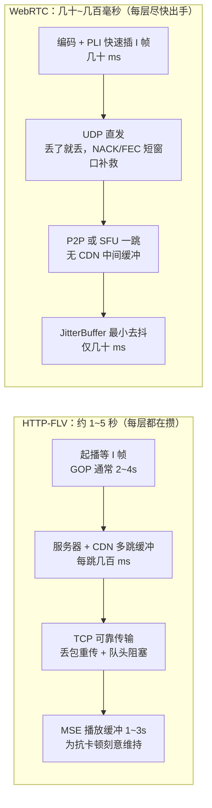

# HLS、FLV、WebRTC 区别

## 一、基础知识

> 注：本文中的「FLV」均指 **HTTP-FLV**——FLV 封装格式走 HTTP 长连接流式下发（浏览器 `flv.js` 方案）。FLV 是封装格式（容器），不是协议；它既能装在 RTMP（传统 Flash 方案）上，也能装在 HTTP 上，本文只讨论浏览器里的 HTTP-FLV。

### 1. 三层概念：索引 / 容器 / 传输协议

三个技术分属不同层，先分清「索引清单 / 容器封装 / 传输协议」三层，才不会把 m3u8 和容器、FLV 和协议搞混。

| 技术     | 索引/清单                              | 容器/封装                         | 传输协议                                   |
| -------- | -------------------------------------- | --------------------------------- | ------------------------------------------ |
| **HLS**  | m3u8（文本索引，列出分片 URL）         | MPEG-TS（.ts）或 fMP4             | HTTP（分片请求，短连接）                   |
| **FLV**  | 无（索引内嵌在文件里）                 | FLV（二进制封装）                 | HTTP-FLV 或 RTMP（都基于 TCP）             |
| **WebRTC** | 无                                   | 无文件容器（编码帧直接封包）      | SRTP（加密 RTP，基于 UDP）                 |

记忆锚点：**HLS = m3u8 索引 + TS 容器；FLV = 自带索引的单一容器；WebRTC = 无容器，编码帧直接封 RTP/SRTP。**

### 2. 三者区别对照表

| 对比维度               | HLS（HTTP 协议）                                            | FLV（HTTP 协议）                                              | WebRTC（P2P/中继协议）                                                     |
| ---------------------- | ----------------------------------------------------------- | ------------------------------------------------------------- | -------------------------------------------------------------------------------- |
| **连接类型**           | 短连接（HTTP），一次请求一个分片，无状态                    | 长连接（HTTP-FLV），服务器持续流式下发，有状态            | 长连接（P2P/中继），全程维持，有状态                                             |
| **服务器角色**         | 静态资源分发者（仅返回预设资源，无需协调）                  | 静态资源分发者（仅返回预设资源，无需协调）                | 信令协调者+数据中转者（全程参与，复杂互动）                                      |
| **核心延迟**           | 10-30 秒（天生高延迟，源于分片缓存）                        | 1-5 秒（流式传输，延迟低于 HLS）                            | 几十~几百毫秒（天生低延迟，源于实时数据包传输）                                  |
| **兼容性**             | 极强（Safari 原生支持，其他浏览器 hls.js）                 | 中等（所有浏览器需 flv.js）                                 | 中等（仅现代浏览器支持，IE 不兼容，移动端适配复杂）                              |
| **服务成本/压力**      | 极低（支持 CDN 缓存，大规模分发时服务器压力几乎不变）       | 极低（支持 CDN 缓存，大规模分发时服务器压力几乎不变）     | 极高（每个观众都需要独立长连接+可能的中继中转，高并发时服务器带宽/内存瓶颈明显） |
| **开发/维护复杂度**    | 低（依赖 hls.js，几行代码实现，异常处理简单）               | 低（依赖 flv.js，几行代码实现，异常处理简单）             | 高（需处理信令协商、ICE 候选、断线重连、跨网中转等，兼容问题多）                 |
| **资源消耗（观众端）** | 低（仅解析视频流，无需维护复杂连接状态）                    | 低（仅解析视频流，无需维护复杂连接状态）                  | 高（需维护 P2P 连接、处理实时数据包，占用更多 CPU/内存）                         |
| **大规模分发友好性**   | 极佳（CDN 天然适配，支持万级/十万级观众）                   | 极佳（CDN 天然适配，支持万级/十万级观众）                 | 极差（P2P/中继难以支撑高并发，CDN 无法直接缓存）                                 |
| **核心适用场景**       | 普通观众单向观看，大规模分发，兼容优先                      | 普通观众单向观看，大规模分发，延迟要求适中                | 双向互动场景（如连麦），低延迟优先，小规模观众                                   |

## 二、问题研究

### 1. HLS 为什么高延迟

根本原因：HLS 是**先切片、再请求**，而不是流式转发。延迟主要来自三处：

1. 切片时长：一个 .ts 分片通常 6~10 秒，客户端必须等一个完整分片就绪才能开始播。
2. 多一跳索引：先拉 m3u8 清单，再逐个拉分片，多一次请求往返。
3. 播放缓冲：为保证流畅，客户端通常预载 2~3 个分片，进一步抬高延迟。

对比 HTTP-FLV / WebRTC 是流式转发，边收边播，不用等「一个完整分片」。

### 2. FLV 比 HLS 更快的核心原因

1. 封装格式：FLV 是二进制封装，索引内嵌，解析快；HLS 不是单一容器，而是 m3u8 文本清单 + TS/fMP4 二进制分片，播放器要先读清单再拉分片，所以起播更慢。
2. 传输协议：HTTP-FLV 基于 HTTP 长连接流式下发（HTTP 又基于 TCP），边推边播，传输效率高；HLS 基于 HTTP 分片请求，一次请求一个分片，传输效率低。
3. 播放逻辑：FLV 是边下载边播放，缓冲较小；HLS 通常要预取多个分片，缓冲更大。
4. 分片策略：FLV 分片连续无缝；HLS 分片独立可能有间隙。

### 3. FLV 比 WebRTC 慢的核心原因

一句话：延迟不是「网速慢」，而是全链路每一层攒出来的缓冲——HTTP-FLV 每层都在为**可靠/流畅**攒数据，WebRTC 每层都在为**实时**尽快出手。

| 延迟来源   | HTTP-FLV                                              | WebRTC                                                          |
| ---------- | ----------------------------------------------------- | --------------------------------------------------------------- |
| 传输协议   | TCP 保证可靠有序：丢包必须重传，后面的数据全排队等（队头阻塞）；网络抖动多花的时间**永远追不回来**，延迟只增不减 | UDP 不保证可靠有序：晚到的数据直接丢，用 NACK（短窗口重传）/ FEC（冗余恢复）补救，绝不干等 |
| 拥塞控制   | TCP 为吞吐优化：降速 → 缓冲越积越多                   | GCC 等为延迟优化：主动降码率、降分辨率，保实时性                  |
| 链路长度   | 源站 → 多层 CDN → 播放器，每一跳都有收发缓冲          | P2P 直连或 SFU 一跳中继，几乎没有中间缓冲                        |
| 播放端缓冲 | flv.js 把 FLV remux 成 fMP4 喂 MSE，浏览器需维持 1~3s 缓冲防卡顿——用延迟换流畅 | 仅 JitterBuffer 做最小去抖（几十 ms），宁可偶发花屏/丢帧也不等   |
| 关键帧策略 | 起播/追帧必须等 I 帧                                  | PLI 随时请求编码器立刻插 I 帧，不用等整个 GOP                    |

本质是设计目标的取舍：

-   **HTTP-FLV：可靠 + 流畅优先。** 数据一条不能少、不能乱，卡顿不可接受，于是用秒级延迟换稳定，适合单向观看。
-   **WebRTC：实时优先。** 一帧晚到就毫无价值（连麦时对方听到的必须是「现在」），于是宁可丢帧、降画质、降码率也要保住几百毫秒。

类比：FLV 像寄快递，缺一件、晚一件，整批货都得停下等；WebRTC 像对讲机，这句没听清就让它过去，继续说下一句。

### 4. 为什么 HLS 现在更流行？

尽管 HLS 播放速度慢，但它有两个不可替代的优势：

-   跨平台兼容性：HLS 基于 HTTP，几乎所有设备（手机、电脑、电视、浏览器）都支持，无需安装额外的播放器。
-   容错性和适应性：HLS 支持 ABR（自适应码率） 和容错，适合直播和点播等复杂场景。
