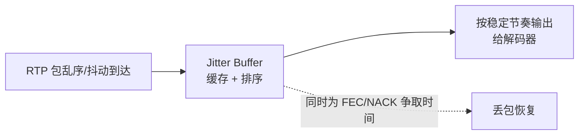
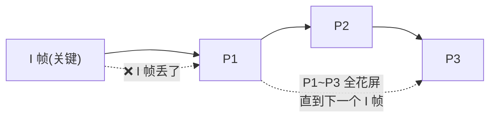

# Jitter Buffer 的作用，丢包、花屏怎么处理

> **一句话结论：** Jitter Buffer（抖动缓冲）是接收端的「蓄水池」，把到达时间抖动的 RTP 包缓存起来、按序按稳定节奏输出，顺便给重传/纠错争取时间；丢包靠 NACK 重传 + FEC 前向纠错，花屏（P 帧依赖链断裂）靠请求关键帧 PLI 快速刷新，前端用 getStats 监控丢包/冻结/抖动三个指标闭环处理。

---

## 一、Jitter Buffer 是什么、解决什么问题

网络里的每个 RTP 包到达时间不一致（**抖动 jitter**），直接拿去解码就会卡顿、断音。Jitter Buffer 在接收端先缓存一段时长的包，再按序、按稳定节奏交给解码器：



**三个作用**：

1. **平滑抖动**——包快包慢都被缓冲成匀速输出；
2. **重排序**——乱序到达的包按序号排好再出；
3. **为恢复争取时间**——丢包后 NACK 重传、FEC 纠错都需要时间，buffer 越大越来得及。

**核心权衡**：buffer 大 = 抗抖动强但**延迟高**；buffer 小 = 延迟低但容易花屏卡顿。WebRTC 的 jitter buffer 由浏览器内置、按网络状况自适应，前端不直接配大小，但能用 `getStats` 的 `jitter`、`jitterBufferDelay` 观察。

---

## 二、丢包怎么处理：NACK + FEC

丢包的本质：接收端发现序号跳变，就知道有包没到。两条恢复路线：

| 手段 | 原理 | 优点 | 代价 |
| --- | --- | --- | --- |
| **NACK 重传** | 接收端发否定确认，发送端重传丢的包 | 恢复完整 | 多一个 RTT 延迟（弱网反复重传更慢） |
| **FEC 前向纠错** | 发送端提前发冗余包（如 XOR），丢包用冗余现场恢复 | 延迟低 | 占额外带宽 |

> 一般结合用：**FEC 保关键帧/低延迟路径，NACK 兜底非关键丢包**。极端弱网里 NACK 会雪崩，所以要有「重传上限 + 降质」的退路。

---

## 三、花屏/马赛克怎么来的，怎么处理

**花屏的根因是「依赖链断裂」**：视频里 P 帧只存与前一帧的差异，依赖前面的 I 帧（关键帧）。一旦 I 帧或前面某个 P 帧丢了，后面所有 P 帧解码出来都是错的花屏，直到下一个 I 帧才恢复。



**处理手段**：

1. **请求关键帧 PLI（Picture Loss Indication）**：接收端发现解码不了，发 PLI 让发送端立刻出新的 I 帧快速刷新——花屏几十 ms~几百 ms 内恢复；
2. **FIR（Full Intra Request）**：比 PLI 更强硬，要求完整关键帧；
3. **降质**：弱网反复花屏，说明码率撑不住，降分辨率/码率减少丢包；
4. **FEC 保护关键帧**：让 I 帧不容易丢，从源头减花屏。

> 名词对应：NACK 救「丢的包」，PLI/FIR 救「解码链断了」，FEC 是「提前买保险」。

---

## 四、前端能做什么：getStats 闭环监控

浏览器把 Jitter Buffer、NACK 都做进去了，前端的职责是**监控 + 联动降质**：

```typescript
async function sampleStats(pc: RTCPeerConnection) {
  const stats = await pc.getStats();
  const m: Record<string, number> = {};
  stats.forEach((r) => {
    if (r.type === 'inbound-rtp' && r.kind === 'video') {
      m.packetsLost = r.packetsLost;        // 丢包 → 花屏/马赛克
      m.jitter = r.jitter;                  // 抖动（秒）→ 网络波动
      m.framesDecoded = r.framesDecoded;    // 判活（冻结检测）
      m.freezeCount = r.freezeCount ?? 0;   // 冻结次数
      m.nackCount = r.nackCount ?? 0;       // 丢包重传请求（越多越弱网）
    }
  });
  return m;
}
```

| 指标 | 异常表现 | 原因 | 前端动作 |
| --- | --- | --- | --- |
| `packetsLost` 持续涨 | 花屏、马赛克 | 弱网丢包 | 降码率/子码流 |
| `jitter` 大 | 卡顿 | 网络抖动 | 等 jitter buffer 自适应，持续差则降质 |
| `freezeCount` 高 | 频繁冻结 | 解码跟不上 | 降帧率诉求、降子码流 |
| `nackCount` 高 | 重传多 | 丢包严重 | 弱网提示 + 降质兜底 |

---

## 面试回答

> Jitter Buffer 是接收端的抖动缓冲，作用是把到达时间抖动的 RTP 包缓存、排序、按稳定节奏输出，顺便给 NACK 重传和 FEC 纠错争取时间，代价是 buffer 越大延迟越高，所以要在抗抖动和低延迟之间权衡。丢包处理两条路：NACK 是收端发现序号跳变后请求重传，恢复完整但多一个 RTT；FEC 是发送端提前发冗余包，丢包现场恢复、延迟低但占带宽。花屏的根因是 P 帧依赖 I 帧，关键帧一丢后面的帧全解错，处理是发 PLI 请求发送端立刻出新的 I 帧快速刷新，配合 FEC 保护关键帧、弱网降质。前端主要靠 getStats 监控 packetsLost、jitter、freezeCount，闭环联动降码率。

## 相关资料

- [WebRTC 质量控制（网络监测 + Simulcast 选层）](./webRTC质量控制.md)
- [WebRTC 断线恢复](./断线恢复.md)
