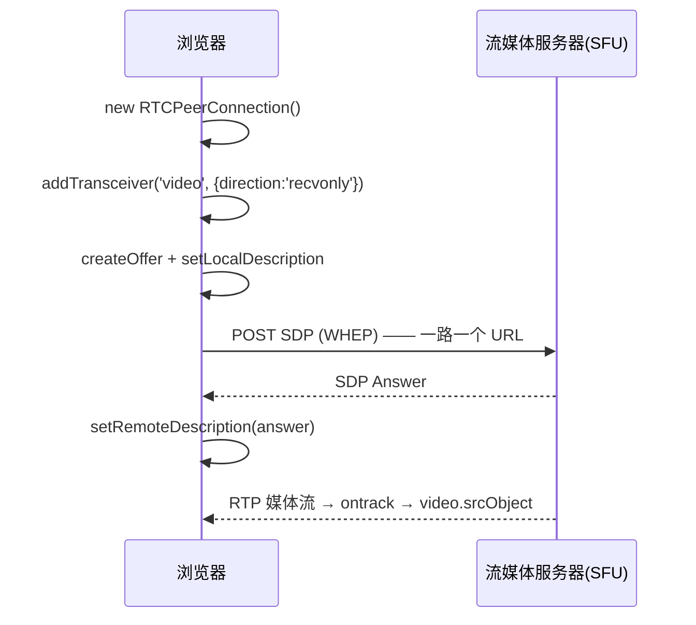
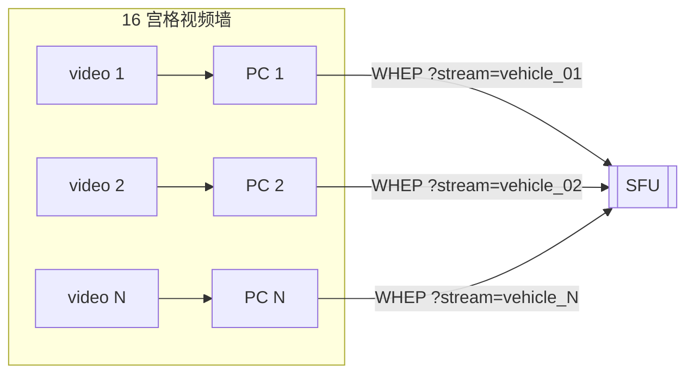
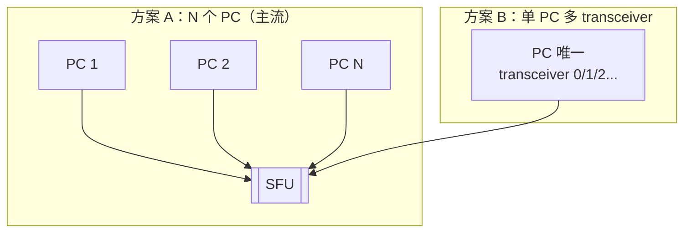
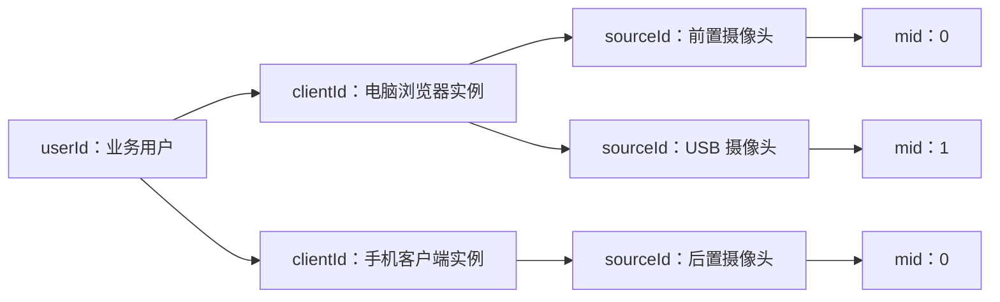
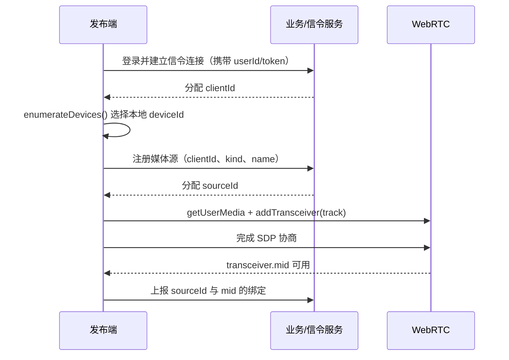

# WebRTC 多路视频拉流是怎么实现的

> **一句话结论：** 「多路拉流」不是在一个连接里塞多路视频，而是**每路视频各自建一个 `RTCPeerConnection`**，各走各的 WHEP/SDP 流程收流，再用一个 `Map<streamId, player>` 把 N 个连接和 N 个 `<video>` 元素对号入座、统一管理生命周期。真正的取舍在于「N 个连接」还是「单连接多 transceiver」。

---

## 一、先把「单路」讲清楚（多路就是 N 份单路）

多路是 N 路视频同时拉，但先得会拉一路——因为每一路都用完全相同的套路。单路拉流的四个动作：



```typescript
// 一路视频 = 1 个 PC + 1 个 WHEP 会话 + 1 个 video 元素
async function pullOneStream(video: HTMLVideoElement, url: string) {
  const pc = new RTCPeerConnection();
  // 只拉不推：声明 recvonly 收发器，让 Offer 里带上 m=video/m=audio
  pc.addTransceiver('video', { direction: 'recvonly' });
  pc.addTransceiver('audio', { direction: 'recvonly' });

  pc.ontrack = (e) => {
    video.srcObject = e.streams[0]; // 远端流挂到 video
    video.play().catch(() => {});
  };

  const offer = await pc.createOffer();
  await pc.setLocalDescription(offer);
  const res = await fetch(url, {
    method: 'POST',
    headers: { 'Content-Type': 'application/sdp' },
    body: offer.sdp,
  });
  await pc.setRemoteDescription({ type: 'answer', sdp: await res.text() });

  return pc;
}
```

关键点：`addTransceiver('video', { direction: 'recvonly' })` 会往 Offer 里写一条「只收」的媒体协商行，SDP 一来一回（WHEP）后服务器就开始推 RTP 过来。连的是服务器**公网地址**，一般不需要 STUN/TURN 打洞。

---

## 二、多路 = N 份单路，用一个管理器组织起来

既然一路一个 PC，那「拉多路」就是把上面的 `pullOneStream` 跑 N 遍，每路配一个 `<video>` 元素和一个 URL，再用 `Map` 记住「哪一路对应哪个 player」：



```typescript
class StreamPlayer {
  private pc: RTCPeerConnection | null = null;

  constructor(private video: HTMLVideoElement, private url: string) {}

  async start() {
    this.pc = new RTCPeerConnection();
    this.pc.addTransceiver('video', { direction: 'recvonly' });
    this.pc.addTransceiver('audio', { direction: 'recvonly' });

    this.pc.ontrack = (e) => {
      this.video.srcObject = e.streams[0];
      this.video.play().catch(() => {});
    };

    const offer = await this.pc.createOffer();
    await this.pc.setLocalDescription(offer);
    const res = await fetch(this.url, {
      method: 'POST',
      headers: { 'Content-Type': 'application/sdp' },
      body: offer.sdp,
    });
    await this.pc.setRemoteDescription({ type: 'answer', sdp: await res.text() });
  }

  destroy() {
    this.video.srcObject = null; // 先摘流再关连接，尽快释放解码资源
    this.pc?.close();
    this.pc = null;
  }
}

class StreamGrid {
  private players = new Map<string, StreamPlayer>();

  // 多路拉流的本质：register 一次 = 新起一路
  register(id: string, video: HTMLVideoElement, url: string) {
    const player = new StreamPlayer(video, url);
    this.players.set(id, player);
    player.start();
  }

  unregister(id: string) {
    this.players.get(id)?.destroy();
    this.players.delete(id);
  }

  // 单独控制某一路（一路断线不影响其它路）
  restart(id: string) {
    this.players.get(id)?.destroy();
    this.players.get(id)?.start();
  }
}
```

`Map<streamId, player>` 就是「多路」的骨架：加一路 = `register`，删一路 = `unregister`，某一路出问题只 `restart` 它自己。

---

## 三、核心取舍：N 个连接 vs 单连接多 transceiver

面试真正问「多路怎么实现」，落点通常在这道二选一。两种都能拉多路，代价完全不同：



| 维度 | N 个 PC（一路一连接） | 单 PC 多 transceiver |
| --- | --- | --- |
| 连接数 | N 个 DTLS/ICE 会话 | 1 个 |
| 每路独立性 | 完全解耦，一路断只重建自己 | 共享一条连接，断则全断 |
| 建连开销 | N 次握手（首屏略慢） | 1 次握手（省） |
| 路由 | `ontrack` 天然绑定自己的 PC | 要按信令维护的 `mid -> sourceId` 映射区分 |
| 服务端要求 | 标准 WHEP，每路一个会话 | SFU 得支持单会话多流（如 mediasoup 一个 transport 多 consumer） |
| 适用场景 | 跨 SFU/跨来源、要单独控制某路 | 同一 SFU、固定同房间多路、要省握手 |

**为什么监控场景用方案 A？** 无人车监控的路是「独立摄像机 + 独立 URL」（`?stream=vehicle_01`、`?stream=vehicle_02`…），天然一个 WHEP 会话一路流；而且「视口外关掉某一路」这种治理动作，直接 `destroy()` 一个 PC 最干净——方案 B 关一路还得和 SFU 协调单会话里的某个 transceiver，麻烦且耦合。

### 方案 B 长什么样（被追问时能写出）

```typescript
const pc = new RTCPeerConnection();
const t1 = pc.addTransceiver('video', { direction: 'recvonly' }); // 路 1
const t2 = pc.addTransceiver('video', { direction: 'recvonly' }); // 路 2

pc.ontrack = (e) => {
  // 单连接多路时，必须手动区分是哪一路
  const mid = e.transceiver.mid; // '0' / '1' / ...（对应 t1/t2 的顺序）
  const videoEl = grid.getVideoByMid(mid);
  videoEl.srcObject = e.streams[0];
};
```

> 注意：浏览器 API 本身**没有**「一个 transceiver 同时收多路视频」的用法——`recvonly` 的 transceiver 一个对应一路（一个 m-line）。所以「单连接多路」不是用一个 transceiver 收多路，而是**一个 PC 里放多个 transceiver**，靠 `mid` 区分。

### 多客户端、多摄像头怎么区分

**一句话结论：** 不同客户端用业务层的 `clientId`，同一客户端的不同摄像头用 `sourceId`；单连接多路时，再由信令把 `sourceId` 和 `transceiver.mid` 绑定。



#### `clientId` 和 `sourceId` 从哪里来

它们都不是 WebRTC 内置字段，而是**业务服务器生成的 ID**。推荐由服务端生成，是因为服务端还要用它们做鉴权、订阅、踢人和资源回收。



例如登录用户 Alice 打开一个浏览器标签页，信令服务可以返回：

```json
{
  "userId": "alice",
  "clientId": "client-7f3a"
}
```

然后浏览器先用 `deviceId` 获取本地摄像头，再向业务服务注册这次发布：

```typescript
const stream = await navigator.mediaDevices.getUserMedia({
  video: { deviceId: { exact: selectedDeviceId } },
});

const { sourceId } = await api.registerSource({
  clientId: "client-7f3a",
  kind: "camera",
  name: "USB 摄像头",
});
// 服务端返回：sourceId = "source-a102"

const transceiver = pc.addTransceiver(stream.getVideoTracks()[0], {
  direction: "sendonly",
  streams: [stream],
});
```

完成 `setLocalDescription` / `setRemoteDescription` 后，`mid` 才会由 SDP 协商确定。发布端再把三者绑定后发给信令服务：

```typescript
await negotiate(pc);

await signaling.send({
  type: "bind-source",
  clientId: "client-7f3a",
  sourceId,                 // 业务服务刚刚分配
  mid: transceiver.mid,     // SDP 协商后得到
});
```

对于固定监控摄像机，`sourceId` 通常不是临时生成，而是设备录入平台时就存入数据库的摄像机 ID，例如 `warehouse-camera-03`。对于临时加入的手机或浏览器摄像头，则可以在每次发布时由服务端生成 UUID。

如果只是没有后端的本地 Demo，也可以用 `crypto.randomUUID()` 生成 `clientId` 和 `sourceId`；但生产环境仍要把它们提交给信令服务登记，不能只保存在发布端内存里。

`clientId` 表示一个客户端实例而不是用户：同一用户同时打开电脑端和手机端，应拿到两个不同的 `clientId`。断线重连是否复用它由业务决定；若要恢复原订阅关系，可以在短时间内复用，服务端仍应另外生成每次连接独有的 `connectionId`。

`mid` 只在所属 `RTCPeerConnection` 内有意义，因此完整定位一条视频通常使用：

```text
clientId + sourceId             // 业务身份
peerConnectionId + mid          // WebRTC 传输位置
```

信令服务器维护两者之间的映射。例如客户端发布两个摄像头后发送：

```json
{
  "type": "source-map",
  "clientId": "client-7f3a",
  "sources": [
    { "sourceId": "source-a101", "name": "前置摄像头", "mid": "0" },
    { "sourceId": "source-a102", "name": "USB 摄像头", "mid": "1" }
  ]
}
```

接收端先保存信令元数据，再在 `ontrack` 中按 `mid` 查业务身份：

```typescript
type RemoteSource = {
  clientId: string;
  sourceId: string;
};

const sourceByMid = new Map<string, RemoteSource>();

pc.ontrack = (event) => {
  const mid = event.transceiver.mid;
  if (mid === null) return;

  const source = sourceByMid.get(mid);
  if (!source) return;

  renderVideo(source.clientId, source.sourceId, event.streams[0]);
};
```

几个 ID 的职责不要混用：

| ID | 用途 | 是否适合作为稳定业务身份 |
| --- | --- | --- |
| `userId` | 区分业务用户 | 不足够，同一用户可能同时登录多个端 |
| `clientId` | 区分浏览器标签页、App 实例等客户端 | 是 |
| `sourceId` | 区分前置、后置、USB 等业务媒体源 | 是 |
| `mid` | 区分一个 PC 内的 m-line/transceiver | 仅适合连接内路由 |
| `track.id` / `stream.id` | 标识当前 WebRTC 媒体对象 | 否，重建或换轨后可能变化 |
| `deviceId` | 本地浏览器选择物理设备 | 否，不应暴露给远端且可能变化 |

例如切换物理摄像头时，可以保留原来的 transceiver 和业务 `sourceId`：

```typescript
await transceiver.sender.replaceTrack(newCameraTrack);
```

此时 `mid` 和 `sourceId` 不变，但 `track.id` 可能变化，所以页面布局、权限和订阅关系都应绑定 `sourceId`，不要绑定 `track.id`。

---

## 四、拉起来之后要治理什么

多路「实现」本身不难，难在**多路并发**之后的资源问题：每路都意味着一个 PC + 一路 H.264 解码，GPU 硬解会话数有限，超出回落软解会打满 CPU 拖死整页。两个后续话题：

- 解码压力治理（限制并发、可见性优先、拉子码流、失败降级）→ [多路并发解码性能瓶颈优化](./多路并发解码性能瓶颈优化.md)
- 弱网断线自愈（状态机 + 看门狗）→ [断线恢复](./断线恢复.md)

---

## 面试回答

> 多路拉流的实现核心是「**一路一个 RTCPeerConnection**」：每路视频 `addTransceiver('video', { direction: 'recvonly' })` 声明只收，走 WHEP 用一次 HTTP 往返交换 SDP，`ontrack` 把 `e.streams[0]` 挂到对应的 `<video>` 元素；N 路就是跑 N 次，用一个 `Map<streamId, player>` 统一管理每路连接的启停。这里有个取舍：可以 N 个连接各拉各路，解耦好、单路断不影响别人、关某一路就是 `destroy()` 一个 PC；也可以一个连接放多个 transceiver 收多路，省握手但耦合、要靠 `mid` 区分。监控场景因为每路是独立摄像头独立 URL，主流是 N 个连接。拉起来之后的多路解码压力和断线恢复是另一个话题——硬解会话数有限、超出回落软解打满 CPU，所以还要做并发治理和子码流降档。

## 相关资料

- [多路并发解码性能瓶颈优化](./多路并发解码性能瓶颈优化.md)
- [断线恢复](./断线恢复.md)
- [WebRTC 整体流程（SDP/ICE 交换）](./webRTC整体流程.md)
- [WebRTC 高频问题梳理](./高频梳理.md)
