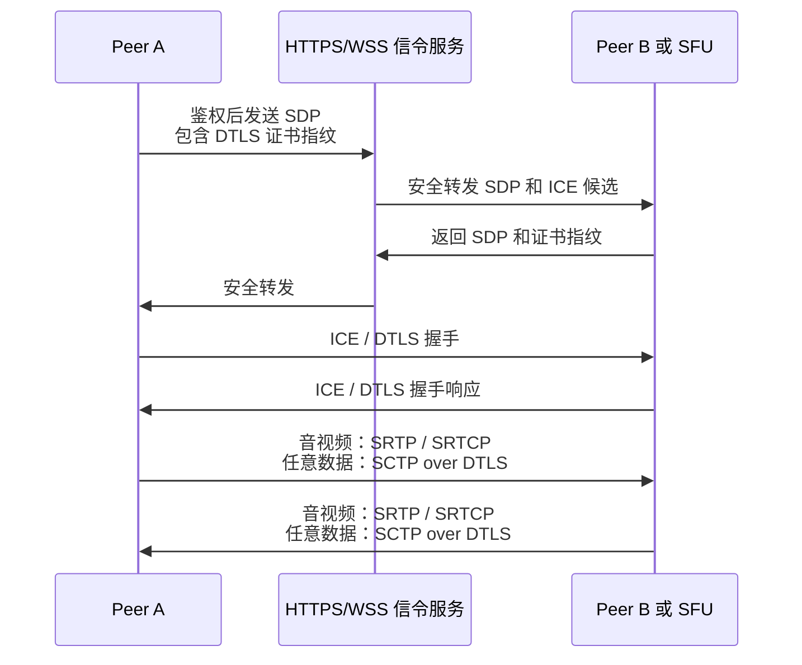
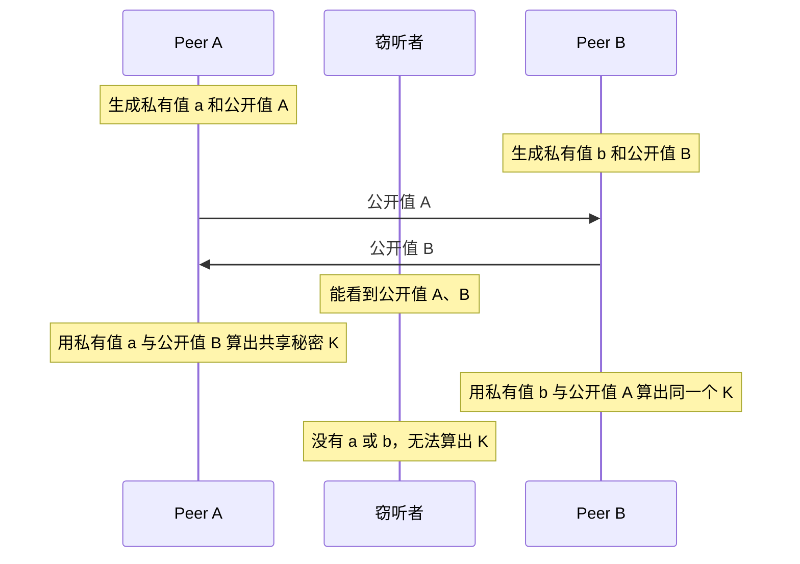
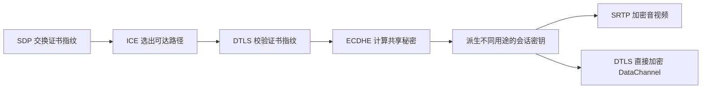
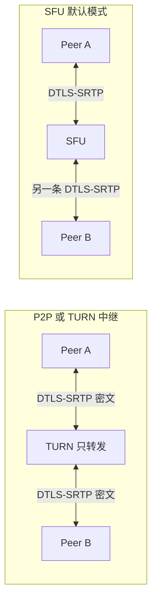

# WebRTC 数据传输怎么保证安全

> 一句话结论：WebRTC 通过安全信令校验通信身份，使用 DTLS 握手协商密钥；音视频走 DTLS-SRTP，数据通道走 SCTP over DTLS，从而提供加密、完整性校验和防重放。P2P 通常是端到端加密，但经过 SFU 时默认只是逐跳加密。

## 安全链路



## 分层保证

| 层次 | 机制 | 解决的问题 |
| --- | --- | --- |
| 页面与设备 | HTTPS 安全上下文、摄像头和麦克风授权 | 防止不可信页面静默采集媒体 |
| 信令层 | HTTPS/WSS、登录鉴权、房间权限、消息校验 | 防止 SDP、ICE 候选和 DTLS 指纹被窃听或替换 |
| 身份与密钥 | DTLS 握手、SDP 中的证书指纹 | 验证当前连接证书，协商临时会话密钥 |
| 音视频 | DTLS-SRTP / SRTCP | 加密 RTP/RTCP，并提供完整性校验和防重放 |
| 数据通道 | SCTP over DTLS | 加密聊天、文件、游戏指令等任意数据 |
| 中继 | TURN 鉴权、短期凭证，可配 TLS | 防止 TURN 被滥用；TURN 只转发端到端已加密的数据包 |
| 业务层 | 用户身份、房间授权、限流、审计 | 防止未授权入会、撞房和接口滥用 |

## DTLS-SRTP 是怎么工作的

DTLS 可以理解为“适用于 UDP 的 TLS”。它不是简单地把一个密码发给对方，而是通过握手让双方**各自在本地算出相同的会话密钥**。

### 第一步：确认正在和谁握手

每个端点先生成 DTLS 证书，SDP 只交换证书的 SHA-256 指纹，不交换私钥和媒体密钥：

```sdp
a=fingerprint:sha-256 8A:7B:...:2F
a=setup:actpass
```

收到对方证书后，浏览器重新计算证书指纹，与 SDP 中的值比较，并在 DTLS 握手中验证对方确实持有该证书对应的私钥：

```text
SHA-256（握手收到的证书） === SDP 中的 fingerprint
```

不一致就终止连接。这一步把 DTLS 连接与信令中协商的通信对象绑定起来，所以信令本身必须使用 HTTPS/WSS 并做好身份鉴权。

### 第二步：双方算出同一个密钥

DTLS 握手通常通过临时椭圆曲线 Diffie-Hellman（ECDHE）交换公开参数。简化理解如下：



#### 用一组小数字理解

先用普通 Diffie-Hellman 演示数学原理。双方约定公开数字 `p = 23`、`g = 5`，`mod` 表示取余数：

| 步骤 | Peer A | Peer B |
| --- | --- | --- |
| 各自保密的私有数 | `a = 6` | `b = 15` |
| 算出并发送公开值 | `A = 5⁶ mod 23 = 8` | `B = 5¹⁵ mod 23 = 19` |
| 收到对方公开值后计算 | `K = 19⁶ mod 23 = 2` | `K = 8¹⁵ mod 23 = 2` |

两边结果相等不是巧合。先完全忽略 `mod`，换成更小的数：公开数 `g = 5`，A 的私有数 `a = 2`，B 的私有数 `b = 3`。

```text
A 先公开：A = 5² = 25
B 先公开：B = 5³ = 125

A 收到 125，再使用自己的私有数 2：
125² = 125 × 125 = 15625

B 收到 25，再使用自己的私有数 3：
25³ = 25 × 25 × 25 = 15625
```

原因是 A 做的事情等于把 `5³` 重复乘 `2` 次，总共出现 `3 × 2 = 6` 个 `5`；B 则把 `5²` 重复乘 `3` 次，总共出现 `2 × 3 = 6` 个 `5`。因为 `3 × 2 = 2 × 3`，所以结果一定相同。

```text
A：5³ × 5³     = 6 个 5 相乘
B：5² × 5² × 5² = 6 个 5 相乘
```

真实计算中的 `mod 23` 表示每一步都取除以 23 的余数，用来限制数字大小并形成难以逆推的单向计算。取余不会破坏上面的规律，所以双方最终仍会得到相同余数。

网络上传输的只有 `p、g、A、B`，私有数 `a、b` 从未发出。示例数字很小，可以暴力枚举；真实协议使用巨大的参数，使攻击者从公开值反推出私有值在计算上不可行，这就是离散对数难题。

#### ECDHE 中的对应关系

ECDHE 把普通幂运算换成椭圆曲线点运算。双方约定公开的基点 `G`：

```text
Peer A：私有值 a，公开值 A = aG
Peer B：私有值 b，公开值 B = bG

Peer A 收到 B：K = aB = a(bG) = abG
Peer B 收到 A：K = bA = b(aG) = abG
```

所以双方能得到同一个 `K = abG`。窃听者虽然知道 `G、A、B`，但从 `A = aG` 反推出 `a` 属于椭圆曲线离散对数问题，在合适参数下不可行。

这里可以把 `aG` 暂时理解成“把椭圆曲线上的点 `G` 重复相加 `a` 次”。A 对 `bG` 再重复操作 `a` 次，最终相当于操作 `a × b` 次；B 对 `aG` 操作 `b` 次，最终是 `b × a` 次，因此结果相同。

共享秘密 `K` 从未在网络中直接传输。双方再通过密钥派生函数，从 `K` 和握手随机数派生出加密密钥、认证密钥以及 SRTP 所需的密钥材料；使用临时密钥交换还能提供前向保密。

### 第三步：加密并检测篡改

以一个 DataChannel 数据包为例，可以把 DTLS 处理后的结构简化为：

```text
发送前：hello

发送后：序号 42 | 密文 7f9a... | 认证标签 a31c...
                         ↑              ↑
                    会话密钥加密    对序号和密文做完整性认证
```

接收方使用相同会话密钥解密，并重新校验认证标签：

- 密文被修改一个 bit，认证标签就无法通过，数据被丢弃。
- 没有会话密钥，攻击者无法伪造合法的认证标签。
- 数据在网络中是密文，窃听者无法直接读取内容。

### 第四步：拒绝重复数据包

DTLS/SRTP 会维护包序号和重放窗口。攻击者把以前抓到的合法密文再次发送时，即使认证标签正确，也会因为序号已经处理过而被丢弃。

### DTLS 最终保护谁



这里要区分两条数据链路：

| 数据类型 | DTLS 的作用 | 真正承载数据的安全协议 |
| --- | --- | --- |
| 音视频 | 握手、验证身份、为 SRTP 派生密钥 | SRTP / SRTCP 加密媒体包 |
| DataChannel | 握手并直接加密 SCTP 数据 | SCTP over DTLS |

因此更准确的说法是：**DTLS 直接保护 DataChannel；对音视频，DTLS 负责安全地协商密钥，SRTP 使用这些密钥逐包加密和认证。**

## 为什么信令必须安全

WebRTC 没有规定信令协议，SDP 和 ICE 通常由业务的 WebSocket 或 HTTP 服务转发。攻击者如果能篡改信令，就可能同时替换 SDP 中的地址和 DTLS 指纹，让双方各自与攻击者建立“校验正确”的加密连接。

因此生产环境至少要做到：

1. 信令只走 `HTTPS/WSS`，校验服务端证书。
2. 用户登录后才能加入房间，并校验呼叫双方、房间和租户权限。
3. Offer、Answer、ICE 消息绑定 `userId + roomId + sessionId`，校验消息类型、大小和状态机顺序。
4. 敏感场景可在业务身份体系中再次校验或签名 DTLS 指纹，防止信令服务被绕过或篡改。

## P2P、TURN 和 SFU 的安全边界



| 拓扑 | 谁能看到媒体明文 | 媒体是否只在通信端点解密 |
| --- | --- | --- |
| P2P 直连 | 通信双方 | 是 |
| TURN 中继 | 通信双方；TURN 通常只看到加密包和网络元数据 | 是 |
| SFU 转发 | 通信双方和 SFU | 默认不是，只是客户端到 SFU 的逐跳加密 |
| SFU + Insertable Streams / SFrame | 持有业务层密钥的通信成员 | 可以实现，SFU 只处理加密媒体帧和必要元数据 |

多人会议通常依赖 SFU 做选层和转发。若会议要求服务端也无法读取内容，需要在 SRTP 之上增加应用层端到端加密，并额外解决成员身份验证、群组密钥分发、成员进出时换钥和录制能力等问题。

## 生产环境检查清单

- 页面、信令接口和 WebSocket 全部使用 HTTPS/WSS，禁止混合内容。
- TURN 使用短期、可过期的动态凭证，限制带宽和来源，不在前端长期写死密码。
- 对加入房间、发布流、订阅流分别鉴权，不能只验证房间号存在。
- 不记录完整 SDP、ICE 地址、TURN 密码或媒体内容；日志做好脱敏和访问控制。
- 监听异常 ICE/DTLS 状态、鉴权失败和异常并发，配合限流与审计告警。
- 需要“服务器不可见”的强 E2EE 时，明确采用 Insertable Streams / SFrame，而不是把普通 SFU 链路误称为端到端加密。

## 面试回答

> WebRTC 的安全要分层回答。首先信令要走 HTTPS 或 WSS，并对用户和房间鉴权，因为 SDP 里包含 DTLS 证书指纹，信令被篡改会产生中间人风险。ICE 建立传输路径后，双方进行 DTLS 握手，校验证书指纹并协商密钥；音视频使用 DTLS-SRTP，提供加密、完整性校验和防重放，DataChannel 则是 SCTP over DTLS。TURN 只负责中继，通常看不到媒体明文。还要注意多人会议经过 SFU 时默认是逐跳加密，SFU 可以解密媒体；如果要求服务端也不可见，需要再使用 Insertable Streams 或 SFrame 做应用层端到端加密，并配套群组密钥管理。

## 相关资料

- [WebRTC 整体流程](./webRTC整体流程.md)
- [WebRTC Security Architecture（RFC 8827）](https://www.rfc-editor.org/rfc/rfc8827.html)
- [Security Considerations for WebRTC（RFC 8826）](https://www.rfc-editor.org/rfc/rfc8826.html)
- [DTLS-SRTP（RFC 5764）](https://www.rfc-editor.org/rfc/rfc5764.html)
- [WebRTC Data Channels（RFC 8831）](https://www.rfc-editor.org/rfc/rfc8831.html)
