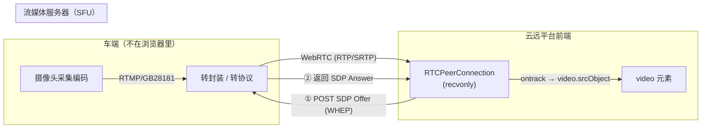
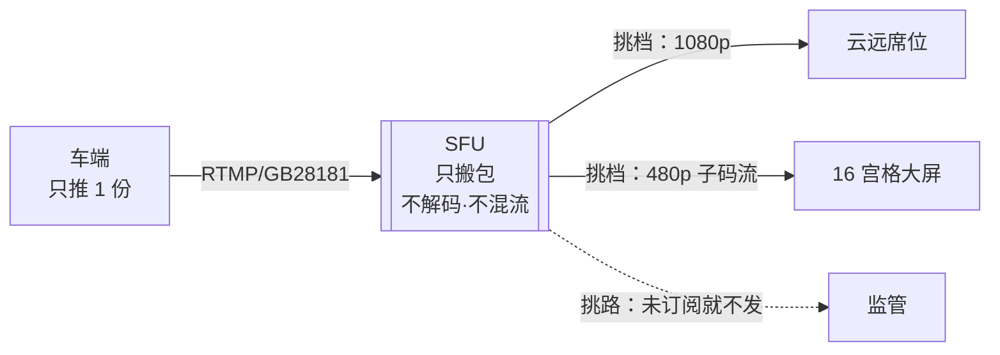
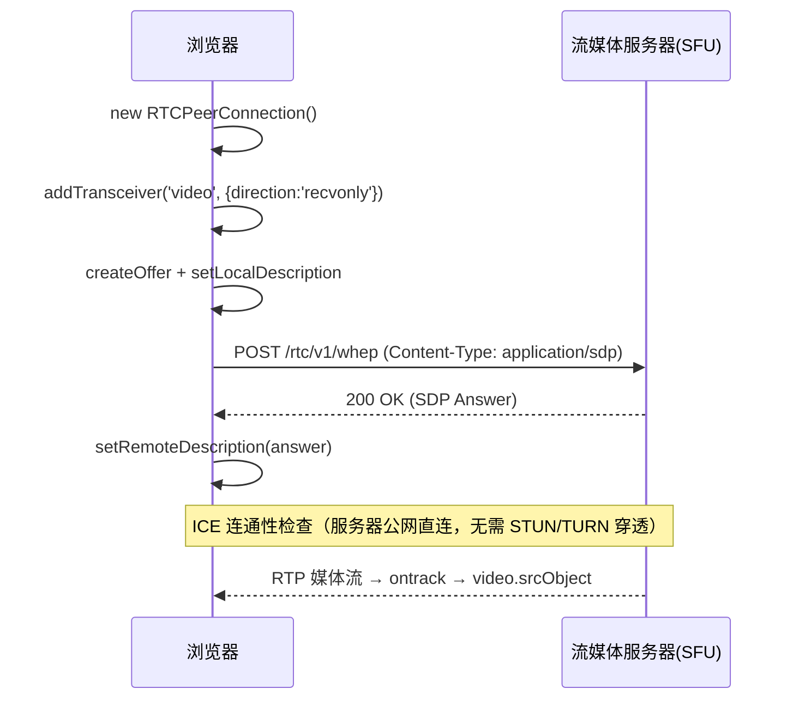
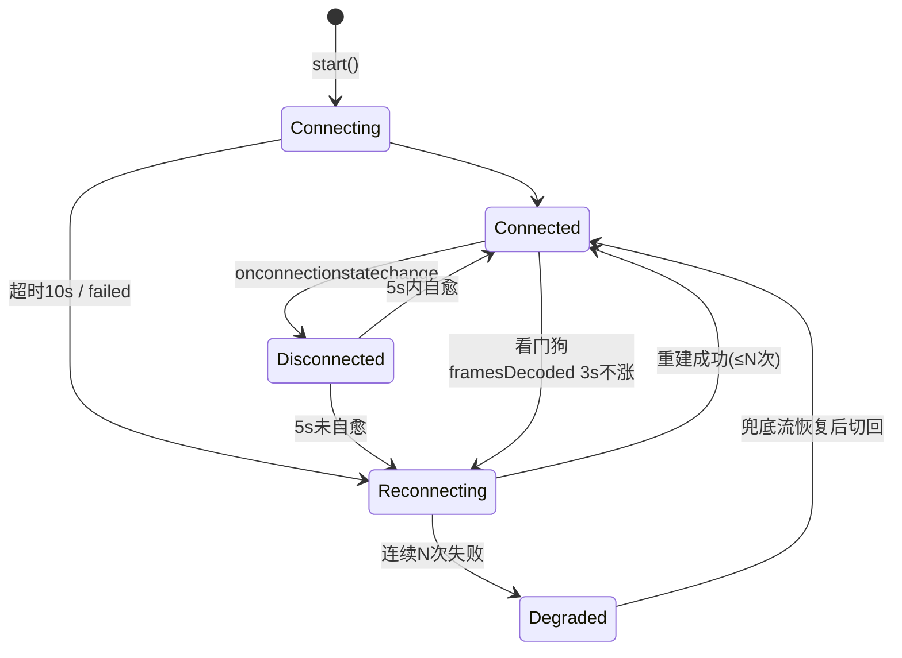
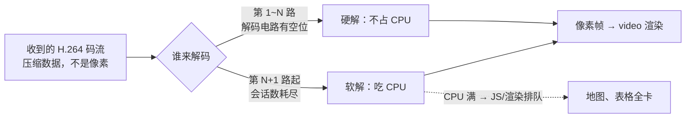
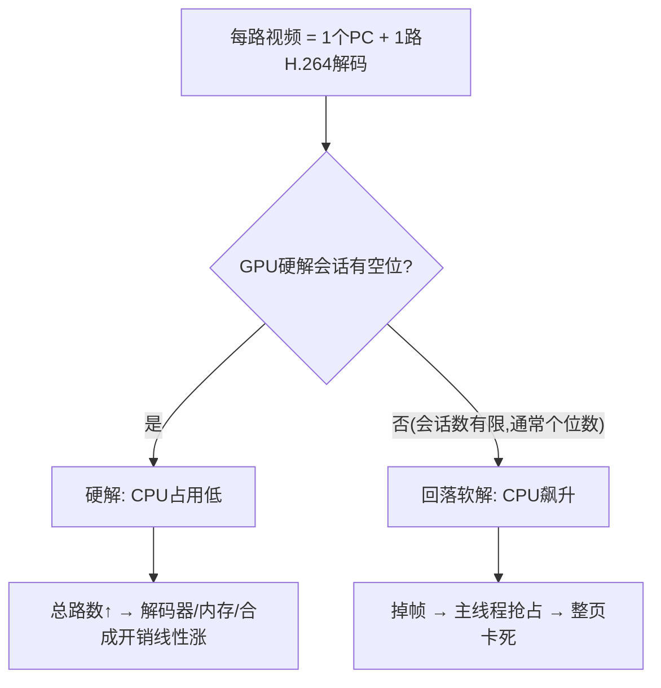

# 多路拉流与断线恢复（无人车监控场景）

> **一句话结论：** 无人车远程监控是「只拉不推」的播放场景——浏览器建 `recvonly` 的 RTCPeerConnection 向流媒体服务器（SFU）拉流，核心难题不在建连，而在**多路并发的解码压力治理**与**弱网下的断线自愈 + 降级**。

> 🎮 **配套可运行 demo**：[demo/index.html](./demo/index.html)（单文件双击即跑）——真实 RTCPeerConnection 复现本文全部代码：宫格/分辨率切换压测解码、冻结/掐断演练状态机与看门狗、IntersectionObserver 视口治理。演练脚本见 [demo/README.md](./demo/README.md)。

---

## 一、拉流模式和视频通话的区别（必问）

| 维度 | 视频通话（P2P / SFU 双向） | 监控拉流（单向播放） |
| --- | --- | --- |
| 方向 | 双向推拉（sendrecv） | 只收不发（recvonly） |
| 媒体来源 | getUserMedia 采集 | 无人车摄像头经服务端转发 |
| 连接对象 | 对端浏览器 | 流媒体服务器（SRS / ZLMediaKit / 云 RTC） |
| 信令 | 自定义 WebSocket | 通常走标准协议 WHEP（HTTP 交换 SDP） |
| 不需要 | getUserMedia、本地编码 | —— |
| 关键治理 | 丢包对抗、带宽估计 | 多路解码、断线恢复、降级 |



**为什么不用 HLS/FLV 而用 WebRTC？** 控车/监控要求延迟亚秒级，WebRTC 几十~几百毫秒，HLS 10s+、FLV 1~5s。详见 [hls、flv、webRTC 区别](../hls、flv、webRTC区别.md)。

**名词：SFU（Selective Forwarding Unit，选择性转发单元）是什么？**

> **一句话结论：** SFU 是「只搬包、不拆包」的服务器——收到 RTP 原样转发，**不解码、不混流、不转码**，所以轻量，一台能扛几百上千路。



N 方要看同一路视频，服务器有三种当法：

| 方案 | 服务器干什么 | 每人上行 | 短板 |
| --- | --- | --- | --- |
| Mesh | 不存在，两两直连 | N-1 份 | ≥4 人带宽爆炸 |
| MCU | 解码→合成 1 路→再编码 | 1 份 | 编解码太重、延迟叠加 |
| **SFU** | **只转发 RTP 包** | 1 份 | 只加一跳；SRS / ZLMediaKit / LiveKit / mediasoup 都是它 |

「**选择性**」= 两个挑选（见上图）：

- **挑路**：按订阅关系，订哪几路转发哪几路；
- **挑档**：车端一次推多档（simulcast），SFU 按接收端网络挑一档发——后文「拉子码流」治理的服务端基础。

无人车链路里的四个动作：收车端推流 → 转封装成 RTP（H.264 进 H.264 出，只换包装）→ 提供 WHEP 端点 → 一份进 N 份出。demo 里 `MockSFU` 演的就是这个角色。

**追问：为什么是 SFU 公网架构，而不是 P2P？**（架构选型题）两层原因：

1. **没有对端可直连**：车端是嵌入式设备走 RTMP/GB28181 进云，会说 WebRTC 的「那辆车」根本不存在——协议转换发生在服务器上，浏览器要拉的流只以 WebRTC 形态存在于 SFU 里。
2. **就算能 P2P 也不能用**：
   - **一对多**：一路车被席位/大屏/监管同时看，P2P 下车端上行 ×N 爆炸；SFU 分发，车只推一份，还能给不同观察者发不同子码流；
   - **移动网络 NAT**：车在 CGNAT 后且多为 symmetric NAT，打洞基本必败（详见 [理解为什么对称 NAT 无法穿透](./理解为什么对称nat无法穿透.md)），兜底 TURN 中继绕一圈还是过公网服务器；
   - **能力只能放服务端**：录制存档（事故追溯监管刚需）、子码流转码、鉴权水印、与控车信令同体系；
   - **安全**：P2P 把车端媒体面暴露给互联网观察者，攻击面直接怼到车上。
3. **延迟反问**（P2P 不是更低吗）：监控只要亚秒级，SFU 一跳几百 ms 足够且**可预期可监控**；P2P 打洞失败走 TURN 后无优势还不可控。

---

## 二、WHEP 拉流完整流程（真实代码）

WHEP（WebRTC-HTTP Egress Protocol，IETF WISH 工作组，与推流方向 WHIP 成对）：用一次 HTTP 往返交换 SDP，把「信令通道」标准化。SRS、ZLMediaKit、LiveKit、Cloudflare 都实现同一端点。

**用 WHEP vs 自建 WebSocket 信令**：

| 维度 | 自建 WS 信令 | WHEP |
| --- | --- | --- |
| 消息格式 | 私有约定，每家 SFU 不一样 | 标准：POST SDP → 201 answer |
| 服务端适配 | 换 SFU/云厂商要重写信令 | 换 URL 不换代码，降供应商锁定 |
| 连接运维 | 长连接心跳/重连/LB 粘性 | 无状态 HTTP，LB/网关/鉴权直接复用 |
| 断开 | 自己设计消息 | `DELETE` 会话资源，幂等 |
| 业务信号 | 可混入信令 | 只管媒体会话，业务信令另走业务接口 |

**为什么拉流场景选它**：① SDP 只需和 SFU 一来一回，无 P2P 对端，HTTP 天然够，维护 WS 长连接属过度设计；② 断线恢复 = 整体重建 = 重新 POST，无状态反成优势，HTTP 状态码即语义（404 流离线触发退避）；③ 基建对 HTTP 的支持远好于 WS。**边界**：需要服务端持续推事件（成员/告警/房间控制）的场景用 WS/SSE；WHEP 与业务信令是并列不是替代。

协议就三个动词：

```http
POST /rtc/v1/whep/?app=live&stream=vehicle_01   (Content-Type: application/sdp, body=offer)
   → 201 Created；Location 指向会话资源；body=answer
DELETE <Location>                                # 主动断开（对应 destroy）
PATCH  <Location>                                # 可选：trickle ICE 候选
```



### 最小可运行示例（TypeScript）

```typescript
class WhepPlayer {
  private pc: RTCPeerConnection | null = null;

  constructor(
    private video: HTMLVideoElement,
    private url: string, // 如 https://rtc.example.com/rtc/v1/whep/?app=live&stream=vehicle_01
  ) {}

  async start() {
    this.pc = new RTCPeerConnection();
    // 只拉不推：声明两个 recvonly 收发器，让 Offer 里带上 m=video/m=audio
    this.pc.addTransceiver('video', { direction: 'recvonly' });
    this.pc.addTransceiver('audio', { direction: 'recvonly' });

    this.pc.ontrack = (e) => {
      // 同步把远端流挂到 video；autoplay 需 muted 才能免交互播放
      this.video.srcObject = e.streams[0];
      this.video.play().catch(() => {}); // 未交互时可能被拦，静默降级
    };

    const offer = await this.pc.createOffer();
    await this.pc.setLocalDescription(offer);

    const res = await fetch(this.url, {
      method: 'POST',
      headers: { 'Content-Type': 'application/sdp' },
      body: offer.sdp,
    });
    if (!res.ok) throw new Error(`WHEP ${res.status}`);

    await this.pc.setRemoteDescription({ type: 'answer', sdp: await res.text() });
  }

  destroy() {
    this.video.srcObject = null; // 先摘流再关连接，尽快释放解码资源
    this.pc?.close();
    this.pc = null;
  }
}
```

**信令去哪了？**（高频追问）WebRTC 规范故意不定义信令协议——SDP 怎么送到对端，随你用什么通道。通话 demo 里常见自建 WebSocket；WHEP 把通道标准化成**一次 HTTP 往返**，上面代码里的 fetch 就是信令本身：

| | 自建信令（通话 demo） | WHEP（本例） |
| --- | --- | --- |
| 发 Offer | `ws.send({type:'offer', sdp})`，服务器转发给对端浏览器 | `fetch(url, { body: offer.sdp })` —— **POST 请求体就是 Offer** |
| 收 Answer | `ws.onmessage` 收对端 answer | `res.text()` —— **HTTP 响应体就是 Answer** |
| 为什么 | P2P 要把 SDP 中转给**另一个浏览器** | 对端就是 SFU 自己，一来一回即完成，无需中转 |

连 `onicecandidate` 都没有：信令本该还有 ICE candidate 交换，但连的是服务器**公网地址**——Answer 自带公网 candidate，客户端发起的连通性检查（出站 UDP）可穿 NAT，无需 STUN/TURN 也不用 trickle。demo 里 `LoopbackSignal.exchange()` 干的就是这次 fetch 的活，接口同为「送 Offer、回 Answer」才能一行换接真 SRS。

**追问：那 Offer 的 SDP 里到底有没有 candidate？**（易混点）`setLocalDescription` 才开始收集候选，上面「立即 POST」的写法发出去的 Offer 里通常**还没有** `a=candidate:` 行——候选全丢弃也能通，靠的就是上面那条公网架构红利。真实实现三种姿势：① 立即 POST 不补（本文/demo，公网服务器场景最省）；② non-trickle——等 `iceGatheringState === 'complete'` 再 POST，候选全包进 SDP 一次发完（实现简单，首帧略慢）；③ trickle——SDP 先发，候选「收集到一个转发一个」（自建信令里即 `onicecandidate → ws.send(candidate)`，对端 `addIceCandidate`；WHEP 里对应 `PATCH application/trickle-ice-sdpfrag`）。trickle 收益来自候选收集分阶段：host 几乎瞬时、srflx 一个 RTT、relay 最慢——逐滴下发让最快候选先建连，**首帧最快**，是 P2P 通话主流；拉流连公网服务器则通常用不上（姿势①就够）。

**再追问：所以 `onicecandidate` 不是必要操作？** 对，且任何场景都不是——它只是「候选边收边通知」的搬运口，候选由 ICE agent 自动收集并**自动写进 `localDescription.sdp`**（non-trickle 等收完直接读 SDP 即可，无需监听）。真正必要的是「**对端得知你的候选**」：P2P 双方都在 NAT 后、互相够不到，才必须交换地址（所以通话 demo 里这个事件满天飞）；拉流对端是公网服务器，你主动出站就够得到它，自然一条候选都不用发。判据一句话：**够得到对端就不用预告地址，够不到才要交换**。

**和通话模式的代码差异**（面试点）：

- 没有 `getUserMedia`、没有 `addTrack` 推流；
- 用 `addTransceiver('video', { direction: 'recvonly' })` 代替，让 Offer 中带上媒体协商行；
- 拉流端连的是服务器公网地址，**一般不需要 STUN/TURN 穿透**（车端→服务器那一段由服务端处理），NAT 穿透难题被 SFU 架构消解了。

---

## 三、断线恢复（状态机 + 看门狗）

### 3.1 为什么 `connected → disconnected` 不能立刻重连

| connectionState | 含义 | 该做什么 |
| --- | --- | --- |
| `connecting` | ICE 检查中 | 等待，设超时（如 10s） |
| `connected` | 媒体通路建立 | 清除重连计数，启动看门狗 |
| `disconnected` | 瞬时失联，可能自愈 | **等 2~5s**，不自愈再重连（弱网抖动很常见，立刻重建反而雪上加霜） |
| `failed` | ICE 放弃 | 立刻重连（退避） |
| `closed` | 主动关闭 | 不处理 |

**看门狗（watchdog）**：`connectionState` 只反映传输层，还有一类「连接活着但画面冻结」（服务端推流中断）。靠 `getStats()` 轮询 `framesDecoded` 是否增长判活。



### 3.2 带看门狗的重连实现（真实代码）

```typescript
class WatchdogPlayer {
  private pc: RTCPeerConnection | null = null;
  private attempts = 0;            // 重连次数
  private lastDecoded = -1;        // 上次采样已解码帧数
  private watchdogId = 0;          // 看门狗定时器
  private readonly MAX_ATTEMPTS = 5;

  constructor(
    private video: HTMLVideoElement,
    private url: string,
    private onDegrade?: () => void, // 连续失败 → 降级回调（切 HLS/FLV）
  ) {}

  async start() { await this.connect(); this.watch(); }

  private async connect() {
    // —— 与上面 WhepPlayer.start 相同的建连流程 ——
  }

  /** 看门狗：3s 采样一次，framesDecoded 不增长视为冻结 */
  private watch() {
    clearInterval(this.watchdogId);
    this.watchdogId = window.setInterval(async () => {
      const pc = this.pc;
      if (!pc) return;
      if (pc.connectionState !== 'connected') return; // 状态机事件已处理

      const stats = await pc.getStats();
      let decoded = 0;
      stats.forEach((r) => {
        if (r.type === 'inbound-rtp' && r.kind === 'video') decoded = r.framesDecoded;
      });
      if (decoded === this.lastDecoded) {
        console.warn('[player] 冻结，触发恢复');
        this.scheduleReconnect();
      }
      this.lastDecoded = decoded;
    }, 3000);
  }

  /** 指数退避重连：1s → 2s → 4s → 8s...，超上限走降级 */
  private scheduleReconnect() {
    if (this.attempts >= this.MAX_ATTEMPTS) {
      this.destroy();
      this.onDegrade?.(); // 降级到 HTTP-FLV / HLS
      return;
    }
    const delay = Math.min(1000 * 2 ** this.attempts, 15000);
    this.attempts++;
    setTimeout(() => this.destroy().then(() => this.start()), delay);
  }

  destroy() {
    clearInterval(this.watchdogId);
    this.video.srcObject = null;
    this.pc?.close();
    this.pc = null;
    return Promise.resolve();
  }
}
```

**面试要点**：重连要做**整体重建**（close 旧 PC → 重新 offer），因为拉流场景 SDP 由服务端生成、IC­E restart 收益小；退避防止服务端故障时万端齐连（雪崩）。

---

## 四、多路并发解码压力（本岗位最核心的问题）

### 4.1 背景：什么是硬解 / 软解（解码发生在哪）

> **一句话结论：** 网络传来的是 H.264/H.265 **压缩码流**，不是像素——必须先解码成帧才能渲染。交给 GPU 里的专用解码电路 = **硬解**（快、省 CPU，但会话数有规格上限）；交给 CPU 跑解码算法 = **软解**（什么都能解，但和页面 JS/渲染抢同一个 CPU）。

| | 硬解 | 软解 |
| --- | --- | --- |
| 执行者 | GPU 专用解码电路（NVDEC / QuickSync / Apple 媒体引擎） | CPU 通用指令（ffmpeg 式软件解码） |
| 速度 / 功耗 | 快、省电 | 慢、费电 |
| 并发上限 | **会话数受显卡规格限制**，1080p 通常个位数~十几路 | 无会话数概念，但每路吃 20%~50% 一个核心 |
| 超限后果 | 多出的路**自动回落软解** | CPU 打满 → 主线程排队 → 整页卡死 |



**直觉数字**：单路 1080p 软解吃 20%~50% 一个核心，4 路并发足以打满一颗。解码线程、主线程、合成线程共享同一个 CPU 资源池——所以卡的不只是视频，是整页。demo 里切 4×4 + 1080p 风扇起飞就是这个现象（环回还叠加 16 路编码压力）。

### 4.2 为什么 16 宫格会把浏览器拖死



- 每一路 `RTCPeerConnection` 都要独立解码一路 H.264/H.265 码流；
- GPU 硬解**并发会话数有限**（受显卡解码器规格限制，1080p 通常只到个位数），超出部分回落 CPU 软解；
- 软解 4 路 1080p 就足以打满一颗核心 → 主线程被抢占，地图、表格全部卡死。

### 4.3 治理手段（按优先级）

| 手段 | 做法 | 效果/代价 |
| --- | --- | --- |
| **限制并发路数** | 9 宫格内才解码；网格分页/虚拟滚动 | 最直接；超出部分显示封面或占位 |
| **可见性优先** | IntersectionObserver 检测视口，视口外的路**关闭 PC**（不是 video.pause） | 解码仍在浏览器里进行，pause 省不了多少；关 PC 才真正释放解码会话与带宽。恢复时有 1~2s 重连代价 |
| **拉子码流** | 请求低分辨率档位（SRS simulcast / 服务端转码出 480p 子流） | 多画面墙看的是态势不是细节，子码流解码开销 1/4 起 |
| **降低帧率诉求** | 监控场景 15fps 足够 | 服务端控制 |
| **降级兜底** | WebRTC 反复失败 → HTTP-FLV(mpegts.js) → HLS | 牺牲延迟保可用 |

### 4.4 视口外暂停的实现（真实代码）

```typescript
class VideoWall {
  private players = new Map<string, { el: HTMLVideoElement; url: string; player: WatchdogPlayer | null }>();

  constructor(private container: HTMLElement) {
    // 视口交叉检测：进入视口才建连拉流，离开即销毁
    const io = new IntersectionObserver(
      (entries) => {
        for (const e of entries) this.toggle(e.target as HTMLElement, e.isIntersecting);
      },
      { root: this.container, rootMargin: '100px' }, // 提前 100px 预拉，滚动时不闪黑
    );
    this.container.querySelectorAll('video[data-stream]').forEach((v) => io.observe(v));
  }

  private toggle(el: HTMLVideoElement, visible: boolean) {
    const item = this.players.get(el.dataset.stream!);
    if (!item) return;
    if (visible && !item.player) {
      item.player = new WatchdogPlayer(el, item.url);
      item.player.start();
    } else if (!visible && item.player) {
      item.player.destroy(); // 关 PC 释放解码会话与带宽
      item.player = null;
    }
  }
}
```

---

## 五、质量监控：getStats 关键指标

```typescript
async function sampleStats(pc: RTCPeerConnection) {
  const stats = await pc.getStats();
  const metrics: Record<string, number> = {};
  stats.forEach((r) => {
    if (r.type === 'inbound-rtp' && r.kind === 'video') {
      metrics.framesDecoded = r.framesDecoded;      // 判活（看门狗用）
      metrics.packetsLost = r.packetsLost;           // 丢包 → 花屏/卡顿
      metrics.jitter = r.jitter;                     // 抖动（秒）→ 网络波动
      metrics.framesPerSecond = r.framesPerSecond;   // 实际渲染帧率
      metrics.freezeCount = r.freezeCount ?? 0;      // 冻结次数（新版 Chrome）
      metrics.nackCount = r.nackCount ?? 0;          // 丢包重传请求
    }
  });
  return metrics; // 上报到监控平台：卡顿率 / 冻结率 / 首帧耗时
}
```

| 指标 | 异常表现 | 常见原因 |
| --- | --- | --- |
| framesPerSecond 持续 < 5 | 卡成 PPT | 弱网、CPU 软解抢占 |
| packetsLost 持续涨 | 花屏、马赛克 | 弱网丢包，等 NACK/FEC 恢复 |
| freezeCount 高 | 频繁冻结 | 抖动大、解码跟不上 |
| 首帧耗时（埋点） | 秒开劣化 | 建连慢、服务端 GOP 缓存未开 |

---

## 六、面试话术（没做过 WebRTC 生产怎么答）

> 我之前在酷狗直播负责直播业务，对播放链路的指标（秒开、卡顿率、CDN 调度）有实战认知。WebRTC 拉流我理解它的核心差异：一是延迟目标从秒级压到几百毫秒，二是把「推流端」换成了车端经 SFU 转发，浏览器侧变成 recvonly 拉流。建连协议（SDP/ICE）我系统梳理过，多路解码治理的思路——限制并发、可见性优先、子码流降档、失败降级 FLV/HLS——和我做播放器降级策略的方法论是一致的，可以快速迁移。

**相关阅读**：

- [WebRTC 整体流程（SDP/ICE 交换）](./webRTC整体流程.md)
- [WebRTC 高频问题梳理](./高频梳理.md)
- [hls、flv、webRTC 区别与降级选型](../hls、flv、webRTC区别.md)
- [长时运行稳定性治理（内存/卡顿排查）](../../../../性能与浏览器/性能优化/长时运行稳定性治理与排查.md)
