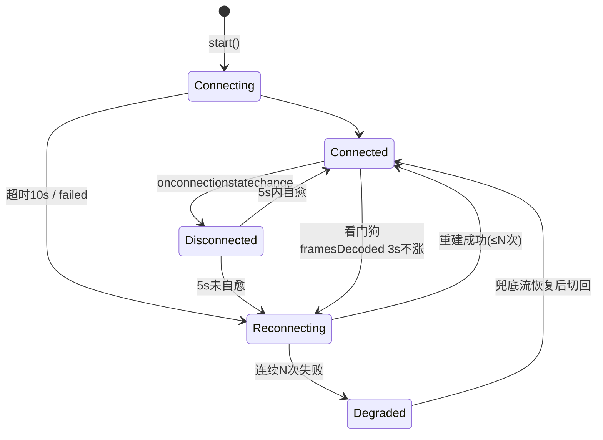

# WebRTC 断线恢复（状态机 + 看门狗）

> **一句话结论：** 断线恢复靠两层配合——`connectionState` 状态机管「传输层断了」，**看门狗**管「连接还活着但画面冻结」；两者各有各的判死阈值，恢复统一走「整体重建 + 指数退避」，防止服务端故障时万端齐连的雪崩。

---

## 一、为什么 `connected → disconnected` 不能立刻重连

`connectionState` 是传输层的健康信号，但它的「断了」分好几种，处理完全不同：

| connectionState | 含义 | 该做什么 |
| --- | --- | --- |
| `connecting` | ICE 检查中 | 等待，设超时（如 10s） |
| `connected` | 媒体通路建立 | 清重连计数，启动看门狗 |
| `disconnected` | **瞬时失联，可能自愈** | 等 2~5s，不自愈再重连 |
| `failed` | ICE 放弃 | 立刻重连（退避） |
| `closed` | 主动关闭 | 不处理 |

> **核心**：弱网抖动很常见，`disconnected` 立刻重建反而雪上加霜——先给它几秒自愈的机会。



---

## 二、看门狗：`connectionState` 管不到「画面冻结」

`connectionState === 'connected'` 不代表画面在动——服务端推流中断、但传输层还连着时，状态机完全无感。所以需要第二个判死信号：

> 靠 `getStats()` 轮询 `framesDecoded`（已解码帧数）是否增长判活——不涨就是冻结。

```typescript
class WatchdogPlayer {
  private attempts = 0;
  private lastDecoded = -1;
  private watchdogId = 0;
  private readonly MAX_ATTEMPTS = 5;

  constructor(
    private video: HTMLVideoElement,
    private url: string,
    private onDegrade?: () => void, // 连续失败 → 降级回调（切 HLS/FLV）
  ) {}

  /** 看门狗：3s 采样一次，framesDecoded 不增长视为冻结 */
  private watch() {
    this.watchdogId = window.setInterval(async () => {
      const pc = this.pc;
      if (!pc || pc.connectionState !== 'connected') return; // 状态机事件已处理

      const stats = await pc.getStats();
      let decoded = 0;
      stats.forEach((r) => {
        if (r.type === 'inbound-rtp' && r.kind === 'video') decoded = r.framesDecoded;
      });
      if (decoded === this.lastDecoded) this.scheduleReconnect(); // 冻结
      this.lastDecoded = decoded;
    }, 3000);
  }

  /** 指数退避重连：1s → 2s → 4s → 8s...，超上限走降级 */
  private scheduleReconnect() {
    if (this.attempts >= this.MAX_ATTEMPTS) {
      this.destroy();
      this.onDegrade?.(); // 降级到 HTTP-FLV / HLS
      return;
    }
    const delay = Math.min(1000 * 2 ** this.attempts, 15000);
    this.attempts++;
    setTimeout(() => this.destroy().then(() => this.start()), delay);
  }
}
```

---

## 三、为什么恢复要「整体重建」而不是 `restartIce`

拉流场景（连 SFU 公网服务器）的 SDP 由服务端生成，`restartIce` 收益小，而且状态可能不一致。所以：

- **整体重建** = `close()` 旧 PC → 重新 `createOffer` → 重新 WHEP POST → 重新 `ontrack`；
- **指数退避** = 防止服务端故障时万端齐连（惊群）；
- **连续失败降级** = 重连 N 次仍失败，切 HTTP-FLV / HLS 兜底（牺牲延迟保可用）。

---

## 面试回答

> 断线恢复分两层。传输层看 `connectionState`：`disconnected` 是瞬时失联可能自愈，先等 2~5 秒，`failed` 才立刻重连，避免弱网抖动时频繁重建。但 `connected` 不代表画面在动——服务端推流断了传输层还连着，所以要有看门狗：`getStats` 轮询 `framesDecoded`，3 秒不涨就判冻结。恢复统一走「整体重建 + 指数退避」：close 旧 PC 重新 offer，退避防止服务端故障时万端齐连；连续 N 次失败就降级到 FLV/HLS 兜底。

## 相关资料

- [WebRTC 多路视频拉流是怎么实现的](./WebRTC多路视频拉流是怎么实现的.md)
- [WebRTC 质量控制（ICE 状态监控）](./webRTC质量控制.md)
