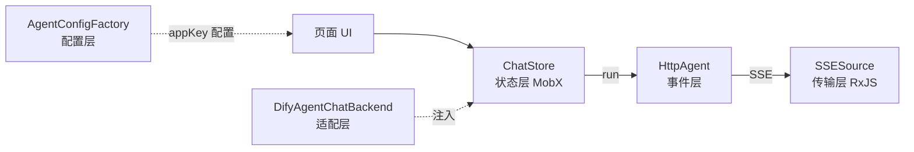

# Agent 智能体模块（DifyAgent）

> 项目位置：`mf-teacher-web/client/modules/pub/pages/Agent`

## 一句话结论

基于 Dify 平台的多智能体对话模块，一套内核 + 配置工厂，承载通用问答 / EPBL 教案 / 教学视频报告三类智能体。前端只负责流式输出与调用 Dify 接口，agent 编排逻辑在平台侧。

## 架构分层



| 层 | 类 | 职责 |
|---|---|---|
| 传输层 | `SSESource` | 字节流 → 字符串流 → SSE 事件 |
| 事件层 | `HttpAgent` | SSE 事件 → 带 type 的领域事件 |
| 状态层 | `ChatStore`（MobX） | 状态机 `idle→streaming→idle`、增量拼接、工具调用缓存 |
| 适配层 | `ChatBackend` 接口 | 解耦业务 API 请求构建 |
| 配置层 | `AgentConfigFactory` | `appKey → IAgentConfig` 差异化配置 |

## 核心难点

### 1. 自定义 SSE（支持 POST）

原生 `EventSource` 只支持 GET、不能带 body 和自定义 header，而调 Dify 需 POST + JSON body + CSRF / org 等 header。

> 通用「原生 vs 自定义」对比见 [sse 原生 vs 自定义](../../AI/面试题/sse/sse原生vs自定义.md)。

项目用 **RxJS** 而非裸 fetch 实现，关键算子：

```ts
fromFetch(url, fetchConfig).pipe(
  switchMap((res) => new Observable((obs) => {
    const reader = res.body!.getReader();
    const decoder = new TextDecoder();
    const pump = async () => {
      const { done, value } = await reader.read();
      if (done) return obs.complete();
      obs.next(decoder.decode(value, { stream: true }));
      await pump();
    };
    pump();
    return () => reader.cancel();   // 清理函数 → 优雅取消
  })),
  takeUntil(closeSubject),           // 主动 close 时取消订阅
  retryWhen((errors) => errors.pipe( // 断线重连：指数退避
    mergeMap((error, index) => {
      this.reconnectAttempts = index + 1;
      if (this.reconnectAttempts <= maxReconnectAttempts) {
        return timer(reconnectDelay * this.reconnectAttempts);
      }
      throw error;
    }),
  )),
).subscribe(...)
```

### 2. 分帧 —— 跨 chunk 行缓冲

HTTP 流按 chunk 到达，一个 event 的 `data` 可能跨多个 chunk，也可能一个 chunk 夹多个 event。直接按 chunk 解析会截断或粘连。

```ts
processChunk(chunk) {
  const full = this.incompleteLineBuffer + chunk;  // 合并上一次残行
  const lines = full.split('\n');
  // 最后一行不以 \n 结尾 → 不完整，留待下次
  this.incompleteLineBuffer = chunk.endsWith('\n') ? '' : (lines.pop() || '');
  lines.forEach((l) => this.processLine(l.trim()));
}
```

- 空行 = 一个事件结束，触发 `dispatchMessage()`。
- 非空行按 `event / data / id / retry` 字段累积（`data` 多行拼接时补 `\n`）。

### 3. 一套内核复用多个智能体

三类智能体差异大：输入占位符、上传格式、语音输入、思考按钮、动作按钮、后端返回的自定义卡片。若各写一份页面会大量重复。

两层抽象 + 一层渲染扩展：

```ts
// 配置层：按 appKey 返回配置，内核零改动
class AgentConfigFactory {
  getConfig() {
    if (AppKey.EPBLTeachingPlan.includes(appKey)) return epblTeachingPlanConfig;
    if (AppKey.TeachingVideoReport.includes(appKey)) return teachingVideoReportConfig;
    return defaultAgentConfig;
  }
}
```

```ts
// 适配层：ChatStore 只依赖接口，业务实现（Dify）注入
class ChatStore {
  constructor(backend: ChatBackend) { this.backend = backend; }
}
```

渲染层用 react-markdown 的 `components` + Context 注入自定义渲染器：`think`（思考折叠）、`step`、`ai-data`（教学视频报告卡片）、`tool-call`。

### 4. 流式增量 + 工具调用续传

- 文本增量：`TextMessageContent` 带 `delta`，`message.content += data.delta`。
- 工具调用参数分片到达，用 `argsBuffer` 缓存拼装；`ToolCallEnd` 后把拼好的 `tool-call` 块插进消息流。
- 用户交互后 `buildToolCallContinuation` 重新发起 SSE（`clarifyRequest`）继续对话。

## 面试追问要点

- **为什么不直接用现成库**：评估体积、安全合规、定制点（POST / header / mock 切换），手写约 400 行更可控。
- **断线重连**：`retryWhen` 指数退避（`delay × attempt`），超 `maxReconnectAttempts` 抛错进 `catchError`。
- **资源释放**：`takeUntil` + `reader.cancel()` + `ChatStore.destroy()` 三层保证，避免内存泄漏。
- **多智能体扩展**：新增 = 加一个 `IAgentConfig` + `getConfig` 加一个分支，内核不改。
