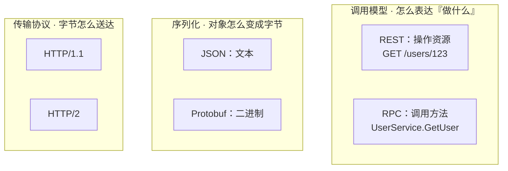
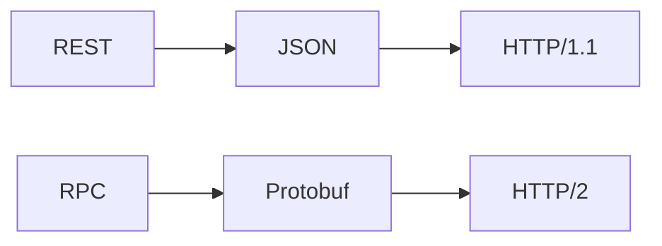

# HTTP 和 RPC 有什么区别？

## 一句话结论

**HTTP 是「传输协议」，RPC 是「调用模型」，二者不在同一个维度，不能直接比。** 最流行的 RPC 框架 gRPC，本身就是跑在 HTTP/2 上的 RPC。

所以「RPC 比 HTTP 快」这句话本身就是错的——它把两个不同维度的东西放在一起比。真正能比的，是「gRPC + Protobuf + HTTP/2」和「REST + JSON + HTTP/1.1」这两套**完整技术栈**。

## 先把两个词拆开

看不懂的根源：这两个词各自被人拿来指代两种东西。

| 词 | 你可能听到的两种含义 |
| --- | --- |
| HTTP | ① 传输协议（HTTP/1.1、HTTP/2）　② REST 风格（`GET /users/123`） |
| RPC | ① 调用模型（远程过程调用的思想）　② gRPC 技术栈（RPC + Protobuf + HTTP/2） |

一次远程调用，其实是**三层各自选一个**：



常见两套组合：



> **序列化**：把内存里的对象变成一串字节（发出去之前）；**反序列化**：把这串字节还原回对象（收到之后）。网络只能传字节、程序只能认对象，中间这道转换就是序列化。

> 所以「HTTP 是文本、RPC 是二进制」也不准确：HTTP/1.1 报文是文本但 Body 能传任意字节，HTTP/2 直接是二进制帧；JSON 是文本序列化、Protobuf 是二进制序列化。这俩是不同层的概念。

## 用一次调用看懂差别

订单服务要查用户 123：


REST 表达的是「获取一个资源」：

```http
GET /users/123 HTTP/1.1
Accept: application/json
```

RPC 表达的是「调用一个方法」：

```ts
const user = await userService.getUser({ id: "123" });
```

这行代码看着像本地函数调用，但背后是网络调用：**会超时、会失败**，必须设置 Deadline、重试和熔断。

| 维度 | REST/HTTP | RPC |
| --- | --- | --- |
| 关注什么 | 资源 `GET /users/123` | 方法 `UserService.GetUser` |
| 调用体验 | 手动拼 URL、Header、解析响应 | 像调用类型化方法 |
| 谁在用 | 浏览器、第三方、开放平台 | 公司内部服务 |
| 常见组合 | HTTP + JSON | gRPC + HTTP/2 + Protobuf |

## 为什么 Protobuf 比 JSON 小

这是「RPC 更快」里唯一真实的部分，核心只有一句话：**JSON 每条消息都重复字段名，Protobuf 用字段编号代替字段名。**

同样返回一个用户：

```json
{"id":"123","name":"Alice"}
```

这段 JSON 是 **27 字节**（字段名 `"id"`、`"name"` 都要算进去）。

对应的 Protobuf 定义用编号代替名字：

```proto
message User {
  string id = 1;    // 字段 1
  string name = 2;  // 字段 2
}
```

序列化后只有 **12 字节**：

```text
0a 03 31 32 33  12 05 41 6c 69 63 65
```

拆开看：

| 字节 | 含义 |
| --- | --- |
| `0a` | 字段 1（id），类型为字符串 |
| `03 31 32 33` | 长度 3，内容是 `123` |
| `12` | 字段 2（name），类型为字符串 |
| `05 41 6c 69 63 65` | 长度 5，内容是 `Alice` |

字段名 `id`/`name` 一次都没出现，只有字段编号 1、2。**字段越多、越常调用，差距越大。**

那接收方怎么知道「编号 1 是 id、编号 2 是 name」？字节里没有名字、只有编号，对照关系写在双方共享的 `.proto` 里。所以收发双方必须用同一份 `.proto` 编译出的代码——这就是「强契约」的含义，也正是 RPC 要求「双方都受控」的根本原因。

## 那「RPC 更快」到底快在哪

快的是**整套组合**，不是「RPC」这三个字，原因有三个：

1. **Protobuf 更小**：不用重复传字段名，解析也更快。
2. **HTTP/2 多路复用**：一条连接上并发传多个请求，不用为每个请求新建连接。
3. **IDL 生成代码**：客户端/服务端代码自动生成，少写手写解析、少出契约对不上的 bug。


gRPC 就是 HTTP，看它请求头里的方法名就明白了：

```text
:method       POST
:path         /UserService/GetUser
content-type  application/grpc
```

`/UserService/GetUser` 直接写在 HTTP 的 path 里。

**但如果 REST 也用了 HTTP/2 + 二进制 Body + 长连接，差距就缩小了。** 如果一次请求 100ms 都耗在查数据库上，省几十字节对总延迟几乎没影响。所以结论是：**不能说「RPC 天生更快」，只能在相同条件下压测得出。**

## 什么时候用哪个

| 场景 | 选择 | 原因 |
| --- | --- | --- |
| 浏览器、开放平台、对外 API | REST/HTTP | 通用、易调试，网关和缓存生态成熟 |
| 内部高频服务调用 | RPC | 强契约、连接复用、二进制序列化 |
| 跨语言服务 | RPC | IDL 生成多语言客户端 |
| 双向流、持续推送 | gRPC streaming | HTTP/2 Stream 内建流控 |
| 异步削峰、事件广播 | 消息队列 | 生产者不应同步等待结果 |

一句话：**RPC 适合「双方都受控」的内部系统；浏览器和外部调用方用 REST/HTTP。** 工程上还需补齐连接复用、服务发现、负载均衡、Deadline、有限重试、熔断、鉴权和链路追踪（Node 常见方案 `@grpc/grpc-js`、Apache Thrift、Dubbo.js）。

## 动手跑一遍

配套一个能跑的真实 gRPC 示例（服务端 + 客户端 + `.proto` 契约），用 `npm run server` / `npm run client` 即可看一次完整调用：[`rpc-demo/`](./rpc-demo/README.md)

## 面试回答（可直接背）

> HTTP 是传输协议，RPC 是调用模型，二者不在同一维度，gRPC 就跑在 HTTP/2 上。gRPC 用 Protobuf 二进制序列化，比 REST 常用的 JSON 更紧凑；HTTP/2 还能复用长连接、并发传多个 Stream，所以它适合内部高频、跨语言、流式调用。但 HTTP 也能传二进制、REST 也能用 HTTP/2，所以不能说 RPC 天生更快，最终要在相同业务和连接条件下压测。

## 参考

- [gRPC over HTTP/2 协议](https://grpc.github.io/grpc/core/md_doc__p_r_o_t_o_c_o_l-_h_t_t_p2.html)
- [Protocol Buffers 编码格式](https://protobuf.dev/programming-guides/encoding/)
- [RFC 9113：HTTP/2](https://www.rfc-editor.org/rfc/rfc9113.html)
