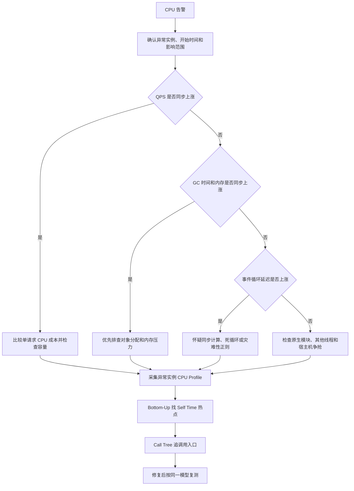

# Node 服务 CPU 占用过高怎么排查？

一句话结论：**先用监控判断是流量增长、业务计算还是 GC，再对异常实例采集 CPU Profile；用 Bottom-Up 找热点函数，用 Call Tree 追到触发它的请求，最后以相同流量复测。**

## 排查流程



不要一看到 CPU 高就重启。重启能恢复服务，却会清掉最有价值的现场；应先摘流量或保留一个异常实例，再抓取 Profile。

## 真实案例：一次搜索请求打满单核

完整可运行项目：[node-cpu-demo](./node-cpu-demo/README.md)。下面先展示核心故障代码和排查过程。

假设搜索服务出现下面的现象：

| 指标 | 正常 | 故障时 | 初步判断 |
| --- | ---: | ---: | --- |
| QPS | 200 | 205 | 流量没有明显增长 |
| 容器 CPU | 35% | 100% | 一个 Node 主线程接近打满 |
| p99 | 80 ms | 8 s | 请求被主线程阻塞 |
| 事件循环延迟 p99 | 12 ms | 4.2 s | 存在长时间同步任务 |
| GC 时间占比 | 3% | 4% | 暂时不像 GC 问题 |

`top` 中 Node 显示 `100%`，通常表示占满一个逻辑核；在多核机器上进程 CPU 也可能超过 `100%`。

### 1. 复现故障服务

问题来自用于校验搜索词的灾难性正则。`(\w+\s?)*` 存在大量重复匹配路径，输入在最后一个字符失败时会发生指数级回溯。

```ts
// app.ts
import { createServer } from 'node:http';
import { monitorEventLoopDelay } from 'node:perf_hooks';

const port = Number(process.env.PORT ?? 3000);
const eventLoopDelay = monitorEventLoopDelay({ resolution: 20 });
eventLoopDelay.enable();

// 故障点：嵌套量词可能造成灾难性回溯。
const unsafeKeywordPattern = /^(\w+\s?)*$/;

const server = createServer((request, response) => {
  try {
    const url = new URL(request.url ?? '/', `http://${request.headers.host ?? 'localhost'}`);

    if (url.pathname === '/search') {
      const keyword = url.searchParams.get('keyword') ?? '';
      const valid = unsafeKeywordPattern.test(keyword);
      response.writeHead(valid ? 200 : 400, { 'content-type': 'application/json' });
      response.end(JSON.stringify({ valid }));
      return;
    }

    if (url.pathname === '/metrics') {
      const p99Ms = eventLoopDelay.percentile(99) / 1e6;
      response.writeHead(200, { 'content-type': 'application/json' });
      response.end(JSON.stringify({ eventLoopDelayP99Ms: Number(p99Ms.toFixed(2)) }));
      eventLoopDelay.reset();
      return;
    }

    response.writeHead(404).end();
  } catch (error) {
    console.error('request_failed', error);
    response.writeHead(500).end();
  }
});

server.listen(port, () => console.log(`listening on http://localhost:${port}`));
```

用 `tsx` 直接运行 TypeScript，并让 Node 同时录制 CPU Profile：

```bash
pnpm add -D typescript tsx --registry=https://registry.npmmirror.com
mkdir -p profiles
node --import tsx --cpu-prof --cpu-prof-dir=profiles app.ts
```

先发正常请求，再发一个末尾校验失败的恶意输入。根据机器性能和 Node 版本，第二个请求可能阻塞数百毫秒到数秒；重复次数不要随意调大，避免本机长时间卡死。

```bash
curl 'http://localhost:3000/search?keyword=hello'

# zsh 下生成 25 个 a，末尾追加 !；--data-urlencode 负责安全编码。
keyword="$(printf 'a%.0s' {1..25})!"
curl --get --data-urlencode "keyword=$keyword" 'http://localhost:3000/search'

curl 'http://localhost:3000/metrics'
```

结束服务后，`profiles/` 中会生成 `CPU.*.cpuprofile`。线上采样应控制在 30～60 秒，并覆盖故障窗口；持续长时间采样会增加开销和文件体积。

### 2. 先在机器上确认哪个进程在烧 CPU

```bash
# 查看进程级 CPU；按 P 可按 CPU 排序。
top -p <PID>

# 查看该进程各线程。Node 主线程通常是热点，但原生模块也可能烧在线程池。
top -H -p <PID>

# 每秒采样一次，共 10 次，避免只看一个瞬时值。
pidstat -p <PID> 1 10
```

如果同一服务有多个实例，应对比异常实例和正常实例。只有单个实例异常时，优先保留该实例现场；所有实例随 QPS 同比上涨时，更像容量不足或单请求成本过高。

### 3. 在 CPU Profile 中定位热点

打开 Chrome DevTools 的 **Performance** 面板，加载 `CPU.*.cpuprofile`，按下面顺序看：

| 视图 | 看什么 | 本例会看到什么 |
| --- | --- | --- |
| Flame Chart | 最宽的调用栈 | 正则执行占据大部分采样时间 |
| Bottom-Up | 按 Self Time 降序找函数 | `RegExp` / `RegExpPrototypeExec` 靠前 |
| Call Tree | 热点由谁触发 | `createServer` 回调 → `/search` → `RegExp.test` |

- **Self Time**：只计算函数自身消耗。它很高时，函数本体通常就是热点。
- **Total Time**：包含子函数消耗。它很高但 Self Time 很低时，应继续展开子调用。
- `(program)`、`(idle)` 很宽不等于业务热点；前者可能是原生代码或采样边界，后者表示 CPU 当时空闲。

本例的证据链是：QPS 未上涨 → GC 未明显上涨 → 事件循环延迟暴涨 → Profile 中正则 Self Time 最高 → Call Tree 指向 `/search` 参数校验。这样才能把“猜测”变成可复现的结论。

### 4. 修复并设置输入边界

把存在嵌套量词的表达式改成线性扫描，并限制外部输入长度：

```ts
const safeKeywordPattern = /^[A-Za-z0-9_ ]+$/;

function isValidKeyword(keyword: string): boolean {
  if (keyword.length === 0 || keyword.length > 100) return false;
  return safeKeywordPattern.test(keyword);
}
```

长度限制不能替代安全正则，但能限制攻击面。业务允许时，也可以不用正则，改成逐字符判断，使复杂度更容易审计。

### 5. 用同一流量模型验证

修复前后必须使用相同机器规格、并发数、请求数据和持续时间。至少比较：

| 验收项 | 期望结果 |
| --- | --- |
| 正常与非法输入 | 状态码、响应体仍符合业务约定 |
| CPU | 峰值下降，且不再被单个非法请求打满 |
| p95 / p99 | 恢复到基线，不只看平均延迟 |
| 事件循环延迟 p99 | 恢复到基线 |
| CPU Profile | 原正则热点消失，且没有转移成新热点 |

还应补一个回归测试，固定这个最坏输入，并给校验函数设置合理的执行时间上限。时间断言会受 CI 机器波动影响，因此更稳妥的做法是同时检查长输入被长度限制提前拒绝。

## 如何区分常见原因

| 现象组合 | 更可能的原因 | 下一步 |
| --- | --- | --- |
| QPS 与 CPU 同比上涨，单请求 CPU 不变 | 容量不足 | 扩容，并继续降低单请求成本 |
| QPS 不变，事件循环延迟暴涨 | 同步计算、死循环、正则回溯 | 抓 CPU Profile 看业务热点 |
| CPU、堆内存、GC 时间一起上涨 | 分配过快或内存压力 | 看 GC 日志和 Heap Profile |
| Node 主线程不高，但进程 CPU 高 | 原生模块或线程池任务 | `top -H` 定位线程，再看原生栈 |
| CPU 不高但延迟高 | I/O、锁、连接池或下游服务 | 看请求链路与等待时间，CPU Profile 不是首选 |

其中“CPU、内存、GC 时间一起上涨”可以运行 [GC 与内存上涨实验](./node-cpu-demo/GC实验.md)，其中同时包含线上排查流程和本地复现实验。

可用下面的方式临时观察 GC。日志量较大，只应在受控实例上短时开启：

```bash
node --import tsx --trace-gc app.ts
```

如果 Profile 里 `JSON.stringify`、加密、压缩或图片处理成为热点，优化策略分别可能是缩小数据、改流式处理、使用异步 API，或放进**有并发上限**的 `worker_threads` 池。Worker 只会转移主线程计算，不会降低总 CPU 成本，所以仍要做容量和过载保护。

## 面试回答模板

> 我先确认告警范围，并关联 QPS、p99、事件循环延迟、内存和 GC。QPS 同涨可能是容量问题；QPS 不变但事件循环延迟上涨，更像同步计算热点；GC 时间占比上涨则先查对象分配。然后我会保留一个异常实例，在故障流量下采集 30～60 秒 CPU Profile。先在 Bottom-Up 按 Self Time 找热点，再用 Call Tree 追到具体接口和输入。修复后使用相同压测模型比较 CPU、吞吐、p99 和事件循环延迟，并再次采样确认热点没有转移。
