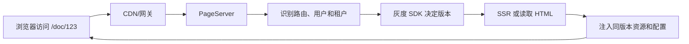
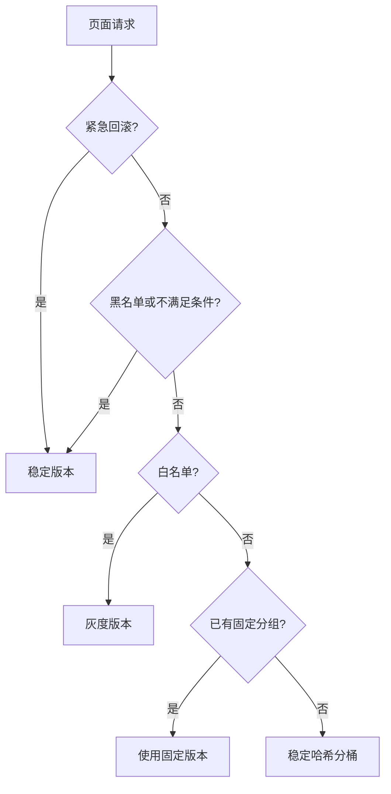

# PageServer 的核心职责是什么？静态页面运行时怎么设计灰度策略？

PageServer 是页面交付层：接收页面请求，选择正确的页面版本，完成 SSR 或 HTML 拼装，再把 HTML、JS/CSS 地址和运行时配置返回给浏览器。

## PageServer 在系统中的位置



| 职责 | 例子 |
| --- | --- |
| 页面路由 | `/doc/:id` 选择文档页面 |
| 版本选择 | 稳定用户返回 `v1`，灰度用户返回 `v2` |
| 页面生成 | SSR、读取静态 HTML 或拼装模板 |
| 配置注入 | API 地址、语言、功能开关、资源版本 |
| 稳定性 | 缓存、超时、SSR 降级、日志和指标 |

PageServer 不等于 CDN。CDN 负责缓存和分发已有内容；PageServer 会根据请求上下文做路由、版本决策和页面组装。

## 静态页面运行时是什么？

页面构建完成后不再编译，但访问时仍要决定加载哪个产物、连接哪个 API、开启哪些功能。这层访问阶段的版本选择和配置注入，就是静态页面运行时。

```html
<script>
  window.__RUNTIME_CONFIG__ = { version: "v2", newEditor: true };
</script>
<script src="/assets/v2/app.8c1f.js"></script>
```

HTML、JS/CSS 和配置必须属于同一版本，否则可能出现 chunk 404、接口不兼容或白屏。

## 怎么把用户稳定映射到桶？

对固定输入做确定性哈希，再对 10,000 取模。同一输入的哈希值不变，所以同一用户无论访问哪个 PageServer 实例，桶号都不变。

```text
bucket = unsignedHash("salt:identityType:identity") % 10000
命中灰度 = bucket < rolloutBasisPoints
```

10,000 个桶可以精确到 `0.01%`：10% 灰度对应 `[0, 1000)`，20% 对应 `[0, 2000)`。扩量只提高阈值，原灰度用户不会退出。

### salt 是什么？

`salt` 是分桶的**命名空间或种子**，用于隔离不同实验。它参与哈希输入，但通常不是密码，也不需要保密。

```text
实验 A：hash("page-editor-release:user:user-123") -> 桶 2006
实验 B：hash("new-homepage:user:user-123")       -> 另一个桶
```

同一个用户在不同实验中不应该总落入相同位置，因此不同实验使用不同 `salt`。同一轮灰度从 1% 扩到 100% 时必须保持 `salt` 不变；修改 `salt` 会让所有用户重新分桶。

企业中通常按 `产品:实验层:实验名` 生成，例如 `docs:editor:page-release-2026-09`。不要把灰度比例放进 `salt`，否则每次扩量都会重新洗牌；如果需要防止用户根据 ID 猜中灰度组，应使用服务端密钥做 HMAC，密钥与普通 `salt` 是两个概念。

### TypeScript 核心实现

生产环境应由统一灰度 SDK 提供算法，业务不能各自复制实现。下面是 SDK 内部的核心分桶策略：

```ts
import { createHash } from "node:crypto";

interface GrayRule {
  salt: string;
  rolloutBasisPoints: number;
}

class GrayBucketStrategy {
  private static readonly BUCKET_COUNT = 10_000;

  constructor(private readonly rule: GrayRule) {
    if (!rule.salt) throw new TypeError("salt is required");
    if (!Number.isInteger(rule.rolloutBasisPoints) ||
        rule.rolloutBasisPoints < 0 || rule.rolloutBasisPoints > 10_000) {
      throw new RangeError("rolloutBasisPoints must be between 0 and 10000");
    }
  }

  isGray(identityType: "user" | "device", identity: string): boolean {
    if (!identity) throw new TypeError("identity is required");
    const input = `${this.rule.salt}:${identityType}:${identity}`;
    const value = createHash("sha256").update(input, "utf8")
      .digest().readBigUInt64BE(0);
    const bucket = Number(value % BigInt(GrayBucketStrategy.BUCKET_COUNT));
    return bucket < this.rule.rolloutBasisPoints;
  }
}
```

`hash % 10000` 保证的是进入各桶的概率近似相等，不保证有限用户中每桶人数完全一样。取模存在极小理论偏差，但远小于抽样波动；如果要求“恰好 10% 用户”，需要离线对全量用户哈希排序并截取，普通发布灰度没有这个必要。

## 企业级灰度决策链

企业灰度由控制面下发规则，统一 SDK 在 PageServer 本地决策，不应每个请求访问配置中心或 Redis。



| 企业能力 | 核心要求 |
| --- | --- |
| 身份 | 登录用稳定 `userId`；匿名用第一方 Cookie 中的 `deviceId`，不用 IP |
| 配置 | Schema 校验、审批、版本号、本地原子快照、最后有效配置兜底 |
| 一致性 | 固定编码、哈希算法、字节序和测试向量，保证 Node/Go/Java 同桶 |
| 多实验 | 使用不同 `salt`；冲突实验按 layer 分配互斥区间 |
| 缓存 | 版本化 URL 或内部版本键隔离 CDN 缓存，禁止新旧资源串版 |
| 可观测 | 区分“分配”和“真实曝光”，异步上报版本、桶号和指标，不记录原始用户 ID |
| 止损 | 按 1% → 10% → 50% → 100% 放量，错误率、白屏率或 p99 超阈值自动回滚 |

只有需要首次分组永久不变、人工指定或审计时，才把 assignment 存入 Redis/数据库；普通分桶直接在本地计算即可。

## 面试回答

> PageServer 是页面版本的选择与交付中心，负责路由、SSR/HTML 拼装、运行时配置、缓存和降级。企业灰度由平台下发带版本的规则，统一 SDK 使用稳定身份、固定 salt 和确定性哈希在本地分桶，再把用户路由到不可变版本产物；同时要保证 HTML、资源和配置版本一致，并配套曝光上报、指标门禁和紧急回滚。salt 是实验的分桶命名空间，同一轮扩量保持不变，不同实验使用不同值。
