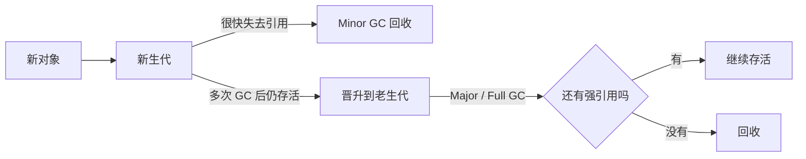
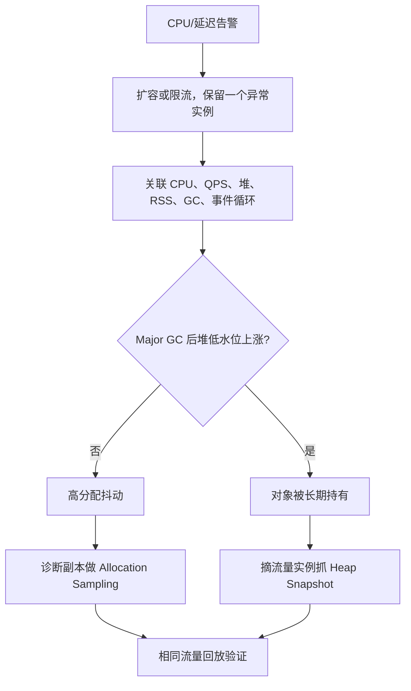

# GC 与内存上涨排查实验

这个实验用于识别另一种 CPU 高场景：**业务持续分配对象，堆内存上涨后触发频繁 GC，GC 本身消耗 CPU 并带来停顿。**

前半部分先讲线上告警怎么处理，后半部分再用本地 demo 练习指标、GC 日志和 Heap Profiler。

## 先理解两个术语

### Allocation instrumentation 是什么

`Allocation instrumentation on timeline` 是 Chrome DevTools Memory 面板中的一种录制模式。它记录程序运行期间的对象分配，并尽量保存创建对象时的调用栈。

它回答的是：**谁在什么时候创建了这么多对象？**

```text
请求进入 /allocate
→ AllocationPressureService.allocate
→ Array.from
→ new OrderSnapshot
→ 在堆中分配对象
```

录制结束后，可以按时间区间和对象类型筛选。本例搜索 `OrderSnapshot`，预期看到分配栈指向 `AllocationPressureService.allocate`。

它不直接回答“为什么对象没有被回收”。对象的创建者和持有者可能不是同一段代码：

```ts
const order = createOrder(); // createOrder 是对象创建者
globalCache.set(order.id, order); // globalCache 才是长期持有者
```

| 工具 | 主要回答的问题 |
| --- | --- |
| Allocation instrumentation | 谁创建了对象？在哪个时间段创建？ |
| Heap Snapshot + Retainers | 当前哪些对象还活着？谁引用着它？ |
| CPU Profile | CPU 时间消耗在哪些函数？ |

Allocation instrumentation 会记录大量分配细节，开销较高。因此它适合本地、预发或已隔离实例，不适合直接在繁忙生产实例长时间录制。线上优先使用抽样的 `--heap-prof`。

### Full GC 是什么

V8 会根据对象存活时间把堆大致分为新生代和老生代：



- **Minor GC**：主要清理新生代，频率高、通常停顿较短，Node GC 日志中常见 `Scavenge`。
- **Major GC**：主要处理老生代，工作量通常更大，日志中常见 `Mark-Compact`。
- **Full GC**：工程排查中通常指覆盖整个 JS 堆或以老生代为核心的完整回收。讨论 Node/V8 指标时，经常和 Major GC 放在同一类语境中，但不同监控产品的命名可能不同。

Full GC 不是“清空内存”，它只回收从 GC Root 已经不可达的对象：

```text
globalCache → OrderSnapshot
```

只要 `globalCache` 仍然引用 `OrderSnapshot`，执行多少次 Full GC 都不会回收它。因此排查泄漏时要观察 **Full GC 后的堆低水位**：

```text
回收前 800 MB → Full GC 后 410 MB：大部分对象可以释放
回收前 870 MB → Full GC 后 550 MB：仍有大量对象被引用
```

Full GC 的部分阶段会暂停 JavaScript 执行，也就是常说的 Stop-The-World；V8 也包含并发或增量阶段，所以不能把整段 GC 耗时都简单理解成主线程完全停止。排障时应同时看 GC 总耗时、最大停顿、事件循环延迟和 p99。

## 现实线上怎么排查

线上不能直接连接 Inspector 或连续拍三张快照。正确顺序是：**先止损并用监控证明 GC 与故障相关，再在诊断副本做低开销采样；Heap Snapshot 只用于已摘流量的异常实例。**



### 1. 先止损，但保留一个现场

不要直接重启所有实例。重启会暂时降低内存，也会清掉对象持有关系。

1. 扩容、限流或降级，先恢复服务容量。
2. 找出 CPU、堆和 GC 最异常的实例。
3. 将其中一个实例摘流量，但暂时不要销毁。
4. 记录实例 ID、PID、告警时间、发布版本和异常接口。
5. 其余实例可以逐步重启止损，保留实例负责取证。

Kubernetes 中先确认目标 Pod：

```bash
kubectl top pod -n <namespace> -l app=<service>
kubectl get pod -n <namespace> -l app=<service> -o wide
kubectl logs -n <namespace> <pod> --since=20m
```

摘流量的具体方式由网关或发布系统决定。不要用 `kubectl delete pod` 代替摘流量，否则现场会一起消失。

### 2. 用同一时间轴证明是不是 GC

至少同时查看这些指标：

| 指标 | 要回答的问题 |
| --- | --- |
| QPS、接口分布、请求大小 | 是不是流量模型变化？ |
| 进程 CPU、容器 CPU | CPU 是否真的消耗在 Node 进程？ |
| `heapUsed`、`heapTotal`、RSS | 上涨的是 JS 堆还是堆外内存？ |
| Minor/Major GC 次数和耗时 | GC 是否变频繁、停顿是否变长？ |
| 事件循环延迟、p99 | GC 停顿是否影响请求？ |
| 发布时间、缓存命中率 | 分配行为从什么时候变化？ |

例如 QPS 基本不变，但 CPU 从 `0.45` 核升到 `0.90` 核、GC 从 `2 s/min` 升到 `18 s/min`、Major GC 从每分钟 1 次升到 8 次，同时 p99 上涨，就有充分理由继续沿 GC 排查。

最关键的是 **Major GC 后的堆低水位**：

```text
高分配抖动：400 → 800 → GC → 410 → 810 → GC → 405 MB
疑似泄漏：  400 → 800 → GC → 470 → 870 → GC → 550 MB
```

- 低水位稳定：对象能回收，但创建太快，优先找分配栈。
- 低水位持续上涨：对象回收不掉，优先找存活对象和 Retainers。
- RSS 上涨但 `heapUsed` 稳定：排查 `Buffer`、原生模块、线程栈和内存碎片，Heap Snapshot 可能看不到根因。

线上不需要调用 `global.gc()` 制造 Full GC。应使用 APM 记录的 Major GC 事件和自然 GC 后的堆数据。

### 3. 先在诊断副本做低风险采样

如果低水位稳定但 GC 很频繁，优先给一个灰度或诊断副本增加 Heap Allocation Sampling：

```bash
node \
  --heap-prof \
  --heap-prof-dir=/diagnostics \
  --heap-prof-interval=524288 \
  dist/server.js
```

让它承接少量真实流量或脱敏回放流量，然后优雅退出。Node 会写出 `/diagnostics/Heap.*.heapprofile`，下载到本地后在 Chrome DevTools Memory 面板加载，按分配大小展开调用栈。

`--heap-prof` 必须在进程启动时配置。不要为了加参数重启唯一的异常实例，应另外启动诊断副本。

线上手段的风险等级：

| 手段 | 适用问题 | 风险 |
| --- | --- | --- |
| GC/APM 指标 | 证明 GC 与告警相关 | 低，可长期启用 |
| `--heap-prof` | 找主要分配调用栈 | 中低，放诊断副本 |
| CPU Profile 30～60 秒 | 判断 GC/构造函数的 CPU 热点 | 中，限制采样窗口 |
| Heap Snapshot | 查存活对象和 Retainers | 高，只在摘流量实例使用 |
| Allocation instrumentation | 记录几乎每次分配 | 很高，仅本地或隔离环境 |

### 4. 必须抓线上 Heap Snapshot 时

只有实例已摘流量、内存和磁盘有充足余量时才抓。Heap Snapshot 会暂停 Node 主线程，并可能额外需要接近当前堆大小的内存；一个堆已用 `1.5 GB`、容器限制 `2 GB` 的实例不应直接拍快照。

诊断实例需要在启动时预先配置：

```bash
node \
  --heapsnapshot-signal=SIGUSR2 \
  --diagnostic-dir=/diagnostics \
  dist/server.js
```

摘流量后发送信号：

```bash
kill -USR2 <node-pid>
ls -lh /diagnostics/*.heapsnapshot
```

注意事项：

- `SIGUSR2` 可能与进程管理器或 `--report-on-signal` 冲突，必须先在预发确认。
- `/diagnostics` 应挂载持久卷或由 sidecar 上传，避免 Pod 退出后文件消失。
- Heap 文件可能包含 Token、用户数据和业务字符串，必须按敏感数据管理。
- 不要把 Node Inspector 监听到 `0.0.0.0` 或暴露到公网。

文件下载后再在本地 DevTools 分析。线上单张快照也能通过 Summary、Retained Size 和 Retainers 找持有链；三快照 Comparison 更适合在流量回放环境完成。

### 5. 用证据选择修复

| 证据 | 常见根因 | 修复方向 |
| --- | --- | --- |
| 低水位稳定，Minor GC 密集 | 临时对象太多 | 减少复制、批处理、流式解析 |
| 低水位上涨，Retainers 指向 `Map` | 无界缓存 | 容量上限、TTL、淘汰策略 |
| Retainers 指向闭包 | 请求对象被回调持有 | 清理定时器、监听器和未完成 Promise |
| RSS 上涨、JS 堆稳定 | Buffer 或原生内存 | 限制 Buffer，排查原生模块 |

修复后使用告警时相同的接口分布、请求大小和 RPS 回放，验证 CPU、GC 总耗时、Major GC 频率、堆低水位、事件循环延迟和 p99。

## 本地实验：把线上现象缩小复现

## 你要学会什么


完成实验后，应能区分两组证据：

| 同步计算热点 | 分配与 GC 压力 |
| --- | --- |
| CPU、事件循环延迟上涨 | CPU、事件循环延迟也会上涨 |
| 内存和 GC 时间不一定变化 | `heapUsed`、GC 次数和 GC 总耗时同步变化 |
| Profile 指向正则或计算函数 | Profile 常出现 GC、分配和对象构造相关栈 |

## 第一步：启动 GC 故障模式

终端 A：

```bash
pnpm dev:gc
```

这个模式把 V8 老生代限制为 `192 MB`，让实验更容易触发 GC。`/allocate` 每次创建 20000 个订单快照，并保留最近 6 批：

```text
请求 1～6：保留对象增加，heapUsed 总体上涨
请求 7 以后：旧批次被淘汰，产生大量待回收对象
GC：为了回收空间而更频繁工作
```

这是受控实验，不要把 `--max-old-space-size=192` 直接照搬到生产配置。

## 第二步：记录无负载基线

服务刚启动时先请求一次指标：

```bash
curl http://localhost:3000/metrics
```

重点记录：

```json
{
  "memoryMb": {
    "heapUsed": 7.5,
    "heapTotal": 10.2,
    "rss": 55.1
  },
  "gc": {
    "count": 1,
    "totalDurationMs": 0.8,
    "maxDurationMs": 0.8,
    "observationWindowMs": 2000
  }
}
```

数值因 Node 版本和机器而异。第一次读取会清零 GC 区间统计，因此下一次读取只反映压测期间发生的 GC。

## 第三步：制造对象分配压力

终端 B：

```bash
pnpm load:gc
```

脚本以固定 `2 RPS` 调用 `/allocate`，默认持续 15 秒。结束时自动输出内存、GC 和事件循环指标。

```text
{
  completed: 30,
  failed: 0,
  eventLoop: {
    memoryMb: { heapUsed: ..., heapTotal: ..., rss: ... },
    gc: {
      count: ...,
      totalDurationMs: ...,
      maxDurationMs: ...,
      observationWindowMs: ...
    }
  }
}
```

按下面的顺序推理：

1. `heapUsed` 相比基线上涨，说明堆中存活对象变多。
2. `gc.count` 和 `gc.totalDurationMs` 上涨，说明 V8 正在花时间回收对象。
3. CPU 同期上涨，说明 CPU 成本至少有一部分来自对象分配与 GC。
4. `eventLoopDelayMaxMs` 上涨，说明 GC 或同步分配已经影响请求调度。

只看到 `heapUsed` 上涨不能直接断言内存泄漏。实验里最多保留 6 批对象，之后内存应在 GC 后进入平台期；真正的泄漏通常表现为多次 Full GC 后的存活堆基线仍持续上涨。

一次 Node 22 实测得到下面的对照：

| 指标 | 无负载基线 | 30 个分配请求后 |
| --- | ---: | ---: |
| `heapUsed` | 8.19 MB | 50.00 MB |
| RSS | 78.55 MB | 162.88 MB |
| GC 次数 | 4 | 53 |
| GC 总耗时 | 3.70 ms | 128.49 ms |
| 最大单次 GC | 2.19 ms | 8.13 ms |
| 事件循环延迟最大值 | 24.72 ms | 35.19 ms |

观察窗口不同时，不要只比较 GC 总耗时。可以计算 `gc.totalDurationMs / observationWindowMs`，得到每毫秒观察时间中有多少比例花在 GC 上；线上监控通常直接提供 GC CPU 占比或单位时间 GC 耗时。

## 第四步：查看真实 GC 日志

停止服务，改用：

```bash
pnpm trace:gc
```

再运行 `pnpm load:gc`，终端 A 会看到类似日志：

```text
Scavenge ... allocation failure
Mark-Compact ...
```

| 日志 | 含义 | 常见判断 |
| --- | --- | --- |
| `Scavenge` | 新生代回收 | 短命对象分配速度很高 |
| `Mark-Compact` | 老生代完整回收 | 存活对象多或老生代空间紧张 |
| `allocation failure` | 当前空间不足以继续分配 | 分配速度超过可用空间 |

不要只数 GC 次数。更有意义的是单位时间内的 `totalDurationMs`、最大单次停顿，以及 Full GC 后 `heapUsed` 是否回到稳定基线。

## 第五步：实际操作 Heap Profiler

先明确三个工具分别回答什么问题：

| 工具 | 回答的问题 | 本例预期证据 |
| --- | --- | --- |
| CPU Profile | CPU 时间花在哪里？ | GC、`Array.from`、字符串创建等栈变宽 |
| Allocation instrumentation | 哪段调用栈正在创建对象？ | `AllocationPressureService.allocate` 创建 `OrderSnapshot` |
| Heap Snapshot | 当前哪些对象还活着，谁持有它们？ | `retainedBatches` 持有 `OrderSnapshot[]` |

CPU Profile 里的“耗时”不能直接说明对象为什么没有释放。Heap Profiler 关注对象的**分配**和**引用关系**，两者要解决的问题不同。

### 5.1 启动可调试服务

先停止前面的服务，再运行：

```bash
pnpm inspect:gc
```

该命令不是让 `tsx` 在内存中直接运行 TS，而是先执行 `pnpm build`，生成下面的调试产物：

```text
src/server.ts
   ↓ tsc: sourceMap + inlineSources
dist/server.js
dist/server.js.map（内含原始 TS 源码）
   ↓ node --inspect-brk --enable-source-maps
Chrome DevTools
```

`dist/server.js` 是 V8 实际执行且一定能读取的脚本；`server.js.map` 负责映射回 `src/server.ts`。`inlineSources` 把 TS 原文写入 map，因此 DevTools 不需要直接读取 `file:///Users/.../src/server.ts`。

终端会出现类似地址：

```text
Debugger listening on ws://127.0.0.1:9230/...
```

Chrome 中打开 `chrome://inspect/#devices`：

1. 点击 **Configure**，确认 Target discovery settings 中包含 `localhost:9230`。
2. 在 **Devices** 页面找到 `dist/server.js` 对应的 Node 进程。
3. 点击进程下面的 **inspect**。
4. DevTools 会在 Sources 中显示 **Paused in debugger**，按 `F8` 或点击 Resume 继续执行。
5. Console 出现 `mode=...` 和 `listening=...` 后，服务才真正启动。
6. 打开 **Memory** 面板；如果找不到，点击顶部 `»`，或按 `Command+Shift+P` 搜索 `Show Memory`。

不要使用普通网页 DevTools 的 Memory 面板。这里要连接的是监听 `9230` 的 **Node 进程**。终端必须出现上面的 `Debugger listening`；如果出现 `address already in use`，Inspector 实际没有启动，应先换空闲端口或停止占用端口的旧调试进程。

Console 刚打开时空白不代表失败。它只显示连接后的新日志，不会补放 Node 启动前输出到终端的历史日志。可以在 Console 输入下面的表达式验证连接：

```js
process.pid
```

能返回数字 PID 就说明 Console 正常。如果页面中央整块空白且无法输入，应关闭该 DevTools 窗口，在 `chrome://inspect` 对标题为 `dist/server.js` 的目标重新点击 **inspect**。

#### 出现 `inspect fallback` 或 Sources 空白怎么办

`inspect fallback` 表示 DevTools 没有正常展示目标脚本，常见原因是内存转译脚本、source map 缺少源码内容、调试会话仍连接旧进程，或 map 路径失效。它不能简单等同于“Chrome 禁止读取本地 TS”。

按顺序检查：

```bash
# 1. 确认实际执行的 JS 和 source map 都生成了。
ls -lh dist/server.js dist/server.js.map

# 2. 确认 JS 声明了 source map。
tail -n 1 dist/server.js

# 3. 重新用项目脚本启动，不要手写 node --inspect src/server.ts。
pnpm inspect:gc
```

然后关闭旧 DevTools 窗口，在 `chrome://inspect/#devices` 对新进程重新点击 **inspect**。进入 Sources 后：

- 按 `Command+P` / `Ctrl+P` 搜索 `server.ts`，正常时打开映射后的 TS。
- 如果 TS 映射仍未显示，搜索 `server.js`；它是 V8 的真实执行脚本，应该始终有内容并且可以断点。
- Network/Memory/Performance 分析不依赖 Sources 面板是否成功展示 TS，但源码映射正常后更容易从调用栈跳回业务代码。

`--enable-source-maps` 主要改善 Node 错误堆栈到 TS 的映射。真正避免空白页的是：存在可读取的 `dist/server.js`，存在 `.js.map`，并通过 `inlineSources` 把 TS 内容嵌入 map。

### 5.2 用三张 Heap Snapshot 看对象由谁持有

在 Memory 面板选择 **Heap snapshot**。

#### Snapshot 1：记录基线

1. 点击 **Take snapshot**。
2. 完成后将它保留为 `Snapshot 1`。
3. 在 Class filter 中搜索 `OrderSnapshot`，此时数量应为 `0` 或很少。

`OrderSnapshot` 在代码中必须是 `class`，因为 TypeScript 的 `interface` 编译后会消失，Heap Snapshot 中无法按接口名搜索。

#### Snapshot 2：负载后寻找增长对象

另开终端运行：

```bash
pnpm load:gc
```

回到 Memory 面板，再点击 **Take snapshot**。选中 `Snapshot 2` 后：

1. 将顶部视图从 **Summary** 切换为 **Comparison**。
2. 对比基准选择 `Snapshot 1`。
3. 在 Class filter 搜索 `OrderSnapshot`。
4. 观察 `# New`、`# Delta` 和 `Size Delta`，它们应该明显大于 `0`。

几个容易混淆的列：

| 列 | 含义 |
| --- | --- |
| Shallow Size | 对象本身占用的内存，不包含它引用的对象 |
| Retained Size | 如果该对象被回收，可以连带释放的总内存 |
| `# Delta` | 与 Snapshot 1 相比，对象数量净增加多少 |
| Size Delta | 与 Snapshot 1 相比，内存净增加多少 |

展开 `OrderSnapshot`，任选一个实例。下方 **Retainers** 面板会显示“谁阻止它被 GC”，本例应看到类似引用链：

```text
OrderSnapshot
← Array（某一批订单）
← retainedBatches
← AllocationPressureService
← CpuDemoServer
```

箭头要从对象向 GC Root 方向读：`OrderSnapshot` 被批次数组引用，批次数组被 `retainedBatches` 引用，服务仍然存活，所以这些对象不能被回收。这条链才是“缓存持有对象”的证据。

#### Snapshot 3：释放后证明引用链消失

执行：

```bash
curl http://localhost:3000/release
```

预期返回：

```json
{"releasedBatches":6,"forcedGc":true}
```

`/release` 会清空 `retainedBatches`，并通过 `--expose-gc` 提供的 `global.gc()` 主动执行一次 Full GC。回到 Memory 面板创建 `Snapshot 3`，再与 `Snapshot 2` 比较：

- `OrderSnapshot` 的 `# Deleted` 应明显增加。
- `# Delta` 和 `Size Delta` 应为负数。
- 原来的 Retainers 引用链应消失。

这证明前面的增长是“有界缓存持有”，不是无法释放的永久泄漏。线上不能依赖 `global.gc()` 治理内存，它在这里只用于控制实验变量。

### 5.3 用 Allocation instrumentation 找创建对象的代码

Heap Snapshot 告诉你谁在**持有**对象，Allocation instrumentation 告诉你谁在**创建**对象。

1. 在 Memory 面板选择 **Allocation instrumentation on timeline**。
2. 点击 **Start** 开始录制。
3. 另一个终端执行 `DURATION_SECONDS=5 pnpm load:gc`。
4. 压测结束后点击 **Stop**。
5. 在上方时间轴拖选内存增长明显的区间。
6. 在下方 Class filter 搜索 `OrderSnapshot`。
7. 选中对象，查看 **Allocation stack**。

预期分配栈为：

```text
new OrderSnapshot
└── Array.from
    └── AllocationPressureService.allocate
        └── /allocate 请求处理
```

如果 Allocation stack 是空的，通常是录制开始前对象就已经创建，或者当前选择的是 Heap Snapshot 而不是 Allocation instrumentation。先点击 Start，再制造负载。

Allocation instrumentation 会记录每次分配，开销较高，适合在本地或隔离实例短时使用。线上低开销采样可选择 **Allocation sampling**，但它是抽样结果，数量不会和真实对象数完全一致。

### 5.4 如何从证据落到修复

打开 [`src/allocation-pressure.ts`](./src/allocation-pressure.ts)，可以把工具证据对应回代码：

| 工具证据 | 源码原因 | 真实修复方向 |
| --- | --- | --- |
| Allocation stack 指向 `Array.from` | 一次创建 20000 个对象 | 分页、分批或流式处理 |
| 大量字符串从 `allocate` 创建 | 每个对象复制 payload | 避免重复数据，复用不可变值 |
| Retainers 指向 `retainedBatches` | 缓存持有整批对象 | 设置容量、TTL 和淘汰策略 |
| Full GC 后对象仍被持有 | 存在到 GC Root 的强引用 | 沿 Retainers 断开错误引用 |

不要把“调大 `--max-old-space-size`”当成根治。它可能降低 GC 频率，也可能让 Full GC 单次停顿更长，并不能消除无界分配或错误引用。

## 面试时怎么表达

> 如果 CPU、堆内存和 GC 时间同时上涨，我会先比较 Full GC 前后的存活堆基线。CPU Profile 用于确认 GC 或对象构造是否占用明显 CPU；Allocation instrumentation 用分配栈定位谁在创建对象；Heap Snapshot 用 Comparison 找增长的对象类型，再沿 Retainers 查到持有它的 GC Root。若多次 Full GC 后对象数量和存活堆仍持续上涨，才进一步判断为内存泄漏。
