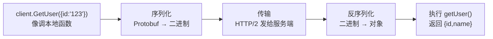

# gRPC 服务端 + 客户端最小示例

配套文档：[`../HTTP与RPC.md`](../HTTP与RPC.md)。这份示例是**真实的 gRPC**（真实 HTTP/2 + Protobuf 二进制），只有「查数据库」这一步是模拟的（直接返回写死的 `Alice`）。

## 跑起来

```bash
cd rpc-demo
npm install          # 装依赖（首次）
npm run server       # 终端 1：启动服务端，监听 50051
npm run client       # 终端 2：发起一次调用
```

预期输出：

```text
# 服务端
[server] 监听在 0.0.0.0:50051
[server] 收到查询用户 id=123

# 客户端
[client] 收到: { id: '123', name: 'Alice' }
[client] 用户名 = Alice
```

## 一次调用发生了什么

对应文档里的三层模型：



1. **调用**：`client.GetUser({ id: '123' }, cb)`——方法名 `GetUser` 来自 `.proto`。
2. **序列化**：gRPC 把 `{ id: '123' }` 编码成 Protobuf 二进制（只有编号 1 + 值，没有 `id` 三个字母）。
3. **传输**：跑在 HTTP/2 上，方法名写在请求头的 `:path /demo.UserService/GetUser`。
4. **服务端反序列化 + 执行**：`getUser()` 拿到 `call.request.id === '123'`，返回 `{ id: '123', name: 'Alice' }`。
5. **原路返回**：结果再序列化传回客户端，`callback` 里 `user` 已经是对象。

## 关键：字段名到哪儿去了

客户端发 `{ id: '123' }` 时，`id` 这个字段名**没有上网络**。真正传的是「字段编号 1 + 值 `123`」。服务端怎么知道编号 1 是 `id`？因为它读了同一份 `proto/user.proto`：

```proto
message GetUserRequest {
  string id = 1;   // 编号 1 = id
}
```

两端必须用同一份 `.proto`——这就是「强契约」。改字段编号会导致两端对不上，数据就错了。

## 自己动手改

- 给 `User` 加一个 `int32 age = 3;`，服务端返回时带上 `age`，客户端打印 `user.age`，重新跑一遍。
- 把 `GetUser` 改成返回多个用户（`repeated User`），体验列表的序列化。
