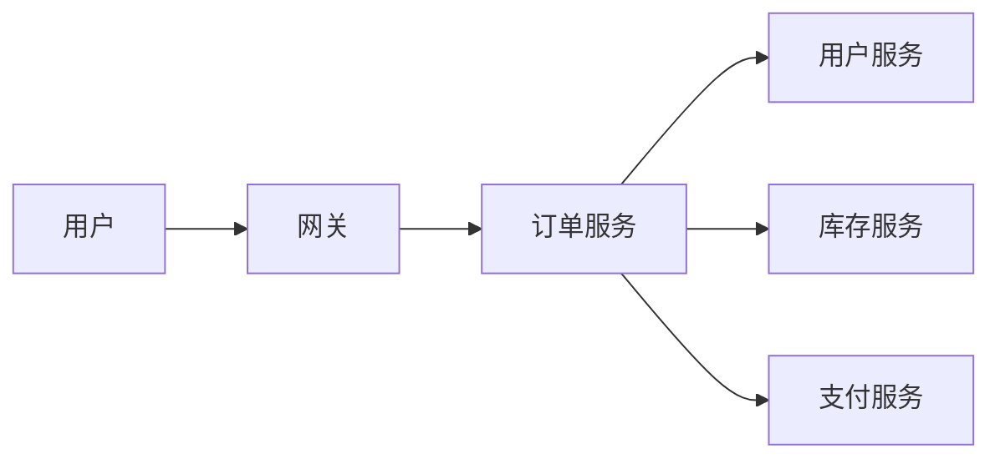
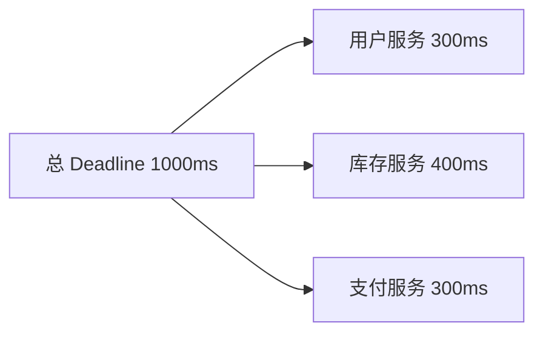
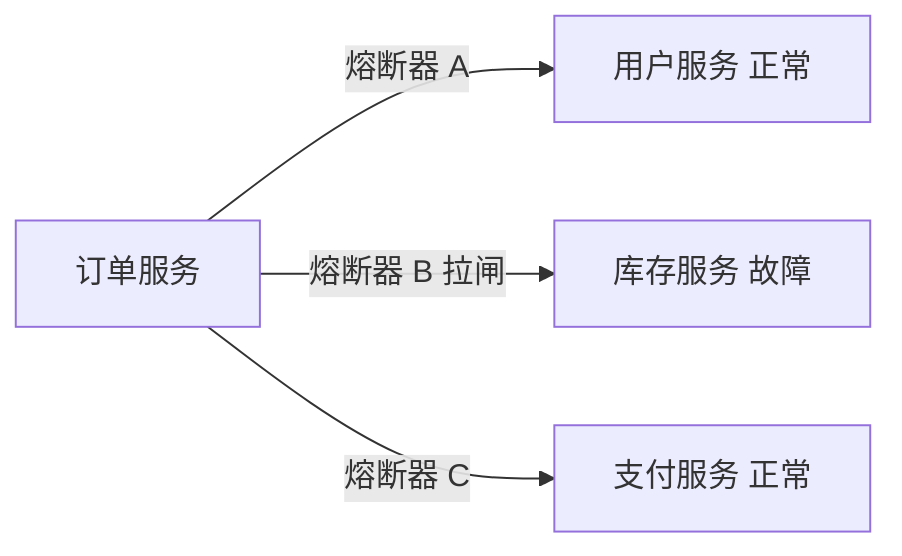
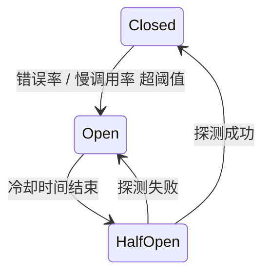
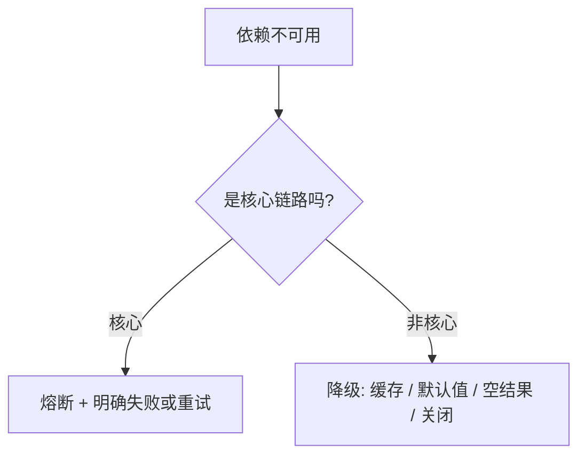
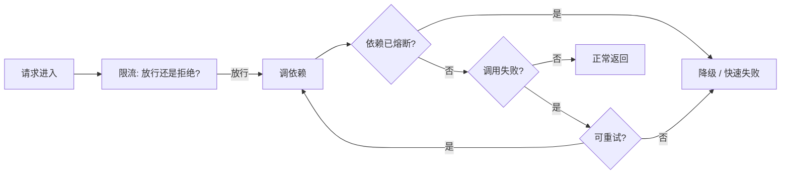

# 接口异常、降级和上下游容错怎么设计？

## 一句话结论

分布式下，一次请求要串起多个服务，任何一个依赖超时、失败或变慢都可能拖垮整条链路。企业级容错是一套**防御性设计**：统一错误语义、超时逐层收紧、只重试幂等操作、用熔断隔离持续故障的依赖、用降级保住核心链路。

## 先看一次请求会遇到什么



订单服务要同时调用户、库存、支付三个下游，任何一个慢或挂都会堵住订单服务。容错要回答四个问题：

1. 依赖**超时**了怎么办 → 超时控制
2. 依赖**失败**了要不要重试 → 重试策略
3. 依赖**持续失败**还要不要继续调 → 熔断
4. 依赖真不可用了怎么**保核心** → 降级

> 这些模式主要用在**服务端 / 网关 / 服务间**。前端侧通常只做「超时 + 取消 + 有限重试 + 兜底 UI」，熔断降级这类逻辑落在后端。

## 一、错误语义：先统一，再分类

### 错误码分三层

| 层 | 例子 | 谁在消费 |
| --- | --- | --- |
| 协议层 | HTTP 4xx/5xx、gRPC Status Code | 框架、网关、重试逻辑 |
| 系统层 | 超时、连接失败、限流、熔断 | 框架、监控告警 |
| 业务层 | 「库存不足」「优惠券已过期」 | 业务代码 |

原则：**错误码稳定、有分类、可追踪**。任何报错都带 `requestId`（或全链路 `traceId`），用户说「下单失败了」，你能靠它串起整条调用链定位。

### 关键分类：能不能重试

| 类型 | 典型 | 能否重试 |
| --- | --- | --- |
| 参数 / 鉴权 / 业务冲突 | 400、401、409 | 不能，重试也没用 |
| 网络抖动、限流、短暂 5xx | 连接重置、429、503 | 能，但有限次 |
| 明确失败 | 404、扣库存失败 | 不能，要明确报错 |

**核心原则：只重试幂等操作。** 幂等 = 同一个请求执行一次和执行多次，结果一样。重试「扣库存」可能扣两次。

## 二、超时控制：逐层收紧

总预算 1000ms，不能每个下游都等 1000ms。要给每个依赖分预算，并把剩余时间传给下游。



### 超时传递（Deadline Propagation）

gRPC 会把 deadline 通过 metadata 传给下游：上游说「我 1000ms 后超时」，下游拿到时只剩 600ms，就用 600ms 做自己的超时。这样**上游超时了，下游不会白跑、继续占资源**。

三种超时要区分：

| 超时 | 含义 | 典型值 |
| --- | --- | --- |
| 连接超时 | 建立 TCP 连接 | 100ms |
| 读 / 写超时 | 发出请求后等响应 | 按预算分 |
| 总 Deadline | 整个请求的硬上限 | 1000ms |

**禁止无限等待**：没有超时，一个卡死的下游能挂起你所有线程。

```ts
// 给请求设 1 秒硬超时，超时自动取消，不会无限等
const res = await fetch(url, { signal: AbortSignal.timeout(1000) });
```

## 三、重试策略：三个要素缺一不可

1. **幂等**：只重试安全操作（查询、带幂等键的写）
2. **退避 + 抖动**：指数退避（1s → 2s → 4s），加随机抖动避免「重试风暴」——所有请求同一时刻重试，把下游打挂
3. **次数上限**：最多 2～3 次，超过就放弃

```ts
async function withRetry(fn, { max = 2, base = 100, jitter = 50 } = {}) {
  for (let attempt = 0; attempt <= max; attempt++) {
    try {
      return await fn();
    } catch (err) {
      if (attempt === max) throw err; // 最后一次也失败，放弃
      const delay = base * 2 ** attempt + Math.random() * jitter; // 指数退避 + 抖动
      await new Promise((r) => setTimeout(r, delay));
    }
  }
}
```

### 幂等键（Idempotency Key）

写操作要支持重试，客户端生成一个唯一键，重试带同一个键，服务端用它去重：

```http
POST /orders HTTP/1.1
Idempotency-Key: 550e8400-e29b-41d4-a716-446655440000
```

服务端收到已处理过的键，直接返回上次结果，不会重复扣库存。

## 四、隔离（舱壁）：别让慢依赖拖垮你

一个依赖变慢，如果占满你的线程池，其他正常的依赖也会跟着超时。舱壁隔离就是**给每个依赖独立分配资源**。

| 隔离方式 | 做法 | 特点 |
| --- | --- | --- |
| 线程池隔离 | 每个依赖一个线程池 | 隔离彻底，线程开销大 |
| 信号量隔离 | 限制单个依赖的并发调用数 | 轻量 |
| 连接池隔离 + 有界队列 | 每依赖独立连接池，队列满就拒绝 | 常见 |

核心思想：**故障隔离**——A 挂了，不影响 B。

### 具体怎么操作

先看**没有隔离**会怎样：服务有个 200 线程的线程池处理所有下游。库存服务突然变慢（每个请求 10 秒），200 个线程很快全被「调库存」占住。此时用户服务、支付服务虽然正常，但**已经没有空闲线程去调它们**——一个慢库存拖死整个服务。

隔离就是给每个依赖一份**独立、有限**的配额。信号量的最小实现：

```ts
class Semaphore {
  constructor(limit) { this.limit = limit; this.used = 0; this.waiters = []; }
  async acquire() {
    if (this.used < this.limit) { this.used++; return; }
    await new Promise((r) => this.waiters.push(r)); // 满了就排队
  }
  release() {
    this.used--;
    const next = this.waiters.shift();
    if (next) { this.used++; next(); }
  }
}

const inventorySem = new Semaphore(20); // 调库存最多 20 个并发
async function callInventory() {
  await inventorySem.acquire();
  try { return await inventoryService(); }
  finally { inventorySem.release(); }
}
```

**线程池隔离 vs 信号量隔离的关键区别**：线程池隔离能挡「慢」——库存占满的是它自己的线程，共享池里还有线程可用；信号量只能限制「并发数」、挡不住「慢」，因为线程仍共享，库存慢会占着线程不还。所以信号量更轻量，适合「下游快、只是怕并发打爆」。

## 五、熔断：依赖持续故障就「拉闸」

重试解决「偶尔失败」，熔断解决「持续失败」。依赖已经挂了，还每次都打过去重试，是浪费资源、还加剧故障。

熔断不是全局开关，而是**按依赖/资源粒度独立**——「谁病了隔离谁」，别的下游照常调：



粒度从粗到细有三档，本质是「多少个调用共享一个失败计数器」：

| 粒度 | 例子 | 取舍 |
| --- | --- | --- |
| 服务级 | 整个库存服务拉闸 | 粗，一个接口挂会连累整个服务 |
| 接口/方法级 | `DeductStock` 拉闸、`QueryStock` 照常 | **企业最常见的甜点区** |
| 参数级 | 只对某个热点 SKU 拉闸 | 太细，样本少、阈值不稳，更常用于限流 |

| 框架 | 熔断绑在什么上 | 实际粒度 |
| --- | --- | --- |
| Hystrix | 每个 Command 一个熔断器 | 方法级 |
| Resilience4j | 每个 CircuitBreaker 实例 | 服务级 / 方法级（自定义） |
| Sentinel（阿里） | 每个「资源」 | 方法级，甚至参数级 |
| Istio / Envoy | 每个 upstream cluster | 服务级（粗） |

**为什么不是越细越好**：太细（参数级）每个参数值一个计数器，内存开销大、单样本少、错误率统计不稳定；太粗（服务级）误伤面大。所以「接口/方法级」是平衡点。



### 熔断器的关键参数

| 参数 | 含义 | 例子 |
| --- | --- | --- |
| 错误率阈值 | 失败请求占比超多少就断开 | 50% |
| 慢调用率阈值 | 超过慢调用时长的请求占比 | 100% 请求 > 500ms |
| 最小请求数 | 至少统计多少个请求才判定 | 10 |
| 冷却时间 | Open 持续多久再进 Half-Open | 10s |
| 探测请求数 | Half-Open 放多少请求试探 | 1～3 |

**两种触发方式**：

- **错误率熔断**：失败请求 / 总请求 超阈值。
- **慢调用熔断**：慢请求比例超阈值。比错误率更早发现问题——依赖没报错、只是变慢，也能拉闸。

最简实现（状态机核心，连续失败版）：

```ts
class CircuitBreaker {
  state = 'CLOSED';                    // CLOSED | OPEN | HALF_OPEN
  failures = 0;
  openedAt = 0;
  constructor({ failureThreshold = 3, cooldownMs = 5000 } = {}) {
    Object.assign(this, { failureThreshold, cooldownMs });
  }
  async call(fn) {
    if (this.state === 'OPEN') {
      if (Date.now() - this.openedAt < this.cooldownMs) throw new Error('熔断中：快速失败');
      this.state = 'HALF_OPEN';        // 冷却结束，放一个探测
    }
    try {
      const r = await fn();
      this.failures = 0; this.state = 'CLOSED';   // 成功复位
      return r;
    } catch (e) {
      this.failures++;
      if (this.state === 'HALF_OPEN' || this.failures >= this.failureThreshold) {
        this.state = 'OPEN'; this.openedAt = Date.now();  // 拉闸
      }
      throw e;
    }
  }
}
```

### 企业级框架

| 框架 | 生态 | 说明 |
| --- | --- | --- |
| Sentinel | 阿里 / Java | 国内主流，熔断 + 限流 + 降级一体 |
| Resilience4j | Java | Hystrix 的替代者 |
| Hystrix | Netflix / Java | 已停维护，但概念是事实标准 |
| Envoy / Istio | 云原生 | Sidecar 代理层做熔断，业务无感 |
| gRPC | 通用 | 内建 deadline + 退避重试 |

## 六、降级：主动牺牲非核心，保核心

熔断是**被动**隔离故障依赖，降级是**主动**牺牲非核心能力。



### 降级手段分级

| 手段 | 例子 |
| --- | --- |
| 读缓存 / 兜底数据 | 推荐位挂了，返回提前算好的热门商品 |
| 返回默认值 / 空结果 | 用户头像挂了，返回默认头像 |
| 关闭非核心功能 | 大促时关掉「猜你喜欢」 |
| 异步化 | 同步发消息改成丢队列 |
| 只读 | 高峰切只读，不写 |

最小实现：主调用失败就兜底。

```ts
let user;
try {
  user = await userService.getUser(id);                  // 主调用
} catch (err) {
  user = await cache.getUser(id) ?? { id, name: '游客' }; // 降级：读缓存 / 默认值
}
```

### 降级开关

降级要有**开关**，放在配置中心（Nacos / Apollo / etcd），支持**手动**（大促预案）或**自动**（依赖失败率高时触发）打开。开关粒度分：服务级 / 方法级 / 参数级。

### 红线

**核心写操作不能伪装成功。** 扣库存失败不能返回「下单成功」。要么明确失败，要么用幂等键 + 事务消息 + 补偿任务保证最终一致。

## 七、三者怎么配合

限流、熔断、降级是一条链路上的三道防线（限流细节见 [`限流降级与熔断.md`](./限流降级与熔断.md)）：

| 手段 | 触发 | 作用 | 位置 |
| --- | --- | --- | --- |
| 限流 | 流量过大 | 入口挡住多余流量 | 第一道 |
| 熔断 | 依赖持续故障 | 隔离故障、快速失败 | 第二道 |
| 降级 | 能力要取舍 | 保住核心链路 | 兜底 |



## 动手跑一遍

四个机制串成一个真实场景（订单服务调故障中的库存服务），看熔断器状态 CLOSED → OPEN → HALF_OPEN → CLOSED 流转。零依赖，直接 `node demo.js` 跑：[`fault-tolerance-demo/`](./fault-tolerance-demo/README.md)

## 面试回答

> 接口容错要分四块：错误语义、超时、重试、隔离降级。错误码分协议层 / 系统层 / 业务层，统一带 requestId 可追踪，并区分 4xx（不重试）和 5xx / 网络抖动（可重试）。超时要逐层收紧，用 deadline propagation 把剩余时间传给下游，禁止无限等待。重试只针对幂等操作，配合指数退避 + 抖动 + 次数上限，写操作靠幂等键去重。对持续故障的依赖用熔断器（Closed/Open/Half-Open 状态机，按错误率和慢调用率触发），用舱壁隔离防止慢依赖拖垮全局。最后对非核心能力做降级兜底，但核心写操作不能伪装成功，要靠幂等键 + 事务消息 + 补偿保证最终一致。
