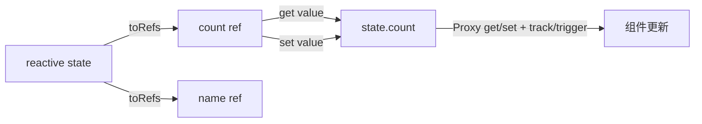

# `toRefs` 原理与使用

## 一句话结论

`toRefs` 不会复制响应式对象的值，而是为对象的每个属性创建一个与原对象保持同步的 `ref`。解构得到的是这些 `ref`，因此访问或修改 `.value` 时仍然会通过原对象触发 Vue 的响应式依赖。

## 为什么直接解构会丢失响应式

`reactive` 返回的是一个由 `Proxy` 代理的对象，响应式依赖建立在“通过代理访问属性”这一步上。

```ts
const state = reactive({ count: 0 });
const { count } = state;

// count 只是解构时拿到的普通数字，后续与 state.count 没有连接
state.count++;
console.log(count); // 0
```

直接解构相当于把属性当前的值取出来，变量 `count` 不再经过 `state` 这个 Proxy 的 `get` 访问，也就无法继续追踪 `state.count` 的变化。

## `toRefs` 是怎么保持同步的

`toRefs(state)` 会为每个属性返回一个类似 `ref` 的对象。这个对象的 `get value` 读取原对象属性，`set value` 写回原对象属性；而原对象仍然是 Vue 的 `reactive` Proxy。



解构发生在 `toRefs` 之后，只是解构出 `count` 这个 ref 对象，并没有把 `state.count` 的值复制出来：

```ts
const state = reactive({ count: 0 });
const { count } = toRefs(state);

state.count++;
console.log(count.value); // 1

count.value++;
console.log(state.count); // 2
```

可以把单个属性的核心实现理解为：

```ts
function toRef<T extends object, K extends keyof T>(
    object: T,
    key: K
) {
    return {
        get value() {
            return object[key];
        },
        set value(value: T[K]) {
            object[key] = value;
        },
    };
}
```

真实 Vue 实现还会处理已有 ref、默认值、类型推导和可枚举属性等情况，但核心就是对原对象属性做 getter/setter 转发。因为 `object` 是 `reactive` 返回的 Proxy，所以 getter/setter 最终仍会进入 Vue 的依赖收集和派发更新流程。

## 基础使用示例

### 在组件中解构 `reactive`

```vue
<script setup lang="ts">
import { reactive, toRefs } from 'vue';

const state = reactive({
    name: 'Alice',
    age: 20,
});

const { name, age } = toRefs(state);

function growUp() {
    age.value++;
}
</script>

<template>
    <p>{{ name }}：{{ age }} 岁</p>
    <button @click="growUp">长大一岁</button>
</template>
```

模板中会自动解包 ref，所以使用 `{{ name }}` 和 `{{ age }}`；在 `<script>` 中仍需使用 `name.value`、`age.value`。

### 在组合式函数中返回响应式对象

组合式函数通常返回对象。调用方如果希望继续解构，组合式函数可以返回 `toRefs`：

```ts
import { reactive, toRefs } from 'vue';

function useUser() {
    const state = reactive({ name: 'Alice', age: 20 });

    return {
        ...toRefs(state),
        growUp: () => state.age++,
    };
}

const { name, age, growUp } = useUser();
growUp();
console.log(age.value); // 21
```

## 面试补充

- `toRefs` 适合需要解构的响应式对象；如果不需要解构，直接使用 `state.count` 更简单。
- `toRefs` 返回的 ref 与原对象属性是双向同步的：改 `ref.value` 会改原对象，改原对象也会更新 `ref.value`。
- `toRefs` 主要转换对象已有的可枚举属性。后续新增的属性不会自动出现在已经返回的 refs 对象中；需要动态绑定单个属性时可以使用 `toRef`。
