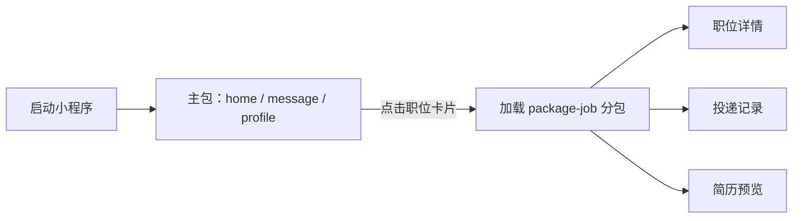

# 小程序分包怎么做

## 一句话结论

小程序分包就是在 `app.json` 中把首屏和公共能力放进主包，把非首屏、低频或相对独立的业务页面放进分包；用户进入分包页面时，客户端再按需加载对应代码，从而缩小启动时需要加载的主包。

## 一个招聘小程序的拆分方案

以“职悟空招聘小程序”为例：用户打开小程序首先进入职位首页，底部 Tab 切换首页、消息和我的，这些页面需要放在主包；职位详情、投递记录和简历预览不是首屏内容，可以拆到业务分包。

```text
miniprogram/
├── app.js
├── app.json
├── app.wxss
├── pages/                    # 主包：启动和 Tab 页面
│   ├── home/
│   ├── message/
│   └── profile/
├── components/               # 主包公共组件
│   ├── job-card/
│   └── empty-state/
└── package-job/              # 职位分包：进入相关页面时加载
    ├── pages/
    │   ├── detail/
    │   ├── applications/
    │   └── resume-preview/
    └── components/
        └── job-description/
```



## `app.json` 配置

`subPackages` 中的 `root` 是分包根目录，`pages` 是相对于 `root` 的页面路径。完整路径是 `package-job/pages/detail`，页面跳转时也必须使用这个完整路径。

```json
{
  "pages": [
    "pages/home/index",
    "pages/message/index",
    "pages/profile/index"
  ],
  "tabBar": {
    "list": [
      {
        "pagePath": "pages/home/index",
        "text": "职位"
      },
      {
        "pagePath": "pages/message/index",
        "text": "消息"
      },
      {
        "pagePath": "pages/profile/index",
        "text": "我的"
      }
    ]
  },
  "subPackages": [
    {
      "root": "package-job",
      "pages": [
        "pages/detail/index",
        "pages/applications/index",
        "pages/resume-preview/index"
      ]
    }
  ],
  "preloadRule": {
    "pages/home/index": {
      "network": "wifi",
      "packages": ["package-job"]
    }
  }
}
```

`preloadRule` 表示进入首页后，在 Wi-Fi 网络下提前加载职位分包。它适合用户大概率马上访问的分包，但不应把所有分包都预加载，否则会抵消按需加载的收益。

## 页面跳转示例

主包首页的职位卡片点击后，使用分包页面的完整路径：

```js
// pages/home/index.js
Page({
  onTapJob(event) {
    const { id } = event.currentTarget.dataset;

    wx.navigateTo({
      url: `/package-job/pages/detail/index?id=${id}`
    });
  }
});
```

```xml
<!-- pages/home/index.wxml -->
<view
  wx:for="{{jobs}}"
  wx:key="id"
  data-id="{{item.id}}"
  bindtap="onTapJob"
>
  <view>{{item.title}}</view>
  <view>{{item.companyName}} · {{item.city}}</view>
</view>
```

分包页面接收参数并请求详情数据：

```js
// package-job/pages/detail/index.js
Page({
  data: {
    job: null
  },

  async onLoad(options) {
    const job = await this.loadJobDetail(options.id);
    this.setData({ job });
  },

  loadJobDetail(id) {
    return new Promise((resolve, reject) => {
      wx.request({
        url: 'https://api.example.com/jobs/' + id,
        success: ({ data }) => resolve(data),
        fail: reject
      });
    });
  }
});
```

## 分包时怎么划分

| 放置位置 | 适合内容 | 招聘小程序示例 |
| --- | --- | --- |
| 主包 | 启动必需、Tab 页面、公共组件和公共工具 | 职位首页、消息、我的、登录态初始化 |
| 业务分包 | 同一业务域的非首屏页面 | 职位详情、投递记录、简历预览 |
| 独立分包 | 与主包、其他分包耦合较少，可独立打开的业务 | 活动页、运营落地页、客服工作台 |

划分时要注意：公共代码被主包引用后会进入主包，分包之间不要互相引用页面或强耦合业务模块；大型图片、富文本和图表依赖也应按使用页面就近放置或延迟加载。

## 常见追问

### 分包页面能不能放进 `tabBar`？

不能。`tabBar` 页面必须属于主包，分包页面适合通过 `wx.navigateTo`、`wx.redirectTo` 等方式进入。

### 分包什么时候下载？

默认在用户首次进入该分包页面前后按需加载；如果配置了 `preloadRule`，则可以在进入指定页面后提前加载。

### 分包和懒加载有什么区别？

分包解决的是代码包按业务拆分和按需下载；页面内部的图片、接口、组件或大型库仍然可以继续做懒加载，两者可以叠加使用。

### 独立分包有什么特点？

独立分包可以在不依赖主包的情况下运行，适合低耦合、需要快速打开的独立场景，但会增加独立分包自身的公共代码体积，不能滥用。
