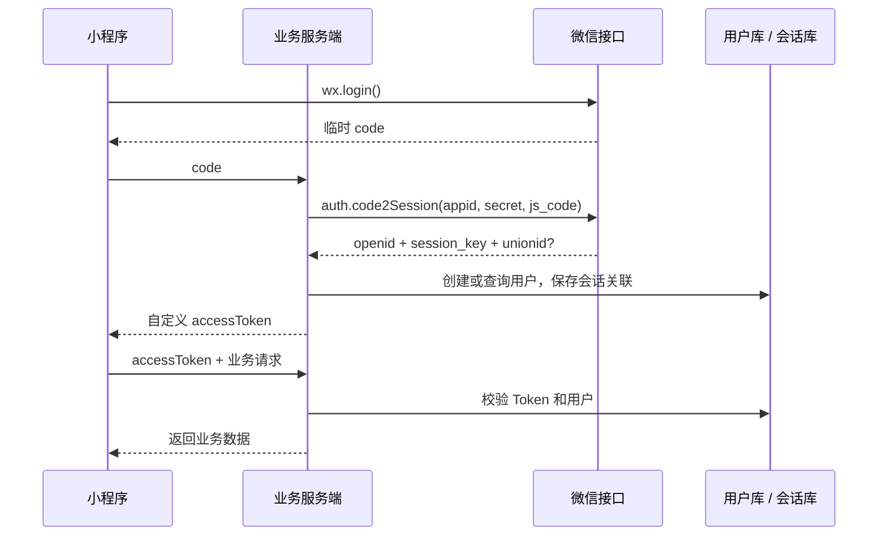
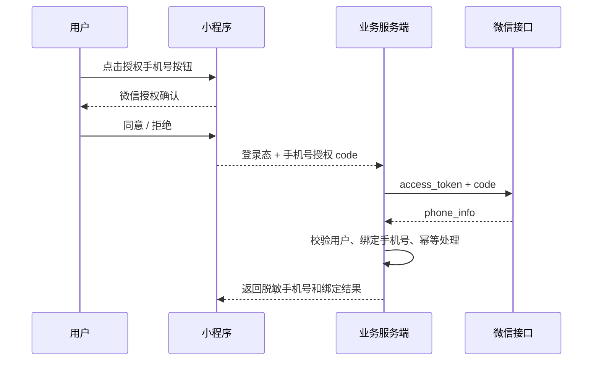

# 小程序登录与手机号授权

## 1. 微信小程序完整登录流程

### 一句话结论

小程序端通过 wx.login 获取临时 code，服务端拿 code 调微信接口换取 openid、session_key 和可能存在的 unionid，再由服务端创建自己的登录态并返回业务 Token；session_key 永远不下发给前端。

### 登录时序



### 最小前端示例

```js
wx.login({
  success: ({ code }) => {
    wx.request({
      url: 'https://api.example.com/auth/wechat/login',
      method: 'POST',
      data: { code },
      success: ({ data }) => {
        wx.setStorageSync('accessToken', data.accessToken);
      },
    });
  },
});
```

### 服务端做什么

```text
POST /auth/wechat/login { code }
  1. 使用 appid、AppSecret 调微信 code2Session
  2. 得到 openid、session_key、unionid（可能没有）
  3. 以 openid 查询或创建业务用户
  4. 保存 session_key 的关联信息，不返回 session_key
  5. 签发自定义 accessToken / refreshToken
```

### 字段对照

| 字段 | 作用 | 能否直接当登录 Token |
| --- | --- | --- |
| code | 微信临时生成的换票凭证，交给服务端换会话信息 | 不能，短时且有使用限制 |
| openid | 用户在当前小程序 AppID 下的唯一标识 | 不能，只是身份映射键 |
| unionid | 用户在同一微信开放平台账号下多个应用之间的统一标识 | 不能，且可能不存在 |
| session_key | 服务端侧会话密钥，供部分开放能力使用 | 不能下发前端 |

### openid 和 unionid

```text
同一个用户 + 小程序 A -> openid_A
同一个用户 + 小程序 B -> openid_B
同一个用户 + 同一开放平台账号 -> unionid 通常相同
```

openid 只在当前 AppID 范围内稳定。unionid 适合做跨小程序、公众号和 App 的账号归并，但应用需要按微信要求绑定到同一开放平台账号，且用户满足返回条件；业务代码必须允许 unionid 缺失。

### 登录注意事项

- code 只传给自己的服务端，由服务端调用微信接口；AppSecret 不能放进小程序包。
- session_key 不写入前端存储、不返回接口响应、不打印日志。
- openid 是用户映射键，不是前端鉴权凭证；后续请求携带服务端签发的 Token。
- 处理 code 过期、重复使用、微信接口失败和网络重试；创建用户必须幂等。
- 自定义 Token 设置过期、刷新和注销策略，并在服务端校验签名、状态和用户归属。
- 不要为了登录强制请求头像昵称授权；登录身份和用户资料授权是两件事。

### 面试模板

> 微信登录分成“换微信身份”和“建立业务会话”两步。小程序调用 wx.login 拿临时 code 传给服务端，服务端使用 AppID 和 AppSecret 调 code2Session，得到当前小程序范围内的 openid、服务端持有的 session_key，以及条件满足时的 unionid。服务端按 openid 查找或创建用户，签发自己的 accessToken。前端后续只携带业务 Token，session_key 和 AppSecret 都不下发。openid 是当前 AppID 内标识，unionid 是开放平台体系下的跨应用标识，unionid 可能缺失。

## 小程序鉴权信息怎么存？Cookie 要不要用？

### 标准做法

小程序优先使用：**服务端签发业务 Token，小程序通过 `Authorization` 请求头调用接口**。

```text
wx.login(code)
  -> 服务端换取 openid / session_key
  -> 服务端创建用户并签发 accessToken
  -> 小程序保存 accessToken
  -> wx.request 携带 Authorization: Bearer accessToken
```

### 信息放在哪里

| 信息 | 存放位置 |
| --- | --- |
| `code` | 登录请求中临时使用，用完即丢 |
| `session_key`、AppSecret、微信 `access_token` | 只放服务端 |
| `openid`、`unionid` | 服务端用户表，用于身份映射 |
| `accessToken` | 内存优先；需要重启恢复时放 `wx.setStorage` |
| `refreshToken` | 必须落地时限制有效期、做好撤销和风险控制 |

### 请求封装示例

```js
function request(options) {
  const accessToken = getApp().globalData.accessToken;
  return wx.request({
    ...options,
    header: {
      ...(options.header || {}),
      ...(accessToken ? { Authorization: `Bearer ${accessToken}` } : {}),
    },
  });
}
```

### Cookie 能不能用

可以，但不建议把它作为小程序的默认方案。小程序没有浏览器的 `document.cookie`，Cookie 是否自动保存和携带也依赖目标平台与基础库；如果需要前端手动读取和设置 Cookie，它和可读取的 Token 差别就不大了。

面试中直接回答：**小程序项目优先使用服务端 Token + `Authorization`，不要依赖 Cookie；Cookie 只有在已有服务端会话体系、网关强依赖 Cookie，并且已经验证目标平台行为时才考虑。**

### 三条安全底线

- `session_key`、AppSecret 和微信 `access_token` 永远不下发小程序。
- Token 只走 HTTPS，不放 URL、日志和埋点；服务端校验签名、过期、撤销和用户归属。
- 登录、刷新、退出和换绑时清理客户端 Token；手机号等敏感信息按最小化原则存储和脱敏。

## 2. 获取用户手机号的授权流程

### 一句话结论

用户点击 open-type="getPhoneNumber" 的按钮后，微信把一次性手机号授权 code 回调给小程序；小程序把 code 传给已登录的业务服务端，服务端使用微信接口凭证换取手机号，再把手机号绑定到当前业务账号。

### 授权时序



### 最小前端示例

```xml
<button
  open-type="getPhoneNumber"
  bindgetphonenumber="onGetPhoneNumber"
>
  使用微信手机号登录
</button>
```

```js
Page({
  onGetPhoneNumber(event) {
    const { code } = event.detail;
    if (!code) {
      wx.showToast({ title: '已取消手机号授权', icon: 'none' });
      return;
    }

    wx.request({
      url: 'https://api.example.com/auth/wechat/phone',
      method: 'POST',
      header: {
        Authorization: 'Bearer ' + wx.getStorageSync('accessToken'),
      },
      data: { code },
    });
  },
});
```

### 服务端做什么

```text
POST /auth/wechat/phone
  1. 从 Authorization 解析当前业务用户
  2. 服务端获取或复用微信 access_token
  3. 使用手机号授权 code 调 getuserphonenumber
  4. 校验返回结果和当前用户，写入手机号绑定关系
  5. 返回脱敏手机号、绑定状态和业务用户信息
```

### 登录 code 和手机号 code 不是一回事

| 凭证 | 产生方式 | 用途 |
| --- | --- | --- |
| wx.login 的 code | 调用 wx.login | 换取 openid、session_key、unionid |
| getPhoneNumber 的 code | 用户点击授权手机号按钮 | 换取 phone_info |
| accessToken | 业务服务端签发 | 调用自己的业务接口 |
| 微信 access_token | 服务端向微信获取 | 服务端调用微信开放接口 |

### 注意事项

- 必须由用户明确点击按钮触发，不能在页面加载时静默获取手机号。
- 微信接口的 access_token、AppSecret 只放服务端；前端只接收业务接口结果。
- 用户拒绝、重复点击、授权 code 过期或微信接口失败，都要有失败分支。
- 手机号绑定必须关联当前已登录业务账号，不能只相信前端传来的 userId。
- 授权 code 有时效和使用限制，服务端要防重放；重复请求应返回同一绑定结果。
- 手机号属于敏感个人信息，应最小化采集、加密或脱敏存储、限制日志和访问权限。
- 绑定、替换和解绑手机号要有明确规则，必要时要求重新验证。
- 旧版 encryptedData / iv 流程不能与当前手机号 code 流程混写，按目标平台和基础库确认。

### 面试模板

> 手机号授权不是前端直接读取手机号，而是用户点击授权按钮后拿到一次性 code。小程序把 code 和当前业务登录态传给服务端，服务端用微信接口凭证调用获取手机号接口，再将手机号绑定到当前 openid 对应的业务账号。AppSecret、微信 access_token 和手机号授权 code 都不能暴露在客户端；服务端还要处理拒绝授权、code 过期、重复提交、接口重试、敏感信息保护和绑定幂等。
