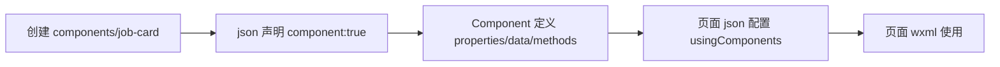
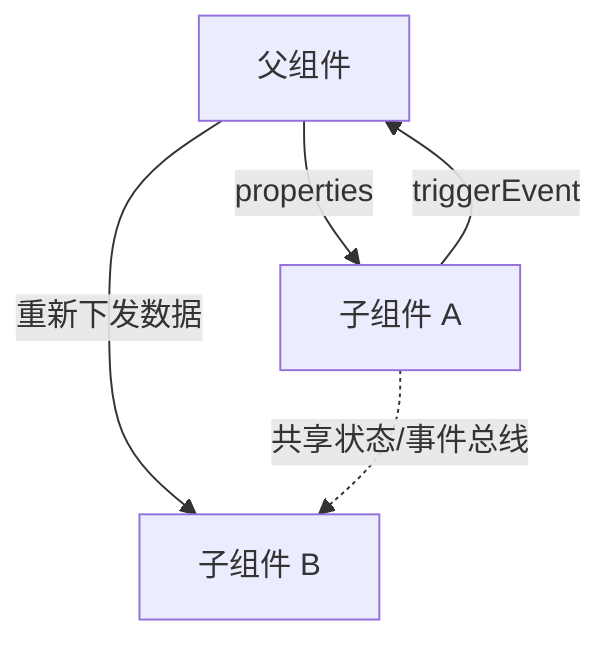

# 小程序组件开发与通信

## 1. 自定义组件的创建流程，以及 `Component` 与 `Page` 的区别

**一句话回答**：自定义组件由 `json` 声明、`wxml` 结构、`wxss` 样式和 `js` 逻辑组成，页面通过 `usingComponents` 注册后使用；`Component` 面向可复用组件，`Page` 面向路由页面。



最小配置：

```text
components/job-card/
  job-card.json   // { "component": true }
  job-card.wxml
  job-card.wxss
  job-card.js
```

```json
// pages/index/index.json
{
  "usingComponents": {
    "job-card": "/components/job-card/job-card"
  }
}
```

```js
// components/job-card/job-card.js
Component({
  properties: {
    job: { type: Object, value: {} }
  },
  data: { expanded: false },
  methods: {
    onTap() {
      this.triggerEvent('select', { id: this.properties.job.id });
    }
  },
  lifetimes: {
    attached() {},
    detached() {}
  }
});
```

| 对比项 | `Component` | `Page` |
| --- | --- | --- |
| 定位 | 可复用的局部 UI 与逻辑 | 一个路由页面、页面栈中的节点 |
| 输入/输出 | `properties` 接收，`triggerEvent` 向外派发 | `options` 接收路由参数，调用路由 API 或通过状态/事件传递 |
| 生命周期 | `created`、`attached`、`ready`、`detached` 等 | `onLoad`、`onShow`、`onReady`、`onHide`、`onUnload` 等 |
| 配置 | 组件 `json` 中声明 `component: true` | 在 `app.json` 的 `pages` 中注册 |
| 专属能力 | `relations`、组件实例方法、样式隔离 | 页面导航、下拉刷新、分享、页面栈生命周期 |

## 2. 父子组件、兄弟组件通信方式与场景

**一句话回答**：父子关系优先使用 `properties + triggerEvent`；兄弟组件优先让共同父组件中转；跨多级组件则根据数据范围选择事件冒泡、祖先组件协调或共享状态。



| 关系 | 方式 | 适用场景 |
| --- | --- | --- |
| 父 -> 子 | `properties` | 父组件声明式下发岗位、按钮文案、开关状态 |
| 子 -> 父 | `triggerEvent` + `bind:event` | 子组件上报点击、选择、删除等用户操作 |
| 父 -> 子调用 | `selectComponent` | 少量命令式操作，如调用弹窗的 `open()`；不宜拿来大规模同步状态 |
| 兄弟 | 共同父组件中转 | 两个组件有明确的业务归属，状态量小且关系稳定 |
| 跨多级组件 | 事件逐级转发，或 `triggerEvent` 配置冒泡 | 一次性的用户操作通知；层级较深时减少手动透传 |
| 组件集合 | `relations` + `getRelationNodes` | 有明确父子/兄弟关系的组件集合，如列表容器管理列表项 |
| 跨页面/全局 | `App`、状态管理、发布订阅 | 用户信息、筛选条件、会话状态等多个页面共同依赖的数据 |

最小的父子通信示例：

```js
// 子组件
this.triggerEvent('change', { value: '北京' });
```

```xml
<!-- 父组件 WXML -->
<city-picker value="{{city}}" bind:change="onCityChange" />
```

```js
// 父组件 JS
Page({
  onCityChange(e) {
    this.setData({ city: e.detail.value });
  }
});
```

### 跨多级组件怎么通信

| 方案 | 做法 | 适用场景与取舍 |
| --- | --- | --- |
| 逐级透传 | 中间组件监听子事件，再调用 `triggerEvent` 转发；数据由祖先通过 `properties` 下发 | 最直观、边界清晰，适合层级不深且链路稳定的局部状态；层级很深时样板代码较多 |
| 事件冒泡 | 子组件使用 `triggerEvent(name, detail, { bubbles: true, composed: true })`，祖先监听同名事件 | 一次性的“选择岗位”“删除消息”等事件；需要注意事件命名和冒泡范围，避免隐式依赖 |
| 祖先组件协调 | 由最上层容器统一维护状态，子孙组件只上报事件、接收必要数据 | 表单、筛选器、消息列表等一组组件共享状态；通常比组件之间互相调用更容易维护 |
| 共享状态/发布订阅 | 把状态或事件放入 `App`、轻量 store 或事件总线 | 跨页面、跨组件树的用户信息、会话、筛选条件；需要处理订阅释放和状态来源 |
| `relations` | 在组件中声明组件关系，通过 `getRelationNodes` 获取关联实例 | 组件库内部的父子组件协作；它描述结构关系，不应替代通用状态管理 |

#### 逐级透传

中间组件同时承担“监听子事件”和“向上转发事件”：

```js
// 深层子组件 child.js
this.triggerEvent('select', { id: 'job-1' });

// 中间组件 middle.js
methods: {
  onChildSelect(e) {
    this.triggerEvent('select', e.detail);
  }
}
```

```xml
<!-- middle.wxml：监听深层子组件 -->
<child bind:select="onChildSelect" />

<!-- page.wxml：继续监听中间组件转发的事件 -->
<middle bind:select="onJobSelect" />
```

#### 事件冒泡

深层组件开启冒泡后，祖先组件可以直接监听事件，中间层不必逐级转发：

```js
// deep-child.js
this.triggerEvent(
  'select-job',
  { id: this.properties.job.id },
  { bubbles: true, composed: true }
);
```

```xml
<!-- ancestor.wxml -->
<job-list bind:select-job="onSelectJob" />
```

#### 祖先组件协调

祖先组件维护唯一状态，子组件只负责上报变更，其他子组件通过 `properties` 接收结果：

```xml
<!-- page.wxml -->
<job-filter value="{{filter}}" bind:change="onFilterChange" />
<job-list filter="{{filter}}" />
```

```js
// page.js
Page({
  data: { filter: { city: '', keyword: '' } },
  onFilterChange(e) {
    this.setData({ filter: e.detail });
  }
});
```

#### 共享状态/发布订阅

小程序没有内置通用事件总线，可以封装一个带订阅释放能力的模块：

```js
// store.js
let state = { user: null };
const listeners = new Set();

export function getState() { return state; }
export function setUser(user) {
  state = { ...state, user };
  listeners.forEach(listener => listener(state));
}
export function subscribe(listener) {
  listeners.add(listener);
  return () => listeners.delete(listener);
}
```

```js
// 页面或组件中
import { getState, subscribe } from './store';

Page({
  onLoad() {
    this.setData(getState());
    this.unsubscribe = subscribe(nextState => this.setData(nextState));
  },
  onUnload() {
    this.unsubscribe?.();
  }
});
```

#### `relations` 与关联组件实例

适合组件库内部的固定结构，例如 `tab-group` 管理多个 `tab-item`：

```js
// tab-group.js
Component({
  relations: {
    '../tab-item/tab-item': { type: 'child' }
  },
  methods: {
    select(index) {
      const items = this.getRelationNodes('../tab-item/tab-item');
      items.forEach((item, itemIndex) => item.setActive(itemIndex === index));
    }
  }
});
```

```js
// tab-item.js
Component({
  methods: {
    setActive(active) {
      this.setData({ active });
    }
  }
});
```

实践中我会优先让祖先容器持有共享状态：例如岗位筛选条件由页面维护，筛选面板只通过事件提交变更，岗位列表通过 `properties` 接收结果。只有低频、边界明确的通知才使用跨层级冒泡；如果多个页面都依赖同一份数据，则提升到 store 或 `App`，不要让组件树承担全局状态管理。

## 3. `styleIsolation` 的值与通用组件选择

**一句话回答**：`styleIsolation` 有 `isolated`、`apply-shared`、`shared` 三个值，默认是 `isolated`；通用组件通常默认隔离，只对明确需要的宿主样式开放入口。

| 值 | 组件样式对外部的影响 | 外部样式对组件的影响 | 典型用途 |
| --- | --- | --- | --- |
| `isolated` | 不影响外部 | 不影响组件 | 默认值，组件样式自洽、可复用 |
| `apply-shared` | 不影响外部 | 页面/祖先级样式可影响组件 | 组件需要继承页面的基础字体、主题变量等 |
| `shared` | 可影响外部 | 外部样式也可影响组件 | 强耦合的业务容器，组件库应谨慎使用 |

```json
// 组件 json
{
  "component": true,
  "styleIsolation": "isolated"
}
```

在职悟空中，我会这样选：岗位卡片和通用按钮使用 `isolated`，避免页面的 `.button`、`.card` 等通用选择器互相污染；颜色、尺寸、状态通过 `properties`、组件样式类或设计变量传入。只有确实要接入页面主题的组件才考虑 `apply-shared`，`shared` 仅用于明确约定了样式边界的业务容器，并配合命名空间降低冲突。

## 4. `wx:if` 与 `hidden` 的区别及场景选择

**一句话回答**：`wx:if` 控制节点是否创建和销毁，适合低频切换或昂贵内容；`hidden` 保留节点，仅切换显示状态，适合高频显隐且需要保留内部状态的内容。

| 对比项 | `wx:if` | `hidden` |
| --- | --- | --- |
| 不显示时 | 不创建或销毁节点/组件 | 节点仍存在，仅隐藏 |
| 切换成本 | 重新创建，成本较高但节省常驻资源 | 切换快，但持续占用节点和内存 |
| 内部状态 | 销毁后通常需要重新初始化 | 可保留输入、滚动、组件状态 |
| 适合 | 低频切换、重型内容、敏感内容 | 高频切换、轻量内容、需要保持状态 |

```xml
<!-- 低频的重型内容：不显示时销毁 -->
<rich-text wx:if="{{message.type === 'markdown'}}" nodes="{{message.nodes}}" />

<!-- 高频切换：保留输入状态与组件实例 -->
<job-filter hidden="{{!filterVisible}}" bind:change="onFilterChange" />
```

场景选择：

- **对话消息气泡**：消息列表中的气泡本身通常随 `wx:for` 渲染，不会用 `hidden` 隐藏整条历史消息。气泡内 markdown、图片、代码块等重型分支可用 `wx:if`；正在生成、重试、加载等轻量且频繁变化的状态用数据绑定或 `hidden`，并控制消息列表规模。
- **岗位筛选弹窗**：如果打开/关闭频繁且需要保留已选条件、滚动位置，使用 `hidden` 保留弹窗实例；如果内容复杂、打开频率低，使用 `wx:if` 释放节点和资源。无论选择哪种方式，关闭时都要确保遮罩、焦点和事件不会继续影响页面。
